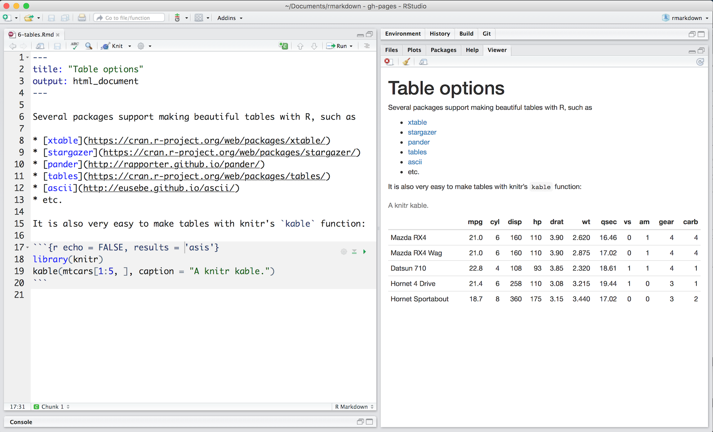
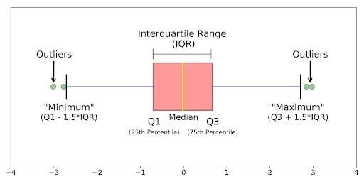
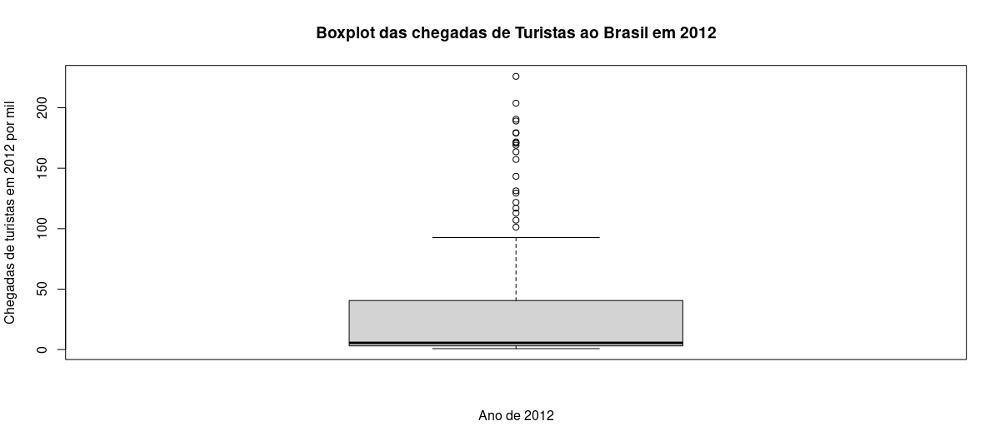
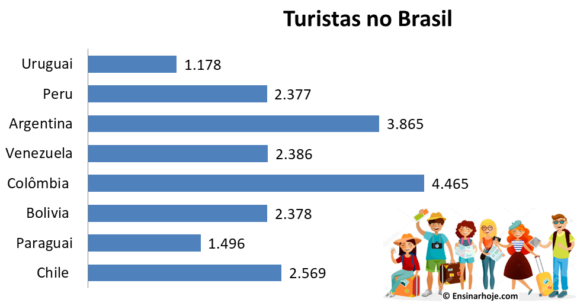
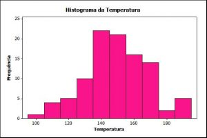
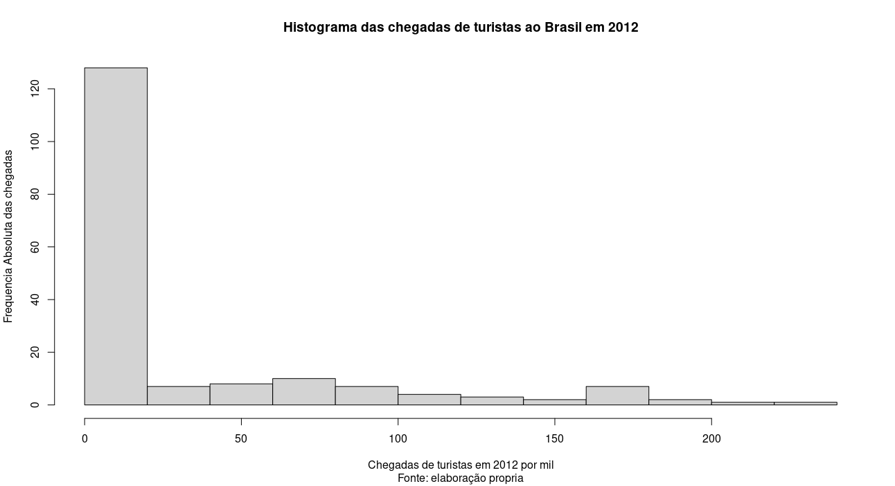

# 1 Objetivo

Estudo dirigido de linguagem R.  

# 2 Livro de referência

Utilizando a Linguagem R.  
Editora: ALTA BOOKS EDITORA  

# 3 Cap 1 - Instalação do R e Rstudio 

-   Download da linguagem R:  
    <https://www.r-project.org/>  

-   Download Rstudio IDE:  
    <https://posit.co/downloads/>  

# 4 Cap 2 - Pacote base e funções estatísticas básicas 

## 4.1 Operações matematicas basicas

| Nome da operação                | Operação  | Resultado |
|:--------------------------------|:---------:|----------:|
| Adição                          |    5+4    |         9 |
| Subtração                       |    6-2    |         4 |
| Multiplicação                   |   7\*3    |        21 |
| Divisão                         |   45/9    |         5 |
| Potência                        |    2^2    |         4 |
| Raiz                            | sqrt(121) |        11 |
| Exponencial                     |  exp(0)   |         1 |
| Log na base e                   |  log(1)   |         0 |
| Log na base 10                  | log10(1)  |         0 |
| Log na base 2                   |  log2(4)  |         2 |
| Log na base 3 ou qualquer outra | log(9,3)  |         2 |

Operações básicas do R

## 4.2 Vetor

-   Para criar um vetor usamos a função *c*().  
-   Os argumentos são separados por virgula dentro do parênteses.  
-   strings devem estar entre aspas duplas.  
    Ex.: *c*(“um”,“sete”,“nove”)  
-   Vetores são compostos de elementos todos do mesmo tipo.  
-   Armazenando vetores em um objeto:  
    Ex.: *obj_qualquer* \<- *c*(1,2,3)  

## 4.3 Tabela de dados (**data.frame**) e **matrizes**

### 4.3.1 **data.frame**

-   Uma tabela onde cada coluna é um vetor.  
-   Como cada coluna é um vetor, cada coluna pode ser de um tipo
    diferente.  
    Ex.: `nome_data.frame <- data.frame(vetor_1, vetor_2)`  
-   Acrescentando uma nova coluna ao data.frame.  
    Ex.: `nome_data.frame <- data.frame(nome_data.frame, vetor_3)`  
-   Para visualizar um **data.frame** podemos usar a função
    **View**().  
    Ex.: `View(nome_data.frame)`  

### 4.3.2 **Matrizes**

-   A diferença entre **matrizes** e **data.frames**, é que no caso das
    matrizes todas as colunas e linhas devem ser do mesmo tipo. Enquanto
    nos **data.frames** as colunas podem ser de tipos diferentes.  

-   Para adicionar uma coluna numa matriz, usamos a função cbind().  
    Ex.: `nome_matriz <- cbind(vetor_1, vetor_2, ...)`  

-   Para adicionar uma linha numa matriz, usamos a função rbind().  
    Ex.: `nome_matriz <- rbind(vetor_3, vetor_4, ...)`  

-   Quando inserimos dados (vetor) de naturezas diferentes (tipos) numa
    matriz, ela converte todos os dados para um único tipo. A principio
    *string* (*chr*).  

## 4.4 Acessando valores em posições especificadas dos objetos - **vetor**, **matriz** e **data.frame**

### 4.4.1 Caso **vetor** e **matriz**

-   Podemos acessar os valores do objeto tipo **vetor** e **matriz**,
    informando a posição entre colchetes \[\].  

-   Para os **vetores** precisamos apenas informa a posição. A contagem
    da posição começa a partir do 1.  
    Ex.:  
    `vetor <- c(5,18,89)`  
    `vetor[1]`  

-   Para as **matrizes**, é necessario informar a posição \[*linha*,
    *coluna*\]. A contagem da posição começa a partir do 1.  
    Ex.:`Mc[1,2]`  

-   Para acessar todos os valores de uma *linha* da **matriz**, podemos
    determinar a *linha* e deixar a *coluna* em branco.  
    Ex.: `Mc[1,]`  

-   Para acessar todos os valores de uma *coluna* da **matriz**, podemos
    determinar a *coluna* e deixar a *linha* em branco.  
    Ex.: `Mc[,2]`  

### 4.4.2 Caso **data.frame**

-   No caso do **data.frame** podemos acessar os valores das colunas
    informando, “nome do **data.frame**” “$” “nome da coluna”.  
    Sintaxe:  
    `nome_dataframe$nome_coluna`  

-   O **data.frame** também aceita as mesmas formas de acessar posições
    que as **matrizes**.  

## 4.5 Visualizando dados

### 4.5.1 **View**() - visualização de dados

-   Podemos visualizar dados de duas formas:  
    -   Escrevendo o nome da variável  
        O valor dela será impressa na tela.  
    -   Atraves da função **View**()  
        Ao chamar a função View() e colocar dentro a variavel que
        queremos ver, será exibido uma nova janela com o valor da
        variável numa tabela.  

### 4.5.2 **str**() - estrutura de objetos

-   A função “**str**()” retorna a estrutura do objeto do argumento.  
-   Retorna diversos dados, entre eles:  
    -   A classe do objeto.  
    -   Tamanho do objeto.  
    -   A lista, ou vertor, dos campos com o tipo e tamanho. 
-   Sintaxe:  
    `str(argumento)`  

### 4.5.3 **summary**() - resumo de variáveis

-   A função **summary**() retorna o resumo de variaveis.  
-   O retorno depende do argumento (se for um vetor, uma lista, um
    data.frame).  
-   O retorno para uma matriz ou **data**.**frame**, vai ser os metodos
    aplicados a cada campo/coluna.  
-   O retorno da função, no geral, retorna diversos metodos aplicados
    aos dados, tais como:  
    -   valor mínimo  
    -   1º quantil  
    -   valor da mediana  
    -   valor da media  
    -   3º quantil  
    -   valor máximo  
-   Sintaxe:  
    `summary(nome_variavel)`  

### 4.5.4 **class**() - classe de objetos

-   A função “**class**()” retorna a que classe do objeto do argemunto
    pertence.  
-   Basicamente diz se o objeto é numerico, string, vetor, lista,
    data.frame, matriz, …  
-   Sintaxe:  
    `class(argumento)`  

## 4.6 Funções estatísticas básicas

| Função                    | Descrição                                                                                                                |
|:-----------------------------|:-----------------------------------------|
| apply(D,i,f)              | Retorna os valores resultantes da aplicação da função f ao objeto D, linhas i=1, ou colunas i=2.                         |
| c(valor1, valor2, valor3) | Concatena uma sequência de valores seja númerico ou de caracteres. Neste último caso os valores devem estar entre aspas. |
| cbind(x1, x2, …, xn)      | Cria uma matriz com n colunas formada pelos vetores x1, x2, …, xn.                                                       |
| ceiling(x)                | Retorna o menor inteiro maior ou igual ao valor x.                                                                       |
| cor(x,y)                  | Calcula o coeficiente de correlação.                                                                                     |
| cumsum(x)                 | Retorna um vetor com valores acumulados em soma sobre os elementos de x.                                                 |
| cumprod(x)                | Retorna um vetor com valores acumulados em produto sobre os elementos de x.                                              |
| cummin(x)                 | Retorna um vetor com valores acumulados em mínimo sobre os elementos de x.                                               |
| cummax(x)                 | Retorna um vetor com valores acumulados em máximo sobre os elementos de x.                                               |
| data.frame(x1, x2, …, xn) | Cria um dataframe com os vatores x1, x2, …, xn.                                                                          |
| det(M)                    | Calcula o determinante da matriz quadrada M.                                                                             |
| dim(M)                    | Retorna as dimensões do objeto M.                                                                                        |
| diff(x)                   | Retorna um vetor com a diferença entre os valores de x.                                                                  |
| eigen(M)                  | Retorna os autovalores e os autovetores da matriz quadrada M.                                                            |
| floor(x)                  | Retorna o maior inteiro menor ou igual a x.                                                                              |
| identical(x,y)            | Verifica se os vetores são idênticos.                                                                                    |
| intersect(x,y)            | Realiza a interseção de dois conjuntos.                                                                                  |
| head(D)                   | Mostra o cabeçalho do objeto D.                                                                                          |
| length(x)                 | Calcula o comprimento do vetor x.                                                                                        |
| mean(x)                   | Calcula a média do vetor x.                                                                                              |
| median(x)                 | Calcula a mediana do vetor x.                                                                                            |
| min(x)                    | Calcula o mínimo de x.                                                                                                   |
| max(x)                    | Calcula o máximo de x.                                                                                                   |
| ncol(M)                   | Retorna o número de colunas da matriz M.                                                                                 |
| nrow(M)                   | Retorna o número de linhas da matriz M.                                                                                  |
| polyroot(x)               | Encontra as raízes do polinômio de ordem n cujos coeficientes são representados no vetor x em ordem decrescente.         |
| prod(x)                   | Multiplica os valores de x.                                                                                              |
| quantile(x,k)             | Calcula o percentil de ordem 0 ≤ *x* ≤ 1 dos valores de x.                                                               |
| Re(x)                     | Retorna a parte real de um vetor x.                                                                                      |
| rep(x,k)                  | Cria um vetor repetindo a sequência x k vezes.                                                                           |
| round(x,k)                | Arredonda o valor x com k casas decimais.                                                                                |
| sd(x)                     | Calcula o desvio-padrão do vetor x.                                                                                      |
| seq(i,j,k)                | Cria uma sequência de i ate j com tamanho de passo k.                                                                    |
| setdiff(x,y)              | Retorna um vetor contendo os elementos do conjunto diferença entre x e y.                                                |
| setequal(x,y)             | Verifica se os elementos dos vetores x e y são iguais, idenpendentemente da frequência em que aparecem no vetor.         |
| solve(A,b)                | Resolve Ax=b, retornando x.                                                                                              |
| sort(x)                   | Ordena os valores de vetor x em ordem crescente.                                                                         |
| sort(x, decreasing = T)   | Ordena os valores de x em ordem decrescente.                                                                             |
| str(D)                    | Retorna a estrutura do objeto D.                                                                                         |
| sum(x)                    | Soma os valores de x.                                                                                                    |
| union(x,y)                | Retorna os elementos da união entre x e y.                                                                               |
| var(x)                    | Calcula a variância do vetor x.                                                                                          |
| var(x,y)                  | Calcula a covariância entre x e y.                                                                                       |
| View(D)                   | Mostra o dataframe em janela separada.                                                                                   |

# 5 Cap 3 - Principais pacotes 

## 5.1 Instalação de pacotes 

-   sintaxe de instalação:  
    **install.packages**(“*nome do pacote*”)  
-   sintaxe de variais instalações simultaneas:  
    **install.packages**(c(“*nome do pacote*”,“*nome do pacote*”,…),
    dependencies = **TRUE**)  

## 5.2 Pacotes

1.  Principais pacotes:  

-   **stringr**  
    Pacote para trabalhar com strings (texto).  

-   **Rmarkdown**  
    Produção de relatorios (html, pdf, doc, md).  

-   **knitr**  
    Interpretação e compilação do documento rmd.  

-   **data.table**  
    Exploração de data.frames.  

-   **janitor**  
    Limpeza de dados.  

-   **DescTools**  
    Analise descritiva de dados.  

-   **tidyverse**  
    conjunto de pacotes.  

    -   **readr**  
        Importação e leitura de arquivos de dados.  
    -   **tibble**  
        estruturação de data.frame.  
    -   **dplyr**  
        Manipulação de data.frame.  
    -   **tidyr**  
        Organização de data.frame.  
    -   **ggplot2**  
        Visualização de dados, produção de gráficos.  
    -   **purr**  
        Manipulação de vetores e listas.  

-   **foreign**  
    Leitura e gravação de dados armazenados por algumas versões de “Epi
    Info”, “Octave”, “Minitab”, “S”, “SAS”, “SPSS”, “Stata”, “Systat”,
    “Weka” e para leitura e gravação de alguns “dBase” arquivos.  

-   **devtools**  
    Para instalar pacotes que não estejam no **CRAN**.  

1.  Pacotes auxiliares ao pacote **ggplot2**:  

-   **ggthemes**  
-   **grid**  

## 5.3 Carregamento de pacotes

-   Para poder utilizar o conjunto de funções de um determinado pacote,
    não basta apenas instalar o pacote, é preciso carrega-lo no
    script.  
-   As principais formas de carregar um pacote no script é través dos
    comandos *library*() e *require*().  
    **library**(*nome_pacote*)  
    **require**(*nome_pacote*)  
-   Outra possibilidade, é ao usar um função especificar a qual pacote
    ela pertence.  
    `nome_pacote::função`.  

## 5.4 Obter ajuda (informações) sobre pacotes

Duas formas de se conseguir informações sobre determinado pacote é
através dos comandos:  
1. `package?nome_pacote`  
2. `help(package = "nome_pacote")`  

# 6 Sites para uso Remote do R

-   Alguns sites que possibilitam utilizar o R básico, sem que seja
    necessário instala-lo no computador.  
-   Uma otima saída quando necessario utilizar em algum computador
    público (lan houses, hotéis, laboratórios, …)  

1.  <http://rstudio.cloud/>
2.  <http://jupyter.org/try>
3.  <http://www.tutorialspoint.com/execute_r_online.php>
4.  <http://github.com/datacamp/datacamp_light>
5.  <http://rdrr.io/snippets>
6.  <http://www.jdoodle.com/execute-r-online>
7.  <http://rextester.com/l/r_online_compiler>
8.  <http://rnotebook.io>

# 7 Cap 4 - R Markdown 

## 7.1 Preâmbulo

### 7.1.1 **Titulo**

*title*: “Titulo desejado”  

### 7.1.2 **Autor**

-   Para inserir um autor:  
    *author*: “Nome do autor”  
-   Para inserir varios autores:  
    *author*:  
    -   autor_1^\[instituto\]  
    -   autor_2^\[instituto\]  

### 7.1.3 **Data**

-   O comando “*date*:”, adiciona uma data ao documento.  
-   Podemos adicionar uma data qualquer para o documento no formato
    “dd/mm/aaaa”.  
    *date*: “dd/mm/aaaa”  
-   Outra possibilidade é usar uma função dentro de um *chunk* “r
    Sys.Date()”, para adicionar a data atual do sistema (modelo
    inglês).  
    *date*: “r Sys.Date()”  
-   Outra opção é usar o a função dentro de um *chunk* “r
    format(Sys.time(), ‘%d %B %Y’)”. A data será gerada no modelo: 02
    agosto 2004.  
    *date*: “r format(Sys.time(), ‘%d %B %Y’)”  
    Obs.: *chunk* deve ser colocado entre acentos graves.  

### 7.1.4 **Tipo do Documento** (*output*)

-   *output*: o tipo de saida, podem ser:  
    -   Documentos:  
        -   *pdf_document*  
        -   *md_document*  
        -   *html_document*  
        -   *word_document*  
        -   *odt_document*  
        -   *rtf_document*  
    -   Apresentação:  
        -   *powerpoint_presentation*  
        -   *ioslides_presentation*  
        -   *beamer_presentation*  
    -   mais:  
        -   *flexdashboard::flex_dashboard*  
        -   *github_document*  

### 7.1.5 **Sumário**

-   Para inserir o sumário no documento, basta colocar o comando “*doc*:
    *yes*” indentado dentro do tipo de saída.  
-   O comando **number_sections: true** adiciona numeração aos capítulos
    do sumário.  

### 7.1.6 Formatação desejada

Para determinar a formatação desejada, basta salvar um arquivo com o
nome *estilo*.*docx*, que contenha a formatação e referenciar o arquivo,
indentado dentro do tipo de arquivo, através do comando
“*reference_docx*: caminho/…/estilo.docx”.  

### 7.1.7 **Abstract**

*Abstract*: “Texto de abstract”.  

### 7.1.8 **Bibliografia**

-   Ter um arquivo \*.bib com as referencias.  
-   Adicionar o arquivo \*.bib no preâmbulo do **R Markdown**, atravês
    do comando:  
    *bibliograpy*: caminho/arquivo.bib  
-   Um arquivo \*.csl com o estilo da citação.  
    Este arquivo pode ser obtido no site:  
    <https://www.zotero.org/styles>  
    Pesquisar por: “abnt”  
    Opção: “Instituto de Pesquisa Econômica Aplicada - ABNT (Português -
    Brasil)”  
-   Adicionar o arquivo \*.csl no preâmbulo do R Markdown, através do
    comando:  
    *csl*: caminho/arquivo.csl  
-   É necessario criar um capítulo no final para as referências. A
    bibliografia vai ser alocada no final do documento, logo neste
    ultímo capítulo. A bibliografio é sempre inserida ao final do
    documento.  
-   Por fim, para aparecer as referencias elas precisam ser citadas no
    texto.  
    As principais formas de citar uma referência num texto de **R
    Markdown** é:  
    -   Uma citação:  
        Exemplo do comando: \[@ chave_da_referencia\]  
        Exemplo de como fica no arquivo final: (Alcoforado, 2021).  
    -   Mais de uma citação ao mesmo tempo:  
        Exemplo do comando: \[@ chave_da_referencia_1, @
        chave_da_referencia_2\]  

## 7.2 *Chunks* (códigos embutidos)

### 7.2.1 Códigos embutidos no texto

-   Podemos embutir códigos ao longo do texto.  

-   Para inserir um código que será rodado no meio do texto, usamos um
    sinais de crase para abrir, definimos a linguagem (normalmente r), o
    comando que desejamos e um sinal de crase para fechar o código.  
    `Este é um código embutido`

-   Para rodar pequenos comandos no meio do texto códigos embutidos é
    uma ótima opção.  

-   Exemplo:  
    O resultado do comando 1:3 é criar uma sequencia com os valores
    `1:3`. A soma destes valores é `sum(1:3)`.  
    O resultado do comando 1:3 é criar uma sequencia com os valores 1,
    2, 3. A soma destes valores é 6.  

### 7.2.2 Chunk

-   Códigos em R, ou em outras linguagens, podem ser inseriodos nos
    documentos através de *chunks*.  
-   *Chunks* são blocos de programação.  
-   A principal forma de inserir *chunks* é:  
-   Três sinais de acento grave (crases) para abrir o *chunk*.  
-   Na primeira linha, definir a linguagem do bloco de programação:  
    -   **R**  
    -   **Python**  
    -   **Julia**  
    -   **C++**  
    -   **SQL**  
        …  
-   Para dar um nome ao *chunk*, após definir a linguagem de programação
    basta colocar o nome do *chunk*. Nomear o *chunk* facilita
    determinar sua função dentro do relatório/documento.  
-   Ainda na primeira linha, considerações sobre o bloco de programação
    (*chunk options*):  
    -   *include*  
        Mostra (*true*), ou não (*false*), o código e os resultados no
        arquivo finalizado. O R Markdown ainda executa o código e o
        resultado dele ainda pode ser usado em outro bloco de
        programação.  
        *include* = *false* \| *true*  
    -   *echo*  
        Impede (*false*), ou não (*true*), que o código apareça, não
        afeta o resultado.  
        *echo* = *false* \| *true*  
    -   *results*  
        “*hide*” mostra o código e omite o resultado.  
        *results* = “*hide*”  
    -   *message*  
        Imprede (*false*), ou não (*true*),que mensagens geradas por
        código apareçam no arquivo finalizado.  
        *message* = *false* \| *true*  
    -   *warning*  
        Imprede (*false*), ou não (*true*), que avisos gerados pelo
        código apareçam no final.  
        *warning* = *false* \| *true*  
    -   *fig.cap*  
        Adiciona uma legenda aos resultados gráficos.  
        *fig*.*cap* = “…”  
-   Bloco de programação, escrito na linguagme definida.  
-   Três sinais de acento grave (crases) para fechar o *chunk*.  
-   Outras formas de inserir *chunks* é atraves do botão *Insert*, na
    área superior da tela do script, do **RStudio**.  
-   Observação:  
    *messagem* e *warning* igual a *false* é muito utilizado quando se
    carrega bibliotecas (**library**) no *chunk*, evita que as mensagens
    do carregamento apareçam.  

### 7.2.3 Configurando imagens e tabelas dentro do *chunk*

-   Os comandos de configuração de imagem no *chunk* são inseridos no
    cabeçalho do *chunk*.  

-   Principais comando de configuração de imagens com *chunk*:  

    -   **fig.width** =  
        Largura da figura em cm na janela gráfica.  
    -   **fig.height** =  
        Altura da figura em cm na janela gráfica.  
    -   **fig.align** =  
        Alinha a figura no arquivo final (“left”, “right” ou
        “center”).  
    -   **fig.cap** = ” “  
        Texto para legenda.  
    -   **dpi** =  
        Valor referente a qualidade da imagem, padrão é 72.  
    -   **out.width ou out.height** =  
        Porcentagem do tamanho original da imagem.  

### 7.2.4 Global *Chunk*

-   Para definir as opções globais que se aplicam a cada parte do seu
    arquivo, chame `knitr::opts_chunk$set` em uma parte do código.  
-   O **knitr** tratará cada opção que você passar para
    `knitr::opts_chunk$set` como um padrão global que pode ser
    substituído em cabeçalhos de blocos individuais.  

## 7.3 Titulos e subtitulos

-   Ao utilizar o comando \# e em seguencia um texo, geramos um
    titulo.  
    \# Titulo  
-   A cada \# que adicionamos, diminuimos uma camada de subtitulos.  
    \## Subtitulo  

## 7.4 Pular linha

-   Para que duas frases fiquem em linhas separadas, dê dois espaços
    entre elas.  
-   Os dois espaços funcionam também para deixar uma linha em branco.  
-   Outra forma é adicinal “\\”, tem o mesmo efeito.  

## 7.5 Listas

### 7.5.1 Listas numeradas

-   Basta inserir o número seguido de ponto e espaço.  
    `1. Tópico da lista numerada`  

-   A ordem das principais camadas de lista numeradas são:  

    -   Número  
        `1. Primeira camada`  
    -   Algarismos romanos  
        `i) Segunda camada`  
    -   Letra  
        `A. Terceira camada`  

-   Para inserir uma lista dentro de uma outra lista, é necessario
    indentar os tópicos.  

### 7.5.2 Listas não numeradas

-   Os principais simbolos (na ordem de utilização) da lista não
    númerada:  
    -   Asterisco(\*)  
    -   Mais(+)  
    -   Traço(-)  
-   Para inserir uma lista dentro de uma outra lista, é necessario
    indentar os tópicos.  

## 7.6 Notas de rodapé (clicáveis)

-   Há duas opções para criar uma nota de rodapé:  

1.  Escrever ao final do texto `[^1]` e então (pode ser logo abaixo, ou
    depois) escrever a nota de rodapé:  
    “Essa informação não é um consenso `[^1]`”  
    `[^1]: Esta é uma nota de rodapé.`  

2.  Colocar a informação da nota de rodapé no meio do texto, e o R
    numerará automaticamente:  
    “Essa informação não é um consenso `^[Esta é uma nota de rodapé]`”  

-   Observação:  
    A informação da nota de rodapé deve estar separado do texto por uma
    linha, no primeiro caso, ou contida na nota no link clicável, como
    no segundo caso.  

-   Exemplo:  
    O RMarkdown é uma ferramenta excelente para documentar seus códigos
    e apresentar os resultados. As muitas funcionalidades dele são
    descritas detalhadamente no livro R Markdown: The Definitive Guide
    [1].  

## 7.7 Inserir tabelas

### 7.7.1 Formato de tabela padrão

-   A tabela mais simples é atraves do padrão:  
    -   Primeira linha:  
        Cabeçalho das colunas, separado por barra vertical(\|).  
    -   Segunda linha:  
        -   Tracejados (pelo menos 3), para representar cada coluna, com
            dois pontos onde se espera que o texto esteja alinhado:
            -   Dois pontos no inicio do tracejado para representar
                alinhamento do texo a esquerda.  
            -   Dois pontos no inicio e no fim do tracejado para
                representar alinhamento centralizado do texto.  
            -   Dois ponstos no final do tracejado para representar
                alinhamento do texto a direita.  
        -   Cada coluna separada por barra vertical.  
    -   Terceira linha em diante:  
        Cada dado de linha em uma linha, com os dados de cada coluna
        separado por barras verticais.  

### 7.7.2 Criador de tabelas online para R Markdown

Site que ajuda a construir tabelas para **R Markdown**:  
<https://tablesgenerator.com/markdown_tables>

### 7.7.3 Tabelas provenientes de banco de dados

#### 7.7.3.1 Mostrar todos os dados

Dentro do *chunk* chamar a variável que contém um **dataframe**, para
imprimir ela na tela.  

#### 7.7.3.2 Mostrar apenas os primeiros dados

-   Dentro do *chunk* chamar a variável que contém um **dataframe**, e
    usar a função **head**() que mostra as 5 primeiras linhas. Podemos
    adicionar o parâmetro de quantidade de linhas desejamos
    apresentar.  

-   Exemplo:  
    **head**(*var_dataframe*, *n_linha*)  

#### 7.7.3.3 Bibliotecas para criação de Tabelas

##### 7.7.3.3.1 **kable**

-   Dentro do *chunk*, podemos chamar a biblioteca **knitr**, e usar a
    função **kable**() onde podemos chamar como argumento a variável
    **dataframe** (e outras funções).  
-   A função **kable**(), apresenta uma tabela em formato mais
    profissional.  
-   Argumentos do **kable**:  
    -   format  
        Tipos de formatos que a tabela pode ser representada.  
        `knitr::kable(head(mtcars[, 1:4]), "pipe")`  
        -   pipe  
        -   simple  
        -   latex  
        -   html  
        -   rst  
    -   **col.names**  
        O nome das colunas.  
        Podemos usar o argumento **col.names** para substituir os nomes
        das colunas por um vetor de novos nomes.  
        `knitr::kable(iris,  col.names = c('We', 'Need', 'Five', 'Names', 'Here'))`  
    -   **row.names**  
        Adiciona nome as linhas.  
    -   **align**  
        Para alterar o alinhamento das colunas da tabela.  
        Podemos usar um vetor contendo os valores consistindo dos
        caracteres **l** (esquerda), **c** (centro) e **r** (direita).  
        `kable(..., align = c("l","c",...))`  
        ou  
        `knitr::kable(iris2, align = "lccrr")`  
    -   **caption**  
        Adiciona uma legenda a tabela.  
        `knitr::kable(iris2, caption = "An example table caption.")`  
    -   **digits**  
        Define o número máximo de casas decimais.  
        `knitr::kable(d, digits = 4)`  
        `knitr::kable(d, digits = c(5, 0, 2))`  
    -   **format.args**  
        Define o formato me que os números serão apresentados.  
        -   scientific  
            Se é no formato cientifico (**true** ou **false**).  
            `knitr::kable(d, digits = 3, format.args = list(scientific = FALSE))`  
        -   big.mark  
            Como será a separação para números grandes.  
            `knitr::kable(d, digits = 3, format.args = list(big.mark = ",",  scientific = FALSE))`  
    -   **escape**  
        Ativa (**TRUE**) e desativa (**FALSE**) os caracteres
        especiais.  
        `knitr::kable(d, format = "latex", escape = TRUE)`  
-   Exemplo:  

<!-- -->

    library(knitr)
    kable(head(var_dataframe,10))

<figure>

<figcaption aria-hidden="true">Exemplo Tabela kable</figcaption>
</figure>

##### 7.7.3.3.2 kableExtra

-   Para mais opções de formatação do `knitr::kable`, temos o pacote
    `kableExtra`.  
-   `kableExtra` é um pacote complementar ao `knitr::kable`, por conta
    disto, é necessário chamar a função `kable` (primeiramente), e
    concatenar as funções do pacote `kableExtra` pelo operador pipe
    `%>%`.  

<!-- -->

    library(knitr)
    library(kableExtra)
    kable(iris) %>%
      kable_styling(latex_options = "striped")

-   Definir o tamanho da fonte:  

<!-- -->

    kable(head(iris, 5), booktabs = TRUE) %>%
      kable_styling(font_size = 8)

-   Estilizar linhas e colunas especificas:  
    -   Funções:  
        -   **row_spec**  
            Especifica a linha que vai ser estilizada.  
        -   **column_spec**  
            Especifica a coluna que vai ser estilizada.  
    -   Estilizações:  
        -   negrito (**bold**)  
        -   italico (**italic**)  
        -   fundo preto (**background**)  
        -   fonte branca (**color**)  
        -   sublinhado (**underline**)  
        -   espaçamento (**monospace**)  
        -   ângulo (**angle**)  

        <!-- -->

            kable(head(iris, 5), align = 'c', booktabs = TRUE) %>%
            row_spec(1, bold = TRUE, italic = TRUE) %>% 
            row_spec(2:3, color = 'white', background = 'black') %>%
            row_spec(4, underline = TRUE, monospace = TRUE) %>% 
            row_spec(5, angle = 45) %>% 
            column_spec(5, strikeout = TRUE)
-   Alterar o tamanho da tabela, preenche todo espaço disponível
    (**full_width**).  

<!-- -->

    kable(head(dados, 10), col.names = c("Gênero", "Álcool", "Memória", "Latência")) %>%
      kable_styling(full_width = FALSE)

-   **bootstap_options**  
    -   Cores alternadas entre linhas (**bootstap_options** =
        c(“striped”)).  

    <!-- -->

        kable(head(dados, 10), col.names = c("Gênero", "Álcool", "Memória", "Latência")) %>%
          kable_styling(full_width = F, bootstrap_options = c("striped"))

    -   Deixando a tabela mais condensada/junta (**bootstap_options** =
        c(“striped”, “condensed”)).  

    <!-- -->

        kable(head(dados, 10), col.names = c("Gênero", "Álcool", "Memória", "Latência")) %>%
          kable_styling(full_width = F, bootstrap_options = c("striped", "condensed"))
-   Agrupar linhas e colunas.  
    Podemos agrupar conjunto de linhas, ou colunas, e dar um cobeçalho
    para elas.  
    -   Agrupar colunas:  
        Através da função `add_header_above` podemos dar nome aos
        agrupamentos e definir o número de colunas agrupadas.  

    <!-- -->

        iris2 <- iris[1:5, c(1, 3, 2, 4, 5)]
        names(iris2) <- gsub('[.].+', '', names(iris2))
        kable(iris2, booktabs = TRUE) %>%
          add_header_above(c("Length" = 2, "Width" = 2, " " = 1)) %>% 
          add_header_above(c("Measurements" = 4, "More attributes" = 1))

    -   Agrupar linhas:  
        Através da função `pack_rows` e do argumento `index` podemos dar
        nome aos agrupamentos e definir o número de linhas agrupadas.  

    <!-- -->

        iris3 <- iris[c(1:2, 51:54, 101:103), ]
        kable(iris3[, 1:4], booktabs = TRUE) %>% 
          pack_rows(index = c("setosa" = 2, "versicolor" = 4, "virginica" = 3))

##### 7.7.3.3.3 **xtable**

-   A biblioteca **xtable** converte um objeto R em um objeto
    **xtable**, que pode ser expresso como uma tabela **LaTeX** ou
    **HTML**.  
-   Dentro do *chunk*, podemos chamar a biblioteca **xtable**, e usar a
    função **xtable**(), que recebe como argumentos a variável
    **dataframe** (e outras funções) e o *tipo* da saída para a tabela
    (**LaTeX** ou **HTML**).  
    `library(xtable)`  
    `xtable(dataframe, type = "latex")`  

``` r
library(xtable)

coluna1 <- c(1,2,3,4,5,6)
coluna2<- c("a","b","c","d","e","f")
tab <- data.frame(coluna1,coluna2)

xtable(tab,type = "latex")
xtable(tab,type = "html")
```

##### 7.7.3.3.4 **pander**

-   O principal objetivo do pacote **pander** R é oferecer uma
    ferramenta de fácil renderização de objetos R no markdown do
    Pandoc.  

-   Um dos recursos mais populares do **pander** é `pandoc.table`,
    renderizando a maioria dos objetos R tabulares em tabelas de
    remarcação com várias opções de configuração:  

    -   *Style* (**Estilo**)  
        -   “*simple*”  
            `style = "simple"`  
        -   “*grid*”  
            `style = "grid"`  
        -   “*markdown*”  
            `style = "markdown"`  
    -   *Caption* (**Legenda**)  
        `caption = "Legenda"`  
    -   *Highlighting cells* (**Celulas destacadas**)  
        Comandos para destacar linhas, colunas e celulas.  
        As celulas pode estar em negrito e italico ao mesmo tempo.  
        -   Italics (*italico*):  
            `emphasize.italics.rows(1)`  
            `emphasize.italics.cols(2)`  
            `emphasize.italics.cells(which(t > 20, arr.ind = TRUE))`  
        -   strong (**negrito**):  
            `emphasize.strong.rows(1)`  
            `emphasize.strong.cols(1)`  
            `emphasize.strong.cells(which(t > 20, arr.ind = TRUE))`  
        -   verbatim (estilo literal):  
            `emphasize.verbatim.rows(1)`  
            `emphasize.verbatim.cols(2)`  
            `emphasize.verbatim.cells(which(t > 20, arr.ind = TRUE))`  
            Exemplo:  
            `emphasize.italics.cols(1)`  
            `emphasize.italics.rows(1)`  
            `emphasize.strong.cells(which(t > 20, arr.ind = TRUE))`  
            `pandoc.table(t)`  
    -   *Justify* (**Alinhamento da celula**)  
        -   Opções de alinhamento de celula:  
            -   “*right*”  
            -   “*left*”  
            -   “*center*”  
        -   Formas de alinhamento de celula:  
            -   Alinhando tudo de uma vez:  
                `justify = "right"`  
            -   Alinhando cada coluna separadamente:  
                `justify = c("right","center","left")`  
    -   *Table and Cell width* (**Largura**)  
        -   split.table (**Largura tabela**) A largura máxima da tabela
            são 80 caracteres, caso ultrapasse esse tamanho, a tabela
            será quebrada e a parte excendente será inserida abaixo,
            como uma continuação. Para desligar essa opção e aumentar o
            tamanho da tabela, basta adicionar a opção *Inf*.  
            `split.table = Inf`  
        -   split.cell (**Largura celula**) O tamanho máximo da celula
            são 30 caracteres, caso ultrapasse esse tamanho, o texto
            será quebrado e adicionado a baixo, ainda na celula.  
            Para ajustar o tamanho da celula (definir o número de
            caracteres) existem três opções:  
            -   Todas de uma vez.  
                `split.cell = 40`  
            -   Coluna por coluna.  
                `split.cell = c(40,20,5)`  
            -   Em termos de porcentagem.  
                `split.cell = "40%"`  
                `split.cell = c("80%","20%","40%")`  

-   Exemplo:  
    `library(pander)`  
    `pandoc.table(dataframe, justify = "center", caption = "Exemplo de tabela")`  

#### 7.7.3.4 Tabela para paginas web

-   Dentro do *chunk*, podemos chamar a biblioteca **rmarkdown**, e usar
    a função **paged_table**(), onde podemos chamar como argumento a
    variável **dataframe**.  
-   Esse tipo de tabela é ideal para aplicações *web*.  
-   Separa os dados por páginas, de maneira dinâmica e com interação do
    usuário.  
-   Mostra dez linhas por página.  
-   Exemplo:  
    **library**(**rmarkdown**)  
    **paged_table**(*var_dataframe*)  

<figure>

<figcaption aria-hidden="true">Exemplo tabela paged_table</figcaption>
</figure>

## 7.8 Hiperlinks e imagens

### 7.8.1 Hiperlinks 

-   Sintaxe:  
    `[Nome do Link](Endereço do Link)`  
-   Exemplo:  
    [Canal do YouTube](https://www.youtube.com/)  

### 7.8.2 Imagens 

-   Existem duas formas de pegar uma imagem são elas:  
    -   Pegar a imagem de um endereço da web (igual a hiperlink).  
        ``
    -   Pegar a imagem de uma pasta no computador (adicionar caminho ate
        a imagem).  
        ``
-   Sintaxe:  
    ``  
-   Exemplo:  

<figure>

<figcaption aria-hidden="true">Logo do R Markdown</figcaption>
</figure>

## 7.9 Fórmulas LaTeX

### 7.9.1 Equações

-   As equações no **R Markdown** são escritas com a linguagem
    **LaTeX**.  

-   Para que a equação apareça no meio do texto, devemos escrevê-la
    entre dois cifrões: `$equação$`  

-   Para que a equação apareça no formato destacado (display), deve ser
    colocada entre quatro cifrões:  
    `$$equação$$`  

### 7.9.2 Superescrito e subscritos

-   Superescrito `$a^2$` = *a*<sup>2</sup>  
-   Subscrito `$a_2$` = *a*<sub>2</sub>  
-   Agrupado `$a^{2+2}$` = *a*<sup>2 + 2</sup>  
-   Subscrito dois índices `$a_{i,j}$` = *a*<sub>*i*, *j*</sub>  
-   Combinando super e subscrito `$a_2^3$` =
    *a*<sub>2</sub><sup>3</sup>  
-   Derivadas `$x'$` = *x*′  

### 7.9.3 Sublinhados, sobrelinhas e vetores

| Fórmula                  |        Símbolo         |
|:-------------------------|:----------------------:|
| `$\hat a$`               |          *â*           |
| `$\bar b$`               |          *b̄*           |
| `$\overrightarrow{a b}$` | $\overrightarrow{a b}$ |
| `$\overleftarrow{c d}$`  | $\overleftarrow{c d}$  |
| `$\widehat{d e f}$`      |   $\widehat{d e f}$    |
| `$\overline{g h i}$`     |   $\overline{g h i}$   |
| `$\underline{j k l}$`    |  $\underline{j k l}$   |

### 7.9.4 Frações, matrizes e chavetas

-   Fração:  
    `$\frac{1}{2}$` = $\frac{1}{2}$  

-   pmatrix:  

<!-- -->

    $\begin{pmatrix}
    x & y \\
    z & v \\
    \end{pmatrix}$

$\begin{pmatrix} x & y \\\\ z & v \\\\ \end{pmatrix}$  

-   bmatrix:  

<!-- -->

    $\begin{bmatrix}
    0 & \cdots & 0 \\
    \vdots & \ddots & \vdots \\
    0 & \cdots & 0 \\
    \end{bmatrix}$

$\begin{bmatrix} 0 & \cdots & 0 \\\\ \vdots & \ddots & \vdots \\\\ 0 & \cdots & 0 \\\\ \end{bmatrix}$  

-   Bmatrix:  

<!-- -->

    $\begin{Bmatrix}
    x & y \\
    z & v \\
    \end{Bmatrix}$

$\begin{Bmatrix} x & y \\\\ z & v \\\\ \end{Bmatrix}$  

-   vmatrix:  

<!-- -->

    $\begin{vmatrix}
    x & y \\
    z & v \\
    \end{vmatrix}$ 

$\begin{vmatrix} x & y \\\\ z & v \\\\ \end{vmatrix}$  

-   Vmatrix:  

<!-- -->

    $\begin{Vmatrix}
    x & y \\
    z & v \\
    \end{Vmatrix}$ 

$\begin{Vmatrix} x & y \\\\ z & v \\\\ \end{Vmatrix}$  

-   matrix:  

<!-- -->

    $\begin{matrix}
    x & y \\
    z & v \\
    \end{matrix}$ 

$\begin{matrix} x & y \\\\ z & v \\\\ \end{matrix}$  

### 7.9.5 Expressões

-   Combinação  
    `${n \choose k}$` = ${n \choose k}$  

-   Função piso  
    `$\lfloor x \rfloor$` = ⌊*x*⌋  

-   Função teto  
    `$\lceil x \rceil$` = ⌈*x*⌉  

-   Sobrechaves  
    `$\begin{matrix} 5050 \\ \overbrace{ 1+2+\cdots+100 } \end{matrix}$`
    =
    $\begin{matrix} 5050 \\\\ \overbrace{1+2+\cdots+100} \end{matrix}$  

-   Sobchaves  
    `$\begin{matrix} \underbrace{ 1+2+\cdots+100 } \\ 5050 \end{matrix}$`
    =
    $\begin{matrix} \underbrace{1+2+\cdots+100} \\\\ 5050 \end{matrix}$  

-   Função por partes  
    `$f(n) = \Bigg \{ \begin{matrix} n/2, & \mbox{se }n\mbox{ é par} \\ 3n+1, & \mbox{se }n\mbox{ é impar} \end{matrix}$`
    =  
    $f(n) = \Bigg \\{ \begin{matrix} n/2, & \mbox{se }n\mbox{ é par} \\\\ 3n+1, & \mbox{se }n\mbox{ é impar} \end{matrix}$  

-   Limites  
    `$\lim_{n \to \infty}x_n$` = lim<sub>*n* → ∞</sub>*x*<sub>*n*</sub>

-   Integral  
    `$\int_{-N}^{N} e^x\, dx$` =
    ∫<sub>−*N*</sub><sup>*N*</sup>*e*<sup>*x*</sup> *d**x*

-   Integral Linear  
    `$\oint_{C}x^3 \, dx + 4y^2 \, dy$` =
    ∮<sub>*C*</sub>*x*<sup>3</sup> *d**x* + 4*y*<sup>2</sup> *d**y*

-   Integral Múltipla  
    `$\iiint_V \mu(u,v,w) \, du \, dv \, dw$` =
    ∭<sub>*V*</sub>*μ*(*u*,*v*,*w*) *d**u* *d**v* *d**w*

-   Somatório  
    `$\sum_{k=1}^{N} k^2$` = $\sum\_{k=1}^{N} k^2$

-   Somatório com dois índices  
    `$\sum_{\overset{0<i<m}{0<j<n}}k_{i,j}$` =
    $\sum\_{\overset{0\<i\<m}{0\<j\<n}}k\_{i,j}$

-   Produtório  
    `$\prod_{i=1}^{N}x_{i}$` = $\prod\_{i=1}^{N}x\_{i}$

-   Raiz n-ésima  
    `$f(x)\approx\sqrt[n]{x}$` = $f(x)\approx\sqrt\[n\]{x}$

### 7.9.6 Sinais e setas

-   Principais sinais e setas:  

| Fórmula             | Símbolo |
|:--------------------|:-------:|
| `$\sim$`            |    ∼    |
| `$\simeq$`          |    ≃    |
| `$\cong$`           |    ≅    |
| `$\le$`             |    ≤    |
| `$\ge$`             |    ≥    |
| `$\equiv$`          |    ≡    |
| `$\approx$`         |    ≈    |
| `$\ne$`             |    ≠    |
| `$\leftarrow$`      |    ←    |
| `$\rightarrow$`     |    →    |
| `$\leftrightarrow$` |    ↔    |
| `$\longleftarrow$`  |    ←    |
| `$\longrightarrow$` |    →    |
| `$\mapsto$`         |    ↦    |
| `$\longmapsto$`     |    ↦    |
| `$\nearrow$`        |    ↗    |
| `$\searrow$`        |    ↘    |
| `$\swarrow$`        |    ↙    |
| `$\nwarrow$`        |    ↖    |
| `$\uparrow$`        |    ↑    |
| `$\downarrow$`      |    ↓    |
| `$\updownarrow$`    |    ↕    |

-   Guia de fórmulas:  
    <a href="http://pt.wikipedia.org/wiki/Ajuda:Guia_de_edição/Fórmulas_TeX"
    class="uri">http://pt.wikipedia.org/wiki/Ajuda:Guia_de_edição/Fórmulas_TeX</a>

## 7.10 Letras gregas

-   Expressões matemáticas, ou letras gregas, devem vir entre símbolos
    de $.  

| Fórmula         | Símbolo |
|:----------------|:-------:|
| `$\alpha$`      |   *α*   |
| `$\beta$`       |   *β*   |
| `$\gamma$`      |   *γ*   |
| `$delta$`       |   *δ*   |
| `$\epsilon$`    |   *ϵ*   |
| `$\varepsilon$` |   *ε*   |
| `$\zeta$`       |   *ζ*   |
| `$\eta$`        |   *η*   |
| `$\theta$`      |   *θ*   |
| `$\vartheta$`   |   *ϑ*   |
| `$\iota$`       |   *ι*   |
| `$\kappa$`      |   *κ*   |
| `$\lambda$`     |   *λ*   |
| `$\mu$`         |   *μ*   |
| `$\nu$`         |   *ν*   |
| `$\xi$`         |   *ξ*   |
| `$\pi$`         |   *π*   |
| `$\varpi$`      |    ϖ    |
| `$\rho$`        |   *ρ*   |
| `$\varrho$`     |    𝜚    |
| `$\sigma$`      |   *σ*   |
| `$\varsigma$`   |    𝜍    |
| `$\tau$`        |   *τ*   |
| `$\upsilon$`    |   *υ*   |
| `$\phi$`        |   *ϕ*   |
| `$\varphi$`     |   *φ*   |
| `$\chi$`        |   *χ*   |
| `$\psi$`        |   *ψ*   |
| `$\omega$`      |   *ω*   |

-   Para letra maiúscula, inicie a letra na fórmula com letra
    maiúscula.  
    *δ* = `$\delta$`  
    *Δ* = `$\Delta$`  

## 7.11 Formatação (Fontes)

-   Para deixar uma palavra em **negrito**, coloque-a entre quatro
    asteriscos: `**negrito**`.  
-   Para deixar uma palavra em *itálico*, coloque-a entre dois
    asteriscos: `*itálico*`.  
-   Para deixar uma palavra em ~~tachado~~, coloque-a entre dois til:
    `~~tachado~~`.  
-   Para deixar caracteres <sup>sobrescritos</sup>, coloque-os entre
    acentos circunflexos: `^1^`.  
-   Para deixar caracteres <sub>subscritos</sub>, coloque-os entre til:
    `~1~`.  
-   Outra forma de escrever subscritos<sub>2</sub> (forma *LaTeX*),
    colocar no formato subscrito equação do *LaTeX*:
    `subscrito$_{2}$`.  
-   Para destacar um termo como `código`, coloque-o entre crases
    (backticks): `` `código` ``.  
-   Para criar uma citação (quote), escreva o texto após um sinal de
    maior: `> Citação`.  

## 7.12 Abas

-   Aplica a um `#titulo` um comando (`{.tabset}`) que transforma em
    abas os `##subtitulo` com os graficos e tabelas contidos neles.  
-   Muito útil para relatórios dinâmicos (**html**).  
-   Exemplo:  
    `# titulo {.tabset}`  

# 8 Cap 5 - Pacotes do Tidyverse e identificando/mudando tipos de variáveis

## 8.1 Identificando/mudando tipos de variáveis

1.  Principais tipos de variáveis:  

| Tipo      |                          Descrição                           |
|:----------|:------------------------------------------------------------:|
| numeric   | Pode ser tanto inteiro (int, ou integer) quanto float (dbl). |
| character |                    São caracteres (chr).                     |
| factor    |                 São variáveis do tipo fator.                 |
| logical   |           Variáveis do tipo lógico: TRUE ou FALSE.           |
| complex   |           No formato de números complexo: 4 + 5i.            |

Principais tipos de dados

1.  Identificando o tipo da variável:  
    Uso do **is**.  

<!-- -->

    is.numeric(variavel)
    [TRUE]

1.  Mudando o tipo da variável:  
    Uso do **as**.  
    `as.caracter(variavel)`  
2.  Observações:  
    -   Não é possivel transformar uma variavel do tipo
        caracter(character) direto para tipo número (numeric), é preciso
        transformar de caracter (character) para fator (factor) e de
        fator (factor) para número (numeric).  

            is.character(varaivel)
            [TRUE]
            as.factor(variavel)
            as.numeric(variavel)

    -   O contrário, transformar de numero (numeric) para caracter
        (character) é possivel.  

            is.numeric(variavel)
            [TRUE]
            as.character(variavel)

## 8.2 Pacotes do Tidyverse

-   **readr**  
    Leitura de dados.  

-   **tibble**  
    Tipo de data.frame.  

-   **magrittr**  
    Operador pipe `%>%`, concatena linhas de comando.  

-   **dplyr**  
    Manipulação de dados.  

-   **tidyr**  
    Organização de dados.  

-   **ggplot2**  
    Elaboração de gráficos.  

## 8.3 Leitura de dados (readr)

-   Os principais formatos de importação de dados são:  
    -   *csv*  
    -   *xls*  
    -   *xlsx*  
    -   *sav*  
    -   *dta*  
    -   *por*  
    -   *sas*  
    -   *stata*  
-   Entre os princiais formatos de importação de dados o mais usado é o
    *csv*.  

### 8.3.1 Importação de dados via **RStudio**

-   No “**Environment**” tem a opção “**Import Dataset**”, que pode ser
    usada para importação de dados “*.csv*”.  
    “**Environment**” \> “**Import Dataset**” \> “**From Text
    (Readr)**”  
-   Dentro de “**Import Text Data**”:  
    -   **File/URL**  
        O caminho ate o arquivo “.csv”.  
    -   **Data Preview**  
        Mostra uma prévia de como os dados serão lidos (ficarão
        organizados no **R**). Se não estiver vizualizando, aperte o
        botão **update**.  
    -   **Import Options**  
        São as configurações que podem ser modificadas para garantir a
        integridade da importação dos dados.  
        Definindo, por exemplo, se o que serpara casas decimais nos
        dados é virgula ou ponto.  
    -   **Code Preview**  
        Apresenta o código que esta sento construido pela automatização
        da janela. Este código pode ser copiado e executado fora da
        janela.  
    -   **Import**  
        Botão para concluir a operação da importação dos dados.  

### 8.3.2 Importação de dados via biblioteca **readr**

-   As principais funções de importação de arquivo *.csv* são:  
    -   `read.csv`  
        É uma função basica do **R**, não precisa chamar nenhuma
        biblioteca. Usa o separador de campos virgula.  
    -   `read.csv2`  
        É uma função basica do **R**, não precisa chamar nenhuma
        biblioteca. Usa o separador de campos ponto e virgula.  
    -   `readr::read_csv`  
        É uma função do pacote **readr**, por isso o uso de “readr::”
        para chamar a função. Usa o separador de campos virgula.  
    -   `readr::read_csv2`  
        É uma função do pacote **readr**, por isso o uso de “readr::”
        para chamar a função. Usa o separador de campos ponto e
        virgula.  
    -   `readr::read_tsv`  
        É uma função do pacote **readr**, por isso o uso de “readr::”
        para chamar a função. Usa o separador de campos tabulação.  
    -   `readr::read_delim`  
        É uma função do pacote **readr**, por isso o uso de “readr::”
        para chamar a função. Usa o separador de campos generico, deve
        ser especificado pelo parâmetro `delim =`.  
-   Principais parâmetros, das funções de importação, do pacote
    `readr`:  
    -   `file =`  
        Define o caminho (ou **URL**), que deve ser pecorrido, e o
        arquivo, no formato .csv, a ser importado. Deve estar entre
        aspas.  
        Exemplo: `file = "Caminho/arquivo.csv"`  
    -   `col_names =`  
        Indica se a primeira linha contém, ou não, o nome das colunas.
        Também pode ser usado para renomear colunas.  
        Se a primeira linha contém o nome das colunas = **TRUE**.  
        Para nomear, ou renomear, colunas podemos usar um vetor contendo
        os nomes.  
        Exemplo:  
        `col_names = TRUE`  
        `col_names = c("coluna_1", "coluna_2", ...)`  
    -   `col_types =`  
        Caso alguma coluna tenha sido importada com a classe errada,
        podemos usar esse parâmetro para mudar e especificar o tipo de
        cada coluna.  
        Podemos especificar através de uma lista contendo as classes de
        cada coluna, ou uma cadeia de caracteres com caracteres
        simbolicos para cada classe de cada coluna.  
        Outra possibilidade é mudar as classes através de funções de
        mudança de classe, usando a função `cols()`, onde `.default =`
        indica a classe default de importação, para casos não
        especificados, e caso precisarmos identificar uma coluna em
        especifico `nome_da_coluna =`.  
        -   Caracteres simbólicos:  
            -   c = character  
            -   i = integer  
            -   n = number  
            -   d = double  
            -   l = logical  
            -   f = factor  
            -   D = date  
            -   T = date time  
            -   t = time  
            -   ? = guess  
            -   \_or- = skip  
        -   Funções de mudança de classe:  
            -   `col_character()`  
            -   `col_date()`  
            -   `col_time()`  
            -   `col_datetime()`  
            -   `col_double()`  
            -   `col_factor()`  
            -   `col_integer()`  
            -   `col_logical()`  
            -   `col_number()`  
            -   `col_skip()`  
        -   Exemplos:  
            `col_types = "iccD"`  
            `col_types = cols(.default = "i", xxx = "c")`  
            `col_types = cols(.default = col_integer(), xxx = col_character())`  
    -   `skip =`  
        Pula linhas do começo do arquivo antes de iniciar a importação.
        Utíl quando tem algum texto explicativo na primeira linha do
        arquivo.  
        Exemplos:  
        `skip = 0`  
        `skip = 1`  
    -   `na =`  
        Indica quais *strings* deverão ser tratas como **NA** na hora da
        importação.  
        Exemplo: `na = c("","NA")`  
    -   `delim =`  
        No caso da função `read_delim`, podemos definir através deste
        parâmetro o tipo de delimitador de campos usado no arquivo. O
        caractere usado como delimitador de campo deve estar entre
        aspas.  
        Exemplo: `delim = ","`  
-   Sintaxe:  

<!-- -->

    library(readr)
    dt <- read_csv2(file = "~/caminho/arquivo.csv",
      col_names = TRUE,
      col_types = "iccD",
      na = c("","NA"),
      skip = 0)

-   Observação:  
    Por padrão *csv* usa separação por virgula, porém no brasil como a
    virgula é usado para separação de casas decimais, o padrão *csv*
    brasileiro o separador de campo é o ponto e virgula, sendo assim,
    para importar dados em formato *csv* no brasil a melhor escolha é o
    pacote `readr::read_csv2`.  

### 8.3.3 Sincronização com banco de dados

-   Drives **ODBC** é um conector com banco de dados.  

    -   instalando **ODBC** no linux/Ubuntu:  
        `sudo apt-get install unixodbc unixodbc-dev --install-suggests`  

    -   Instalação de cada ODBC separadamente:  

        -   SQL Server ODBC Drivers (Free TDS)  
            `sudo apt-get install tdsodbc`  
        -   PostgreSQL ODBC ODBC Drivers  
            `sudo apt-get install odbc-postgresql`  
        -   MySQL ODBC Drivers  
            `sudo apt-get install libmyodbc`  
        -   SQLite ODBC Drivers  
            `sudo apt-get install libsqliteodbc`  

    -   É necessário configurar dois arquivos `odbcinst.ini` e
        `odbc.ini`.  

        -   `odbcinst.ini`  

        <!-- -->

            [PostgreSQL Driver]
            Driver          = caminho/psqlodbcw.so
            [SQLite Driver]
            Driver          = caminho/libsqlite3odbc.dylib

        -   `odbc.ini`  

        <!-- -->

            [PostgreSQL]
            Driver      = PostgreSQL Driver
            Database    = test_db
            Servername  = localhost
            UserName    = postgres
            Password    = password
            Port        = 5432

            [SQLite]
            Driver      = SQLite Driver
            Database    =/tmp/testing

-   O pacote **DBI** ajuda a conectar o **R** aos sistemas de
    gerenciamento de banco de dados (DBMS).  

-   Conectando com banco de dados **Postgres**:  

<!-- -->

    con <- DBI::dbConnect(odbc::odbc(),
                          Driver   = "PostgreSQL Driver",
                          Server   = "localhost",
                          Database = "name_database",
                          UID      = rstudioapi::askForPassword("Database user"),
                          PWD      = rstudioapi::askForPassword("Database password"),
                          Port     = 5432)

-   Referência:  
    <http://db.rstudio.com/>  

## 8.4 **tibble**

### 8.4.1 Visualização de tabelas tipo **tibble**

-   *tibble* é um tipo especial de tabela equivalente ao *data.frame*,
    porem mais compacta e com mais informações.  

-   O *tibble* exibe informações sobre os tipos de cada variável:  

    -   *factor*(**fct**)  
    -   *character*(**chr**)  
    -   *integer*(**int**)  
    -   *double*(**dbl**)  

-   Visualização da tabela:  

-   O *tibble* também omite linhas quando a tabela é muito numerosa,
    para melhor visualização.  

-   O *tibble* por **default** exibira ate 10 linhas.  

<!-- -->

    library(tibble)
    dt <- tibble(dados)
    dt

-   Caso necessite ver mais linhas basta especificar.  
    `print(dt, n=15)`  

### 8.4.2 Criação de tabela tipo **tibble**

-   Primeiramente é necessario chamar a biblioteca **tibble**  
    `library(tibble)`  

-   De forma semelhante ao **data.frame**, podemos criar tabelas do tipo
    **tibble**.  
    `x = tibble(coluna1 = c(...), coluna2 = c(...), ...)`  

### 8.4.3 Funções **tibble**

-   `as_tibble()`  
    -   Transforma um **data.frame** em tipo **tibble**, através da
        função **as_tibble()**.  
        `x <- as_tibble(x)`  
-   `is_tibble()`  
    -   Verifica se uma tabela é tipo **tibble**, através da função
        **is_tibble()**. Retorna **TRUE** (se verdadeiro), ou **FALSE**
        (se falso).  
        `is_tibble(x)`  
-   `add_column()`  
    -   Adiciona novas colunas.  

    <!-- -->

        dados1 %>% 
        add_column(nome = valor)

    -   Também é possivel definir a posição onde a nova coluna vai se
        encaixar, indicando a posição (`.before = 1` ou `.after = 1`).  

    <!-- -->

        dados1 %>% 
        add_column(nome = valor, .before = 1)
-   `add_row()`  
    -   Adiciona novas linhas.  
    -   Também é possivel definir a posição da nova linha através dos
        comandos `.before` ou `.after`.  
    -   É necessário adicionar as informações e referenciar as
        colunas.  

    <!-- -->

        dados1 %>% 
        add_row(cupom = 100, filial = "A",
        valor_compra = 10, n_itens = 1,
        desconto_perc = 0, quinzena = 1,
        .before = 1)

## 8.5 Operador **pipe**

-   Esta contido do pacote `magrittr`.  
-   Funciona como uma função composta, tornando a leitura das linhas de
    comando mais lógica e natural.  
-   Trata-se de um operador cuja notação é `%>%`. Com ele podemos
    encadear (concatenar) linhas de comandos na ordem de execução.  
-   Atalho no teclado `ctrl+shift+M`.  
-   Exemplo:  

<!-- -->

    library(magrittr)
    library(dplyr)

    dados1 %>% 
    select(filial,quinzena) %>%
    filter(quinzena == 1)

## 8.6 Manipulando dados com o **dplyr**

### 8.6.1 munipulação de dados:

-   `select()`  
    -   Seleciona e retorna as colunas selecionadas da tabela.  
    -   Retorna as colunas selecionadas no formato tabela.  
    -   Pode retornar mais de uma coluna.  
    -   Exemplo:  

    <!-- -->

        library(dplyr)
        library(magrittr)
        dados1 %>% 
        select(filial,quinzena,valor_compra)
-   `pull()`  
    -   Extrai uma coluna de uma tabela de dados e retorna ela como
        vetor.  
    -   A coluna identificada para extração pode ser tanto pelo nome,
        quanto pela posição.  
    -   Retorna apenas uma coluna, no formato vetor.  
    -   Exemplo:  

    <!-- -->

        library(dplyr)
        library(magrittr)
        vetor <- dados1 %>% 
        pull(filial)

    ou,  
    `pull(2)`  
    ou,  
    `pull(-5)`  

-   `filter()`  
    -   Filtra linhas.  
    -   Exemplo:  

    <!-- -->

        library(dplyr)
        library(magrittr)
        dados1 %>% 
        filter(filial == "A")

    -   Pricipais operadores lógicos:  

| Operador lógico |          Descrição |
|:----------------|-------------------:|
| ==              |          Igualdade |
| !=              |          Diferença |
| \>              |          Maior que |
| \<              |          Menor que |
| \>=             | Maior ou igual que |
| \<=             | Menor ou igual que |
| &               |                  E |
| \|              |                 OU |
| !               |            Negação |

Tabela dos principais operadores lógicos usados na função filter.

-   `distinct()`  
    -   Remove linhas com valores repetidos de determinadas colunas.  
    -   Podemos extrair todas as linhas distintas , do banco de dados,
        pelo comando `distinct()`, apenas não especificando as
        colunas.  
    -   Exemplo:  

    <!-- -->

        library(dplyr)
        library(magrittr)
        dados1 %>% 
        distinct(filial)

    ou,  
    `distinct(filial, quinzena, desconto_perc)`  
    ou,  
    `distinct()`  

-   `arrange()`  
    -   Reordena em determinadas colunas as linhas.  
    -   Pode reordenar mais de uma coluna por vez.  
        `arrange(coluna_1,coluna_2,...)`  
        ou  

    <!-- -->

        arrange(coluna_1) %>% 
        arrange(coluna_2)

    -   A ordem das colunas na função determina a prioridade na
        ordenação.  
    -   Por **default** reordena as linhas em ordem crescente.  
    -   Podemos também reordenar as linhas em ordem decrescente:  
        -   `arrange(-nome_coluna)`  
            Colocando um sinal de negativo na frente da coluna é
            informar ordenar em decrescente.  
        -   `arrange(desc(nome_coluna))`  
            Usando a função `desc()`.  
    -   Exemplo:  

    <!-- -->

        library(magrittr)
        library(dplyr)

        dados1 %>% 
        arrange(n_itens,valor_compra) %>% 
        filter(valor_compra > 100) %>% 
        select(filial,n_itens,valor_compra)

-   `mutate()`  
    -   Cria novas colunas, na base de dados.  
    -   Exemplo:  

    <!-- -->

        library(magrittr)
        library(dplyr)

        dados1 %>% 
        mutate(vmci = round(valor_compra/n_itens))
-   `transmute()`  
    -   Cria novas colunas, mas não adiciona na base de dados.  
    -   A diferença de `transmute()` para `mutate()` é que em `mutate()`
        acrescenta novas colunas aos dados originais, enquanto que em
        `transmute()` criamos novas colunas a partir dos dados
        originais.  
    -   Exemplo:  

    <!-- -->

        library(magrittr)
        library(dplyr)

        dados1 %>% 
        transmute(vmci = round(valor_compra/n_itens))

-   `summarise()`  

    -   Permite sumarizar variáveis, ou seja, produzir tabelas resumidas
        do banco de dados.  
    -   Pode ser usado em conjunto com o comando `group_by()` para obter
        o resumo de grupos.  
    -   Sintaxe:  
        `summarise(nome_da_coluna = função_summarise(coluna))`
    -   Exemplo:  

    <!-- -->

        dados1 %>%
        select(filial) %>%
        summarise(item_total = sum(n_itens))

    ou

        dados1 %>%
        group_by(filial) %>%
        summarise(cupons_distintos = n_distinct(cupom))

    -   Principais funções de sumarização:  

| Funções            |                                      Descrição                                      |
|:-------------|:--------------------------------------------------------:|
| n()                |                       Conta o número de elementos da coluna x                       |
| n_distinct(x)      |                      Conta os elementos distintos da coluna x                       |
| sum(x)             |                  Soma os valores da coluna x, retorna o acumulado                   |
| mean(x)            |                             Cálcula a média da coluna x                             |
| median(x)          |                            Cálcula a mediana da coluna x                            |
| quantile(x,k)      |           Cálcula o percentil de ordem 0\<=k\<=1 dos valores da coluna x            |
| min(x)             |                          Retorna o valor mínimo da coluna                           |
| max(x)             |                          Retorna o valor máximo da coluna                           |
| var(x) ou var(x,y) | Cálcula a variância da coluna x, ou a covariância da coluna x em relação a coluna y |
| sd(x)              |                         Cálcula o desvio-padrão da coluna x                         |
| prod(x)            |                          Multiplica os valores da coluna x                          |

Principais funções de summarise

-   `group_by()`  
    -   Permite operações por grupo. Agrupa dados de determinadas
        colunas.  
    -   Agrupa as colunas priorizando a ordem em que aparecem na
        função.  
    -   Exemplo:  
        `group_by(coluna1,coluna2,...)`  

-   `rename()`  
    -   Renomeia uma coluna.  
        `rename(novo_nome = antigo_nome)`  
    -   Pode renomear várias colunas de uma vez.  

    <!-- -->

        dados1 %>% 
        rename(x1 = coluna1, x2 = coluna2, ...)

### 8.6.2 combinando tabelas de dados: 

-   `bind_cols()`  

    -   Une duas tabelas lado a lado, sobrepostas. Ou seja, soma o
        número de colunas das duas tabelas.  
    -   Acrescenta numeração as colunas repetidas. Ou seja, se hover a
        mesma coluna nas duas tabelas, será acrescido ao nome das
        colunas repetidas um valor.  
    -   É necessario que tenha o mesmo número de linhas nas duas tabelas
        para fazer essa combinação.  
    -   Dentro da função, a ordem de chamada de cada tabela determina a
        ordem das colunas.  
    -   Exemplo:  

    <!-- -->

        library(tibble)
        library(magrittr)
        library(dplyr)
        x <- dados1 %>% 
        select(cupom,filial,valor_compra)
        y <- dados1 %>%
        select(cupom,n_itens)
        z <- bind_cols(x,y)
        colnames(z)

    `[1] "cupom...1" "filial" "valor_compra" "cupom...4" "n_itens"`  

-   `bind_rows()`  

    -   Une duas tabelas pelas linhas.  
    -   Não é necessário que o número de linhas, ou colunas, seja igual
        nas duas tabelas. Nesse ponto é diferente do comando
        `bind_cols()`.  
    -   As colunas das duas tabelas são combinadas, porém das colunas
        repetidas é mantida apenas uma.  
    -   Quando não há correspondencia entre as colunas o comando retorna
        **NA**, no valor especifico da linha.  
    -   Dentro da função, a ordem de chamada de cada tabela determina a
        ordem das colunas.  
    -   Exemplo:  

    <!-- -->

        library(tibble)
        library(magrittr)
        library(dplyr)
        x <- dados1 %>% 
        select(cupom,filial,valor_compra)
        y <- dados1 %>%
        select(cupom,n_itens)
        z <- bind_rows(x,y)
        colnames(z)

    `[1] "cupom" "filial" "valor_compra" "n_itens"`  

-   `inner_join()`  
    -   A tabela final será o resultado da intersecção das colunas de x
        e y, que possuem pelo menos uma coluna em comum, a coluna
        *chave*.  
    -   Junta duas colunas pela interseção.  
    -   Ao juntar as duas tabelas pela função `inner_join()`, apenas os
        registros que existam nas duas tabelas (pela coluna chave) são
        unidos, os demais registros de cada tabela não são agregados.  
    -   Os filtros (`filter()`) aplicados a cada tabela são somados.  
    -   Exemplo:  

    <!-- -->

        x = dados1 %>%
        select(cupom, filial, valor_compra) %>%
        filter(valor_compra >500)
        x
        y = dados1 %>%
        select(filial,n_itens) %>%
        filter(n_itens < 8)
        y
        inner_join(x,y)
-   `left_join()`  
    -   Une duas tabelas, definindo qual será a tabela principal (tabela
        da **esquerda**).  
    -   Apresenta e prioriza os registros da tabela principal (tabela da
        **esquerda**).  
    -   O resultado final reúne todos os registros da tabela principal e
        os correspondentes na outra tabela.  
    -   É necessário que tenha pelo menos uma coluna em comum, a coluna
        chave.  
    -   Exemplo:  
        `left_join(tabela_principal, tabela_secundaria)`  
-   `right_join()`  
    -   Une duas tabelas, definindo qual será a tabela principal (tabela
        da **direita**).  
    -   Apresenta e prioriza os registros da tabela principal (tabela da
        **direita**).  
    -   O resultado final reúne todos os registros da tabela principal e
        os correspondentes na outra tabela.  
    -   É necessário que tenha pelo menos uma coluna em comum, a coluna
        chave.  
    -   Exemplo:  
        `right_join(tabela_secundaria, tabela_principal)`  
-   `full_join()`  
    -   Une duas tabelas.  
    -   Mantem todos os registros.  
    -   Prestar atenção na junção das linhas/registros que formam novas
        informações, através da combinação de correspondentes.  
    -   Os registros sem correspondentes na outra tabela são preenchidos
        com valor **NA**.  
    -   É necessario que tenha pelo menos uma coluna em comum, uma
        coluna chave.  
    -   Exemplo:  

    <!-- -->

        x <- dados1 %>% 
        select(cupom,filial,valor_compra) %>% 
        filter(valor_compra > 500)

        y <- dados1 %>% 
        select(filial,n_itens) %>% 
        filter(n_itens < 8)

        full_join(x,y)

-   `intersect()`  
    Retorna a interseção entre tabelas.  
    `intersect(x,y)`  

-   `union()`  

    -   Retorna a união de tabelas.  
    -   Não repete registros iguais nas duas tabelas.  
    -   Monta a nova tabela na ordem em que as tabelas foram inseridas
        na função.  
    -   Exemplo:  
        `union(x,y)`  

-   `setdiff()`  

    -   Retorna a diferença entre tabelas.  
    -   A ordem das tabelas na função interfere na saída:  
        -   `setdiff(x,y)`  
            Retorna tudo que esta em x e não esta em y.  
        -   `setdiff(y,x)`  
            Retorna tudo que esta em y e não esta em x.  

-   `setequal()`  

    -   Esse comando verifica se duas tabelas de dados possuem linhas
        com os mesmos valores, independentemente da ordem em que tais
        valores se apresentem.  
    -   Retorna **TRUE**, se os registros forem iguais, ou **FALSE**, se
        os registros forem diferentes.  
    -   Sintaxe:  
        `setequal(tabela_1,tabela_2)`  

## 8.7 Organizando dados com o **tidyr**

-   `pivot_longer()` ou `gather()`  
    -   Converte a tabela de dados do formato larga para o formato
        longo. (larga -\> longo)  
    -   A função `pivot_longer()` substituiu a função `gather()`, após o
        ano de 2019.  
    -   Transformação:  
        -   Converte várias colunas do dataframe original em duas
            colunas e várias linhas/registros.  
        -   Uma coluna recebe o nome das variáveis em colunas e a outra
            recebe os valores dessas variáveis.  
        -   Ao final o número de linhas do dataframe é ampliado e o
            número de colunas diminuiu.  
    -   Condição:  
        -   As colunas originais devem ter em comum a mesma variável.  
        -   Pelo menos duas colunas contendo os nomes das categorias de
            uma variável separados por colunas.  
    -   Sintaxe:  
        `tabela_longa <- tabela_larga %>% pivot_longer(cols = c(coluna_4,coluna_5)), names_to = "nova_coluna_1", values_to = "nova_coluna_2")`  
        -   `cols`  
            Recebe as colunas que vão ser transformadas em linhas.  
        -   `names_to`  
            Nome da nova coluna que vai receber como variável o nome das
            colunas originais.  
        -   `values_to`  
            Nome da nova coluna que vai receber os valores contidos nas
            colunas originais.  
    -   Exemplo:  

| Estado | Terrestre | Aéreo |
|:------:|:---------:|:-----:|
|   SP   |   3900    | 4200  |
|   RS   |   2800    | 3800  |
|   RJ   |   2600    | 3950  |

Tabela de chegada de turistas no formato larga

| Estado |   Meio    | Chegada |
|:------:|:---------:|:-------:|
|   SP   | Terrestre |  3900   |
|   SP   |   Aereo   |  4200   |
|   RS   | Terrestre |  2800   |
|   RS   |   Aereo   |  3800   |
|   RJ   | Terrestre |  2600   |
|   RJ   |   Aereo   |  3950   |

Tabela de chegada de turistas no formato longo

-   `pivot_wider()` ou `spread()`  
    -   Converte a tabela de dados do formato longo para o formato
        larga. (longo -\> larga)  
    -   A função `pivot_wider()` substituiu a função `spread()`, após o
        ano de 2019.  
    -   As funções `pivot_wider()` e `spread()`, faz o inverso das
        funções `pivot_longer()` e `gather()`, ou seja, espalha os dados
        das linhas por colunas.  
    -   Transformação:  
        -   Converte várias linhas do dataframe original em colunas.  
    -   Sintaxe:  
        `tabela_larga <- tabela_longa %>% pivot_wider(names_to = "coluna_4", values_to = "coluna_5")`  
        -   `names_to`  
            Determina qual coluna terá seus valores transformados em
            novas colunas.  
        -   `values_to`  
            Determina qual coluna terá seus valores distribuidos entre
            as novas colunas.  
    -   Exemplo:  

| Pacientes | Tempo |  Sexo  | dieta  | Peso |
|:---------:|:-----:|:------:|:------:|:----:|
|     1     |   4   | Homem  | Antes  | 150  |
|     2     |   4   | Homem  | Antes  | 160  |
|     3     |   3   | Mulher | Antes  |  90  |
|     4     |   3   | Mulher | Antes  |  95  |
|     5     |   6   | Mulher | Antes  | 110  |
|     1     |   4   | Homem  | Depois | 140  |
|     2     |   4   | Homem  | Depois | 110  |
|     3     |   3   | Mulher | Depois |  80  |
|     4     |   3   | Mulher | Depois |  80  |
|     5     |   6   | Mulher | Depois |  82  |

Tabela em formato longo dieta de pacientes

| Pacientes | Tempo |  Sexo  | Antes | Depois |
|:---------:|:-----:|:------:|:-----:|:------:|
|     1     |   4   | Homem  |  150  |  140   |
|     2     |   4   | Homem  |  160  |  110   |
|     3     |   3   | Mulher |  90   |   80   |
|     4     |   3   | Mulher |  95   |   80   |
|     5     |   6   | Mulher |  110  |   82   |

Tabela em formato larga dieta de pacientes

-   `separate()`  
    -   Separa os dados contidos numa mesma coluna para diversas
        colunas.  
    -   Transforma um campo vetorizado em diversas colunas separadas.  
    -   É necessário determinar o separador, o caracter que separa os
        dados dentro do campo.  
    -   Argumentos:  
        -   Coluna que vai ter seus dados separados.  
        -   Novas colunas que vão receber os dados.  
        -   Caracter que separa os dados na coluna original.  
    -   Exemplo:  
        `resposta <- dados %>% separate(cor, c("cor1","cor2"), sep = ",")`  
-   `unite()`  
    -   O comando `unite()` é utilizado para unir duas ou mais colunas
        em uma unica coluna.  
    -   Argumentos:  
        -   Nova coluna que vai receber os dados unidos.  
        -   Colunas originais que vão ceder os dados.  
        -   Caracter separador usados para separar os dados na nova
            coluna.  
    -   Exemplo:  
        `resposta_unida <- dados %>% unite("cor", c("cor1","cor2"), sep = ",")`  

-   `complete()`  
    -   Gera todas as combinações possiveis entre as colunas, ou
        tabelas, selecionadas.  
        `dados %>% complete(coluna1,coluna2,coluna3,...)`  
        `dados %>% complete(dt1,dt2,...)`  
    -   Completa as combinações de colunas, se não houver valor, com
        **NA**.  
    -   O comando `nesting()`, que pode ser usado dentro da função
        `complete()`, cruza todos os valores de determinado grupo
        (tabela) com os pares unicos dos valores das colunas
        selecionadas em `nesting()`.  
        `dados1 %>% complete(dt,nesting(coluna1,coluna3))`  
-   `drop_na()`  
    -   Elimina as linhas, especificadas ou não, com valor **NA**.  
    -   Eliminando linhas com **NA**, de colunas especificadas:  
        `dados %>% drop_na(c(coluna1,coluna2))`  
    -   Eliminando todas as linhas com valor **NA**:  
        `dados %>% drop_na()`  
-   `replace_na()`  
    -   Substitui os valores **NA**, de determinada coluna, por outro
        valor especificado.  
    -   Especifica a coluna, ou as colunas atraves de `list()`, e define
        o valor caso **NA**.  
    -   Exemplo:  
        `dados %>% replace_na(list(paciente = "ausente", antes = 0, depois = 0))`  

# 9 Cap 6 - Pacote data.table 

## 9.1 Teoria

-   Manipula dados, porém usa uma filosofia diferente de
    **tidyverse**.  
-   Chega nos mesmo resultados que **tidyverse**.  
-   Apresenta um ganho em desempenho no tempo, em relação ao
    **tidyverse**.  
-   Não necessita de tantos pacotes para executar as tarefas.  

## 9.2 Estrutura

-   A estrutura básica do `data.table`:  
    -   Sintaxe:  
        `DT[i,j,by]`  
        onde,  
        -   **DT**  
            É o nome do data.frame.  
        -   *i*  
            Corresponde a(s) linha(s) selecionadas, ou uma operção sobre
            a(s) linha(s).  
        -   *j*  
            Corresponde a(s) coluna(s) selecionadas, ou uma operção
            sobre a(s) coluna(s).  
        -   *by*  
            Agrupa os dados em torno de determinada(s) coluna(s)
            (semelhante a `group_by`).  
    -   Exemplo:  
        `dt[, .N, by = filial]`  
        Obs.: A função `.N` conta número de registros.  
-   O `data.table` pode receber mais argumentos (como no `magrittr`,
    semelhante ao operador *pipe*):  
    -   Sintaxe:  
        `DT[i,j,by][...]...`  
    -   Exemplo:  
        `DT[c(1,7,9)][order(-valor_compra)]`  

## 9.3 Transformando **data.frame** em **data.table**

-   Para transformar `data.frame` em `data.table` aplicamos a função
    `data.table()`.  
-   Exemplo:  

<!-- -->

    # Biblioteca
    library(data.table)

    # Transformando data.frame dados em data.table dt
    dt <- data.table(dados)

## 9.4 **data.table**

### 9.4.1 Manipulando linhas

|                      Comando                       |                                                                         O que faz?                                                                          |
|:-----------------:|:---------------------------------------------------:|
|          DT\[condições sobre as colunas\]          |                                                   Seleciona as linhas de DT que satisfazem as condições.                                                    |
|                     DT\[1:k\]                      |                                                                Seleciona as linhas de 1 a k.                                                                |
|                 DT\[order(j1,j2)\]                 | Ordena os dados em ordem ascendente do vetor 1, seguido por vetor 2. Para ordem descendente use sinal de menos antes do nome do vetor. Ex.: DT\[order(-j)\] |
| unique(DT) ou unique(DT,by = colunas selecionadas) |                                 Seleciona as linhas distintas (elimina as repetidas) considerando as colunas selecionadas.                                  |
|      na.omit(DT,cols = colunas selecionadas)       |                                       Elimina as linhas com valores faltantes, considerando as colunas selecionadas.                                        |

5 formas de manipulação de linhas no data.table

### 9.4.2 Manipulando colunas

|                              Comando                               |                            O que faz?                            |
|:-----------------------------------:|:---------------------------------:|
|                      DT\[,j\] ou DT\[\[j\]\]                       |             Seleciona a coluna j e retorna um vetor.             |
|                   DT\[,list(j)\] ou DT\[,.(j)\]                    |           Seleciona a coluna j e retorna um data.table           |
|                       DT\[,-c(j1,j2,…,jn)\]                        |             Exclui as colunas listadas j1, j2, …, jn             |
|                        DT\[,.(j1,j2,…,jn)\]                        |            Retorna as colunas listadas j1, j2, …, jn             |
|                DT\[,.(nome_escolhido = função(j))\]                | Aplica a função especificada à coluna j e retorna um data.table. |
|    DT\[,.(nome_1 = f(j1), nome_2 = f(j2), …, nome_n = f(jn))\]     | Aplica várias funções a várias colunas e retorna um data.table.  |
|                      DT\[,novacol := vetor\]                       |                    Adiciona uma nova coluna.                     |
| DT\[,c(‘col1’, ‘col2’, …,‘coln’) := c(vetor1, vetor2, …, vetorn)\] |                  Adiciona várias novas colunas.                  |

8 formas de manipulação de colunas no data.table

### 9.4.3 Sumarizando dados

-   Realiza operações para apuração de valores sobre linhas de um
    `data.table`.  
-   Argumentos de operações de sumariazação de dados:  

|                   Comandos                    |                                                       O que faz?                                                        |
|:-------------------:|:-------------------------------------------------:|
|                      .N                       |                                                Conta o número de linhas.                                                |
|          DT\[,.N, by = c(j1,…,jn)\]           |                      Conta o número de linhas de acordo com os agrupamentos das colunas j1, …, jn                       |
|       DT\[,.(f1(j1),…,fn(jn)), by = j\]       |            Aplica diversas funções nas colunas especificadas, de acordo com o agrupamento da coluna j em by.            |
| DT\[,.(f1(j1),…,fn(jn)), keyby = .(j1,…,jn)\] | Aplica diversas funções nas colunas especificadas, de acordo com o agrupamento das colunas listadas j1, …, jn em keyby. |

Argumentos para operações em um DT aplicados a uma ou mais colunas

### 9.4.4 Operando um subconjunto de dados

-   O pacote possui um símbolo especial denotado por `.SD` para realizar
    operações em um subconjunto de dados do `data.table` **DT**, de
    acordo com um grupo definido por `by` (agrupa em torno de
    determinadas colunas, igual a `group_by`).  

    -   `DT[,.SD]`  
        Subconjunto completo dos dados.  
    -   `DT[,.SD, by = .(j)]`  
        É o subconjunto completo dos dados exeto pela coluna j, formando
        subconjuntos para cada grupo da coluna j.  
    -   `DT[,.SD, by = .(j,k)]`  
        Podemos agrupar entorno de mais de uma coluna, definidas por
        `by`.  

-   É possível ainda definir (**selecionar**) as colunas do conjunto
    completo que deverão ser consideradas em `.SD` através do operador
    `.SDcols`. São as colunas que vão receber as funções.  
    `DT[,lapply(.SD,mean), .SDcols = c("coluna_1", "coluna_2"), by = .(coluna_3)]`  

-   `lapply`  

    -   Aplica a função determinada no subconjunto.  
        Sintaxe: `lapply(.SD, função)`  
    -   É comum que apareça dentro de `data.table` quando realizando
        operação de subconjuntos. É fundamental para as operações.  
        Ex.:
        `DT[,lapply(.SD, mean), .SDcols = "coluna_1", by = .(coluna_2)]`  
    -   Podem ser aplicadas várias funções no subconjunto.  
        Ex.:
        `DT[,c(lapply(.SD,mean),lapply(.SD,sum)), .SDcols = "coluna_1", by = .(coluna_2)]`

-   Exemplo:  
    `DT[, c(lapply(.SD,mean), lapply(.SD, sum)), .SDcols = c("coluna_1", "coluna_2"), by = .(coluna_3, coluna_4)]`  

    -   Aplica as funções média(`mean`) e soma(`sum`) sobre as colunas
        selecionadas coluna_1 e coluna_2.  
    -   Agrupando os dados (`by`) entorno das colunas selecionadas
        coluna_3 e coluna_4.  

### 9.4.5 Modificando dados com **set**

-   As funções **set** são para modificação de dados do `data.table`.  
-   São as principais funções **set**:  

| Funções set |                          Descrição                          |                         Fórmula                         |
|:------:|:-------------------------------:|:-----------------------------:|
|     set     |             Modifica o valor da linha e coluna.             |              set(dt, i=1, j=3, value=999)               |
|  setnames   |                 Modifica o nome da coluna.                  | setnames(dt, old=‘nome_coluna’, new=‘novo_nome_coluna’) |
|  setorder   | Reordena linhas de forma de forma decrescente ou crescente. |             setorder(dt, -vendas, n_itens)              |
| setcolorder |                      Reordena colunas.                      |                setcolorder(dt, c(1,3,2))                |

Funções set para modificação de dados no formato data.table

# 10 Cap 7 - Gráficos pacote básico e pacote ggplot2

-   Objetivo é obter o grafico ideal, com o qual se consiga visualizar
    os dados e analiza-los.  

-   Os principais passos:  

    -   Identificação dos tipos de variáveis.  
    -   Construção dos gráficos.  
    -   Ajustes.  
    -   Refinamento.  

## 10.1 Gráficos com o pacote básico

-   Principais funções de gráfico do pacote básico:  

|      Função      |                                     Tipo de Gráfico                                     |
|:------------:|:--------------------------------------------------------:|
|    barplot(x)    |                        Produz um gráfico de colunas do vetor x.                         |
|    boxplot(x)    |                                 Produz o boxplot de x.                                  |
| coplot(y\~x\|z)  |             Produz um gráfico de dispersão entre x e y condicionado por z.              |
| curve(expressão) |              Produz um gráfico a partir da expressão de certa função de x.              |
|    dotplot(x)    |                              Produz um gráfico de pontos.                               |
|     hist(x)      |                            Produz um histograma do vetor x.                             |
|    mosaicplot    |                     Produz um mosaico para tabelas de contigência.                      |
|     pairs(x)     | Produz uma grande de gráficos de dispersão entre variáveis quantitativas de uma tabela. |
|      pie(x)      |                           Produz um gráfico circular (pizza).                           |
|     plot(x)      |                       Produz um gráfico de dispersão entre x e y                        |
|    qqnorm(x)     |                 Plota os quantis de x usando como base a curva normal.                  |
|     stem(x)      |                                 Produz um ramo e folha.                                 |
|    stripchart    |                     Produz um gráfico de dispersão unidimensional.                      |

Nome das principais funções para construção de gráficos do pacote base.

-   Principais argumentos das funções de gráfico do pacote básico:  

|        Função         |                                                                                                                                                  Efeito no gráfico                                                                                                                                                  |
|:---------:|:-----------------------------------------------------------:|
|         adj=          |                                                                                                              Controla a formatação do texto (0 formatação à esquerda; 0.5 centralizada; 1 à direita).                                                                                                               |
|        main=’’        |                                                                                                                      Adiciona um título principal ao gráfico de acordo com texto entre aspas.                                                                                                                       |
|         col=          |                           Comando para colorir diversos itens do gráfico, pode ser valores como 1,2,…, ou por nome como ‘red’, ‘blue’, etc (consulte nomes com o comando colors() ou sistemas como rgb(), hsv(), gray() e rainbow()). Para cor das fontes use: col.lab, col.main, col.sub                           |
|        border=        |                                                                                                                                 Especifica a cor da borda de uma coluna no gráfico.                                                                                                                                 |
|         font=         |                                                                                                                 Controla o estilo da fonte de: 0-normal, 1-itálico, 2-negrito, 3-itálico e negrito.                                                                                                                 |
|         cex=          |                                                                                                          Controla o tamanho da fonte de textos, o valor padrão é 1.(cex.axis, cex.lab, cex.main, cex.sub)                                                                                                           |
|         lty=          |                                                                                                                              Especifica o tipo de linha (1-sólida, 2-tracejadas, etc).                                                                                                                              |
|         lwd=          |                                                                                                                                     Especifica a espessura da linha (1, 2, …).                                                                                                                                      |
|         pch=          |                                                                                                                          Controla o tipo de símbolo (1 a 25 ou especificando entre aspas).                                                                                                                          |
|         type=         | Especifica o tipo de plotagem: ‘p’ (pontos); ‘l’ (linhas); ‘b’ (pontos conectados por linhas); ‘o’ (idem a b com pontos sobrepostos à linhas); ‘h’ (linhas verticais); ‘s’ (degrau no qual o dado é representado no topo da linha vertical); ‘S’ (idem ao s porém o dado é representado na base da linha vertical). |
|   xlim=(inicio,fim)   |                                                                                                                                           Controla os limites do eixo X.                                                                                                                                            |
|   ylim=(inicio,fim)   |                                                                                                                                           Controla os limites do eixo Y.                                                                                                                                            |
|        xlab=’’        |                                                                                                                           Adiciona rótulo para o eixo X de acordo com texto entre aspas.                                                                                                                            |
|        ylab=’’        |                                                                                                                           Adiciona rótulo para o eixo Y de acordo com texto entre aspas.                                                                                                                            |
|        las=’’         |                                                                                                 Controla a orientação dos rótulos dos eixos. 0 - paralelo ao eixo; 1 - horizontal; 2 - perpendicular; 3 - vertical.                                                                                                 |
|    xaxt ou yaxt=’’    |                                                                                                 Se xaxt = ‘n’, o eixo X é definido porém não é desenhado; Se yaxt = ‘n’, o eixo Y é definido porém não é desenhado.                                                                                                 |
|         text          |                                                                                                                                                                                                                                                                                                                     |
| (x,y,‘texto’,cex,col) |                                                                        Adiciona texto ao gráfico na coordenada (x,y) podendo ser diminuído o tamanho da fonte na proporção desejada em relação ao tamanho padrão 1 e com a cor especificada.                                                                        |
|  legend(x,y,legenda)  |                                                                                                                       Adiciona uma legenda no ponto (x,y) com símbolos dados no campo legenda                                                                                                                       |
|        locator        |                                                                                                                                                                                                                                                                                                                     |
|    (n,type=‘n’,…)     |                                                Retorna as coordenadas correspondentes pedidas pelo usuário ao clicar (n vezes) no gráfico. Também desenha símbolos (type = ‘p’) ou linhas (type = ‘1’) Respeitando os parâmetros do gráfico. Por padrão type = ‘n’.                                                 |
| segments(x0,y0,x1,y1) |                                                                                                                          Desenha segmentos de linha a partir do ponto (x0,y0) até (x1,y1).                                                                                                                          |

Nome dos argumentos para adicionar efeito em gráficos.

-   Observações sobre visulização:  
    Podemos usar o comando `par(mfrow = c(i,j))` que prepara uma janela
    gráfica para receber vários gráficos.  
    -   Dois gráficos, lado a lado.  
        `par(mfrow=c(1,2))`  
    -   Dois gráficos, um abaixo do outro.  
        `par(mfrow=c(2,1))`  
    -   Quatro gráficos, sendo dois em cada linha.  
        `par(mfrow=c(2,2))`  
    -   Um gráfico na janela gráfica.  
        Basta omitir o comando.  
    -   Redefinir o número de linhas a partir das margens da janela
        gráfica (**default**).  
        `par(mar=c(5,4,4,2))`  
        Sendo na ordem: abaixo, esquerda, acima e direita.  
        Esses valores tem impacto no espaço dos títulos dos gráficos.  
        Mudar esses valores reajusta o gráfico.  
    -   Define a medida das margens.  
        `par(mai=c(x1,x2,x3,x4)`  
        Sendo na ordem: abaixo, esquerda, acima e direita.  
    -   Fecha a janela gráfica (*devices*).  
        `dev.off()`  

### 10.1.1 Gráfico de barras (barplot)

-   A função `barplot()` gera um gráfico de barras.  

#### 10.1.1.1 Pré-requisitos

-   Necessita que os dados estejam preparados para gerar os gráfico, em
    formato *tabulado*.  
-   Para preparação dos dados é necessario o uso das funções dos pacotes
    `magrittr`, `dplyr` (ou `data.table`), e `tidyr`.  
-   Uma coluna com os dados **númericos** (frequencias e/ou valores).  
-   Uma coluna com os dados **string**, ou **factor**.  

#### 10.1.1.2 Preparação dos dados

-   Organização dos dados das colunas, colocando uma coluna em função da
    outra. As principais funções necesse caso são:
    -   `order`  
        Retorna uma permutação que reorganiza seu primeiro argumento em
        ordem crescente ou decrescente, quebrando laços por argumentos
        adicionais.  
        `x <- tabula_Estado$Estado[order(tabula_Estado$cheg_2012)]`  
    -   `sort`  
        Ordena um vetor em ordem crescente ou decrescente.  
        `y <- sort(tabula_Estado$cheg_2012)/1000`  
-   Definindo parâmetros para a janela gráfica (`par`):  
    -   `mar`  
        Vetor númerico que oferece o número de linhas a partir das
        margens da janela gráfica.  
        No formato c(inferior, esquerda, superior, direita).  
        `mar = c(9,5,4,2)`  
    -   `mai`  
        Vetor númerico que oferece o tamanho da margem, especificado em
        polegadas.  
        No formato c(inferior, esquerda, superior, direita).  
        `mai = c(1.8,1,0.8,0.4)`  
    -   Exemplo:  
        `par(mar = c(9,5,4,2),mai = c(1.8,1,0.8,0.4))`  

#### 10.1.1.3 Plotagem gráfico de barras (barplot)

-   Principais argumentos:  
    -   `y`  
        Vetor do eixo Y.  
    -   `names.arg`  
        Vetor com os nomes das barras do eixo X.  
    -   `main`  
        Título principal do gráfico.  
    -   `cex.main`  
        Tamanho da fonte de textos (título do gráfico).  
    -   `xlab`  
        Rótulo do eixo X.  
    -   `ylab`  
        Rótulo do eixo Y.  
    -   `cex.names`  
        Tamanho da fonte de textos (nomes das barras do eixo X, vetor
        x).  
    -   `axisnames`  
        Inclui os nomes das categorias no eixo x.  
    -   `las`  
        Controla a orientação dos rótulos dos eixos.  
    -   `ylim`  
        Controla os limites do eixo Y.  
    -   `text`  
        Neste caso, adiciona valores de Y no topo de cada barra de
        **xbar** (variável com gráfico).  
        Como consequência dessa função, é necessário colocar o gráfico
        dentro de uma variável (**xbar**), se não for desejado este
        artificio não é necessário colocar `barplot` dentro de uma
        variável.  
    -   Para plotar gráfico de barras na horizontal basta adicionar o
        argumento `horizon = TRUE`.  
    -   Exemplo:  

    <!-- -->

        xbar = barplot(
        y, names.arg = x,
        main = "Titulo do gráfico.",
        cex.main = 1.5,
        xlab = "Rótulo do eixo X.",
        ylab = "Rótulo do eixo Y.",
        cex.names = 1,
        axisnames = T,
        las = 2,
        ylim = c(0,1.2*max(y))
        )
        text(xbar, y, label = round(y,2), pos = 3, cex = 0.8, col = "black")


### 10.1.2 Gráfico circular/pizza (pie)

-   A função `pie` gera um gráfico circular/pizza.  
-   Essa forma de visualização serve para analisar a frequencia de
    variáveis categóricas.  

#### 10.1.2.1 Pré-requisitos

-   Utilize somente em casos de a variável possuir poucas categorias (em
    torno de cinco).  
-   Com quantidades diferentes entre si.  
-   Caso não se enquadrar nos pré-requisitos o ideial é optar por
    gráfico de barras.  
-   Os dados devem estar organizados em formato tabular.  

#### 10.1.2.2 Preparação dos dados

-   Organização dos dados das colunas, colocando uma coluna em função da
    outra. As principais funções necesse caso são:
    -   `order`  
        Retorna uma permutação que reorganiza seu primeiro argumento em
        ordem crescente ou decrescente, quebrando laços por argumentos
        adicionais.  
        `x <- tabula_Estado$Estado[order(tabula_Estado$cheg_2012)]`  
    -   `sort`  
        Ordena um vetor em ordem crescente ou decrescente.  
        `y <- sort(tabula_Estado$cheg_2012)/1000`  
-   Definindo parâmetros para a janela gráfica (`par`):  
    -   `mar`  
        Vetor númerico que oferece o número de linhas a partir das
        margens da janela gráfica.  
        No formato c(inferior, esquerda, superior, direita).  
        `mar = c(9,5,4,2)`  
    -   `mai`  
        Vetor númerico que oferece o tamanho da margem, especificado em
        polegadas.  
        No formato c(inferior, esquerda, superior, direita).  
        `mai = c(1.8,1,0.8,0.4)`  
    -   Exemplo:  
        `par(mar = c(9,5,4,2),mai = c(1.8,1,0.8,0.4))`  

#### 10.1.2.3 Plotagem gráfico circular/pizza (pie)

-   Principais argumentos:  
    -   `y`  
        O vetor do eixo Y, contendo os valores das categorias.  
    -   `main`  
        Título principal do gráfico.  
    -   `labels`  
        Rótulo com cada categoria do gráfico.  
    -   `cex.main`  
        Tamanho da fonte de textos (título do gráfico).  
    -   `cex`  
        Tamanho do texto dos rótulos (`labels`).  
    -   `col`  
        Comando para colorir diversos itens do gráfico, pode ser valores
        como 1,2,…, ou por nome como ‘red’, ‘blue’, etc.  
        Neste caso para colorir os pedaços do gráfico circular/pizza.  
    -   `text`  
        Adiciona texto ao final do gráfico, neste caso o texto é a fonte
        usada para elaboração do gráfico.  
        Dentro do `text` apresenta parâmetros para localizar o texto na
        janela gráfica, o texto e tamanho da fonte.  
    -   **rotulos**  
        Variável que recebe o texto, a partir da função `paste` de
        concatenação de texto e valores, com os rótulos de cada
        categoria, contendo nome de cada categoria (**x**) e
        porcentagem(**porc**).  
    -   Exemplo:  

    <!-- -->

        #Juntando categorias com baixa proporção na categoria outros.
        y <- c(sum(y[1:10]), y[11:15])
        x <- c("Outros", as.character(x[11:15]))

        #Gráfico circular/pizza
        #Variável rótulo
        porc = 100*round(y/sum(y),2) #calcula a %
        rotulos = paste(x,"(",porc,"%)",sep = "") #texto para rotulo

        #plotando gráfico pizza
        par(mar = c(4,0,2,0), mai = c(0.8,0,0.4,0))
        pie(
        y,
        main = "Título do gráfico",
        labels = rotulos,
        cex.main = 2,
        cex = 1.5,
        col = gray(1:length(x)/length(x))
        )
        text(0, -1, "Fonte: Elaborado com pacote graphics version 3.6.1 do R.", cex = 1)


### 10.1.3 Gráfico de linhas (plot lines)

-   O gráfico de linhas (`plot`) é utilizado para vizualizar uma ou mais
    variáveis númericas que podem ser plotadas ao longo do tempo (não
    somente tempo) no eixo x.  
-   Podemos adicionar mais linhas (variáveis) no gráfico através do
    comando `lines`.  

#### 10.1.3.1 Pré-requisitos

-   Os dados devem estar organizados em formato tabular.  

<!-- -->

    dados_SP <- dados %>%
      select(Mes, Estado, cheg_2012, cheg_2013, cheg_2014, cheg_2015) %>%
      filter(Estado == "SaoPaulo")
    dados_SP

-   Separar as colunas em vetores.  

<!-- -->

    # Definindo os valores dos eixos
    x <- dados_SP$Mes
    y1 <- dados_SP$cheg_2012/1000
    y2 <- dados_SP$cheg_2013/1000
    y3 <- dados_SP$cheg_2014/1000
    y4 <- dados_SP$cheg_2015/1000

#### 10.1.3.2 Preparação dos dados

-   Definir os limites do eixo y:  
    -   **li**  
        Variável que recebe o limite inferior do eixo y, com base no
        menor valor do eixo y dos vetores de cada coluna.  
    -   **ls**  
        Variável que recebe o limite superior do eixo y, com base no
        maior valor do eixo y dos vetores de cada coluna.  
    -   Exemplo:  

    <!-- -->

        # Definindo os limites do eixo y
        li <- min(y1,y2,y3,y4)
        ls <- max(y1,y2,y3,y4)

#### 10.1.3.3 Plotagem gráfico plot

-   Principais argumentos:  
    -   **x**  
        Variável do tipo vetor que recebe valores de tempo.  
    -   **y1**, **y2**, **y3** e **y4**  
        Variáveis do tipo vetor em que cada uma representa os valores de
        uma linha.  
    -   `lty`  
        Especifica o tipo de linha.  
    -   `lwd`  
        Especifica a espessura da linha.  
    -   `type`  
        Especifica o tipo de plotagem, ‘b’ (pontos conectados por
        linhas).  
    -   `ylim`  
        Controla os limites do eixo Y.  
    -   `xlab`  
        Rótulo do eixo X.  
        Quando o gráfico apresentar diversas linhas, o rótulo deve ser
        inicializado e zerado dentro do `plot` e adicionado seu valor
        definitivo na função `title`.  
    -   `ylab`  
        Rótulo do eixo Y.  
        Quando o gráfico apresentar diversas linhas, o rótulo deve ser
        inicializado e zerado dentro do `plot` e adicionado seu valor
        definitivo na função `title`.  
    -   `lines`  
        Adiciona novas linhas ao gráfico de linhas, cada uma com suas
        particularidades.  
    -   `title`  
        Função que adiciona títulos, rótulos e texto ao gráfico de
        linhas.  
    -   `main`  
        Título principal do gráfico.  
    -   `sub`  
        Adiciona texto ao final do gráfico.  
    -   `cex.sub`  
        Tamanho da fonte do texto.  
    -   `col`  
        Comando para colorir diversos itens do gráfico, pode ser valores
        como 1,2,…, ou por nome como ‘red’, ‘blue’, etc.  
        Neste caso para colorir as linhas do gráfico de linhas.  
    -   `legend`  
        Adiciona um quadro de legenda a janela gráfica.  
    -   Exemplo:  

    <!-- -->

        plot(x, y1, lty = 1, lwd = 1, type = "b", ylim = c(0.8*li,ls*1.2),xlab ="",
           ylab = "", col = "red")
        lines(x, y2, lty = 2, lwd = 1, type = "b", col = "yellow")
        lines(x, y3, lty = 3, lwd = 2, type = "b", col = "blue")
        lines(x, y4, lty = 4, lwd = 1, type = "b", col = "green")
        title(main = "Chegada de turistas em São Paulo",
            xlab ="Mês",
            ylab = "Chegadas por mil",
            sub = "Fonte: Elaborado com pacote graphics version 3.6.1 do R.",
            cex.sub = 0.8)
        legend(9,400,c("2012","2013","2014","2015"), col = c("red","yellow","blue","green"),
            lty = 1:4, cex = 0.5)


#### 10.1.3.4 Comparando séries de gráficos de linhas

##### 10.1.3.4.1 O que é comparar séries

-   O intuito é plotar mais de um gráfico na mesma janela gráfica, para
    facilitar a comparação das diferentes séries de dados.  
-   Sendo possível preparar a janela gráfica assim como uma matriz, para
    receber gráficos em linha, ou em coluna, ou em linhas e colunas ao
    mesmo tempo.  

##### 10.1.3.4.2 Preparação da janela gráfica

-   Existem duas formas de preparar a janela gráfica para receber os
    gráficos:  
    -   `par(mfrow = c(nº_linhas, nº_colunas))`  
        Prepara a janela gráfica como uma matriz, sendo definido o
        número de linhas e colunas a receber os gráficos.  
        Necessita ajeitar os parâmetros de margem da janela
        gráfica(`mai` e `mar`), por conta disto não é o mais aconselhado
        de usar.  
    -   `layout(matrix(nº_linhas,nº_colunas), nº_linhas, nº_colunas)`  
        Prepara a janela gráfica como uma matriz, sendo definido o
        número de linhas e colunas a receber os gráficos.  
        Mais recomendado a utilização.  

##### 10.1.3.4.3 Plotagem de gráficos de linhas comparando séries

    #script para dois graficos de linha
    #preparando a janela grafica para receber dois graficos

    #metodo 1 - não recomendado
    #par(mfrow = c(2,1)) #necessidade de configurar margens
    #par(mar = c(6,4,1,1), mai = c(0.9,0.9,0.3,0.1))

    #Metodo 2 - Recomendado
    layout(matrix(c(1,2), 1, 2)) #tende a funcionar melhor que par(mfrow())
    #numero de linhas, numero de colunas

    #grafico 1

    #definindo os limites do eixo y
    li1 <- min(y1,y2,y3,y4)
    ls1 <- max(y1,y2,y3,y4)

    #script para o grafico de linha
    plot(x1, y1, lty = 1, lwd = 1, type = "b", ylim = c(0.8*li1,ls1*1.2),xlab ="",
         ylab = "") #xlab e ylab vazios some com os rotulos x e y, para que possa colocar a no titulo (title) abaixo
    lines(x1, y2, lty = 2, lwd = 1, type = "b") #acrescenta y2
    lines(x1, y3, lty = 3, lwd = 2, type = "b") #acrescenta y3
    lines(x1, y4, lty = 4, lwd = 1, type = "b") #acrescenta y4
    #lty = especifica o tipo de linha
    #lwd = especifica a espessura da linha
    #type = especifica o tipo de plotagem, 'b' (pontos conectados por linhas)
    title(main = "Chegada de turistas em São Paulo",
          xlab ="Mês",
          ylab = "Chegadas por mil")
    legend(9,400,c("2012","2013","2014","2015"), lty = 1:4, cex = 0.5) #os dois primeiros valores são a posição (coordenadas) da legenda no grafico

    #grafico 2

    #definindo os limites do eixo y
    li2 <- min(z1,z2,z3,z4)
    ls2 <- max(z1,z2,z3,z4)

    #script para o grafico de linha
    plot(x2, z1, lty = 1, lwd = 1, type = "b", ylim = c(0.8*li2,ls2*1.2), xlab ="",
             ylab = "") #xlab e ylab vazios some com os rotulos x e y, para que possa colocar a no titulo (title) abaixo
    lines(x2, z2, lty = 2, lwd = 1, type = "b") #acrescenta y2
    lines(x2, z3, lty = 3, lwd = 2, type = "b") #acrescenta y3
    lines(x2, z4, lty = 4, lwd = 1, type = "b") #acrescenta y4
    #lty = especifica o tipo de linha
    #lwd = especifica a espessura da linha
    #type = especifica o tipo de plotagem, 'b' (pontos conectados por linhas)
    title(main = "Chegada de turistas em Rio de Janeiro",
          xlab ="Mês",
          ylab = "Chegadas por mil",
          sub = "Fonte: Elaborado com pacote graphics version 3.6.1 do R.", cex.sub = 0.8)
    legend(9,300,c("2012","2013","2014","2015"), lty = 1:4, cex = 0.5) #os dois primeiros valores são a posição (coordenadas) da legenda no grafico


### 10.1.4 Gráfico de dispersão (plot abline)

-   O gráfico de dispersão é usado para observar a relação entre duas
    variáveis quantitativas (que podem ser contadas).  
-   O pesquisar a principio busca uma relação linear, logo a visão do
    gráfico deve ser acompanhado do **coeficiente de correlação
    linear**, que mede matematicamente a intensidade dessa relação.  
-   **Coeficiente de correlação linear**:  
    -   A relação entre duas variáveis é chamada **regressão linear
        simples**.  
    -   O coeficiente de **correlação linear** é uma medida que varia
        entre 1 e -1.  
    -   Espera-se encontrar valores próximos de -1 e 1 no caso de
        presença de relacionamento linear.  
    -   no caso de 1.  
        O coeficiente é positivo ou dito crescente, uma variável cresce
        acompanhando o crescimento da outra.  
    -   no caso de -1.  
        O coeficiente é negativo ou dito decrescente, uma variável
        cresce com o decaimento da outra.  

#### 10.1.4.1 Pré-requisitos

-   Os dados devem estar em formato tabular, ou as variáveis em formato
    de vetor.  

#### 10.1.4.2 Preparação dos dados

-   Coeficiente de Correlação linear:  

    -   Teoria  

        -   O coeficiente de correlação tem o objetivo de entender como
            uma variável se comporta num cenario onde a outra variável
            variando. E se existe alguma relação entre a variabilidade
            de ambas as variáveis.  
        -   Os coeficientes variam de 1 a -1. Quanto mais proximo dos
            extremos, mais forte é a relação entre as variáveis. Quanto
            mais proximo do centro 0, menor é a relação entre as
            variáveis. Em 0 não existe relação entre as variáveis.  

        

        -   A correlação proximo do valor 1, significa que a relação é
            positiva, ou seja, a reta de regressão é ascendente. Quando
            uma variável aumenta a outra aumenta também.  
        -   A correlação proximo do valor -1, significa que a relação é
            Negativa, ou seja, a reta de regressão é descendente. Quando
            uma variável diminui a outra aumenta.  

        

    -   Cálculo de correlação linear:  
        $$cor\_{x,y} = \frac{n \sum x_i y_i \\, - \\, \sum x_i \sum y_i}{ \sqrt{ n \sum x_i^2  - ( \sum x_i)^2} \\, \cdot \\, \sqrt{ n \sum y_i^2  - ( \sum y_i)^2}}$$

    Onde,  
    *n* é o número de registros/linhas.  
    *x*<sub>*i*</sub> é o vetor x.  
    *y*<sub>*i*</sub> é o vetor y.  
    *x**y* é x vezes y.  

    Uma forma rápida e simples de resolver o cálculo é preencher a
    tabela de correlação linear com as informações:  

    

    -   `cor(x,y)`  
        Função do **R** que cálcula a correlação linear das variáveis
        vetor x e y. 

-   Coeficiente de reta de regressão:  
    Tenta traçar uma reta que melhor aproxime todos os pontos
    dispersos.  
    *y* = *A* + *B**x*
    Onde,  
    *A* é o intercepto  
    *B* é o coeficiente angular.  

    -   Coeficiente angular:  
        $$B = \frac{ n \sum x_i y_i - \sum x_i \sum y_i}{ n \sum x_i^2 - ( \sum x_i)^2}$$

    -   Intercepto:  
        $$A = \frac{ \sum y - B \sum x }{n}$$

    -   `lm(y ~ x)$coef`  
        Esta função do **R** retorna os coeficientes da reta de
        regressão (**intercepto** e **coeficiente angular**).  
        A parte da função `$coef` apenas retorna de maneira mais direta
        os coeficientes separados, assim deixando claro em cada coluna o
        que é **intercepto** e o que é **coeficiente angular**.  

#### 10.1.4.3 Plotagem gráfico plot abline

-   Funções usadas:  
    -   `paste()`  
        Concatena as strings e valores.  
    -   `expression()`  
        Salva numa variável o desenho de texto no formato
        **expression**, ou seja, uma expressão matematica, uma
        equação.  
        As Expressões (**expressions**) podem ser usadas como título,
        subtitulo e rotulos de eixos.  
    -   `eval()`  
        Avalia, e se possivel resolve, uma **expression**.  
-   Principais argumentos do gráfico de dispersão:  
    -   **x**  
        Vetor com variável quantitativa x.  
    -   **y**  
        Vetor com variável quantitativa y.  
    -   `main`  
        Título principal do gráfico.  
    -   `xlab`  
        Rótulo do eixo x.  
    -   `ylab`  
        Rótulo do eixo y.  
    -   `text`  
        Adiciona texto ao gráfico.  
        Neste caso adiciona, pela posição do texto inserido, o nome a
        reta e a equação/expressão da reta.  
    -   `abline`  
        Adiciona a reta tracejada.  
    -   `lty`  
        Especifica o tipo de linha.  
    -   `lwd`  
        Especifica a espessura da linha.  
    -   Exemplo:  

    <!-- -->

        #Observando a correlação entre as chegadas de São Paulo e Rio de Janeiro
        x <- dados_RJ$cheg_2014/1000
        y <- dados_SP$cheg_2014/1000
        x
        y

        #Obtendo a correlação
        cor(x,y)

        #Obtendo os coeficientes da reta de regressão
        lm(y ~ x)$coef
        #lm = é usado para ajustar modelos lineares. Ele pode ser usado para realizar regressão, análise de variância de estrato único e análise de covariância 
        #coef = é uma função genérica que extrai coeficientes de modelo de objetos retornados por funções de modelagem. coeficientes é um apelido para ele.

        #Gráfico de dispersão
        plot(x, y, 
           main = paste("Gráfico de Dispersão entre as chegadas de turistas de 2014",
                        "\n","São Paulo x Rio de Janeiro"),
           xlab = "Chegadas no Rio de Janeiro/1000",
           ylab = "Chegadas em São Paulo/1000"
           )
        abline(lm(y ~ x), lty = 2, lwd = 2) #adiciona a reta tracejada
        #lty = especifica o tipo de linha
        #lwd = especifica a espessura da linha
        text(130,230,"reta de regressão") #adiciona texto na posição (130,230)
        text(130,210,paste("y = ",eval(expression(round(lm(y ~ x)$coef[[2]],2))), 
                         #[[j]] seleciona a coluna j.
                         "x + ",eval(expression(round(lm(y ~ x)$coef[[1]],2)))))
        #adiciona equação na posição (130,210)
        #paste = Concatenar vetores após a conversão em caractere.
        #eval = Avalie uma expressão R em um ambiente especificado.
        #expression = Cria ou testa objetos do modo "expressão".


### 10.1.5 Diagrama de caixa (boxplot)

-   O **Diagrama de caixa** serve para compreensão da forma e amplitude
    dos dados.  
-   É importante para fazer o **diagrama de caixa** conhecer a fórmula
    das **separatrizes**.  
-   O **diagrama de caixa** usa em sua construção os conceitos de
    **quartis** (**Q1**, **Q2**, e **Q3**).  

#### 10.1.5.1 Separatrizes

-   Quartis:  
    -   Q1 (25%)  
    -   Q2 (50% ou mediana)  
    -   Q3 (75%)  
-   Tabela de distribuição de frequências:  


-   Como achar o intervalo de classe que corresponde a separatriz
    calculada.  
    Ex.: Se Q1 (25%), achar na tabela de classes e frequências, na
    coluna frequência acumulada, a classe que contém o valor que
    corresponde a 25% da frequência acumulada total.  
    Esse intervalo de classe será a classe selecionada para aplicação da
    fórmula.  

-   Fórmula da separatriz:  
    $$P_k = Li + \frac{k \cdot \sum f_i - F\_{anterior}}{f\_{intervalo}} \cdot h$$

onde,  
*P*<sub>*k*</sub> é o percentil (separatriz),  
*L**i* é o limite inferior do intervalo de classe selecionada,  
*k* é o número em fração do percentil,  
*f*<sub>*i*</sub> é a frequência,  
∑*f*<sub>*i*</sub> é a frequência acumulada total,  
*F*<sub>*a**n**t**e**r**i**o**r*</sub> é a frequencia acumulada do
intervalo de classe anterior (ao selecionado) do qual se esta
calculando,  
*f*<sub>*i**n**t**e**r**v**a**l**o*</sub> é a frequência do intervalo de
classe selecionada,  
*h* é a amplitude de classe (*L**s* − *L**i*).  

#### 10.1.5.2 boxplot

-   Montando a box:  
    A box contém como limite superior *Q*<sub>3</sub>, limite inferior
    *Q*<sub>1</sub> e linha interna a mediana (*Q*<sub>2</sub>).  

-   Intervalo interquartil:  
    *I**Q**R* = *Q*<sub>3</sub> − *Q*<sub>1</sub>

-   Limites:  

    -   Máximo  
        *L*<sub>*m**á**x*</sub> = *Q*<sub>3</sub> + 1, 5 ⋅ (*I**Q**R*)
    -   Mínimo  
        *L*<sub>*m**í**n*</sub> = *Q*<sub>1</sub> − 1, 5 ⋅ (*I**Q**R*)

-   Valores discrepantes (**Outliers**):  

    -   Possíveis erros (arredondamento ou observação).  
    -   Alguma condição especial que deve ser observada separadamente.  

-   Exemplo explicativo de boxplot:  

<figure>

<figcaption aria-hidden="true">Exemplo explicativo de
boxplot</figcaption>
</figure>

#### 10.1.5.3 Pré-requisitos

-   Os dados devem estar em formato tabular.  

#### 10.1.5.4 Preparação dos dados

-   A variável em formato de vetor.  
    Ex.: `x <- turismo$cheg_2012/1000`  

#### 10.1.5.5 Plotagem gráfico boxplot

-   Principais argumentos do gráfico de dispersão:  
    -   **x**  
        Variável em formato de vetor.  
    -   `main`  
        Título principal do gráfico.  
    -   `xlab`  
        Rótulo do eixo x.  
    -   `ylab`  
        Rótulo do eixo y.  
    -   Exemplo:  

    <!-- -->

        #Variável x
        x <- turismo$cheg_2012/1000

        #Plotando o diagrama de caixa - boxplot
        boxplot(x,
              main ="Boxplot das chegadas de Turistas ao Brasil em 2012",
              xlab ="Ano de 2012",
              ylab ="Chegadas de turistas em 2012 por mil")

<figure>

<figcaption aria-hidden="true">Gráfico de caixa (boxplot)</figcaption>
</figure>

### 10.1.6 histograma (hist)

-   Histograma é um tipo de gráficos de barras.  

-   É usado para variáveis quantitativas continuas.  

-   Este tipo de gráfico é muito usado para observar:  

    -   **Distribuição de frequências**  
    -   **Simetria**  
    -   **Desvio**  
        Presença de valores discrepantes (Outliers).  
    -   **Amplitude da variável**  

-   A diferença entre gráficos de barras e histograma:  

    -   **Gráfico de barras**  
        É aplicado a variáveis categóricas, apenas um eixo representando
        variável númerica e o outro eixo representando um variável
        categórica.  

    <figure>
    
    <figcaption aria-hidden="true">Exemplo gráfico de barras</figcaption>
    </figure>

    -   **Histograma**  
        É aplicado a variáveis númericas e possui dois eixos númericos
        (x representando a variável e y representando a frequência da
        variável).  

    <figure>
    
    <figcaption aria-hidden="true">Exemplo histograma</figcaption>
    </figure>

#### 10.1.6.1 Pré-requisitos

-   Os dados devem estar em formato tabular.  

#### 10.1.6.2 Preparação dos dados

-   A variável em formato de vetor.  
    Ex.: `x <- dados$cheg_2012/1000`  
-   A frequência é calculada automaticamente pela função `hist`
    (histograma), basta informar a função se ela deve cálcular a
    frequência absoluta (**T**) ou a frequência relativa (**F**).  
    Ex.: `hist(... , freq = T | F, ...)`  

#### 10.1.6.3 Plotagem gráfico boxplot

-   Principais argumentos do histograma:  
    -   **x**  
        Variável em formato de vetor.  
    -   `freq`  
        É a frequência.  
        Caso queira a frequência absoluta `= T`.  
        Caso queira a frequência relativa `= F.`  
    -   `col`  
        Comando para colorir diversos itens do gráfico, pode ser valores
        como 1,2,…, ou por nome como ‘red’, ‘blue’, etc.  
    -   `main`  
        Título principal do gráfico.  
    -   `xlab`  
        Rótulo do eixo x.  
    -   `ylab`  
        Rótulo do eixo y.  
    -   `sub`  
        Adiciona texto ao final do gráfico.  
    -   Exemplo:  

    <!-- -->

        #Compreendendo a distribuição frequência de chegadas de turistas do Brasil em
        #2012
        x <- dados$cheg_2012/1000

        #histograma
        hist(x,
           freq = T, #se T fornece a frequencia absoluta, se F fornece a frequencia relativa
           main = "Histograma das chegadas de turistas ao Brasil em 2012",
           xlab = "Chegadas de turistas em 2012 por mil",
           ylab = "Frequencia Absoluta das chegadas",
           sub = "Fonte: elaboração propria") #legenda

<figure>

<figcaption aria-hidden="true">Histograma</figcaption>
</figure>

## 10.2 Pacote **ggplot2**

-   Constroi diversos tipos de graficos a partir da mesma estrutura de
    componentes:  
    -   *data*: referente ao banco de dados.  
    -   *geom_forma*: um rol de tipos possiveis de representação dos
        dados.  
    -   *coord_system*: referente ao sistema de coordenadas, que podem
        ser cartesianas, polares e projeção de mapas.  

1.  O que precisa para fazer o grafico?  
    A. Um nome de objeto para guardar o grafico (uma variavel).  
    B. A base de dados que será utilizada para a plotagem.  
    **ggplot**(*data***=***nome_da_base*)  
    C. Descrever como as variaveis serão utilizadas na plotagem:  
    **aes**(*x***=**…, *y***=**…, …)  
    D. Especificar o tipo de grafico:  
    *geom_forma*(…)  
    E. Utilizar o operador “**+**” para adicionar camadas ao objeto
    **ggplot** criado.  
    F. Pacotes auxiliares como *ggthemes* e *grid*, dentre outros.  

2.  Quais formatos podemos utilizar no ggplot2 - geom_forma?  

| Forma                                          |                                                     Tipo de grafico |
|:-----------------|-----------------------------------------------------:|
| geom_area ou geom_ribbon                       | Produz um grafico para visualizar área sob a curva ou entre curvas. |
| geom_bar ou geom_col                           |                            Produz um grafico de colunas do vetor x. |
| geom_bar+coord_polar                           |                                 Produz um grafico circular (Pizza). |
| geom_boxplot                                   |                                              Produz o boxplot de x. |
| geom_curve                                     |                                         Produz um grafico em curva. |
| geom_density                                   |                                Produz um grafico da densidade de x. |
| geom_dotplot                                   |                                        Produz um grafico de pontos. |
| geom_histogram                                 |                                    Produz um histograma do vetor x. |
| geom_line, geom_abline, geom_hline, geom_vline |                                         Produz um grafico de linhas |
| geom_point                                     |                         Produz um grafico de dispersão entre x e y. |
| geom_qq ou geom_qq_line                        |              plota os quantis de x usando como base a curva normal. |
| geom_tile, geom_rect ou geom_raster            |                                     Produz uma grade de retangulos. |
| geom_violin                                    |                              Produz um grafico em forma de violino. |

1.  Nome dos argumentos para adicionar efeito em graficos do pacote
    ggplot2.

| Função                                    |                                        Efeito no grafico |
|:------------------|----------------------------------------------------:|
| autoplot                                  |    Produz um grafico apropriado para o tipo de variavel. |
| coord_cartesian                           |                                   Coordenada cartesiana. |
| coord_fixed                               | Coordenada cartesiana com razão entre eixo x e y fixada. |
| coord_flip                                |                       Inverte a posição dos eixos x e y. |
| coord_polar                               |                                        Coordenada polar. |
| geom_blank                                |                                        Janela em branco. |
| geom_jitter                               |                                 Produz um efeito jitter. |
| geom_smooth                               |                              Produz uma curva suavizada. |
| geom_text                                 |                           Aplica texto a janela grafica. |
| scale_fill\_(=brewer ou grey ou gradient) |                                Define a escala de cores. |
| scale\_\*\_continuos                      |          Define parametros para o eixo x ou y continuos. |
| scale\_\*\_discrete                       |           Define parametros para o eixo x ou y discreto. |
| scale\_\*\_manual                         |             Define parametros para os eixos manualmente. |

-   Definindo um tema para o grafico **ggplot**.  
    -   *theme_gray*  
        Fundo cinza e linhas grandes brancas.  
    -   *theme_bw*  
        O classico preto e branco. Otimo para projetor.  
    -   *theme_linedraw*  
        Linhas pretasde varias larguras num fundo branco. semelhante ao
        theme_bw.  
    -   *theme_light*  
        Semelhante ao theme_linedraw, porem com as linhas mais cinza
        claro, para dar atenção aos dados.  
    -   *theme_dark*  
        Versão escura do theme_light, com o fundo escuro, util para
        criar linhas finas coloridas.  
    -   *theme_minimal*  
        Um tema minimalista sem anotações de fundo.  
    -   *theme_classic*  
        Tema classico, com linhas do eixo x e y, sem linhas de grade.  
    -   *theme_void*  
        Um tema completamente vazio.  

# 11 Andamento dos Estudos

## 11.1 Assunto em andamento:

Atualmente estou estudando Cap.7, gráficos do pacote básico.  

# 12 Referências

ALCOFORADO, L. F. **[UTILIZANDO A LINGUAGEM R: conceitos, manipulação,
visualização, modelagem e elaboração de
relatórios](https://altabooks.com.br/produto/utilizando-a-linguagem-r/)**.
Rio de Janeiro: Departamento de estatística da UFF; Alta Books Editora,
2021.

[1] R Markdown: The Definitive Guide. Yihui Xie, J. J. Allaire, Garrett
Grolemund. Disponível em:  
<https://bookdown.org/yihui/rmarkdown/>  
