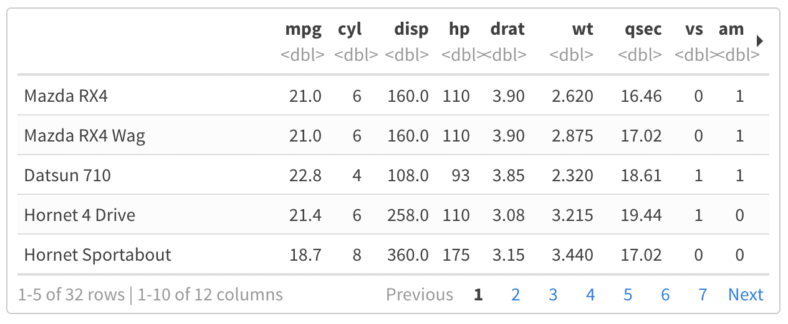

\newpage

# Objetivo

Estudo dirigido de linguagem R.\

```{r Pacotes, message=FALSE, warning=FALSE, echo=FALSE}
library(knitr)
library(rmarkdown)
library(readr)
library(tibble)
library(magrittr)
library(dplyr)
```

# Livro de referência

Utilizando a Linguagem R.\
Editora: ALTA BOOKS EDITORA\

\newpage

# Cap 1 - Instalação do R e Rstudio\

- Download da linguagem R:\
<https://www.r-project.org/>\

- Download Rstudio IDE:\
<https://posit.co/downloads/>\

\newpage

# Cap 2 - Pacote base e funções estatísticas básicas\

## Operações matematicas basicas

```{r Operações Básicas, echo=FALSE}
library(tibble)
library(knitr)
nome_op <- c("Adição","Subtração","Multiplicação","Divisão","Potência","Raiz","Exponencial","Log na base e","Log na base 10","Log na base 2","Log na base 3 ou qualquer outra")
op <- c("5+4","6-2","7*3","45/9","2^2","sqrt(121)","exp(0)","log(1)","log10(1)","log2(4)","log(9,3)")
res <- c(9,4,21,5,4,11,1,0,0,2,2)
tbl_op_bas <- tibble(nome_op,op,res)
kable(tbl_op_bas, "simple" , col.names = c("Nome da operação", "Operação", "Resultado"),align = "lcr",caption = "Operações básicas do R")
```

## Vetor

- Para criar um vetor usamos a função *c*().\
- Os argumentos são separados por virgula dentro do parênteses.\
- strings devem estar entre aspas duplas.\
Ex.: *c*("um","sete","nove")\
- Vetores são compostos de elementos todos do mesmo tipo.\
- Armazenando vetores em um objeto:\
Ex.: *obj_qualquer* <- *c*(1,2,3)\

\newpage

## Tabela de dados (**data.frame**) e **matrizes**

### **data.frame**

- Uma tabela onde cada coluna é um vetor.\
- Como cada coluna é um vetor, cada coluna pode ser de um tipo diferente.\
Ex.: `nome_data.frame <- data.frame(vetor_1, vetor_2)`\
- Acrescentando uma nova coluna ao data.frame.\
Ex.: `nome_data.frame <- data.frame(nome_data.frame, vetor_3)`\
- Para visualizar um **data.frame** podemos usar a função **View**().\
Ex.: `View(nome_data.frame)`\

### **Matrizes**

- A diferença entre **matrizes** e **data.frames**, é que no caso das matrizes todas as colunas e linhas devem ser do mesmo tipo. Enquanto nos **data.frames** as colunas podem ser de tipos diferentes.\

- Para adicionar uma coluna numa matriz, usamos a função cbind().\
Ex.: `nome_matriz <- cbind(vetor_1, vetor_2, ...)`\

- Para adicionar uma linha numa matriz, usamos a função rbind().\
Ex.: `nome_matriz <- rbind(vetor_3, vetor_4, ...)`\

- Quando inserimos dados (vetor) de naturezas diferentes (tipos) numa matriz, ela converte todos os dados para um único tipo. A principio *string* (*chr*).\

\newpage

## Acessando valores em posições especificadas dos objetos - **vetor**, **matriz** e **data.frame**

### Caso **vetor** e **matriz**

- Podemos acessar os valores do objeto tipo **vetor** e **matriz**, informando a posição entre colchetes [].\

- Para os **vetores** precisamos apenas informa a posição. A contagem da posição começa a partir do 1.\
Ex.:\
`vetor <- c(5,18,89)`\
`vetor[1]`\

- Para as **matrizes**, é necessario informar a posição [*linha*, *coluna*]. A contagem da posição começa a partir do 1.\
Ex.:`Mc[1,2]`\

- Para acessar todos os valores de uma *linha* da **matriz**, podemos determinar a *linha* e deixar a *coluna* em branco.\
Ex.: `Mc[1,]`\

- Para acessar todos os valores de uma *coluna* da **matriz**, podemos determinar a *coluna* e deixar a *linha* em branco.\
Ex.: `Mc[,2]`\

### Caso **data.frame**

- No caso do **data.frame** podemos acessar os valores das colunas informando, "nome do **data.frame**" "\$" "nome da coluna".\
Sintaxe:\
`nome_dataframe$nome_coluna`\

- O **data.frame** também aceita as mesmas formas de acessar posições que as **matrizes**.\

\newpage

## Visualizando dados

### **View**() - visualização de dados
- Podemos visualizar dados de duas formas:\
  - Escrevendo o nome da variável\
  O valor dela será impressa na tela.\
  - Atraves da função **View**()\
  Ao chamar a função View() e colocar dentro a variavel que queremos ver, será exibido uma nova janela com o valor da variável numa tabela.\

### **str**() - estrutura de objetos
- A função "**str**()" retorna a estrutura do objeto do argumento.\
- Retorna diversos dados, entre eles:\
  - A classe do objeto.\
  - Tamanho do objeto.\
  - A lista, ou vertor, dos campos com o tipo e tamanho.\ 
- Sintaxe:\
`str(argumento)`\

### **summary**() - resumo de variáveis
- A função **summary**() retorna o resumo de variaveis.\
- O retorno depende do argumento (se for um vetor, uma lista, um data.frame).\
- O retorno para uma matriz ou **data**.**frame**, vai ser os metodos aplicados a cada campo/coluna.\
- O retorno da função, no geral, retorna diversos metodos aplicados aos dados, tais como:\
  - valor mínimo\
  - 1º quantil\
  - valor da mediana\
  - valor da media\
  - 3º quantil\
  - valor máximo\
- Sintaxe:\
`summary(nome_variavel)`\

### **class**() - classe de objetos
- A função "**class**()" retorna a que classe do objeto do argemunto pertence.\
- Basicamente diz se o objeto é numerico, string, vetor, lista, data.frame, matriz, ...\
- Sintaxe:\
`class(argumento)`\

\newpage

## Funções estatísticas básicas

Função    |   Descrição
:------    |   :---------
apply(D,i,f)    |   Retorna os valores resultantes da aplicação da função f ao objeto D, linhas i=1, ou colunas i=2.
c(valor1, valor2, valor3)    |   Concatena uma sequência de valores seja númerico ou de caracteres. Neste último caso os valores devem estar entre aspas.
cbind(x1, x2, ..., xn)    |   Cria uma matriz com n colunas formada pelos vetores x1, x2, ..., xn.
ceiling(x)    |   Retorna o menor inteiro maior ou igual ao valor x.
cor(x,y)    |   Calcula o coeficiente de correlação.
cumsum(x)    |   Retorna um vetor com valores acumulados em soma sobre os elementos de x.
cumprod(x)    |   Retorna um vetor com valores acumulados em produto sobre os elementos de x.
cummin(x)    |   Retorna um vetor com valores acumulados em mínimo sobre os elementos de x.
cummax(x)    |   Retorna um vetor com valores acumulados em máximo sobre os elementos de x.
data.frame(x1, x2, ..., xn)    |   Cria um dataframe com os vatores x1, x2, ..., xn.
det(M)    |   Calcula o determinante da matriz quadrada M.
dim(M)    |   Retorna as dimensões do objeto M.
diff(x)    |   Retorna um vetor com a diferença entre os valores de x.
eigen(M)    |   Retorna os autovalores e os autovetores da matriz quadrada M.
floor(x)    |   Retorna o maior inteiro menor ou igual a x.
identical(x,y)    |   Verifica se os vetores são idênticos.
intersect(x,y)    |   Realiza a interseção de dois conjuntos.
head(D)    |   Mostra o cabeçalho do objeto D.
length(x)    |   Calcula o comprimento do vetor x.
mean(x)    |   Calcula a média do vetor x.
median(x)    |   Calcula a mediana do vetor x.
min(x)    |   Calcula o mínimo de x.
max(x)    |   Calcula o máximo de x.
ncol(M)    |    Retorna o número de colunas da matriz M.
nrow(M)    |   Retorna o número de linhas da matriz M.
polyroot(x)    |   Encontra as raízes do polinômio de ordem n cujos coeficientes são representados no vetor x em ordem decrescente.
prod(x)    |   Multiplica os valores de x.
quantile(x,k)    |   Calcula o percentil de ordem $0 \le x \le 1$ dos valores de x.
Re(x)    |   Retorna a parte real de um vetor x.
rep(x,k)    |   Cria um vetor repetindo a sequência x k vezes.
round(x,k)    |   Arredonda o valor x com k casas decimais.
sd(x)    |   Calcula o desvio-padrão do vetor x.
seq(i,j,k)    |   Cria uma sequência de i ate j com tamanho de passo k.
setdiff(x,y)    |   Retorna um vetor contendo os elementos do conjunto diferença entre x e y.
setequal(x,y)    |   Verifica se os elementos dos vetores x e y são iguais, idenpendentemente da frequência em que aparecem no vetor.
solve(A,b)    |   Resolve Ax=b, retornando x.
sort(x)    |   Ordena os valores de vetor x em ordem crescente.
sort(x, decreasing = T)    |   Ordena os valores de x em ordem decrescente.
str(D)    |   Retorna a estrutura do objeto D.
sum(x)    |   Soma os valores de x.
union(x,y)    |   Retorna os elementos da união entre x e y.
var(x)    |   Calcula a variância do vetor x.
var(x,y)    |   Calcula a covariância entre x e y.
View(D)    |   Mostra o dataframe em janela separada.

\newpage

# Cap 3 - Principais pacotes\

## Instalação de pacotes\
 - sintaxe de instalação:\
 **install.packages**("*nome do pacote*")\
 - sintaxe de variais instalações simultaneas:\
 **install.packages**(c("*nome do pacote*","*nome do pacote*",...), dependencies = **TRUE**)\

## Pacotes

1. Principais pacotes:\

  - **stringr**\
  Pacote para trabalhar com strings (texto).\
  
  - **Rmarkdown**\
  Produção de relatorios (html, pdf, doc, md).\

  - **knitr**\
  Interpretação e compilação do documento rmd.\

  - **data.table**\
  Exploração de data.frames.\

  - **janitor**\
  Limpeza de dados.\

  - **DescTools**\
  Analise descritiva de dados.\

  - **tidyverse**\
  conjunto de pacotes.\
    - **readr**\
    Importação e leitura de arquivos de dados.\
    - **tibble**\
    estruturação de data.frame.\
    - **dplyr**\
    Manipulação de data.frame.\
    - **tidyr**\
    Organização de data.frame.\
    - **ggplot2**\
    Visualização de dados, produção de gráficos.\
    - **purr**\
    Manipulação de vetores e listas.\
  - **foreign**\
  Leitura e gravação de dados armazenados por algumas versões de "Epi Info", "Octave", "Minitab", "S", "SAS", "SPSS", "Stata", "Systat", "Weka" e para leitura e gravação de alguns "dBase" arquivos.\
  - **devtools**\
  Para instalar pacotes que não estejam no **CRAN**.\

2. Pacotes auxiliares ao pacote **ggplot2**:\
  - **ggthemes**\
  - **grid**\

## Carregamento de pacotes

- Para poder utilizar o conjunto de funções de um determinado pacote, não basta apenas instalar o pacote, é preciso carrega-lo no script.\
- As principais formas de carregar um pacote no script é través dos comandos *library*() e *require*().\
**library**(*nome_pacote*)\
**require**(*nome_pacote*)\
- Outra possibilidade, é ao usar um função especificar a qual pacote ela pertence.\
`nome_pacote::função`.\

## Obter ajuda (informações) sobre pacotes

Duas formas de se conseguir informações sobre determinado pacote é através dos comandos:\
1. `package?nome_pacote`\
2. `help(package = "nome_pacote")`\

\newpage

# Sites para uso Remote do R
- Alguns sites que possibilitam utilizar o R básico, sem que seja necessário instala-lo no computador.\
- Uma otima saída quando necessario utilizar em algum computador público (lan houses, hotéis, laboratórios, ...)\
1. <http://rstudio.cloud/>
2. <http://jupyter.org/try>
3. <http://www.tutorialspoint.com/execute_r_online.php>
4. <http://github.com/datacamp/datacamp_light>
5. <http://rdrr.io/snippets>
6. <http://www.jdoodle.com/execute-r-online>
7. <http://rextester.com/l/r_online_compiler>
8. <http://rnotebook.io>

\newpage

# Cap 4 - R Markdown\

## Preâmbulo
### **Titulo**
*title*: "Titulo desejado"\

### **Autor**
  - Para inserir um autor:\
  *author*: "Nome do autor"\
  - Para inserir varios autores:\
  *author*:\
    - autor_1\^[instituto]\
    - autor_2\^[instituto]\

### **Data**
- O comando "*date*:", adiciona uma data ao documento.\
- Podemos adicionar uma data qualquer para o documento no formato "dd/mm/aaaa".\
*date*: "dd/mm/aaaa"\
- Outra possibilidade é usar uma função dentro de um *chunk* "r Sys.Date()", para adicionar a data atual do sistema (modelo inglês).\
*date*: "r Sys.Date()"\
- Outra opção é usar o a função dentro de um *chunk* "r format(Sys.time(), '\%d \%B \%Y')". A data será gerada no modelo: 02 agosto 2004.\
*date*: "r format(Sys.time(), '\%d \%B \%Y')"\
Obs.: *chunk* deve ser colocado entre acentos graves.\

### **Tipo do Documento** (*output*)
- *output*: o tipo de saida, podem ser:\
  - Documentos:\
    - *pdf_document*\
    - *md_document*\
    - *html_document*\
    - *word_document*\
    - *odt_document*\
    - *rtf_document*\
    
  - Apresentação:\
    - *powerpoint_presentation*\
    - *ioslides_presentation*\
    - *beamer_presentation*\
    
  - mais:\
    - *flexdashboard::flex_dashboard*\
    - *github_document*\

### **Sumário**
- Para inserir o sumário no documento, basta colocar o comando "*doc*: *yes*" indentado dentro do tipo de saída.\
- O comando **number_sections: true** adiciona numeração aos capítulos do sumário.\

### Formatação desejada
  Para determinar a formatação desejada, basta salvar um arquivo com o nome *estilo*.*docx*, que contenha a formatação e referenciar o arquivo, indentado dentro do tipo de arquivo, através do comando "*reference_docx*: caminho/.../estilo.docx".\

### **Abstract**
  *Abstract*: "Texto de abstract".\

### **Bibliografia**
  - Ter um arquivo \*.bib com as referencias.\
  - Adicionar o arquivo \*.bib no preâmbulo do **R Markdown**, atravês do comando:\
  *bibliograpy*: caminho/arquivo.bib\
  - Um arquivo \*.csl com o estilo da citação.\
  Este arquivo pode ser obtido no site:\
  <https://www.zotero.org/styles>\
  Pesquisar por: "abnt"\
  Opção: "Instituto de Pesquisa Econômica Aplicada - ABNT (Português - Brasil)"\
  - Adicionar o arquivo \*.csl no preâmbulo do R Markdown, através do comando:\
  *csl*: caminho/arquivo.csl\
  - É necessario criar um capítulo no final para as referências. A bibliografia vai ser alocada no final do documento, logo neste ultímo capítulo. A bibliografio é sempre inserida ao final do documento.\
  - Por fim, para aparecer as referencias elas precisam ser citadas no texto.\
  As principais formas de citar uma referência num texto de **R Markdown** é:\
    - Uma citação:\
    Exemplo do comando: [\@ chave_da_referencia]\
    Exemplo de como fica no arquivo final: [@ULR].\
    - Mais de uma citação ao mesmo tempo:\
    Exemplo do comando: [\@ chave_da_referencia_1, \@ chave_da_referencia_2]\

\newpage

## *Chunks* (códigos embutidos)

### Códigos embutidos no texto

- Podemos embutir códigos ao longo do texto.\
- Para inserir um código que será rodado no meio do texto, usamos um sinais de crase para abrir, definimos a linguagem (normalmente r), o comando que desejamos e um sinal de crase para fechar o código.\
` Este é um código embutido`

- Para rodar pequenos comandos no meio do texto códigos embutidos é uma ótima opção.\

- Exemplo:\
O resultado do comando 1:3 é criar uma sequencia com os valores `1:3`. A soma destes valores é `sum(1:3)`.\
O resultado do comando 1:3 é criar uma sequencia com os valores `r 1:3`. A soma destes valores é `r sum(1:3)`.\

### Chunk

- Códigos em R, ou em outras linguagens, podem ser inseriodos nos documentos através de *chunks*.\
- *Chunks* são blocos de programação.\
-  A principal forma de inserir *chunks* é:\
  + Três sinais de acento grave (crases) para abrir o *chunk*.\
  + Na primeira linha, definir a linguagem do bloco de programação:\
    - **R**\
    - **Python**\
    - **Julia**\
    - **C++**\
    - **SQL**\
    ...\
  + Para dar um nome ao *chunk*, após definir a linguagem de programação basta colocar o nome do *chunk*. Nomear o *chunk* facilita determinar sua função dentro do relatório/documento.\
  + Ainda na primeira linha, considerações sobre o bloco de programação (*chunk options*):\
    - *include*\
    Mostra (*true*), ou não (*false*), o código e os resultados no arquivo finalizado. O R Markdown ainda executa o código e o resultado dele ainda pode ser usado em outro bloco de programação.\
    *include* = *false* | *true*\
    - *echo*\
    Impede (*false*), ou não (*true*), que o código apareça, não afeta o resultado.\
    *echo* = *false* | *true*\
    - *results*\
    "*hide*" mostra o código e omite o resultado.\
    *results* = "*hide*"\
    - *message*\
    Imprede (*false*), ou não (*true*),que mensagens geradas por código apareçam no arquivo finalizado.\
    *message* = *false* | *true*\
    - *warning*\
    Imprede (*false*), ou não (*true*), que avisos gerados pelo código apareçam no final.\
    *warning* = *false* | *true*\
    - *fig.cap*\
    Adiciona uma legenda aos resultados gráficos.\
    *fig*.*cap* = "..."\
  + Bloco de programação, escrito na linguagme definida.\
  + Três sinais de acento grave (crases) para fechar o *chunk*.\
- Outras formas de inserir *chunks* é atraves do botão *Insert*, na área superior da tela do script, do **RStudio**.\
- Observação:\
*messagem* e *warning* igual a *false* é muito utilizado quando se carrega bibliotecas (**library**) no *chunk*, evita que as mensagens do carregamento apareçam.\

### Configurando imagens e tabelas dentro do *chunk*

- Os comandos de configuração de imagem no *chunk* são inseridos no cabeçalho do *chunk*.\

- Principais comando de configuração de imagens com *chunk*:\
  - **fig.width** =\
  Largura da figura em cm na janela gráfica.\
  - **fig.height** =\
  Altura da figura em cm na janela gráfica.\
  - **fig.align** =\
  Alinha a figura no arquivo final ("left", "right" ou "center").\
  - **fig.cap** = " "\
  Texto para legenda.\
  - **dpi** =\
  Valor referente a qualidade da imagem, padrão é 72.\
  - **out.width ou out.height** = \
  Porcentagem do tamanho original da imagem.\

### Global *Chunk*
- Para definir as opções globais que se aplicam a cada parte do seu arquivo, chame `knitr::opts_chunk$set` em uma parte do código.\
- O **knitr** tratará cada opção que você passar para `knitr::opts_chunk$set` como um padrão global que pode ser substituído em cabeçalhos de blocos individuais.\

\newpage

## Titulos e subtitulos
- Ao utilizar o comando \# e em seguencia um texo, geramos um titulo.\
\# Titulo\
- A cada \# que adicionamos, diminuimos uma camada de subtitulos.\
\#\# Subtitulo\

## Pular linha
- Para que duas frases fiquem em linhas separadas, dê dois espaços entre elas.\
- Os dois espaços funcionam também para deixar uma linha em branco.\
- Outra forma é adicinal "\\", tem o mesmo efeito.\

\newpage

## Listas
### Listas numeradas
- Basta inserir o número seguido de ponto e espaço.\
`1. Tópico da lista numerada`\

- A ordem das principais camadas de lista numeradas são:\
  - Número\
  `1. Primeira camada`\
  - Algarismos romanos\
  `i) Segunda camada`\
  - Letra\
  `A. Terceira camada`\
  
- Para inserir uma lista dentro de uma outra lista, é necessario indentar os tópicos.\

### Listas não numeradas

- Os principais simbolos (na ordem de utilização) da lista não númerada:\
  - Asterisco(\*)\
  - Mais(\+)\
  - Traço(\-)\
- Para inserir uma lista dentro de uma outra lista, é necessario indentar os tópicos.\

\newpage

## Notas de rodapé (clicáveis)
- Há duas opções para criar uma nota de rodapé:\
  
1. Escrever ao final do texto `[^1]` e então (pode ser logo abaixo, ou depois) escrever a nota de rodapé:\
"Essa informação não é um consenso `[^1]`"\
`[^1]: Esta é uma nota de rodapé.`\

2. Colocar a informação da nota de rodapé no meio do texto, e o R numerará automaticamente:\
"Essa informação não é um consenso `^[Esta é uma nota de rodapé]`"\

- Observação:\
A informação da nota de rodapé deve estar separado do texto por uma linha, no primeiro caso, ou contida na nota no link clicável, como no segundo caso.\

- Exemplo:\
O RMarkdown é uma ferramenta excelente para documentar seus códigos e apresentar os resultados. As muitas funcionalidades dele são descritas detalhadamente no livro R Markdown: The Definitive Guide [^1].\
  
[^1]: R Markdown: The Definitive Guide. Yihui Xie, J. J. Allaire, Garrett Grolemund. Disponível em:\
<https://bookdown.org/yihui/rmarkdown/>\

\newpage

## Inserir tabelas

### Formato de tabela padrão

- A tabela mais simples é atraves do padrão:\
  - Primeira linha:\
  Cabeçalho das colunas, separado por barra vertical(|).\
  - Segunda linha:\
    - Tracejados (pelo menos 3), para representar cada coluna, com dois pontos onde se espera que o texto esteja alinhado:
      - Dois pontos no inicio do tracejado para representar alinhamento do texo a esquerda.\
      - Dois pontos no inicio e no fim do tracejado para representar alinhamento centralizado do texto.\
      - Dois ponstos no final do tracejado para representar alinhamento do texto a direita.\
    - Cada coluna separada por barra vertical.\
  - Terceira linha em diante:\
  Cada dado de linha em uma linha, com os dados de cada coluna separado por barras verticais.\

### Criador de tabelas online para R Markdown

Site que ajuda a construir tabelas para **R Markdown**:\
<https://tablesgenerator.com/markdown_tables>

\newpage

### Tabelas provenientes de banco de dados

#### Mostrar todos os dados
Dentro do *chunk* chamar a variável que contém um **dataframe**, para imprimir ela na tela.\

#### Mostrar apenas os primeiros dados

- Dentro do *chunk* chamar a variável que contém um **dataframe**, e usar a função **head**() que mostra as 5 primeiras linhas. Podemos adicionar o parâmetro de quantidade de linhas desejamos apresentar.\

- Exemplo:\
**head**(*var_dataframe*, *n_linha*)\

\newpage

#### Bibliotecas para criação de Tabelas

##### **kable**

- Dentro do *chunk*, podemos chamar a biblioteca **knitr**, e usar a função **kable**() onde podemos chamar como argumento a variável **dataframe** (e outras funções).\
- A função **kable**(), apresenta uma tabela em formato mais profissional.\
- Argumentos do **kable**:\
  - format\
  Tipos de formatos que a tabela pode ser representada.\
  `knitr::kable(head(mtcars[, 1:4]), "pipe")`\
    - pipe\
    - simple\
    - latex\
    - html\
    - rst\
  - **col.names**\
  O nome das colunas.\
  Podemos usar o argumento **col.names** para substituir os nomes das colunas por um vetor de novos nomes.\
  `knitr::kable(iris,  col.names = c('We', 'Need', 'Five', 'Names', 'Here'))`\
  - **row.names**\
  Adiciona nome as linhas.\
  - **align**\
  Para alterar o alinhamento das colunas da tabela.\
  Podemos usar um vetor contendo os valores consistindo dos caracteres **l** (esquerda), **c** (centro) e **r** (direita).\
  `kable(..., align = c("l","c",...))`\
  ou\
  `knitr::kable(iris2, align = "lccrr")`\
  - **caption**\
  Adiciona uma legenda a tabela.\
  `knitr::kable(iris2, caption = "An example table caption.")`\
  - **digits**\
  Define o número máximo de casas decimais.\
  `knitr::kable(d, digits = 4)`\
  `knitr::kable(d, digits = c(5, 0, 2))`\
  - **format.args**\
  Define o formato me que os números serão apresentados.\
    - scientific\
    Se é no formato cientifico (**true** ou **false**).\
    `knitr::kable(d, digits = 3, format.args = list(scientific = FALSE))`\
    - big.mark\
    Como será a separação para números grandes.\
    `knitr::kable(d, digits = 3, format.args = list(big.mark = ",",  scientific = FALSE))`\
  - **escape**\
  Ativa (**TRUE**) e desativa (**FALSE**) os caracteres especiais.\
  `knitr::kable(d, format = "latex", escape = TRUE)`\
- Exemplo:\
```
library(knitr)
kable(head(var_dataframe,10))
```

{ width=50% } \

\newpage

##### kableExtra

- Para mais opções de formatação do `knitr::kable`, temos o pacote `kableExtra`.\
- `kableExtra` é um pacote complementar ao `knitr::kable`, por conta disto, é necessário chamar a função `kable` (primeiramente), e concatenar as funções do pacote `kableExtra` pelo operador pipe `%>%`.\
```
library(knitr)
library(kableExtra)
kable(iris) %>%
  kable_styling(latex_options = "striped")

```

- Definir o tamanho da fonte:\
```
kable(head(iris, 5), booktabs = TRUE) %>%
  kable_styling(font_size = 8)
```

- Estilizar linhas e colunas especificas:\
  - Funções:\
    - **row_spec**\
    Especifica a linha que vai ser estilizada.\
    - **column_spec**\
    Especifica a coluna que vai ser estilizada.\
  - Estilizações:\
    - negrito (**bold**)\
    - italico (**italic**)\
    - fundo preto (**background**)\
    - fonte branca (**color**)\
    - sublinhado (**underline**)\
    - espaçamento (**monospace**)\
    - ângulo (**angle**)\
```
kable(head(iris, 5), align = 'c', booktabs = TRUE) %>%
  row_spec(1, bold = TRUE, italic = TRUE) %>% 
  row_spec(2:3, color = 'white', background = 'black') %>%
  row_spec(4, underline = TRUE, monospace = TRUE) %>% 
  row_spec(5, angle = 45) %>% 
  column_spec(5, strikeout = TRUE)
```

- Alterar o tamanho da tabela, preenche todo espaço disponível (**full_width**).\
```
kable(head(dados, 10), col.names = c("Gênero", "Álcool", "Memória", "Latência")) %>%
  kable_styling(full_width = FALSE)
```
- **bootstap_options**\
  - Cores alternadas entre linhas (**bootstap_options** = c("striped")).\
  ```
  kable(head(dados, 10), col.names = c("Gênero", "Álcool", "Memória", "Latência")) %>%
    kable_styling(full_width = F, bootstrap_options = c("striped"))
  ```
  - Deixando a tabela mais condensada/junta (**bootstap_options** = c("striped", "condensed")).\
  ```
  kable(head(dados, 10), col.names = c("Gênero", "Álcool", "Memória", "Latência")) %>%
    kable_styling(full_width = F, bootstrap_options = c("striped", "condensed"))
  ```

- Agrupar linhas e colunas.\
Podemos agrupar conjunto de linhas, ou colunas, e dar um cobeçalho para elas.\
  - Agrupar colunas:\
  Através da função `add_header_above` podemos dar nome aos agrupamentos e definir o número de colunas agrupadas.\
  ```
  iris2 <- iris[1:5, c(1, 3, 2, 4, 5)]
  names(iris2) <- gsub('[.].+', '', names(iris2))
  kable(iris2, booktabs = TRUE) %>%
    add_header_above(c("Length" = 2, "Width" = 2, " " = 1)) %>% 
    add_header_above(c("Measurements" = 4, "More attributes" = 1))
  ```
  - Agrupar linhas:\
  Através da função `pack_rows` e do argumento `index` podemos dar nome aos agrupamentos e definir o número de linhas agrupadas.\
  ```
  iris3 <- iris[c(1:2, 51:54, 101:103), ]
  kable(iris3[, 1:4], booktabs = TRUE) %>% 
    pack_rows(index = c("setosa" = 2, "versicolor" = 4, "virginica" = 3))
  ```

\newpage

##### **xtable**

- A biblioteca **xtable** converte um objeto R em um objeto **xtable**, que pode ser expresso como uma tabela **LaTeX** ou **HTML**.\
- Dentro do *chunk*, podemos chamar a biblioteca **xtable**, e usar a função **xtable**(), que recebe como argumentos a variável **dataframe** (e outras funções) e o *tipo* da saída para a tabela (**LaTeX** ou **HTML**).\
`library(xtable)`\
`xtable(dataframe, type = "latex")`\

```{r Teste Tabela xtable, message=FALSE, warning=FALSE, results='hide'}
library(xtable)

coluna1 <- c(1,2,3,4,5,6)
coluna2<- c("a","b","c","d","e","f")
tab <- data.frame(coluna1,coluna2)

xtable(tab,type = "latex")
xtable(tab,type = "html")
```

\newpage

##### **pander**

- O principal objetivo do pacote **pander** R é oferecer uma ferramenta de fácil renderização de objetos R no markdown do Pandoc.\

- Um dos recursos mais populares do **pander** é `pandoc.table`, renderizando a maioria dos objetos R tabulares em tabelas de remarcação com várias opções de configuração:\
  - *Style* (**Estilo**)\
    - "*simple*"\
    `style = "simple"`\
    - "*grid*"\
    `style = "grid"`\
    - "*markdown*"\
    `style = "markdown"`\
  - *Caption* (**Legenda**)\
  `caption = "Legenda"`\
  - *Highlighting cells* (**Celulas destacadas**)\
  Comandos para destacar linhas, colunas e celulas.\
  As celulas pode estar em negrito e italico ao mesmo tempo.\
    - Italics (*italico*):\
    `emphasize.italics.rows(1)`\
    `emphasize.italics.cols(2)`\
    `emphasize.italics.cells(which(t > 20, arr.ind = TRUE))`\
    - strong (**negrito**):\
    `emphasize.strong.rows(1)`\
    `emphasize.strong.cols(1)`\
    `emphasize.strong.cells(which(t > 20, arr.ind = TRUE))`\
    - verbatim (estilo literal):\
    `emphasize.verbatim.rows(1)`\
    `emphasize.verbatim.cols(2)`\
    `emphasize.verbatim.cells(which(t > 20, arr.ind = TRUE))`\
  Exemplo:\
  `emphasize.italics.cols(1)`\
  `emphasize.italics.rows(1)`\
  `emphasize.strong.cells(which(t > 20, arr.ind = TRUE))`\
  `pandoc.table(t)`\
  - *Justify* (**Alinhamento da celula**)\
    - Opções de alinhamento de celula:\
      - "*right*"\
      - "*left*"\
      - "*center*"\
    - Formas de alinhamento de celula:\
      - Alinhando tudo de uma vez:\
      `justify = "right"`\
      - Alinhando cada coluna separadamente:\
      `justify = c("right","center","left")`\
  - *Table and Cell width* (**Largura**)\
    - split.table (**Largura tabela**)
    A largura máxima da tabela são 80 caracteres, caso ultrapasse esse tamanho, a tabela será quebrada e a parte excendente será inserida abaixo, como uma continuação. Para desligar essa opção e aumentar o tamanho da tabela, basta adicionar a opção *Inf*.\
    `split.table = Inf`\
    - split.cell (**Largura celula**)
    O tamanho máximo da celula são 30 caracteres, caso ultrapasse esse tamanho, o texto será quebrado e adicionado a baixo, ainda na celula.\
    Para ajustar o tamanho da celula (definir o número de caracteres) existem três opções:\
      - Todas de uma vez.\
      `split.cell = 40`\
      - Coluna por coluna.\
      `split.cell = c(40,20,5)`\
      - Em termos de porcentagem.\
      `split.cell = "40%"`\
      `split.cell = c("80%","20%","40%")`\
- Exemplo:\
`library(pander)`\
`pandoc.table(dataframe, justify = "center", caption = "Exemplo de tabela")`\

\newpage

#### Tabela para paginas web

-  Dentro do *chunk*, podemos chamar a biblioteca **rmarkdown**, e usar a função **paged_table**(), onde podemos chamar como argumento a variável **dataframe**.\
- Esse tipo de tabela é ideal para aplicações *web*.\
- Separa os dados por páginas, de maneira dinâmica e com interação do usuário.\
- Mostra dez linhas por página.\
- Exemplo:\
**library**(**rmarkdown**)\
**paged_table**(*var_dataframe*)\

{ width=50% } \

\newpage

## Hiperlinks e imagens
### Hiperlinks\
- Sintaxe:\
`[Nome do Link](Endereço do Link)`\
- Exemplo:\
[Canal do YouTube](https://www.youtube.com/)\

### Imagens\
  - Existem duas formas de pegar uma imagem são elas:\
    - Pegar a imagem de um endereço da web (igual a hiperlink).\
    ``
    - Pegar a imagem de uma pasta no computador (adicionar caminho ate a imagem).\
    ``
  - Sintaxe:\
  ``\
  - Exemplo:\
  { width=35% }\

\newpage

## Fórmulas LaTeX

### Equações

- As equações no **R Markdown** são escritas com a linguagem **LaTeX**.\
  
- Para que a equação apareça no meio do texto, devemos escrevê-la entre dois cifrões: `$equação$`\

- Para que a equação apareça no formato destacado (display), deve ser colocada entre quatro cifrões:\
`$$equação$$`\

###  Superescrito e subscritos

- Superescrito `$a^2$` = $a^2$\
- Subscrito `$a_2$` = $a_2$\
- Agrupado `$a^{2+2}$` = $a^{2+2}$\
- Subscrito dois índices `$a_{i,j}$` = $a_{i,j}$\
- Combinando super e subscrito `$a_2^3$` = $a_2^3$\
- Derivadas `$x'$` = $x'$\

### Sublinhados, sobrelinhas e vetores
Fórmula   |   Símbolo
:-----    |   :-------:
`$\hat a$`    |   $\hat a$
`$\bar b$`    |   $\bar b$
`$\overrightarrow{a b}$`    |   $\overrightarrow{a b}$
`$\overleftarrow{c d}$`   |   $\overleftarrow{c d}$
`$\widehat{d e f}$`   |   $\widehat{d e f}$
`$\overline{g h i}$`    |   $\overline{g h i}$
`$\underline{j k l}$`   |   $\underline{j k l}$

\newpage

### Frações, matrizes e chavetas

- Fração:\
`$\frac{1}{2}$` = $\frac{1}{2}$\

- pmatrix:\
```
$\begin{pmatrix}
x & y \\
z & v \\
\end{pmatrix}$
```
$\begin{pmatrix}
x & y \\
z & v \\
\end{pmatrix}$ \

- bmatrix:\
```
$\begin{bmatrix}
0 & \cdots & 0 \\
\vdots & \ddots & \vdots \\
0 & \cdots & 0 \\
\end{bmatrix}$
```
$\begin{bmatrix}
0 & \cdots & 0 \\
\vdots & \ddots & \vdots \\
0 & \cdots & 0 \\
\end{bmatrix}$ \

- Bmatrix:\
```
$\begin{Bmatrix}
x & y \\
z & v \\
\end{Bmatrix}$
```
$\begin{Bmatrix}
x & y \\
z & v \\
\end{Bmatrix}$ \

- vmatrix:\
```
$\begin{vmatrix}
x & y \\
z & v \\
\end{vmatrix}$ 
```
$\begin{vmatrix}
x & y \\
z & v \\
\end{vmatrix}$ \

- Vmatrix:\
```
$\begin{Vmatrix}
x & y \\
z & v \\
\end{Vmatrix}$ 
```
$\begin{Vmatrix}
x & y \\
z & v \\
\end{Vmatrix}$ \

- matrix:\
```
$\begin{matrix}
x & y \\
z & v \\
\end{matrix}$ 
```
$\begin{matrix}
x & y \\
z & v \\
\end{matrix}$ \

\newpage

### Expressões

- Combinação\
`${n \choose k}$` = ${n \choose k}$\

- Função piso\
`$\lfloor x \rfloor$` = $\lfloor x \rfloor$\

- Função teto\
`$\lceil x \rceil$` = $\lceil x \rceil$\

- Sobrechaves\
`$\begin{matrix} 5050 \\ \overbrace{ 1+2+\cdots+100 } \end{matrix}$` = $\begin{matrix} 5050 \\ \overbrace{1+2+\cdots+100} \end{matrix}$\

- Sobchaves\
`$\begin{matrix} \underbrace{ 1+2+\cdots+100 } \\ 5050 \end{matrix}$` = $\begin{matrix} \underbrace{1+2+\cdots+100}  \\ 5050 \end{matrix}$\

- Função por partes\
`$f(n) = \Bigg \{ \begin{matrix} n/2, & \mbox{se }n\mbox{ é par} \\ 3n+1, & \mbox{se }n\mbox{ é impar} \end{matrix}$` =\
$f(n) = \Bigg \{ \begin{matrix} n/2, & \mbox{se }n\mbox{ é par} \\ 3n+1, & \mbox{se }n\mbox{ é impar} \end{matrix}$\

- Limites\
`$\lim_{n \to \infty}x_n$` = $\lim_{n \to \infty}x_n$\

- Integral\
`$\int_{-N}^{N} e^x\, dx$` = $\int_{-N}^{N} e^x\, dx$\

- Integral Linear\
`$\oint_{C}x^3 \, dx + 4y^2 \, dy$` = $\oint_{C}x^3 \, dx + 4y^2 \, dy$\

- Integral Múltipla\
`$\iiint_V \mu(u,v,w) \, du \, dv \, dw$` = $\iiint_V \mu(u,v,w) \, du \, dv \, dw$\

- Somatório\
`$\sum_{k=1}^{N} k^2$` = $\sum_{k=1}^{N} k^2$\

- Somatório com dois índices\
`$\sum_{\overset{0<i<m}{0<j<n}}k_{i,j}$` = $\sum_{\overset{0<i<m}{0<j<n}}k_{i,j}$\

- Produtório\
`$\prod_{i=1}^{N}x_{i}$` = $\prod_{i=1}^{N}x_{i}$\

- Raiz n-ésima\
`$f(x)\approx\sqrt[n]{x}$` = $f(x)\approx\sqrt[n]{x}$\

\newpage

### Sinais e setas

- Principais sinais e setas:\

Fórmula   |   Símbolo
:-----    |   :-------:
`$\sim$`    |   $\sim$
`$\simeq$`    |   $\simeq$
`$\cong$`   |   $\cong$
`$\le$`   |   $\le$
`$\ge$`   |   $\ge$
`$\equiv$`    |   $\equiv$
`$\approx$`   |   $\approx$
`$\ne$`   |   $\ne$
`$\leftarrow$`    |   $\leftarrow$
`$\rightarrow$`   |   $\rightarrow$
`$\leftrightarrow$`   |   $\leftrightarrow$
`$\longleftarrow$`    |   $\longleftarrow$
`$\longrightarrow$`   |   $\longrightarrow$
`$\mapsto$`   |   $\mapsto$
`$\longmapsto$`   |   $\longmapsto$
`$\nearrow$`    |   $\nearrow$
`$\searrow$`    |   $\searrow$
`$\swarrow$`    |   $\swarrow$
`$\nwarrow$`    |   $\nwarrow$
`$\uparrow$`    |   $\uparrow$
`$\downarrow$`    |   $\downarrow$
`$\updownarrow$`    |   $\updownarrow$

- Guia de fórmulas:\
<http://pt.wikipedia.org/wiki/Ajuda:Guia_de_edição/Fórmulas_TeX>

\newpage

## Letras gregas

- Expressões matemáticas, ou letras gregas, devem vir entre símbolos de $.\

Fórmula   |   Símbolo
:------   |   :------:
`$\alpha$`    |    $\alpha$ 
`$\beta$`   |   $\beta$ 
`$\gamma$`    |   $\gamma$
`$delta$`   |   $\delta$
`$\epsilon$`    |   $\epsilon$
`$\varepsilon$`   |    $\varepsilon$
`$\zeta$`   |    $\zeta$
`$\eta$`    |   $\eta$
`$\theta$`    |   $\theta$
`$\vartheta$`   |   $\vartheta$
`$\iota$`   |   $\iota$
`$\kappa$`    |   $\kappa$
`$\lambda$`   |    $\lambda$
`$\mu$`   |    $\mu$
`$\nu$`   |   $\nu$
`$\xi$`   |   $\xi$
`$\pi$`   |   $\pi$
`$\varpi$`    |   $\varpi$
`$\rho$`    |   $\rho$
`$\varrho$`   |   $\varrho$
`$\sigma$`    |   $\sigma$
`$\varsigma$`   |   $\varsigma$
`$\tau$`    |   $\tau$
`$\upsilon$`    |   $\upsilon$
`$\phi$`    |   $\phi$
`$\varphi$`   |   $\varphi$
`$\chi$`    |   $\chi$
`$\psi$`    |   $\psi$
`$\omega$`    |   $\omega$


- Para letra maiúscula, inicie a letra na fórmula com letra maiúscula.\
$\delta$ = `$\delta$`\
$\Delta$ = `$\Delta$`\

\newpage

## Formatação (Fontes)

- Para deixar uma palavra em **negrito**, coloque-a entre quatro asteriscos: `**negrito**`.\
- Para deixar uma palavra em *itálico*, coloque-a entre dois asteriscos: `*itálico*`.\
- Para deixar uma palavra em ~~tachado~~, coloque-a entre dois til: `~~tachado~~`.\
- Para deixar caracteres ^sobrescritos^, coloque-os entre acentos circunflexos: `^1^`.\
- Para deixar caracteres ~subscritos~, coloque-os entre til: `~1~`.\
- Outra forma de escrever subscritos$_{2}$ (forma *LaTeX*), colocar no formato subscrito equação do *LaTeX*: `subscrito$_{2}$`.\
- Para destacar um termo como `código`, coloque-o entre crases (backticks): `` `código` ``.\
- Para criar uma citação (quote), escreva o texto após um sinal de maior: `> Citação`.\

## Abas

- Aplica a um `#titulo` um comando (`{.tabset}`) que transforma em abas os `##subtitulo` com os graficos e tabelas contidos neles.\
- Muito útil para relatórios dinâmicos (**html**).\
- Exemplo:\
`# titulo {.tabset}`\

\newpage

# Cap 5 - Pacotes do Tidyverse e identificando/mudando tipos de variáveis

## Identificando/mudando tipos de variáveis
i. Principais tipos de variáveis:\
```{r Tabela principais tipos, echo = FALSE}
    tipos_var <- c("numeric","character","factor","logical","complex")
    descricao <- c("Pode ser tanto inteiro (int, ou integer) quanto float (dbl).",
            "São caracteres (chr).",
            "São variáveis do tipo fator.",
            "Variáveis do tipo lógico: TRUE ou FALSE.",
            "No formato de números complexo: 4 + 5i.")
    tab_tipos <- tibble(tipos_var, descricao)
    kable(tab_tipos, col.names = c('Tipo','Descrição'), align = 'lc', caption = "Principais tipos de dados")

```
ii. Identificando o tipo da variável:\
Uso do **is**.\
```
is.numeric(variavel)
[TRUE]
```
iii. Mudando o tipo da variável:\
Uso do **as**.\
`as.caracter(variavel)`\
iv. Observações:\
    - Não é possivel transformar uma variavel do tipo caracter(character) direto para tipo número (numeric), é preciso transformar de caracter (character) para fator (factor) e de fator (factor) para número (numeric).\
  ```
    is.character(varaivel)
    [TRUE]
    as.factor(variavel)
    as.numeric(variavel)
  ```
    - O contrário, transformar de numero (numeric) para caracter (character) é possivel.\
  ```
    is.numeric(variavel)
    [TRUE]
    as.character(variavel)
  ```

\newpage

## Pacotes do Tidyverse
- **readr**\
Leitura de dados.\
  
- **tibble**\
Tipo de data.frame.\
  
- **magrittr**\
Operador pipe `%>%`, concatena linhas de comando.\
  
- **dplyr**\
Manipulação de dados.\
    
- **tidyr**\
Organização de dados.\

- **ggplot2**\
Elaboração de gráficos.\

\newpage

## Leitura de dados (readr)

- Os principais formatos de importação de dados são:\
  - *csv*\
  - *xls*\
  - *xlsx*\
  - *sav*\
  - *dta*\
  - *por*\
  - *sas*\
  - *stata*\
- Entre os princiais formatos de importação de dados o mais usado é o *csv*.\

### Importação de dados via **RStudio**

- No "**Environment**" tem a opção "**Import Dataset**", que pode ser usada para importação de dados "*.csv*".\
"**Environment**" > "**Import Dataset**" > "**From Text (Readr)**"\
- Dentro de "**Import Text Data**":\
  - **File/URL**\
  O caminho ate o arquivo ".csv".\
  - **Data Preview**\
  Mostra uma prévia de como os dados serão lidos (ficarão organizados no **R**). Se não estiver vizualizando, aperte o botão **update**.\
  - **Import Options**\
  São as configurações que podem ser modificadas para garantir a integridade da importação dos dados.\
  Definindo, por exemplo, se o que serpara casas decimais nos dados é virgula ou ponto.\
  - **Code Preview**\
  Apresenta o código que esta sento construido pela automatização da janela. Este código pode ser copiado e executado fora da janela.\
  -  **Import**\
  Botão para concluir a operação da importação dos dados.\

\newpage

### Importação de dados via biblioteca **readr**

- As principais funções de importação de arquivo *.csv* são:\
  - `read.csv`\
  É uma função basica do **R**, não precisa chamar nenhuma biblioteca. Usa o separador de campos virgula.\
  - `read.csv2`\
  É uma função basica do **R**, não precisa chamar nenhuma biblioteca. Usa o separador de campos ponto e virgula.\
  - `readr::read_csv`\
  É uma função do pacote **readr**, por isso o uso de "readr::" para chamar a função. Usa o separador de campos virgula.\
  - `readr::read_csv2`\
  É uma função do pacote **readr**, por isso o uso de "readr::" para chamar a função. Usa o separador de campos ponto e virgula.\
  - `readr::read_tsv`\
  É uma função do pacote **readr**, por isso o uso de "readr::" para chamar a função. Usa o separador de campos tabulação.\
  - `readr::read_delim`\
  É uma função do pacote **readr**, por isso o uso de "readr::" para chamar a função. Usa o separador de campos generico, deve ser especificado pelo parâmetro `delim =`.\
  
- Principais parâmetros, das funções de importação, do pacote `readr`:\
  - `file = `\
  Define o caminho (ou **URL**), que deve ser pecorrido, e o arquivo, no formato .csv, a ser importado. Deve estar entre aspas.\
  Exemplo: `file = "Caminho/arquivo.csv"`\
  - `col_names =`\
  Indica se a primeira linha contém, ou não, o nome das colunas. Também pode ser usado para renomear colunas.\
  Se a primeira linha contém o nome das colunas = **TRUE**.\
  Para nomear, ou renomear, colunas podemos usar um vetor contendo os nomes.\
  Exemplo:\
  `col_names = TRUE`\
  `col_names = c("coluna_1", "coluna_2", ...)`\
  - `col_types =`\
    Caso alguma coluna tenha sido importada com a classe errada, podemos usar esse parâmetro para mudar e especificar o tipo de cada coluna.\
    Podemos especificar através de uma lista contendo as classes de cada coluna, ou uma cadeia de caracteres com caracteres simbolicos para cada classe de cada coluna.\
    Outra possibilidade é mudar as classes através de funções de mudança de classe, usando a função `cols()`, onde `.default =` indica a classe default de importação, para casos não especificados, e caso precisarmos identificar uma coluna em especifico `nome_da_coluna =`.\
    - Caracteres simbólicos:\
      - c = character\
      - i = integer\
      - n = number\
      - d = double\
      - l = logical\
      - f = factor\
      - D = date\
      - T = date time\
      - t = time\
      - ? = guess\
      - _or- = skip\
    - Funções de mudança de classe:\
      - `col_character()`\
      - `col_date()`\
      - `col_time()`\
      - `col_datetime()`\
      - `col_double()`\
      - `col_factor()`\
      - `col_integer()`\
      - `col_logical()`\
      - `col_number()`\
      - `col_skip()`\
    - Exemplos:\
    `col_types = "iccD"`\
    `col_types = cols(.default = "i", xxx = "c")`\
    `col_types = cols(.default = col_integer(), xxx = col_character())`\
  - `skip =`\
  Pula linhas do começo do arquivo antes de iniciar a importação. Utíl quando tem algum texto explicativo na primeira linha do arquivo.\
  Exemplos:\
  `skip = 0`\
  `skip = 1`\
  - `na =`\
  Indica quais *strings* deverão ser tratas como **NA** na hora da importação.\
  Exemplo: `na = c("","NA")`\
  - `delim =`\
  No caso da função `read_delim`, podemos definir através deste parâmetro o tipo de delimitador de campos usado no arquivo. O caractere usado como delimitador de campo deve estar entre aspas.\
  Exemplo: `delim = ","`\

- Sintaxe:\
```
library(readr)
dt <- read_csv2(file = "~/caminho/arquivo.csv",
  col_names = TRUE,
  col_types = "iccD",
  na = c("","NA"),
  skip = 0)
```

- Observação:\
  Por padrão *csv* usa separação por virgula, porém no brasil como a virgula é usado para separação de casas decimais, o padrão *csv* brasileiro o separador de campo é o ponto e virgula, sendo assim, para importar dados em formato *csv* no brasil a melhor escolha é o pacote `readr::read_csv2`.\

\newpage

### Sincronização com banco de dados

- Drives **ODBC** é um conector com banco de dados.\
  - instalando **ODBC** no linux/Ubuntu:\
  `sudo apt-get install unixodbc unixodbc-dev --install-suggests`\
  - Instalação de cada ODBC separadamente:\
    - SQL Server ODBC Drivers (Free TDS)\
    `sudo apt-get install tdsodbc`\
    - PostgreSQL ODBC ODBC Drivers\
    `sudo apt-get install odbc-postgresql`\
    - MySQL ODBC Drivers\
    `sudo apt-get install libmyodbc`\
    - SQLite ODBC Drivers\
    `sudo apt-get install libsqliteodbc`\
  - É necessário configurar dois arquivos `odbcinst.ini` e `odbc.ini`.\
    
    
    - `odbcinst.ini`\
    ```
    [PostgreSQL Driver]
    Driver          = caminho/psqlodbcw.so
    [SQLite Driver]
    Driver          = caminho/libsqlite3odbc.dylib
    ```
    
    
    - `odbc.ini`\
    ```
    [PostgreSQL]
    Driver      = PostgreSQL Driver
    Database    = test_db
    Servername  = localhost
    UserName    = postgres
    Password    = password
    Port        = 5432
    
    [SQLite]
    Driver      = SQLite Driver
    Database    =/tmp/testing
    ```
    
- O pacote **DBI** ajuda a conectar o **R** aos sistemas de gerenciamento de banco de dados (DBMS).\

- Conectando com banco de dados **Postgres**:\
```
con <- DBI::dbConnect(odbc::odbc(),
                      Driver   = "PostgreSQL Driver",
                      Server   = "localhost",
                      Database = "name_database",
                      UID      = rstudioapi::askForPassword("Database user"),
                      PWD      = rstudioapi::askForPassword("Database password"),
                      Port     = 5432)
```
    
- Referência:\
<http://db.rstudio.com/> \

\newpage

## **tibble**

### Visualização de tabelas tipo **tibble**

- *tibble* é um tipo especial de tabela equivalente ao *data.frame*, porem mais compacta e com mais informações.\

- O *tibble* exibe informações sobre os tipos de cada variável:\
  - *factor*(**fct**)\
  - *character*(**chr**)\
  - *integer*(**int**)\
  - *double*(**dbl**)\
-  Visualização da tabela:\
  - O *tibble* também omite linhas quando a tabela é muito numerosa, para melhor visualização.\
  - O *tibble* por **default** exibira ate 10 linhas.\
  ```
  library(tibble)
  dt <- tibble(dados)
  dt
  ```
  - Caso necessite ver mais linhas basta especificar.\
  `print(dt, n=15)`\

### Criação de tabela tipo **tibble**

- Primeiramente é necessario chamar a biblioteca **tibble**\
`library(tibble)`\

- De forma semelhante ao **data.frame**, podemos criar tabelas do tipo **tibble**.\
`x = tibble(coluna1 = c(...), coluna2 = c(...), ...)`\

\newpage

### Funções **tibble**

- `as_tibble()`\
  - Transforma um **data.frame** em tipo **tibble**, através da função **as_tibble()**.\
  `x <- as_tibble(x)`\

- `is_tibble()`\
  - Verifica se uma tabela é tipo **tibble**, através da função **is_tibble()**. Retorna **TRUE** (se verdadeiro), ou **FALSE** (se falso).\
  `is_tibble(x)`\

- `add_column()`\
  - Adiciona novas colunas.\
  ```
  dados1 %>% 
  add_column(nome = valor)
  ```
  - Também é possivel definir a posição onde a nova coluna vai se encaixar, indicando a posição (`.before = 1` ou `.after = 1`).\
  ```
  dados1 %>% 
  add_column(nome = valor, .before = 1)
  ```
  
- `add_row()`\
  - Adiciona novas linhas.\
  - Também é possivel definir a posição da nova linha através dos comandos `.before` ou `.after`.\
  - É necessário adicionar as informações e referenciar as colunas.\
  ```
  dados1 %>% 
  add_row(cupom = 100, filial = "A",
  valor_compra = 10, n_itens = 1,
  desconto_perc = 0, quinzena = 1,
  .before = 1)
  ```

\newpage

## Operador **pipe**

- Esta contido do pacote `magrittr`.\
- Funciona como uma função composta, tornando a leitura das linhas de comando mais lógica e natural.\
- Trata-se de um operador cuja notação é `%>%`. Com ele podemos encadear (concatenar) linhas de comandos na ordem de execução.\
- Atalho no teclado `ctrl+shift+M`.\
- Exemplo:\
```
library(magrittr)
library(dplyr)

dados1 %>% 
select(filial,quinzena) %>%
filter(quinzena == 1)
```

\newpage

## Manipulando dados com o **dplyr**

### munipulação de dados:
- `select()`\
  - Seleciona e retorna as colunas selecionadas da tabela.\
  - Retorna as colunas selecionadas no formato tabela.\
  - Pode retornar mais de uma coluna.\
  - Exemplo:\
```
library(dplyr)
library(magrittr)
dados1 %>% 
select(filial,quinzena,valor_compra)
```
          
- `pull()`\
  - Extrai uma coluna de uma tabela de dados e retorna ela como vetor.\
  - A coluna identificada para extração pode ser tanto pelo nome, quanto pela posição.\
  - Retorna apenas uma coluna, no formato vetor.\
  - Exemplo:\
  ```
  library(dplyr)
  library(magrittr)
  vetor <- dados1 %>% 
  pull(filial)
  ```
  ou,\
  `pull(2)`\
  ou,\
  `pull(-5)`\

\newpage

- `filter()`\
  - Filtra linhas.\
  - Exemplo:\
  ```
  library(dplyr)
  library(magrittr)
  dados1 %>% 
  filter(filial == "A")
  ```
  - Pricipais operadores lógicos:\
```{r operadores lógicos usados na função filter, echo=FALSE,message=FALSE}
# Pacotes
library(knitr)
library(tibble)

# Colunas
op_logic <- c("==","!=", ">","<",">=","<=","&","|","!")
desc_op_logic <- c("Igualdade","Diferença","Maior que","Menor que", "Maior ou igual que", "Menor ou igual que", "E", "OU", "Negação")

# Tabela
tbl_op_logic <- tibble(op_logic,desc_op_logic) # tibble
kable(tbl_op_logic, align = "lr", col.names = c("Operador lógico","Descrição"), caption = "Tabela dos principais operadores lógicos usados na função filter.")
```

- `distinct()`\
  - Remove linhas com valores repetidos de determinadas colunas.\
  - Podemos extrair todas as linhas distintas , do banco de dados, pelo comando `distinct()`, apenas não especificando as colunas.\
  - Exemplo:\
  ```
  library(dplyr)
  library(magrittr)
  dados1 %>% 
  distinct(filial)
  ```
  ou,\
  `distinct(filial, quinzena, desconto_perc)`\
  ou,\
  `distinct()`\

\newpage

- `arrange()`\
  - Reordena em determinadas colunas as linhas.\
  - Pode reordenar mais de uma coluna por vez.\
  `arrange(coluna_1,coluna_2,...)`\
  ou\
  ```
  arrange(coluna_1) %>% 
  arrange(coluna_2)
  ```
  - A ordem das colunas na função determina a prioridade na ordenação.\
  - Por **default** reordena as linhas em ordem crescente.\
  - Podemos também reordenar as linhas em ordem decrescente:\
    - `arrange(-nome_coluna)`\
    Colocando um sinal de negativo na frente da coluna é informar ordenar em decrescente.\
    - `arrange(desc(nome_coluna))`\
    Usando a função `desc()`.\
  - Exemplo:\
  ```
  library(magrittr)
  library(dplyr)
  
  dados1 %>% 
  arrange(n_itens,valor_compra) %>% 
  filter(valor_compra > 100) %>% 
  select(filial,n_itens,valor_compra)
  ```

\newpage

- `mutate()`\
  - Cria novas colunas, na base de dados.\
  - Exemplo:\
  ```
  library(magrittr)
  library(dplyr)
  
  dados1 %>% 
  mutate(vmci = round(valor_compra/n_itens))
  ```
    
- `transmute()`\
  - Cria novas colunas, mas não adiciona na base de dados.\
  - A diferença de `transmute()` para `mutate()` é que em `mutate()` acrescenta novas colunas aos dados originais, enquanto que em `transmute()` criamos novas colunas a partir dos dados originais.\
  - Exemplo:\
  ```
  library(magrittr)
  library(dplyr)
  
  dados1 %>% 
  transmute(vmci = round(valor_compra/n_itens))
  ```

\newpage

- `summarise()`\
  - Permite sumarizar variáveis, ou seja, produzir tabelas resumidas do banco de dados.\
  - Pode ser usado em conjunto com o comando `group_by()` para obter o resumo de grupos.\
  - Sintaxe:\
  `summarise(nome_da_coluna = função_summarise(coluna))`
  - Exemplo:\
  ```
  dados1 %>%
  select(filial) %>%
  summarise(item_total = sum(n_itens))
  ```
  ou
  ```
  dados1 %>%
  group_by(filial) %>%
  summarise(cupons_distintos = n_distinct(cupom))
  ```
  - Principais funções de sumarização:\
```{r Principais funções de sumarização, echo=FALSE}
# bibliotecas
library(tibble)
library(knitr)

# colunas  
funcoes_sum <- c(
  "n()",
  "n_distinct(x)",
  "sum(x)",
  "mean(x)",
  "median(x)",
  "quantile(x,k)",
  "min(x)",
  "max(x)",
  "var(x) ou var(x,y)",
  "sd(x)",
  "prod(x)")
desc_func_sum <- c(
  "Conta o número de elementos da coluna x",
  "Conta os elementos distintos da coluna x",
  "Soma os valores da coluna x, retorna o acumulado",
  "Cálcula a média da coluna x",
  "Cálcula a mediana da coluna x",
  "Cálcula o percentil de ordem 0<=k<=1 dos valores da coluna x",
  "Retorna o valor mínimo da coluna",
  "Retorna o valor máximo da coluna",
  "Cálcula a variância da coluna x, ou a covariância da coluna x em relação a coluna y",
  "Cálcula o desvio-padrão da coluna x",
  "Multiplica os valores da coluna x"
)
tbl_func_sum <- tibble(funcoes_sum,desc_func_sum)
kable(tbl_func_sum,col.names = c("Funções", "Descrição"), caption = "Principais funções de summarise", align = "lc")
```

- `group_by()`\
  - Permite operações por grupo. Agrupa dados de determinadas colunas.\
  - Agrupa as colunas priorizando a ordem em que aparecem na função.\
  - Exemplo:\
  `group_by(coluna1,coluna2,...)`\

\newpage

- `rename()`\
  - Renomeia uma coluna.\
  `rename(novo_nome = antigo_nome)`\
  - Pode renomear várias colunas de uma vez.\
  ```
  dados1 %>% 
  rename(x1 = coluna1, x2 = coluna2, ...)
  ```

\newpage

### combinando tabelas de dados:\
- `bind_cols()`\
  - Une duas tabelas lado a lado, sobrepostas. Ou seja, soma o número de colunas das duas tabelas.\
  - Acrescenta numeração as colunas repetidas. Ou seja, se hover a mesma coluna nas duas tabelas, será acrescido ao nome das colunas repetidas um valor.\
  - É necessario que tenha o mesmo número de linhas nas duas tabelas para fazer essa combinação.\
  - Dentro da função, a ordem de chamada de cada tabela determina a ordem das colunas.\
  - Exemplo:\
  ```
  library(tibble)
  library(magrittr)
  library(dplyr)
  x <- dados1 %>% 
  select(cupom,filial,valor_compra)
  y <- dados1 %>%
  select(cupom,n_itens)
  z <- bind_cols(x,y)
  colnames(z)
  ```
  ` [1] "cupom...1" "filial" "valor_compra" "cupom...4" "n_itens"`\
  
- `bind_rows()`\
  - Une duas tabelas pelas linhas.\
  - Não é necessário que o número de linhas, ou colunas, seja igual nas duas tabelas. Nesse ponto é diferente do comando `bind_cols()`.\
  - As colunas das duas tabelas são combinadas, porém das colunas repetidas é mantida apenas uma.\
  - Quando não há correspondencia entre as colunas o comando retorna **NA**, no valor especifico da linha.\
  - Dentro da função, a ordem de chamada de cada tabela determina a ordem das colunas.\
  - Exemplo:\
  ```
  library(tibble)
  library(magrittr)
  library(dplyr)
  x <- dados1 %>% 
  select(cupom,filial,valor_compra)
  y <- dados1 %>%
  select(cupom,n_itens)
  z <- bind_rows(x,y)
  colnames(z)
  ```
  ` [1] "cupom" "filial" "valor_compra" "n_itens"`\

\newpage
 
- `inner_join()`\
  - A tabela final será o resultado da intersecção das colunas de x e y, que possuem pelo menos uma coluna em comum, a coluna *chave*.\
  - Junta duas colunas pela interseção.\
  - Ao juntar as duas tabelas pela função `inner_join()`, apenas os registros que existam nas duas tabelas (pela coluna chave) são unidos, os demais registros de cada tabela não são agregados.\
  - Os filtros (`filter()`) aplicados a cada tabela são somados.\
  - Exemplo:\
  ```
  x = dados1 %>%
  select(cupom, filial, valor_compra) %>%
  filter(valor_compra >500)
  x
  y = dados1 %>%
  select(filial,n_itens) %>%
  filter(n_itens < 8)
  y
  inner_join(x,y)
  ```
          
- `left_join()`\
  - Une duas tabelas, definindo qual será a tabela principal (tabela da **esquerda**).\
  - Apresenta e prioriza os registros da tabela principal (tabela da **esquerda**).\
  - O resultado final reúne todos os registros da tabela principal e os correspondentes na outra tabela.\
  - É necessário que tenha pelo menos uma coluna em comum, a coluna chave.\
  - Exemplo:\
  `left_join(tabela_principal, tabela_secundaria)`\
        
- `right_join()`\
  - Une duas tabelas, definindo qual será a tabela principal (tabela da **direita**).\
  - Apresenta e prioriza os registros da tabela principal (tabela da **direita**).\
  - O resultado final reúne todos os registros da tabela principal e os correspondentes na outra tabela.\
  - É necessário que tenha pelo menos uma coluna em comum, a coluna chave.\
  - Exemplo:\
  `right_join(tabela_secundaria, tabela_principal)`\
        
- `full_join()`\
  - Une duas tabelas.\
  - Mantem todos os registros.\
  - Prestar atenção na junção das linhas/registros que formam novas informações, através da combinação de correspondentes.\
  - Os registros sem correspondentes na outra tabela são preenchidos com valor **NA**.\
  - É necessario que tenha pelo menos uma coluna em comum, uma coluna chave.\
  - Exemplo:\
  ```
  x <- dados1 %>% 
  select(cupom,filial,valor_compra) %>% 
  filter(valor_compra > 500)
  
  y <- dados1 %>% 
  select(filial,n_itens) %>% 
  filter(n_itens < 8)
  
  full_join(x,y)
  ```

\newpage

- `intersect()`\
Retorna a interseção entre tabelas.\
`intersect(x,y)`\
          
- `union()`\
  - Retorna a união de tabelas.\
  - Não repete registros iguais nas duas tabelas.\
  - Monta a nova tabela na ordem em que as tabelas foram inseridas na função.\
  - Exemplo:\
  `union(x,y)`\
          
- `setdiff()`\
  - Retorna a diferença entre tabelas.\
  - A ordem das tabelas na função interfere na saída:\
    - `setdiff(x,y)`\
    Retorna tudo que esta em x e não esta em y.\
    - `setdiff(y,x)`\
    Retorna tudo que esta em y e não esta em x.\

- `setequal()`\
  - Esse comando verifica se duas tabelas de dados possuem linhas com os mesmos valores, independentemente da ordem em que tais valores se apresentem.\
  - Retorna **TRUE**, se os registros forem iguais, ou **FALSE**, se os registros forem diferentes.\
  - Sintaxe:\
  `setequal(tabela_1,tabela_2)`\

\newpage

## Organizando dados com o **tidyr**

- `pivot_longer()` ou `gather()`\
Converte a tabela de dados para o formato longo. (larga -> longo)\
    
- `pivot_wider()` ou `spread()`\
Converte a tabela de dados para o formato larga. (longo -> larga)\
    
- `separate()`\
Separa as respostas que estão em uma unica coluna para diversas colunas.\
    
- `unite()`\
O comando unite é utilizado para unir duas ou mais colunas em uma unica coluna.\
    
- `complete()`\
Completa as combinações de duas colunas, se não houver valor completa com **NA**.\
    
- `drop_na()`\
Elimina as linhas, especificadas ou não, com valor **NA**.\
    
- `replace_na()`\
Substitui o valor **NA** por outro valor especificado.\

\newpage

# Cap 6 - Pacote data.table\
  1. **data.table**\
      - Manipulando linhas\
      - Manipulando colunas\
      - Sumarizando dados\
      - Operando um subconjunto de dados
        - *lapply*\
      - modificando dados com set:
        - *set*\
        modificando um valor.\
        - *setnames*\
        modificando nome da coluna.\
        - *setorder*\
        modificando ordem das linhas.\
        - *setcolorder*\
        modificando ordem das colunas.\

\newpage

# Cap 7 - Gráficos basicos e pacote ggplot2\

1. Gráficos basicos:\
  
  - Gráfico de barras\
  **barplot**\
      
  - Gráfico circular (pizza)\
  **pie**
      
  - Gráfico de linhas\
  **plot**
    - Para adicionar mais linhas no grafico.\
    **lines** 
        
  - Gráfico de dispersão\
    - Para obter a correlação.\
    **cor**(x,y)\
    - Para obter o coeficiente da reta de regressão.\
    **lm**(y ~x)$coef\
    - Adiciona a reta tracejada.\
    **abline**\
        
  - Histograma\
  **hist**\
      
  - **Boxplot** (diagrama de caixa)\
      

2. Pacote **ggplot2**\
  - Constroi diversos tipos de graficos a partir da mesma estrutura de componentes:\
    - *data*: referente ao banco de dados.\
    - *geom_forma*: um rol de tipos possiveis de representação dos dados.\
    - *coord_system*: referente ao sistema de coordenadas, que podem ser cartesianas, polares e projeção de mapas.\
      
  i) O que precisa para fazer o grafico?\
    A. Um nome de objeto para guardar o grafico (uma variavel).\
    B. A base de dados que será utilizada para a plotagem.\
    **ggplot**(*data***=***nome_da_base*)\
    C. Descrever como as variaveis serão utilizadas na plotagem:\
    **aes**(*x***=**..., *y***=**..., ...)\
    D. Especificar o tipo de grafico:\
    *geom_forma*(...)\
    E. Utilizar o operador "**+**" para adicionar camadas ao objeto **ggplot** criado.\
    F. Pacotes auxiliares como *ggthemes* e *grid*, dentre outros.\
      
  ii) Quais formatos podemos utilizar no ggplot2 - geom_forma?\
  
  Forma   |   Tipo de grafico
  :----   |   ---------------:
  geom_area ou geom_ribbon    |   Produz um grafico para visualizar área sob a curva ou entre curvas.
  geom_bar ou geom_col    |   Produz um grafico de colunas do vetor x.
  geom_bar+coord_polar    |   Produz um grafico circular (Pizza).
  geom_boxplot    |   Produz o boxplot de x.
  geom_curve    |   Produz um grafico em curva.
  geom_density    |   Produz um grafico da densidade de x.
  geom_dotplot    |   Produz um grafico de pontos.
  geom_histogram    |   Produz um histograma do vetor x.
  geom_line, geom_abline, geom_hline, geom_vline    |   Produz um grafico de linhas
  geom_point    |   Produz um grafico de dispersão entre x e y.
  geom_qq ou geom_qq_line    |   plota os quantis de x usando como base a curva normal.
  geom_tile, geom_rect ou geom_raster    |   Produz uma grade de retangulos.
  geom_violin    |   Produz um grafico em forma de violino.

  iii) Nome dos argumentos para adicionar efeito em graficos do pacote ggplot2.
  
  Função    |   Efeito no grafico
  :-----    |   -----------------:
  autoplot    |   Produz um grafico apropriado para o tipo de variavel.
  coord_cartesian    |   Coordenada cartesiana.
  coord_fixed    |   Coordenada cartesiana com razão entre eixo x e y fixada.
  coord_flip    |   Inverte a posição dos eixos x e y.
  coord_polar    |   Coordenada polar.
  geom_blank    |   Janela em branco.
  geom_jitter    |   Produz um efeito jitter.
  geom_smooth    |   Produz uma curva suavizada.
  geom_text    |   Aplica texto a janela grafica.
  scale_fill_(=brewer ou grey ou gradient)    |   Define a escala de cores.
  scale_*_continuos    |   Define parametros para o eixo x ou y continuos.
  scale_*_discrete    |   Define parametros para o eixo x ou y discreto.
  scale_*_manual    |   Define parametros para os eixos manualmente.

  - Definindo um tema para o grafico **ggplot**.\
    - *theme_gray*\
    Fundo cinza e linhas grandes brancas.\
    - *theme_bw*\
    O classico preto e branco. Otimo para projetor.\
    - *theme_linedraw*\
    Linhas pretasde varias larguras num fundo branco. semelhante ao theme_bw.\
    - *theme_light*\
    Semelhante ao theme_linedraw, porem com as linhas mais cinza claro, para dar atenção aos dados.\
    - *theme_dark*\
    Versão escura do theme_light, com o fundo escuro, util para criar linhas finas coloridas.\
    - *theme_minimal*\
    Um tema minimalista sem anotações de fundo.\
    - *theme_classic*\
    Tema classico, com linhas do eixo x e y, sem linhas de grade.\
    - *theme_void*\
    Um tema completamente vazio.\
    
\newpage

# Andamento dos Estudos

## Assunto em andamento:

Atualmente estou estudando Cap.7, pacote ggplot2.\
E revisando Cap.5 \- O sistema tidyverse.\

\newpage

# Referências
