\thispagestyle{empty}

\newpage
\pagenumbering{roman}

```{=latex}
\setcounter{tocdepth}{4}
\renewcommand{\contentsname}{SUMÁRIO}
\tableofcontents
```

\newpage

```{=latex}
\setcounter{tocdepth}{4}
\renewcommand{\listfigurename}{LISTA DE FIGURAS}
\listoffigures
```

\newpage

```{=latex}
\setcounter{tocdepth}{4}
\renewcommand{\listtablename}{LISTA DE TABELAS}
\listoftables
```

```{r Pacotes, message=FALSE, warning=FALSE, echo=FALSE}
library(knitr)
library(rmarkdown)
library(readr)
library(tibble)
library(magrittr)
library(dplyr)
library(tidyr)
library(data.table)
library(janitor)
```

\newpage

# OBJETIVO

Estudo dirigido de linguagem R.\

\pagenumbering{arabic}
\newpage

# CAP. 1 - INSTALAÇÃO DO **R** E **RSTUDIO**

- Download da linguagem R:\
<https://www.r-project.org/>\

- Download Rstudio IDE:\
<https://posit.co/downloads/>\

\newpage

# CAP. 2 - PACOTE BASE E FUNÇÕES ESTATÍSTICAS BÁSICAS

## Operações matematicas basicas

```{r Operações Básicas, echo=FALSE}
library(tibble)
library(knitr)
nome_op <- c("Adição","Subtração","Multiplicação","Divisão","Potência","Raiz","Exponencial","Log na base e","Log na base 10","Log na base 2","Log na base 3 ou qualquer outra")
op <- c("5+4","6-2","7*3","45/9","2^2","sqrt(121)","exp(0)","log(1)","log10(1)","log2(4)","log(9,3)")
res <- c(9,4,21,5,4,11,1,0,0,2,2)
tbl_op_bas <- tibble(nome_op,op,res)
kable(tbl_op_bas, "simple" , col.names = c("Nome da operação", "Operação", "Resultado"),align = "lcr",caption = "Operações básicas do R")
```

## Vetor

- Para criar um vetor usamos a função *c*().\
- Os argumentos são separados por virgula dentro do parênteses.\
- strings devem estar entre aspas duplas.\
Ex.: *c*("um","sete","nove")\
- Vetores são compostos de elementos todos do mesmo tipo.\
- Armazenando vetores em um objeto:\
Ex.: *obj_qualquer* <- *c*(1,2,3)\

\newpage

## Tabela de dados (**data.frame**) e **matrizes**

### **data.frame**

- Uma tabela onde cada coluna é um vetor.\
- Como cada coluna é um vetor, cada coluna pode ser de um tipo diferente.\
Ex.: `nome_data.frame <- data.frame(vetor_1, vetor_2)`\
- Acrescentando uma nova coluna ao data.frame.\
Ex.: `nome_data.frame <- data.frame(nome_data.frame, vetor_3)`\
- Para visualizar um **data.frame** podemos usar a função **View**().\
Ex.: `View(nome_data.frame)`\

### **Matrizes**

- A diferença entre **matrizes** e **data.frames**, é que no caso das matrizes todas as colunas e linhas devem ser do mesmo tipo. Enquanto nos **data.frames** as colunas podem ser de tipos diferentes.\

- Para adicionar uma coluna numa matriz, usamos a função cbind().\
Ex.: `nome_matriz <- cbind(vetor_1, vetor_2, ...)`\

- Para adicionar uma linha numa matriz, usamos a função rbind().\
Ex.: `nome_matriz <- rbind(vetor_3, vetor_4, ...)`\

- Quando inserimos dados (vetor) de naturezas diferentes (tipos) numa matriz, ela converte todos os dados para um único tipo. A principio *string* (*chr*).\

\newpage

## Acessando valores em posições especificadas dos objetos - **vetor**, **matriz** e **data.frame**

### Caso **vetor** e **matriz**

- Podemos acessar os valores do objeto tipo **vetor** e **matriz**, informando a posição entre colchetes [].\

- Para os **vetores** precisamos apenas informa a posição. A contagem da posição começa a partir do 1.\
Ex.:\
`vetor <- c(5,18,89)`\
`vetor[1]`\

- Para as **matrizes**, é necessario informar a posição [*linha*, *coluna*]. A contagem da posição começa a partir do 1.\
Ex.:`Mc[1,2]`\

- Para acessar todos os valores de uma *linha* da **matriz**, podemos determinar a *linha* e deixar a *coluna* em branco.\
Ex.: `Mc[1,]`\

- Para acessar todos os valores de uma *coluna* da **matriz**, podemos determinar a *coluna* e deixar a *linha* em branco.\
Ex.: `Mc[,2]`\

### Caso **data.frame**

- No caso do **data.frame** podemos acessar os valores das colunas informando, "nome do **data.frame**" "\$" "nome da coluna".\
Sintaxe:\
`nome_dataframe$nome_coluna`\

- O **data.frame** também aceita as mesmas formas de acessar posições que as **matrizes**.\

\newpage

## Visualizando dados

### **View**() - visualização de dados
- Podemos visualizar dados de duas formas:\
  - Escrevendo o nome da variável\
  O valor dela será impressa na tela.\
  - Atraves da função **View**()\
  Ao chamar a função View() e colocar dentro a variavel que queremos ver, será exibido uma nova janela com o valor da variável numa tabela.\

### **str**() - estrutura de objetos
- A função "**str**()" retorna a estrutura do objeto do argumento.\
- Retorna diversos dados, entre eles:\
  - A classe do objeto.\
  - Tamanho do objeto.\
  - A lista, ou vertor, dos campos com o tipo e tamanho.\ 
- Sintaxe:\
`str(argumento)`\

### **summary**() - resumo de variáveis
- A função **summary**() retorna o resumo de variaveis.\
- O retorno depende do argumento (se for um vetor, uma lista, um data.frame).\
- O retorno para uma matriz ou **data**.**frame**, vai ser os metodos aplicados a cada campo/coluna.\
- O retorno da função, no geral, retorna diversos metodos aplicados aos dados, tais como:\
  - valor mínimo\
  - 1º quantil\
  - valor da mediana\
  - valor da media\
  - 3º quantil\
  - valor máximo\
- Sintaxe:\
`summary(nome_variavel)`\

### **class**() - classe de objetos
- A função "**class**()" retorna a que classe do objeto do argemunto pertence.\
- Basicamente diz se o objeto é numerico, string, vetor, lista, data.frame, matriz, ...\
- Sintaxe:\
`class(argumento)`\

\newpage

## Funções estatísticas básicas

Função    |   Descrição
:------    |   :---------
apply(D,i,f)    |   Retorna os valores resultantes da aplicação da função f ao objeto D, linhas i=1, ou colunas i=2.
c(valor1, valor2, valor3)    |   Concatena uma sequência de valores seja númerico ou de caracteres. Neste último caso os valores devem estar entre aspas.
cbind(x1, x2, ..., xn)    |   Cria uma matriz com n colunas formada pelos vetores x1, x2, ..., xn.
ceiling(x)    |   Retorna o menor inteiro maior ou igual ao valor x.
cor(x,y)    |   Calcula o coeficiente de correlação.
cumsum(x)    |   Retorna um vetor com valores acumulados em soma sobre os elementos de x.
cumprod(x)    |   Retorna um vetor com valores acumulados em produto sobre os elementos de x.
cummin(x)    |   Retorna um vetor com valores acumulados em mínimo sobre os elementos de x.
cummax(x)    |   Retorna um vetor com valores acumulados em máximo sobre os elementos de x.
data.frame(x1, x2, ..., xn)    |   Cria um dataframe com os vatores x1, x2, ..., xn.
det(M)    |   Calcula o determinante da matriz quadrada M.
dim(M)    |   Retorna as dimensões do objeto M.
diff(x)    |   Retorna um vetor com a diferença entre os valores de x.
eigen(M)    |   Retorna os autovalores e os autovetores da matriz quadrada M.
floor(x)    |   Retorna o maior inteiro menor ou igual a x.
identical(x,y)    |   Verifica se os vetores são idênticos.
intersect(x,y)    |   Realiza a interseção de dois conjuntos.
head(D)    |   Mostra o cabeçalho do objeto D.
length(x)    |   Calcula o comprimento do vetor x.
mean(x)    |   Calcula a média do vetor x.
median(x)    |   Calcula a mediana do vetor x.
min(x)    |   Calcula o mínimo de x.
max(x)    |   Calcula o máximo de x.
ncol(M)    |    Retorna o número de colunas da matriz M.
nrow(M)    |   Retorna o número de linhas da matriz M.
polyroot(x)    |   Encontra as raízes do polinômio de ordem n cujos coeficientes são representados no vetor x em ordem decrescente.
prod(x)    |   Multiplica os valores de x.
quantile(x,k)    |   Calcula o percentil de ordem $0 \le x \le 1$ dos valores de x.
Re(x)    |   Retorna a parte real de um vetor x.
rep(x,k)    |   Cria um vetor repetindo a sequência x k vezes.
round(x,k)    |   Arredonda o valor x com k casas decimais.
sd(x)    |   Calcula o desvio-padrão do vetor x.
seq(i,j,k)    |   Cria uma sequência de i ate j com tamanho de passo k.
setdiff(x,y)    |   Retorna um vetor contendo os elementos do conjunto diferença entre x e y.
setequal(x,y)    |   Verifica se os elementos dos vetores x e y são iguais, idenpendentemente da frequência em que aparecem no vetor.
solve(A,b)    |   Resolve Ax=b, retornando x.
sort(x)    |   Ordena os valores de vetor x em ordem crescente.
sort(x, decreasing = T)    |   Ordena os valores de x em ordem decrescente.
str(D)    |   Retorna a estrutura do objeto D.
sum(x)    |   Soma os valores de x.
union(x,y)    |   Retorna os elementos da união entre x e y.
var(x)    |   Calcula a variância do vetor x.
var(x,y)    |   Calcula a covariância entre x e y.
View(D)    |   Mostra o dataframe em janela separada.

\newpage

# CAP. 3 - PRINCIPAIS PACOTES

## Instalação de pacotes\
 - sintaxe de instalação:\
 **install.packages**("*nome do pacote*")\
 - sintaxe de variais instalações simultaneas:\
 **install.packages**(c("*nome do pacote*","*nome do pacote*",...), dependencies = **TRUE**)\

## Pacotes

1. Principais pacotes:\

  - **stringr**\
  Pacote para trabalhar com strings (texto).\
  
  - **Rmarkdown**\
  Produção de relatorios (html, pdf, doc, md).\

  - **knitr**\
  Interpretação e compilação do documento rmd.\

  - **data.table**\
  Exploração de data.frames.\

  - **janitor**\
  Limpeza de dados.\

  - **DescTools**\
  Analise descritiva de dados.\

  - **tidyverse**\
  conjunto de pacotes.\
    - **readr**\
    Importação e leitura de arquivos de dados.\
    - **tibble**\
    estruturação de data.frame.\
    - **dplyr**\
    Manipulação de data.frame.\
    - **tidyr**\
    Organização de data.frame.\
    - **ggplot2**\
    Visualização de dados, produção de gráficos.\
    - **purr**\
    Manipulação de vetores e listas.\
  - **foreign**\
  Leitura e gravação de dados armazenados por algumas versões de "Epi Info", "Octave", "Minitab", "S", "SAS", "SPSS", "Stata", "Systat", "Weka" e para leitura e gravação de alguns "dBase" arquivos.\
  - **devtools**\
  Para instalar pacotes que não estejam no **CRAN**.\

2. Pacotes auxiliares ao pacote **ggplot2**:\
  - **ggthemes**\
  - **grid**\

## Carregamento de pacotes

- Para poder utilizar o conjunto de funções de um determinado pacote, não basta apenas instalar o pacote, é preciso carrega-lo no script.\
- As principais formas de carregar um pacote no script é través dos comandos *library*() e *require*().\
**library**(*nome_pacote*)\
**require**(*nome_pacote*)\
- Outra possibilidade, é ao usar um função especificar a qual pacote ela pertence.\
`nome_pacote::função`.\

## Obter ajuda (informações) sobre pacotes

Duas formas de se conseguir informações sobre determinado pacote é através dos comandos:\
1. `package?nome_pacote`\
2. `help(package = "nome_pacote")`\

\newpage

# SITES PARA USO REMOTO DO **R**
- Alguns sites que possibilitam utilizar o R básico, sem que seja necessário instala-lo no computador.\
- Uma otima saída quando necessario utilizar em algum computador público (lan houses, hotéis, laboratórios, ...)\
1. <http://rstudio.cloud/>
2. <http://jupyter.org/try>
3. <http://www.tutorialspoint.com/execute_r_online.php>
4. <http://github.com/datacamp/datacamp_light>
5. <http://rdrr.io/snippets>
6. <http://www.jdoodle.com/execute-r-online>
7. <http://rextester.com/l/r_online_compiler>
8. <http://rnotebook.io>

\newpage

# CAP. 4 - **R MARKDOWN**

## Preâmbulo
### **Titulo**
*title*: "Titulo desejado"\

### **Autor**
  - Para inserir um autor:\
  *author*: "Nome do autor"\
  - Para inserir varios autores:\
  *author*:\
    - autor_1\^[instituto]\
    - autor_2\^[instituto]\

### **Data**
- O comando "*date*:", adiciona uma data ao documento.\
- Podemos adicionar uma data qualquer para o documento no formato "dd/mm/aaaa".\
*date*: "dd/mm/aaaa"\
- Outra possibilidade é usar uma função dentro de um *chunk* "r Sys.Date()", para adicionar a data atual do sistema (modelo inglês).\
*date*: "r Sys.Date()"\
- Outra opção é usar o a função dentro de um *chunk* "r format(Sys.time(), '\%d \%B \%Y')". A data será gerada no modelo: 02 agosto 2004.\
*date*: "r format(Sys.time(), '\%d \%B \%Y')"\
Obs.: *chunk* deve ser colocado entre acentos graves.\

### **Tipo do Documento** (*output*)
- *output*: o tipo de saida, podem ser:\
  - Documentos:\
    - *pdf_document*\
    - *md_document*\
    - *html_document*\
    - *word_document*\
    - *odt_document*\
    - *rtf_document*\
    
  - Apresentação:\
    - *powerpoint_presentation*\
    - *ioslides_presentation*\
    - *beamer_presentation*\
    
  - mais:\
    - *flexdashboard::flex_dashboard*\
    - *github_document*\

### **Sumário**
- Para inserir o sumário no documento, basta colocar o comando "*doc*: *yes*" indentado dentro do tipo de saída.\
- O comando **number_sections: true** adiciona numeração aos capítulos do sumário.\

### Formatação desejada
  Para determinar a formatação desejada, basta salvar um arquivo com o nome *estilo*.*docx*, que contenha a formatação e referenciar o arquivo, indentado dentro do tipo de arquivo, através do comando "*reference_docx*: caminho/.../estilo.docx".\

### **Abstract**
  *Abstract*: "Texto de abstract".\

### **Bibliografia**
  - Ter um arquivo \*.bib com as referencias.\
  - Adicionar o arquivo \*.bib no preâmbulo do **R Markdown**, atravês do comando:\
  *bibliograpy*: caminho/arquivo.bib\
  - Um arquivo \*.csl com o estilo da citação.\
  Este arquivo pode ser obtido no site:\
  <https://www.zotero.org/styles>\
  Pesquisar por: "abnt"\
  Opção: "Instituto de Pesquisa Econômica Aplicada - ABNT (Português - Brasil)"\
  - Adicionar o arquivo \*.csl no preâmbulo do R Markdown, através do comando:\
  *csl*: caminho/arquivo.csl\
  - É necessario criar um capítulo no final para as referências. A bibliografia vai ser alocada no final do documento, logo neste ultímo capítulo. A bibliografio é sempre inserida ao final do documento.\
  - Por fim, para aparecer as referencias elas precisam ser citadas no texto.\
  As principais formas de citar uma referência num texto de **R Markdown** é:\
    - Uma citação:\
    Exemplo do comando: [\@ chave_da_referencia]\
    Exemplo de como fica no arquivo final: [@ULR].\
    - Mais de uma citação ao mesmo tempo:\
    Exemplo do comando: [\@ chave_da_referencia_1, \@ chave_da_referencia_2]\

\newpage

## *Chunks* (códigos embutidos)

### Códigos embutidos no texto

- Podemos embutir códigos ao longo do texto.\
- Para inserir um código que será rodado no meio do texto, usamos um sinais de crase para abrir, definimos a linguagem (normalmente r), o comando que desejamos e um sinal de crase para fechar o código.\
` Este é um código embutido`

- Para rodar pequenos comandos no meio do texto códigos embutidos é uma ótima opção.\

- Exemplo:\
O resultado do comando 1:3 é criar uma sequencia com os valores `1:3`. A soma destes valores é `sum(1:3)`.\
O resultado do comando 1:3 é criar uma sequencia com os valores `r 1:3`. A soma destes valores é `r sum(1:3)`.\

### Chunk

- Códigos em R, ou em outras linguagens, podem ser inseriodos nos documentos através de *chunks*.\
- *Chunks* são blocos de programação.\
-  A principal forma de inserir *chunks* é:\
  + Três sinais de acento grave (crases) para abrir o *chunk*.\
  + Na primeira linha, definir a linguagem do bloco de programação:\
    - **R**\
    - **Python**\
    - **Julia**\
    - **C++**\
    - **SQL**\
    ...\
  + Para dar um nome ao *chunk*, após definir a linguagem de programação basta colocar o nome do *chunk*. Nomear o *chunk* facilita determinar sua função dentro do relatório/documento.\
  + Ainda na primeira linha, considerações sobre o bloco de programação (*chunk options*):\
    - *include*\
    Mostra (*true*), ou não (*false*), o código e os resultados no arquivo finalizado. O R Markdown ainda executa o código e o resultado dele ainda pode ser usado em outro bloco de programação.\
    *include* = *false* | *true*\
    - *echo*\
    Impede (*false*), ou não (*true*), que o código apareça, não afeta o resultado.\
    *echo* = *false* | *true*\
    - *results*\
    "*hide*" mostra o código e omite o resultado.\
    *results* = "*hide*"\
    - *message*\
    Imprede (*false*), ou não (*true*),que mensagens geradas por código apareçam no arquivo finalizado.\
    *message* = *false* | *true*\
    - *warning*\
    Imprede (*false*), ou não (*true*), que avisos gerados pelo código apareçam no final.\
    *warning* = *false* | *true*\
    - *fig.cap*\
    Adiciona uma legenda aos resultados gráficos.\
    *fig*.*cap* = "..."\
  + Bloco de programação, escrito na linguagme definida.\
  + Três sinais de acento grave (crases) para fechar o *chunk*.\
- Outras formas de inserir *chunks* é atraves do botão *Insert*, na área superior da tela do script, do **RStudio**.\
- Observação:\
*messagem* e *warning* igual a *false* é muito utilizado quando se carrega bibliotecas (**library**) no *chunk*, evita que as mensagens do carregamento apareçam.\

### Configurando imagens e tabelas dentro do *chunk*

- Os comandos de configuração de imagem no *chunk* são inseridos no cabeçalho do *chunk*.\

- Principais comando de configuração de imagens com *chunk*:\
  - **fig.width** =\
  Largura da figura em cm na janela gráfica.\
  - **fig.height** =\
  Altura da figura em cm na janela gráfica.\
  - **fig.align** =\
  Alinha a figura no arquivo final ("left", "right" ou "center").\
  - **fig.cap** = " "\
  Texto para legenda.\
  - **dpi** =\
  Valor referente a qualidade da imagem, padrão é 72.\
  - **out.width ou out.height** = \
  Porcentagem do tamanho original da imagem.\

### Global *Chunk*
- Para definir as opções globais que se aplicam a cada parte do seu arquivo, chame `knitr::opts_chunk$set` em uma parte do código.\
- O **knitr** tratará cada opção que você passar para `knitr::opts_chunk$set` como um padrão global que pode ser substituído em cabeçalhos de blocos individuais.\

\newpage

## Titulos e subtitulos
- Ao utilizar o comando \# e em seguencia um texo, geramos um titulo.\
\# Titulo\
- A cada \# que adicionamos, diminuimos uma camada de subtitulos.\
\#\# Subtitulo\

## Pular linha
- Para que duas frases fiquem em linhas separadas, dê dois espaços entre elas.\
- Os dois espaços funcionam também para deixar uma linha em branco.\
- Outra forma é adicinal "\\", tem o mesmo efeito.\

\newpage

## Listas
### Listas numeradas
- Basta inserir o número seguido de ponto e espaço.\
`1. Tópico da lista numerada`\

- A ordem das principais camadas de lista numeradas são:\
  - Número\
  `1. Primeira camada`\
  - Algarismos romanos\
  `i) Segunda camada`\
  - Letra\
  `A. Terceira camada`\
  
- Para inserir uma lista dentro de uma outra lista, é necessario indentar os tópicos.\

### Listas não numeradas

- Os principais simbolos (na ordem de utilização) da lista não númerada:\
  - Asterisco(\*)\
  - Mais(\+)\
  - Traço(\-)\
- Para inserir uma lista dentro de uma outra lista, é necessario indentar os tópicos.\

\newpage

## Notas de rodapé (clicáveis)
- Há duas opções para criar uma nota de rodapé:\
  
1. Escrever ao final do texto `[^1]` e então (pode ser logo abaixo, ou depois) escrever a nota de rodapé:\
"Essa informação não é um consenso `[^1]`"\
`[^1]: Esta é uma nota de rodapé.`\

2. Colocar a informação da nota de rodapé no meio do texto, e o R numerará automaticamente:\
"Essa informação não é um consenso `^[Esta é uma nota de rodapé]`"\

- Observação:\
A informação da nota de rodapé deve estar separado do texto por uma linha, no primeiro caso, ou contida na nota no link clicável, como no segundo caso.\

- Exemplo:\
O RMarkdown é uma ferramenta excelente para documentar seus códigos e apresentar os resultados. As muitas funcionalidades dele são descritas detalhadamente no livro R Markdown: The Definitive Guide [^1].\
  
[^1]: R Markdown: The Definitive Guide. Yihui Xie, J. J. Allaire, Garrett Grolemund. Disponível em:\
<https://bookdown.org/yihui/rmarkdown/>\

\newpage

## Inserir tabelas

### Formato de tabela padrão

- A tabela mais simples é atraves do padrão:\
  - Primeira linha:\
  Cabeçalho das colunas, separado por barra vertical(|).\
  - Segunda linha:\
    - Tracejados (pelo menos 3), para representar cada coluna, com dois pontos onde se espera que o texto esteja alinhado:
      - Dois pontos no inicio do tracejado para representar alinhamento do texo a esquerda.\
      - Dois pontos no inicio e no fim do tracejado para representar alinhamento centralizado do texto.\
      - Dois ponstos no final do tracejado para representar alinhamento do texto a direita.\
    - Cada coluna separada por barra vertical.\
  - Terceira linha em diante:\
  Cada dado de linha em uma linha, com os dados de cada coluna separado por barras verticais.\

### Criador de tabelas online para R Markdown

Site que ajuda a construir tabelas para **R Markdown**:\
<https://tablesgenerator.com/markdown_tables>

\newpage

### Tabelas provenientes de banco de dados

#### Mostrar todos os dados
Dentro do *chunk* chamar a variável que contém um **dataframe**, para imprimir ela na tela.\

#### Mostrar apenas os primeiros dados

- Dentro do *chunk* chamar a variável que contém um **dataframe**, e usar a função **head**() que mostra as 5 primeiras linhas. Podemos adicionar o parâmetro de quantidade de linhas desejamos apresentar.\

- Exemplo:\
**head**(*var_dataframe*, *n_linha*)\

\newpage

#### Bibliotecas para criação de Tabelas

##### **kable**

- Dentro do *chunk*, podemos chamar a biblioteca **knitr**, e usar a função **kable**() onde podemos chamar como argumento a variável **dataframe** (e outras funções).\
- A função **kable**(), apresenta uma tabela em formato mais profissional.\
- Argumentos do **kable**:\
  - format\
  Tipos de formatos que a tabela pode ser representada.\
  `knitr::kable(head(mtcars[, 1:4]), "pipe")`\
    - pipe\
    - simple\
    - latex\
    - html\
    - rst\
  - **col.names**\
  O nome das colunas.\
  Podemos usar o argumento **col.names** para substituir os nomes das colunas por um vetor de novos nomes.\
  `knitr::kable(iris,  col.names = c('We', 'Need', 'Five', 'Names', 'Here'))`\
  - **row.names**\
  Adiciona nome as linhas.\
  - **align**\
  Para alterar o alinhamento das colunas da tabela.\
  Podemos usar um vetor contendo os valores consistindo dos caracteres **l** (esquerda), **c** (centro) e **r** (direita).\
  `kable(..., align = c("l","c",...))`\
  ou\
  `knitr::kable(iris2, align = "lccrr")`\
  - **caption**\
  Adiciona uma legenda a tabela.\
  `knitr::kable(iris2, caption = "An example table caption.")`\
  - **digits**\
  Define o número máximo de casas decimais.\
  `knitr::kable(d, digits = 4)`\
  `knitr::kable(d, digits = c(5, 0, 2))`\
  - **format.args**\
  Define o formato me que os números serão apresentados.\
    - scientific\
    Se é no formato cientifico (**true** ou **false**).\
    `knitr::kable(d, digits = 3, format.args = list(scientific = FALSE))`\
    - big.mark\
    Como será a separação para números grandes.\
    `knitr::kable(d, digits = 3, format.args = list(big.mark = ",",  scientific = FALSE))`\
  - **escape**\
  Ativa (**TRUE**) e desativa (**FALSE**) os caracteres especiais.\
  `knitr::kable(d, format = "latex", escape = TRUE)`\
- Exemplo:\
```
library(knitr)
kable(head(var_dataframe,10))
```


{ width=50% }

\newpage

##### kableExtra

- Para mais opções de formatação do `knitr::kable`, temos o pacote `kableExtra`.\
- `kableExtra` é um pacote complementar ao `knitr::kable`, por conta disto, é necessário chamar a função `kable` (primeiramente), e concatenar as funções do pacote `kableExtra` pelo operador pipe `%>%`.\
```
library(knitr)
library(kableExtra)
kable(iris) %>%
  kable_styling(latex_options = "striped")

```

- Definir o tamanho da fonte:\
```
kable(head(iris, 5), booktabs = TRUE) %>%
  kable_styling(font_size = 8)
```

- Estilizar linhas e colunas especificas:\
  - Funções:\
    - **row_spec**\
    Especifica a linha que vai ser estilizada.\
    - **column_spec**\
    Especifica a coluna que vai ser estilizada.\
  - Estilizações:\
    - negrito (**bold**)\
    - italico (**italic**)\
    - fundo preto (**background**)\
    - fonte branca (**color**)\
    - sublinhado (**underline**)\
    - espaçamento (**monospace**)\
    - ângulo (**angle**)\
```
kable(head(iris, 5), align = 'c', booktabs = TRUE) %>%
  row_spec(1, bold = TRUE, italic = TRUE) %>% 
  row_spec(2:3, color = 'white', background = 'black') %>%
  row_spec(4, underline = TRUE, monospace = TRUE) %>% 
  row_spec(5, angle = 45) %>% 
  column_spec(5, strikeout = TRUE)
```

- Alterar o tamanho da tabela, preenche todo espaço disponível (**full_width**).\
```
kable(head(dados, 10), col.names = c("Gênero", "Álcool", "Memória", "Latência")) %>%
  kable_styling(full_width = FALSE)
```
- **bootstap_options**\
  - Cores alternadas entre linhas (**bootstap_options** = c("striped")).\
  ```
  kable(head(dados, 10), col.names = c("Gênero", "Álcool", "Memória", "Latência")) %>%
    kable_styling(full_width = F, bootstrap_options = c("striped"))
  ```
  - Deixando a tabela mais condensada/junta (**bootstap_options** = c("striped", "condensed")).\
  ```
  kable(head(dados, 10), col.names = c("Gênero", "Álcool", "Memória", "Latência")) %>%
    kable_styling(full_width = F, bootstrap_options = c("striped", "condensed"))
  ```

- Agrupar linhas e colunas.\
Podemos agrupar conjunto de linhas, ou colunas, e dar um cobeçalho para elas.\
  - Agrupar colunas:\
  Através da função `add_header_above` podemos dar nome aos agrupamentos e definir o número de colunas agrupadas.\
  ```
  iris2 <- iris[1:5, c(1, 3, 2, 4, 5)]
  names(iris2) <- gsub('[.].+', '', names(iris2))
  kable(iris2, booktabs = TRUE) %>%
    add_header_above(c("Length" = 2, "Width" = 2, " " = 1)) %>% 
    add_header_above(c("Measurements" = 4, "More attributes" = 1))
  ```
  - Agrupar linhas:\
  Através da função `pack_rows` e do argumento `index` podemos dar nome aos agrupamentos e definir o número de linhas agrupadas.\
  ```
  iris3 <- iris[c(1:2, 51:54, 101:103), ]
  kable(iris3[, 1:4], booktabs = TRUE) %>% 
    pack_rows(index = c("setosa" = 2, "versicolor" = 4, "virginica" = 3))
  ```

\newpage

##### **xtable**

- A biblioteca **xtable** converte um objeto R em um objeto **xtable**, que pode ser expresso como uma tabela **LaTeX** ou **HTML**.\
- Dentro do *chunk*, podemos chamar a biblioteca **xtable**, e usar a função **xtable**(), que recebe como argumentos a variável **dataframe** (e outras funções) e o *tipo* da saída para a tabela (**LaTeX** ou **HTML**).\
`library(xtable)`\
`xtable(dataframe, type = "latex")`\

```{r Teste Tabela xtable, message=FALSE, warning=FALSE, results='hide'}
library(xtable)

coluna1 <- c(1,2,3,4,5,6)
coluna2<- c("a","b","c","d","e","f")
tab <- data.frame(coluna1,coluna2)

xtable(tab,type = "latex")
xtable(tab,type = "html")
```

\newpage

##### **pander**

- O principal objetivo do pacote **pander** R é oferecer uma ferramenta de fácil renderização de objetos R no markdown do Pandoc.\

- Um dos recursos mais populares do **pander** é `pandoc.table`, renderizando a maioria dos objetos R tabulares em tabelas de remarcação com várias opções de configuração:\
  - *Style* (**Estilo**)\
    - "*simple*"\
    `style = "simple"`\
    - "*grid*"\
    `style = "grid"`\
    - "*markdown*"\
    `style = "markdown"`\
  - *Caption* (**Legenda**)\
  `caption = "Legenda"`\
  - *Highlighting cells* (**Celulas destacadas**)\
  Comandos para destacar linhas, colunas e celulas.\
  As celulas pode estar em negrito e italico ao mesmo tempo.\
    - Italics (*italico*):\
    `emphasize.italics.rows(1)`\
    `emphasize.italics.cols(2)`\
    `emphasize.italics.cells(which(t > 20, arr.ind = TRUE))`\
    - strong (**negrito**):\
    `emphasize.strong.rows(1)`\
    `emphasize.strong.cols(1)`\
    `emphasize.strong.cells(which(t > 20, arr.ind = TRUE))`\
    - verbatim (estilo literal):\
    `emphasize.verbatim.rows(1)`\
    `emphasize.verbatim.cols(2)`\
    `emphasize.verbatim.cells(which(t > 20, arr.ind = TRUE))`\
  Exemplo:\
  `emphasize.italics.cols(1)`\
  `emphasize.italics.rows(1)`\
  `emphasize.strong.cells(which(t > 20, arr.ind = TRUE))`\
  `pandoc.table(t)`\
  - *Justify* (**Alinhamento da celula**)\
    - Opções de alinhamento de celula:\
      - "*right*"\
      - "*left*"\
      - "*center*"\
    - Formas de alinhamento de celula:\
      - Alinhando tudo de uma vez:\
      `justify = "right"`\
      - Alinhando cada coluna separadamente:\
      `justify = c("right","center","left")`\
  - *Table and Cell width* (**Largura**)\
    - split.table (**Largura tabela**)
    A largura máxima da tabela são 80 caracteres, caso ultrapasse esse tamanho, a tabela será quebrada e a parte excendente será inserida abaixo, como uma continuação. Para desligar essa opção e aumentar o tamanho da tabela, basta adicionar a opção *Inf*.\
    `split.table = Inf`\
    - split.cell (**Largura celula**)
    O tamanho máximo da celula são 30 caracteres, caso ultrapasse esse tamanho, o texto será quebrado e adicionado a baixo, ainda na celula.\
    Para ajustar o tamanho da celula (definir o número de caracteres) existem três opções:\
      - Todas de uma vez.\
      `split.cell = 40`\
      - Coluna por coluna.\
      `split.cell = c(40,20,5)`\
      - Em termos de porcentagem.\
      `split.cell = "40%"`\
      `split.cell = c("80%","20%","40%")`\
- Exemplo:\
`library(pander)`\
`pandoc.table(dataframe, justify = "center", caption = "Exemplo de tabela")`\

\newpage

#### Tabela para paginas web

-  Dentro do *chunk*, podemos chamar a biblioteca **rmarkdown**, e usar a função **paged_table**(), onde podemos chamar como argumento a variável **dataframe**.\
- Esse tipo de tabela é ideal para aplicações *web*.\
- Separa os dados por páginas, de maneira dinâmica e com interação do usuário.\
- Mostra dez linhas por página.\
- Exemplo:\
**library**(**rmarkdown**)\
**paged_table**(*var_dataframe*)\


{ width=50% }

\newpage

## Hiperlinks e imagens
### Hiperlinks\
- Sintaxe:\
`[Nome do Link](Endereço do Link)`\
- Exemplo:\
[Canal do YouTube](https://www.youtube.com/)\

### Imagens\
  - Existem duas formas de pegar uma imagem são elas:\
    - Pegar a imagem de um endereço da web (igual a hiperlink).\
    ``
    - Pegar a imagem de uma pasta no computador (adicionar caminho ate a imagem).\
    ``
  - Sintaxe:\
  ``\
  - Exemplo:\
  
  
  { width=35% }

\newpage

## Fórmulas LaTeX

### Equações

- As equações no **R Markdown** são escritas com a linguagem **LaTeX**.\
  
- Para que a equação apareça no meio do texto, devemos escrevê-la entre dois cifrões: `$equação$`\

- Para que a equação apareça no formato destacado (display), deve ser colocada entre quatro cifrões:\
`$$equação$$`\

###  Superescrito e subscritos

- Superescrito `$a^2$` = $a^2$\
- Subscrito `$a_2$` = $a_2$\
- Agrupado `$a^{2+2}$` = $a^{2+2}$\
- Subscrito dois índices `$a_{i,j}$` = $a_{i,j}$\
- Combinando super e subscrito `$a_2^3$` = $a_2^3$\
- Derivadas `$x'$` = $x'$\

### Sublinhados, sobrelinhas e vetores
Fórmula   |   Símbolo
:-----    |   :-------:
`$\hat a$`    |   $\hat a$
`$\bar b$`    |   $\bar b$
`$\overrightarrow{a b}$`    |   $\overrightarrow{a b}$
`$\overleftarrow{c d}$`   |   $\overleftarrow{c d}$
`$\widehat{d e f}$`   |   $\widehat{d e f}$
`$\overline{g h i}$`    |   $\overline{g h i}$
`$\underline{j k l}$`   |   $\underline{j k l}$

\newpage

### Frações, matrizes e chavetas

- Fração:\
`$\frac{1}{2}$` = $\frac{1}{2}$\

- pmatrix:\
```
$\begin{pmatrix}
x & y \\
z & v \\
\end{pmatrix}$
```
$\begin{pmatrix}
x & y \\
z & v \\
\end{pmatrix}$ \

- bmatrix:\
```
$\begin{bmatrix}
0 & \cdots & 0 \\
\vdots & \ddots & \vdots \\
0 & \cdots & 0 \\
\end{bmatrix}$
```
$\begin{bmatrix}
0 & \cdots & 0 \\
\vdots & \ddots & \vdots \\
0 & \cdots & 0 \\
\end{bmatrix}$ \

- Bmatrix:\
```
$\begin{Bmatrix}
x & y \\
z & v \\
\end{Bmatrix}$
```
$\begin{Bmatrix}
x & y \\
z & v \\
\end{Bmatrix}$ \

- vmatrix:\
```
$\begin{vmatrix}
x & y \\
z & v \\
\end{vmatrix}$ 
```
$\begin{vmatrix}
x & y \\
z & v \\
\end{vmatrix}$ \

- Vmatrix:\
```
$\begin{Vmatrix}
x & y \\
z & v \\
\end{Vmatrix}$ 
```
$\begin{Vmatrix}
x & y \\
z & v \\
\end{Vmatrix}$ \

- matrix:\
```
$\begin{matrix}
x & y \\
z & v \\
\end{matrix}$ 
```
$\begin{matrix}
x & y \\
z & v \\
\end{matrix}$ \

\newpage

### Expressões

- Combinação\
`${n \choose k}$` = ${n \choose k}$\

- Função piso\
`$\lfloor x \rfloor$` = $\lfloor x \rfloor$\

- Função teto\
`$\lceil x \rceil$` = $\lceil x \rceil$\

- Sobrechaves\
`$\begin{matrix} 5050 \\ \overbrace{ 1+2+\cdots+100 } \end{matrix}$` = \
$\begin{matrix} 5050 \\ \overbrace{1 + 2 + \cdots + 100} \end{matrix}$

- Sobchaves\
`$\begin{matrix} \underbrace{ 1+2+\cdots+100 } \\ 5050 \end{matrix}$` = \
$\begin{matrix} \underbrace{1 + 2 + \cdots + 100}  \\ 5050 \end{matrix}$

- Função por partes\
`$f(n) = \Bigg \{ \begin{matrix} n/2, & \mbox{se }n\mbox{ é par} \\ 3n+1, & \mbox{se }n\mbox{ é impar} \end{matrix}$` =\
$f(n) = \Bigg \{ \begin{matrix} n/2, & \mbox{se }n\mbox{ é par} \\ 3n+1, & \mbox{se }n\mbox{ é impar} \end{matrix}$

- Limites\
`$\lim_{n \to \infty}x_n$` = $\lim_{n \to \infty}x_n$

- Integral\
`$\int_{-N}^{N} e^x\, dx$` = $\int_{-N}^{N} e^x\, dx$

- Integral Linear\
`$\oint_{C}x^3 \, dx + 4y^2 \, dy$` = $\oint_{C}x^3 \, dx + 4y^2 \, dy$

- Integral Múltipla\
`$\iiint_V \mu(u,v,w) \, du \, dv \, dw$` = $\iiint_V \mu(u,v,w) \, du \, dv \, dw$

- Somatório\
`$\sum_{k=1}^{N} k^2$` = $\sum_{k=1}^{N} k^2$

- Somatório com dois índices\
`$\sum_{\overset{0<i<m}{0<j<n}}k_{i,j}$` = $\sum_{\overset{0<i<m}{0<j<n}}k_{i,j}$

- Produtório\
`$\prod_{i=1}^{N}x_{i}$` = $\prod_{i=1}^{N}x_{i}$

- Raiz n-ésima\
`$f(x)\approx\sqrt[n]{x}$` = $f(x)\approx\sqrt[n]{x}$

\newpage

### Sinais e setas

- Principais sinais e setas:\

Fórmula   |   Símbolo
:-----    |   :-------:
`$\sim$`    |   $\sim$
`$\simeq$`    |   $\simeq$
`$\cong$`   |   $\cong$
`$\le$`   |   $\le$
`$\ge$`   |   $\ge$
`$\equiv$`    |   $\equiv$
`$\approx$`   |   $\approx$
`$\ne$`   |   $\ne$
`$\leftarrow$`    |   $\leftarrow$
`$\rightarrow$`   |   $\rightarrow$
`$\leftrightarrow$`   |   $\leftrightarrow$
`$\longleftarrow$`    |   $\longleftarrow$
`$\longrightarrow$`   |   $\longrightarrow$
`$\mapsto$`   |   $\mapsto$
`$\longmapsto$`   |   $\longmapsto$
`$\nearrow$`    |   $\nearrow$
`$\searrow$`    |   $\searrow$
`$\swarrow$`    |   $\swarrow$
`$\nwarrow$`    |   $\nwarrow$
`$\uparrow$`    |   $\uparrow$
`$\downarrow$`    |   $\downarrow$
`$\updownarrow$`    |   $\updownarrow$

- Guia de fórmulas:\
<http://pt.wikipedia.org/wiki/Ajuda:Guia_de_edição/Fórmulas_TeX>

\newpage

## Letras gregas

- Expressões matemáticas, ou letras gregas, devem vir entre símbolos de $.\

Fórmula   |   Símbolo
:------   |   :------:
`$\alpha$`    |    $\alpha$ 
`$\beta$`   |   $\beta$ 
`$\gamma$`    |   $\gamma$
`$delta$`   |   $\delta$
`$\epsilon$`    |   $\epsilon$
`$\varepsilon$`   |    $\varepsilon$
`$\zeta$`   |    $\zeta$
`$\eta$`    |   $\eta$
`$\theta$`    |   $\theta$
`$\vartheta$`   |   $\vartheta$
`$\iota$`   |   $\iota$
`$\kappa$`    |   $\kappa$
`$\lambda$`   |    $\lambda$
`$\mu$`   |    $\mu$
`$\nu$`   |   $\nu$
`$\xi$`   |   $\xi$
`$\pi$`   |   $\pi$
`$\varpi$`    |   $\varpi$
`$\rho$`    |   $\rho$
`$\varrho$`   |   $\varrho$
`$\sigma$`    |   $\sigma$
`$\varsigma$`   |   $\varsigma$
`$\tau$`    |   $\tau$
`$\upsilon$`    |   $\upsilon$
`$\phi$`    |   $\phi$
`$\varphi$`   |   $\varphi$
`$\chi$`    |   $\chi$
`$\psi$`    |   $\psi$
`$\omega$`    |   $\omega$


- Para letra maiúscula, inicie a letra na fórmula com letra maiúscula.\
$\delta$ = `$\delta$`\
$\Delta$ = `$\Delta$`\

\newpage

## Formatação (Fontes)

- Para deixar uma palavra em **negrito**, coloque-a entre quatro asteriscos: `**negrito**`.\
- Para deixar uma palavra em *itálico*, coloque-a entre dois asteriscos: `*itálico*`.\
- Para deixar uma palavra em ~~tachado~~, coloque-a entre dois til: `~~tachado~~`.\
- Para deixar caracteres ^sobrescritos^, coloque-os entre acentos circunflexos: `^1^`.\
- Para deixar caracteres ~subscritos~, coloque-os entre til: `~1~`.\
- Outra forma de escrever subscritos$_{2}$ (forma *LaTeX*), colocar no formato subscrito equação do *LaTeX*: `subscrito$_{2}$`.\
- Para destacar um termo como `código`, coloque-o entre crases (backticks): `` `código` ``.\
- Para criar uma citação (quote), escreva o texto após um sinal de maior: `> Citação`.\

## Abas

- Aplica a um `#titulo` um comando (`{.tabset}`) que transforma em abas os `##subtitulo` com os graficos e tabelas contidos neles.\
- Muito útil para relatórios dinâmicos (**html**).\
- Exemplo:\
`# titulo {.tabset}`\

\newpage

# CAP. 5 - PACOTES DO TIDYVERSE E IDENTIFICANDO/MUDANDO TIPOS DE VARIÁVEIS

## Identificando/mudando tipos de variáveis
i. Principais tipos de variáveis:\
```{r Tabela principais tipos, echo = FALSE}
    tipos_var <- c("numeric","character","factor","logical","complex")
    descricao <- c("Pode ser tanto inteiro (int, ou integer) quanto float (dbl).",
            "São caracteres (chr).",
            "São variáveis do tipo fator.",
            "Variáveis do tipo lógico: TRUE ou FALSE.",
            "No formato de números complexo: 4 + 5i.")
    tab_tipos <- tibble(tipos_var, descricao)
    kable(tab_tipos, col.names = c('Tipo','Descrição'), align = 'lc', caption = "Principais tipos de dados")

```
ii. Identificando o tipo da variável:\
Uso do **is**.\
```
is.numeric(variavel)
[TRUE]
```
iii. Mudando o tipo da variável:\
Uso do **as**.\
`as.caracter(variavel)`\
iv. Observações:\
    - Não é possivel transformar uma variavel do tipo caracter(character) direto para tipo número (numeric), é preciso transformar de caracter (character) para fator (factor) e de fator (factor) para número (numeric).\
  ```
    is.character(varaivel)
    [TRUE]
    as.factor(variavel)
    as.numeric(variavel)
  ```
    - O contrário, transformar de numero (numeric) para caracter (character) é possivel.\
  ```
    is.numeric(variavel)
    [TRUE]
    as.character(variavel)
  ```

\newpage

## Pacotes do Tidyverse
- **readr**\
Leitura de dados.\
  
- **tibble**\
Tipo de data.frame.\
  
- **magrittr**\
Operador pipe `%>%`, concatena linhas de comando.\
  
- **dplyr**\
Manipulação de dados.\
    
- **tidyr**\
Organização de dados.\

- **ggplot2**\
Elaboração de gráficos.\

\newpage

## Leitura de dados (readr)

- Os principais formatos de importação de dados são:\
  - *csv*\
  - *xls*\
  - *xlsx*\
  - *sav*\
  - *dta*\
  - *por*\
  - *sas*\
  - *stata*\
- Entre os princiais formatos de importação de dados o mais usado é o *csv*.\

### Importação de dados via **RStudio**

- No "**Environment**" tem a opção "**Import Dataset**", que pode ser usada para importação de dados "*.csv*".\
"**Environment**" > "**Import Dataset**" > "**From Text (Readr)**"\
- Dentro de "**Import Text Data**":\
  - **File/URL**\
  O caminho ate o arquivo ".csv".\
  - **Data Preview**\
  Mostra uma prévia de como os dados serão lidos (ficarão organizados no **R**). Se não estiver vizualizando, aperte o botão **update**.\
  - **Import Options**\
  São as configurações que podem ser modificadas para garantir a integridade da importação dos dados.\
  Definindo, por exemplo, se o que serpara casas decimais nos dados é virgula ou ponto.\
  - **Code Preview**\
  Apresenta o código que esta sento construido pela automatização da janela. Este código pode ser copiado e executado fora da janela.\
  -  **Import**\
  Botão para concluir a operação da importação dos dados.\

\newpage

### Importação de dados via biblioteca **readr**

- As principais funções de importação de arquivo *.csv* são:\
  - `read.csv`\
  É uma função basica do **R**, não precisa chamar nenhuma biblioteca. Usa o separador de campos virgula.\
  - `read.csv2`\
  É uma função basica do **R**, não precisa chamar nenhuma biblioteca. Usa o separador de campos ponto e virgula.\
  - `readr::read_csv`\
  É uma função do pacote **readr**, por isso o uso de "readr::" para chamar a função. Usa o separador de campos virgula.\
  - `readr::read_csv2`\
  É uma função do pacote **readr**, por isso o uso de "readr::" para chamar a função. Usa o separador de campos ponto e virgula.\
  - `readr::read_tsv`\
  É uma função do pacote **readr**, por isso o uso de "readr::" para chamar a função. Usa o separador de campos tabulação.\
  - `readr::read_delim`\
  É uma função do pacote **readr**, por isso o uso de "readr::" para chamar a função. Usa o separador de campos generico, deve ser especificado pelo parâmetro `delim =`.\
  
- Principais parâmetros, das funções de importação, do pacote `readr`:\
  - `file = `\
  Define o caminho (ou **URL**), que deve ser pecorrido, e o arquivo, no formato .csv, a ser importado. Deve estar entre aspas.\
  Exemplo: `file = "Caminho/arquivo.csv"`\
  - `col_names =`\
  Indica se a primeira linha contém, ou não, o nome das colunas. Também pode ser usado para renomear colunas.\
  Se a primeira linha contém o nome das colunas = **TRUE**.\
  Para nomear, ou renomear, colunas podemos usar um vetor contendo os nomes.\
  Exemplo:\
  `col_names = TRUE`\
  `col_names = c("coluna_1", "coluna_2", ...)`\
  - `col_types =`\
    Caso alguma coluna tenha sido importada com a classe errada, podemos usar esse parâmetro para mudar e especificar o tipo de cada coluna.\
    Podemos especificar através de uma lista contendo as classes de cada coluna, ou uma cadeia de caracteres com caracteres simbolicos para cada classe de cada coluna.\
    Outra possibilidade é mudar as classes através de funções de mudança de classe, usando a função `cols()`, onde `.default =` indica a classe default de importação, para casos não especificados, e caso precisarmos identificar uma coluna em especifico `nome_da_coluna =`.\
    - Caracteres simbólicos:\
      - c = character\
      - i = integer\
      - n = number\
      - d = double\
      - l = logical\
      - f = factor\
      - D = date\
      - T = date time\
      - t = time\
      - ? = guess\
      - _or- = skip\
    - Funções de mudança de classe:\
      - `col_character()`\
      - `col_date()`\
      - `col_time()`\
      - `col_datetime()`\
      - `col_double()`\
      - `col_factor()`\
      - `col_integer()`\
      - `col_logical()`\
      - `col_number()`\
      - `col_skip()`\
    - Exemplos:\
    `col_types = "iccD"`\
    `col_types = cols(.default = "i", xxx = "c")`\
    `col_types = cols(.default = col_integer(), xxx = col_character())`\
  - `skip =`\
  Pula linhas do começo do arquivo antes de iniciar a importação. Utíl quando tem algum texto explicativo na primeira linha do arquivo.\
  Exemplos:\
  `skip = 0`\
  `skip = 1`\
  - `na =`\
  Indica quais *strings* deverão ser tratas como **NA** na hora da importação.\
  Exemplo: `na = c("","NA")`\
  - `delim =`\
  No caso da função `read_delim`, podemos definir através deste parâmetro o tipo de delimitador de campos usado no arquivo. O caractere usado como delimitador de campo deve estar entre aspas.\
  Exemplo: `delim = ","`\

- Sintaxe:\
```
library(readr)
dt <- read_csv2(file = "~/caminho/arquivo.csv",
  col_names = TRUE,
  col_types = "iccD",
  na = c("","NA"),
  skip = 0)
```

- Observação:\
  Por padrão *csv* usa separação por virgula, porém no brasil como a virgula é usado para separação de casas decimais, o padrão *csv* brasileiro o separador de campo é o ponto e virgula, sendo assim, para importar dados em formato *csv* no brasil a melhor escolha é o pacote `readr::read_csv2`.\

\newpage

## **tibble**

### Visualização de tabelas tipo **tibble**

- *tibble* é um tipo especial de tabela equivalente ao *data.frame*, porem mais compacta e com mais informações.\

- O *tibble* exibe informações sobre os tipos de cada variável:\
  - *factor*(**fct**)\
  - *character*(**chr**)\
  - *integer*(**int**)\
  - *double*(**dbl**)\
-  Visualização da tabela:\
  - O *tibble* também omite linhas quando a tabela é muito numerosa, para melhor visualização.\
  - O *tibble* por **default** exibira ate 10 linhas.\
  ```
  library(tibble)
  dt <- tibble(dados)
  dt
  ```
  - Caso necessite ver mais linhas basta especificar.\
  `print(dt, n=15)`\

### Criação de tabela tipo **tibble**

- Primeiramente é necessario chamar a biblioteca **tibble**\
`library(tibble)`\

- De forma semelhante ao **data.frame**, podemos criar tabelas do tipo **tibble**.\
`x = tibble(coluna1 = c(...), coluna2 = c(...), ...)`\

\newpage

### Funções **tibble**

- `as_tibble()`\
  - Transforma um **data.frame** em tipo **tibble**, através da função **as_tibble()**.\
  `x <- as_tibble(x)`\

- `is_tibble()`\
  - Verifica se uma tabela é tipo **tibble**, através da função **is_tibble()**. Retorna **TRUE** (se verdadeiro), ou **FALSE** (se falso).\
  `is_tibble(x)`\

- `add_column()`\
  - Adiciona novas colunas.\
  ```
  dados1 %>% 
  add_column(nome = valor)
  ```
  - Também é possivel definir a posição onde a nova coluna vai se encaixar, indicando a posição (`.before = 1` ou `.after = 1`).\
  ```
  dados1 %>% 
  add_column(nome = valor, .before = 1)
  ```
  
- `add_row()`\
  - Adiciona novas linhas.\
  - Também é possivel definir a posição da nova linha através dos comandos `.before` ou `.after`.\
  - É necessário adicionar as informações e referenciar as colunas.\
  ```
  dados1 %>% 
  add_row(cupom = 100, filial = "A",
  valor_compra = 10, n_itens = 1,
  desconto_perc = 0, quinzena = 1,
  .before = 1)
  ```

\newpage

## Operador **pipe**

- Esta contido do pacote `magrittr`.\
- Funciona como uma função composta, tornando a leitura das linhas de comando mais lógica e natural.\
- Trata-se de um operador cuja notação é `%>%`. Com ele podemos encadear (concatenar) linhas de comandos na ordem de execução.\
- Atalho no teclado `ctrl+shift+M`.\
- Exemplo:\
```
library(magrittr)
library(dplyr)

dados1 %>% 
select(filial,quinzena) %>%
filter(quinzena == 1)
```

\newpage

## Manipulando dados com o **dplyr**

### munipulação de dados:
- `select()`\
  - Seleciona e retorna as colunas selecionadas da tabela.\
  - Retorna as colunas selecionadas no formato tabela.\
  - Pode retornar mais de uma coluna.\
  - Exemplo:\
```
library(dplyr)
library(magrittr)
dados1 %>% 
select(filial,quinzena,valor_compra)
```
          
- `pull()`\
  - Extrai uma coluna de uma tabela de dados e retorna ela como vetor.\
  - A coluna identificada para extração pode ser tanto pelo nome, quanto pela posição.\
  - Retorna apenas uma coluna, no formato vetor.\
  - Exemplo:\
  ```
  library(dplyr)
  library(magrittr)
  vetor <- dados1 %>% 
  pull(filial)
  ```
  ou,\
  `pull(2)`\
  ou,\
  `pull(-5)`\

\newpage

- `filter()`\
  - Filtra linhas.\
  - Exemplo:\
  ```
  library(dplyr)
  library(magrittr)
  dados1 %>% 
  filter(filial == "A")
  ```
  - Pricipais operadores lógicos:\
```{r operadores lógicos usados na função filter, echo=FALSE,message=FALSE}
# Pacotes
library(knitr)
library(tibble)

# Colunas
op_logic <- c("==","!=", ">","<",">=","<=","&","|","!")
desc_op_logic <- c("Igualdade","Diferença","Maior que","Menor que", "Maior ou igual que", "Menor ou igual que", "E", "OU", "Negação")

# Tabela
tbl_op_logic <- tibble(op_logic,desc_op_logic) # tibble
kable(tbl_op_logic, align = "lr", col.names = c("Operador lógico","Descrição"), caption = "Tabela dos principais operadores lógicos usados na função filter.")
```

- `distinct()`\
  - Remove linhas com valores repetidos de determinadas colunas.\
  - Podemos extrair todas as linhas distintas , do banco de dados, pelo comando `distinct()`, apenas não especificando as colunas.\
  - Exemplo:\
  ```
  library(dplyr)
  library(magrittr)
  dados1 %>% 
  distinct(filial)
  ```
  ou,\
  `distinct(filial, quinzena, desconto_perc)`\
  ou,\
  `distinct()`\

\newpage

- `arrange()`\
  - Reordena em determinadas colunas as linhas.\
  - Pode reordenar mais de uma coluna por vez.\
  `arrange(coluna_1,coluna_2,...)`\
  ou\
  ```
  arrange(coluna_1) %>% 
  arrange(coluna_2)
  ```
  - A ordem das colunas na função determina a prioridade na ordenação.\
  - Por **default** reordena as linhas em ordem crescente.\
  - Podemos também reordenar as linhas em ordem decrescente:\
    - `arrange(-nome_coluna)`\
    Colocando um sinal de negativo na frente da coluna é informar ordenar em decrescente.\
    - `arrange(desc(nome_coluna))`\
    Usando a função `desc()`.\
  - Exemplo:\
  ```
  library(magrittr)
  library(dplyr)
  
  dados1 %>% 
  arrange(n_itens,valor_compra) %>% 
  filter(valor_compra > 100) %>% 
  select(filial,n_itens,valor_compra)
  ```

\newpage

- `mutate()`\
  - Cria novas colunas, na base de dados.\
  - Exemplo:\
  ```
  library(magrittr)
  library(dplyr)
  
  dados1 %>% 
  mutate(vmci = round(valor_compra/n_itens))
  ```
    
- `transmute()`\
  - Cria novas colunas, mas não adiciona na base de dados.\
  - A diferença de `transmute()` para `mutate()` é que em `mutate()` acrescenta novas colunas aos dados originais, enquanto que em `transmute()` criamos novas colunas a partir dos dados originais.\
  - Exemplo:\
  ```
  library(magrittr)
  library(dplyr)
  
  dados1 %>% 
  transmute(vmci = round(valor_compra/n_itens))
  ```

\newpage

- `summarise()`\
  - Permite sumarizar variáveis, ou seja, produzir tabelas resumidas do banco de dados.\
  - Pode ser usado em conjunto com o comando `group_by()` para obter o resumo de grupos.\
  - Sintaxe:\
  `summarise(nome_da_coluna = função_summarise(coluna))`
  - Exemplo:\
  ```
  dados1 %>%
  select(filial) %>%
  summarise(item_total = sum(n_itens))
  ```
  ou
  ```
  dados1 %>%
  group_by(filial) %>%
  summarise(cupons_distintos = n_distinct(cupom))
  ```
  - Principais funções de sumarização:\
```{r Principais funções de sumarização, echo=FALSE}
# bibliotecas
library(tibble)
library(knitr)

# colunas  
funcoes_sum <- c(
  "n()",
  "n_distinct(x)",
  "sum(x)",
  "mean(x)",
  "median(x)",
  "quantile(x,k)",
  "min(x)",
  "max(x)",
  "var(x) ou var(x,y)",
  "sd(x)",
  "prod(x)")
desc_func_sum <- c(
  "Conta o número de elementos da coluna x",
  "Conta os elementos distintos da coluna x",
  "Soma os valores da coluna x, retorna o acumulado",
  "Cálcula a média da coluna x",
  "Cálcula a mediana da coluna x",
  "Cálcula o percentil de ordem 0<=k<=1 dos valores da coluna x",
  "Retorna o valor mínimo da coluna",
  "Retorna o valor máximo da coluna",
  "Cálcula a variância da coluna x, ou a covariância da coluna x em relação a coluna y",
  "Cálcula o desvio-padrão da coluna x",
  "Multiplica os valores da coluna x"
)
tbl_func_sum <- tibble(funcoes_sum,desc_func_sum)
kable(tbl_func_sum,col.names = c("Funções", "Descrição"), caption = "Principais funções de summarise", align = "lc")
```

- `group_by()`\
  - Permite operações por grupo. Agrupa dados de determinadas colunas.\
  - Agrupa as colunas priorizando a ordem em que aparecem na função.\
  - Exemplo:\
  `group_by(coluna1,coluna2,...)`\

\newpage

- `rename()`\
  - Renomeia uma coluna.\
  `rename(novo_nome = antigo_nome)`\
  - Pode renomear várias colunas de uma vez.\
  ```
  dados1 %>% 
  rename(x1 = coluna1, x2 = coluna2, ...)
  ```

\newpage

### combinando tabelas de dados:\
- `bind_cols()`\
  - Une duas tabelas lado a lado, sobrepostas. Ou seja, soma o número de colunas das duas tabelas.\
  - Acrescenta numeração as colunas repetidas. Ou seja, se hover a mesma coluna nas duas tabelas, será acrescido ao nome das colunas repetidas um valor.\
  - É necessario que tenha o mesmo número de linhas nas duas tabelas para fazer essa combinação.\
  - Dentro da função, a ordem de chamada de cada tabela determina a ordem das colunas.\
  - Exemplo:\
  ```
  library(tibble)
  library(magrittr)
  library(dplyr)
  x <- dados1 %>% 
  select(cupom,filial,valor_compra)
  y <- dados1 %>%
  select(cupom,n_itens)
  z <- bind_cols(x,y)
  colnames(z)
  ```
  ` [1] "cupom...1" "filial" "valor_compra" "cupom...4" "n_itens"`\
  
- `bind_rows()`\
  - Une duas tabelas pelas linhas.\
  - Não é necessário que o número de linhas, ou colunas, seja igual nas duas tabelas. Nesse ponto é diferente do comando `bind_cols()`.\
  - As colunas das duas tabelas são combinadas, porém das colunas repetidas é mantida apenas uma.\
  - Quando não há correspondencia entre as colunas o comando retorna **NA**, no valor especifico da linha.\
  - Dentro da função, a ordem de chamada de cada tabela determina a ordem das colunas.\
  - Exemplo:\
  ```
  library(tibble)
  library(magrittr)
  library(dplyr)
  x <- dados1 %>% 
  select(cupom,filial,valor_compra)
  y <- dados1 %>%
  select(cupom,n_itens)
  z <- bind_rows(x,y)
  colnames(z)
  ```
  ` [1] "cupom" "filial" "valor_compra" "n_itens"`\

\newpage
 
- `inner_join()`\
  - A tabela final será o resultado da intersecção das colunas de x e y, que possuem pelo menos uma coluna em comum, a coluna *chave*.\
  - Junta duas colunas pela interseção.\
  - Ao juntar as duas tabelas pela função `inner_join()`, apenas os registros que existam nas duas tabelas (pela coluna chave) são unidos, os demais registros de cada tabela não são agregados.\
  - Os filtros (`filter()`) aplicados a cada tabela são somados.\
  - Exemplo:\
  ```
  x = dados1 %>%
  select(cupom, filial, valor_compra) %>%
  filter(valor_compra >500)
  x
  y = dados1 %>%
  select(filial,n_itens) %>%
  filter(n_itens < 8)
  y
  inner_join(x,y)
  ```
          
- `left_join()`\
  - Une duas tabelas, definindo qual será a tabela principal (tabela da **esquerda**).\
  - Apresenta e prioriza os registros da tabela principal (tabela da **esquerda**).\
  - O resultado final reúne todos os registros da tabela principal e os correspondentes na outra tabela.\
  - É necessário que tenha pelo menos uma coluna em comum, a coluna chave.\
  - Exemplo:\
  `left_join(tabela_principal, tabela_secundaria)`\
        
- `right_join()`\
  - Une duas tabelas, definindo qual será a tabela principal (tabela da **direita**).\
  - Apresenta e prioriza os registros da tabela principal (tabela da **direita**).\
  - O resultado final reúne todos os registros da tabela principal e os correspondentes na outra tabela.\
  - É necessário que tenha pelo menos uma coluna em comum, a coluna chave.\
  - Exemplo:\
  `right_join(tabela_secundaria, tabela_principal)`\
        
- `full_join()`\
  - Une duas tabelas.\
  - Mantem todos os registros.\
  - Prestar atenção na junção das linhas/registros que formam novas informações, através da combinação de correspondentes.\
  - Os registros sem correspondentes na outra tabela são preenchidos com valor **NA**.\
  - É necessario que tenha pelo menos uma coluna em comum, uma coluna chave.\
  - Exemplo:\
  ```
  x <- dados1 %>% 
  select(cupom,filial,valor_compra) %>% 
  filter(valor_compra > 500)
  
  y <- dados1 %>% 
  select(filial,n_itens) %>% 
  filter(n_itens < 8)
  
  full_join(x,y)
  ```

\newpage

- `intersect()`\
Retorna a interseção entre tabelas.\
`intersect(x,y)`\
          
- `union()`\
  - Retorna a união de tabelas.\
  - Não repete registros iguais nas duas tabelas.\
  - Monta a nova tabela na ordem em que as tabelas foram inseridas na função.\
  - Exemplo:\
  `union(x,y)`\
          
- `setdiff()`\
  - Retorna a diferença entre tabelas.\
  - A ordem das tabelas na função interfere na saída:\
    - `setdiff(x,y)`\
    Retorna tudo que esta em x e não esta em y.\
    - `setdiff(y,x)`\
    Retorna tudo que esta em y e não esta em x.\

- `setequal()`\
  - Esse comando verifica se duas tabelas de dados possuem linhas com os mesmos valores, independentemente da ordem em que tais valores se apresentem.\
  - Retorna **TRUE**, se os registros forem iguais, ou **FALSE**, se os registros forem diferentes.\
  - Sintaxe:\
  `setequal(tabela_1,tabela_2)`\

\newpage

## Organizando dados com o **tidyr**

- `pivot_longer()` ou `gather()`\
  - Converte a tabela de dados do formato larga para o formato longo. (larga -> longo)\
  - A função `pivot_longer()` substituiu a função `gather()`, após o ano de 2019.\
  - Transformação:\
    - Converte várias colunas do dataframe original em duas colunas e várias linhas/registros.\
    - Uma coluna recebe o nome das variáveis em colunas e a outra recebe os valores dessas variáveis.\
    - Ao final o número de linhas do dataframe é ampliado e o número de colunas diminuiu.\
  - Condição:\
    - As colunas originais devem ter em comum a mesma variável.\
    - Pelo menos duas colunas contendo os nomes das categorias de uma variável separados por colunas.\
  - Sintaxe:\
  `tabela_longa <- tabela_larga %>% pivot_longer(cols = c(coluna_4,coluna_5)), names_to = "nova_coluna_1", values_to = "nova_coluna_2")`\
    - `cols`\
    Recebe as colunas que vão ser transformadas em linhas.\
    - `names_to`\
    Nome da nova coluna que vai receber como variável o nome das colunas originais.\
    - `values_to`\
    Nome da nova coluna que vai receber os valores contidos nas colunas originais.\
  - Exemplo:\
```{r pivot_longer tabela formato larga, message=FALSE, warning=FALSE, echo=FALSE}
#Bibliotecas
library(tidyr)
library(tibble)
library(magrittr)
library(knitr)

# dados e tibble
Estado <- c("SP","RS","RJ")
Terrestre <- c(3900,2800,2600)
Aereo <- c(4200,3800,3950)
viagem_larga <- tibble(Estado,Terrestre,Aereo)

# tidyr - pivot_longer
#transformando larga em longa
viagem_longo <- viagem_larga %>% 
  pivot_longer(cols = c(Terrestre,Aereo), names_to = "Meio", values_to = "Chegada")

# Imprimir tabela
kable(viagem_larga, col.names = c("Estado","Terrestre","Aéreo"), align = "ccc",caption = "Tabela de chegada de turistas no formato larga")

```
```{r pivot_longer Tabela formato longo, message=FALSE, warning=FALSE, echo=FALSE}
#Bibliotecas
library(tidyr)
library(tibble)
library(magrittr)
library(knitr)

# dados e tibble
Estado <- c("SP","RS","RJ")
Terrestre <- c(3900,2800,2600)
Aereo <- c(4200,3800,3950)
viagem_larga <- tibble(Estado,Terrestre,Aereo)

# tidyr - pivot_longer
#transformando larga em longa
viagem_longo <- viagem_larga %>% 
  pivot_longer(cols = c(Terrestre,Aereo), names_to = "Meio", values_to = "Chegada")

# Imprimir tabela
kable(viagem_longo, col.names = c("Estado","Meio","Chegada"), align = "ccc",caption = "Tabela de chegada de turistas no formato longo")
```

\newpage

- `pivot_wider()` ou `spread()`\
  - Converte a tabela de dados do formato longo para o formato larga. (longo -> larga)\
  - A função `pivot_wider()` substituiu a função `spread()`, após o ano de 2019.\
  - As funções `pivot_wider()` e `spread()`, faz o inverso das funções `pivot_longer()` e `gather()`, ou seja, espalha os dados das linhas por colunas.\
  - Transformação:\
    - Converte várias linhas do dataframe original em colunas.\
  - Sintaxe:\
  `tabela_larga <- tabela_longa %>% pivot_wider(names_to = "coluna_4", values_to = "coluna_5")`\
    - `names_to`\
    Determina qual coluna terá seus valores transformados em novas colunas.\
    - `values_to`\
    Determina qual coluna terá seus valores distribuidos entre as novas colunas.\
  - Exemplo:\
```{r Formato longo tabela pivot_wider, message=FALSE, warning=FALSE, echo=FALSE, results='hide'}
# Bibliotecas
library(tidyr)
library(magrittr)
library(tibble)

# dados e tibble
pacientes <- c(1,2,3,4,5,1,2,3,4,5)
tempo <- c(4,4,3,3,6,4,4,3,3,6)
sexo <- c("Homem","Homem","Mulher","Mulher","Mulher","Homem","Homem","Mulher","Mulher","Mulher")
dieta <- c("Antes","Antes","Antes","Antes","Antes","Depois","Depois","Depois","Depois","Depois")
peso <- c(150,160,90,95,110,140,110,80,80,82)
as.factor(sexo)
as.factor(dieta)
dadosdieta_longo <- tibble(pacientes,tempo,sexo,dieta,peso)

```

```{r Print formato longo tabela pivot_wider, message=FALSE, warning=FALSE, echo=FALSE}
# Imprimir tabela
kable(dadosdieta_longo, col.names = c("Pacientes","Tempo","Sexo","dieta","Peso"),
      caption = c("Tabela em formato longo dieta de pacientes"), align = "ccccc")

```

```{r Formato larga tabela pivot_wider, echo=FALSE, message=FALSE, warning=FALSE, results='hide'}
# Bibliotecas
library(tidyr)
library(magrittr)
library(tibble)

# dados e tibble
pacientes <- c(1,2,3,4,5,1,2,3,4,5)
tempo <- c(4,4,3,3,6,4,4,3,3,6)
sexo <- c("Homem","Homem","Mulher","Mulher","Mulher","Homem","Homem","Mulher","Mulher","Mulher")
dieta <- c("Antes","Antes","Antes","Antes","Antes","Depois","Depois","Depois","Depois","Depois")
peso <- c(150,160,90,95,110,140,110,80,80,82)
as.factor(sexo)
as.factor(dieta)
dadosdieta_longo <- tibble(pacientes,tempo,sexo,dieta,peso)

# tidyr - pivot_longer
#transformando larga em longa
dadosdieta_larga <- dadosdieta_longo %>% 
  pivot_wider(names_from = "dieta", values_from = "peso")
```

```{r Print formato larga tabela pivot_wider, echo=FALSE, message=FALSE, warning=FALSE}
# Imprimir tabela
kable(dadosdieta_larga, col.names = c("Pacientes", "Tempo", "Sexo", "Antes", "Depois"),
      align = "ccccc", caption = "Tabela em formato larga dieta de pacientes")
```

\newpage

- `separate()`\
  - Separa os dados contidos numa mesma coluna para diversas colunas.\
  - Transforma um campo vetorizado em diversas colunas separadas.\
  - É necessário determinar o separador, o caracter que separa os dados dentro do campo.\
  - Argumentos:\
    - Coluna que vai ter seus dados separados.\
    - Novas colunas que vão receber os dados.\
    - Caracter que separa os dados na coluna original.\
  - Exemplo:\
  `resposta <- dados %>% separate(cor, c("cor1","cor2"), sep = ",")`\

- `unite()`\
  - O comando `unite()` é utilizado para unir duas ou mais colunas em uma unica coluna.\
  - Argumentos:\
    - Nova coluna que vai receber os dados unidos.\
    - Colunas originais que vão ceder os dados.\
    - Caracter separador usados para separar os dados na nova coluna.\
  - Exemplo:\
  `resposta_unida <- dados %>% unite("cor", c("cor1","cor2"), sep = ",")`\

\newpage

- `complete()`\
  - Gera todas as combinações possiveis entre as colunas, ou tabelas, selecionadas.\
  `dados %>% complete(coluna1,coluna2,coluna3,...)`\
  `dados %>% complete(dt1,dt2,...)`\
  - Completa as combinações de colunas, se não houver valor, com **NA**.\
  - O comando `nesting()`, que pode ser usado dentro da função `complete()`, cruza todos os valores de determinado grupo (tabela) com os pares unicos dos valores das colunas selecionadas em `nesting()`.\
  `dados1 %>% complete(dt,nesting(coluna1,coluna3))`\
    
- `drop_na()`\
  - Elimina as linhas, especificadas ou não, com valor **NA**.\
  - Eliminando linhas com **NA**, de colunas especificadas:\
  `dados %>% drop_na(c(coluna1,coluna2))`\
  - Eliminando todas as linhas com valor **NA**:\
  `dados %>% drop_na()`\

- `replace_na()`\
  - Substitui os valores **NA**, de determinada coluna, por outro valor especificado.\
  - Especifica a coluna, ou as colunas atraves de `list()`, e define o valor caso **NA**.\
  - Exemplo:\
  `dados %>% replace_na(list(paciente = "ausente", antes = 0, depois = 0))`\
  
\newpage

# SINCRONIZAÇÃO COM BANCO DE DADOS

## Pacotes de banco de dados
- Sincronização com banco de dados:\
  - `DBI`\
  Conecta R ao sistema de gerenciamento de banco de dados (SGBD).\
  - `odbc`\
  Componentes de conexão/interação com bancos de dados.\
  - `RSQLite`\
  Conexão com SQLite.\
  - `RMySQL`\
  Conexão com MySQL e MariaDB.\
  - `RPostgres`\
  Conexão com Postgres.\
  - `RPostgreSQL`\
  Alternativo Conexão com PostgreSQL.\
  - `bigrquery`\
  Conexão Google’s BigQuery.\
- Manipulação de dados:\
  - `dbplyr`\
  Tradução de dplyr em dbplyr (SQL).\
  - `sqldf`\
  Permite manipular data.frame em R com instruções SQL.\

\newpage

## Sincronização com banco de dados

- Referência para estudo de pacotes R de banco de dados:\
<http://db.rstudio.com/> \

### `DBI`

- O pacote `DBI` ajuda a conectar **R** a sistemas de gerenciamento de banco de dados (SGBD).\
- Ele suporta as seguintes operações:\
  - Conectar/desconectar do SGBD.\
  - Criar e executar instruções no SGBD.\
  - Extrair resultados de declarações.\
  - Tratamento de erros e exceções.\
  - Informações (metadados) de objetos de banco de dados.\
  - Gerenciamento de transação.\
- Ele é instalado automaticamente quando instalado um dos *backends* do banco de dados:\
  - `odbc`\
  - `RSQLite`\
  - `RMariaDB` ou `RMySQL`\
  - `RPostgres`\
  - `bigrquery`\
  - ...\

\newpage

- Principais funções:\
  - `dbConnect(backends::SGBD(), dbname = "nome_banco_de_dados")`\
  Conecta a determinado banco de dados.\
  Ex.: `con <- dbConnect(RSQLite::SQLite(), dbname = "memory")`\
  - `dbListTables(con)`\
  Lista as tabelas.\
  - `dbWriteTable(con, "nome_tabela", valores)`\
  Cria uma tabela.\
  Ex.:`dbWriteTable(con, "mtcars", mtcars)`\
  - `dbListFields(con, "nome_tabela")`\
  Lista os campos de uma tabela.\
  Ex.: `dbListFields(con, "mtcars")`\
  - `dbReadTable(con, "nome_tabela")`\
  Mostra determinada tabela contida no banco de dados.\
  Ex.:`dbReadTable(con, "mtcars")`\
  - `dbSendQuery(con, "query")`\
  Salva uma query (SQL) numa variável (não executa).\
  Ex.:`res <- dbSendQuery(con, "SELECT * FROM mtcars WHERE cyl = 4")`\
  - `dbFetch(variável)`\
  Executa determinada query (SQL) salva numa variável.\
  Ex.:`dbFetch(res)`\
  - `dbClearResult(variável)`\
  Limpa determinada variável que contém uma query.\
  Ex.:`dbClearResult(res)`\
  - `dbDisconnect(con)`\
  Desconecta do banco de dados.\

\newpage

### `odbc`

- O pacote `odbc` oferece uma interface compativel com `DBI` para *drives* *open database connectivity* (ODBC).\
- Permite de uma maneira fácil e eficiente de configurar a conexão com banco de dados usando um drive ODBC, incluindo:\
  - SQLite\
  - MySQL\
  - PostgreSQL\
  - SQL Server\
  - Oracle\
  - ...\
- Os pacotes dos *drives* podem ser baixados separamente.\  
- O pacote `odbc` funciona com em uso conjunto com o pacote `DBI`.\

\newpage

- Principais funções:\
  - Explorando objetos e colunas da banco de dados:\
    - `odbcListObjects(con)`\
    Lista objetos.\
    - `odbcListObjects(con, catalog="mydb", schema="dbo")`\
    Tabelas em determinado schema.\
    - `odbcListColumns(con, catalog="mydb", schema="dbo", table="cars")`\
    colunas em uma tabela.\
    - `odbcListObjectTypes(con)`\
    Estruturas de objetos contidas num banco de dados.\
  - Dados do sistema:\
    - `odbcListDrivers()`\
    Todos os *drives* do sistema.\
    - `odbcListDataSources()`\
    Todas as fontes do sistema.\
  - Queries (consultas) e declarações:\
    - `dbGetQuery(con, "SELECT speed, dist FROM cars")`\
    Para enviar consultar interativas. Envia uma consulta e busca os resultados.\
    Faz as duas coisas "consultar" e "buscar" o resultado, é equivalente ao `dbSendQuery()` + `dbFetch()`\
    - `dbSendQuery(con, "SELECT speed, dist FROM cars")`\
    Salva uma query (SQL) numa variável (não executa).\
    Ex.:`query <- dbSendQuery(con, "SELECT speed, dist FROM cars")`\
    - `dbFetch(query, n = 10)`\
    Executa determinada query (SQL) salva numa variável.\
    `n = valor` limita o resultado (resultado parcial).\
    Ex.:`dbFetch(query)`\
    - `dbClearResult(variável)`\
    Limpa determinada variável que contém uma query.\
    Ex.:`dbClearResult(query)`\
    - `dbExecute(con, "INSERT INTO cars (speed, dist) VALUES (88, 30)")`\
    Força uma instrução SQL direta.\

\newpage

- Conexão com banco de dados usando pacotes `DBI` + `odbc` (modelo):\
```
#Bibliotecas
library(DBI)
library(odbc)

#Conexão com banco de dado
con <- dbConnect(odbc::odbc(),
  driver = "PostgreSQL Driver",
  database = "test_db",
  uid = "postgres",
  pwd = "password",
  host = "localhost",
  port = 5432)
```

\newpage

### Drives

#### `RSQLite`

- Pacote `RSQLite` incorpora o mecanismo de banco de dados **SQLite** em **R** (`RSQLite`), fornece uma interface compatível com `DBI`.\
- Por *default* as extensões SQLite3 estão habilitadas.\
- Conectar ao banco de dados **SQLite**:\
`con <- dbConnect(RSQLite::SQLite(), dbname = "nome_database")`\

- Criar um nova *database* no **SQLite** pelo **R**:\
`con <- dbConnect(RSQLite::SQLite(), "my-db.sqlite")`\

- Criar um nova *database* temporaria no **SQLite** pelo **R**:\
`con <- dbConnect(RSQLite::SQLite(), ":memory:")`\
Este banco de dados será excluído automaticamente quando for desconectado.\

- Desconectar do banco de dados **SQLite**:\
`dbDisconnect(con)`\

\newpage

#### `RMySQL` ou `RMariaDB`

- O pacote `odbc`, em combinação com um drive (`RMySQL` e/ou `RMariaDB`), fornece suporte ao `DBI` e uma conexão ODBC.\
- Configurações de conexão pelo pacote `RMySQL`:\
  - `dbname`\
  Nome da *database* que deseja se conectar dentro do **MySQL**.\
  - `host`\
  "localhost".\
  - `port`\
  Para o **MySQL** é 3306.\
  - `user`\
  Login de usuário para se conectar ao **MySQL**.\
  Normalmente é "root".\
  - `password`\
  Senha para loggar no banco de dados **MySQL**.\

- Conexão com banco de dados **MySQL** usando pacotes `DBI` + `odbc` + `RMySQL` (modelo):\
```
con = dbConnect(RMySQL::MySQL(),
                dbname='Database name',
                host='localhost',
                port=3306,
                user='Database user',
                password='Database password')
```

\newpage

#### `RPostgres`

- O pacote `odbc`, em combinação com um drive (`RPostgres`), fornece suporte ao `DBI` e uma conexão ODBC.\

- Configurações de conexão pelo pacote `RPostgres`:\
  - `dbname`\
  Nome da *database* que deseja se conectar dentro do **PostgreSQL**.\
  - `host`\
  "localhost".\
  - `port`\
  Para o **PostgreSQL** é 5432.\
  - `user`\
  Login de usuário para se conectar ao **PostgreSQL**.\
  Normalmente é "postgres".\
  - `password`\
  Senha para loggar no banco de dados **PostgreSQL**.\

- Conexão com banco de dados **PostgreSQL** usando pacotes `DBI` + `odbc` + `RPostgres` (modelo):\
```
con <- dbConnect(RPostgres::Postgres(),
                 dbname = 'Database name', 
                 host = 'localhost',
                 port = 5432,
                 user = 'Database user',
                 password = 'Database password')
```
ou,\
```
con <- DBI::dbConnect(odbc::odbc(),
                      Driver = "PostgreSQL Driver", 
                      Server = "localhost", 
                      Database = "Database name", 
                      UID = "rstudioapi::askForPassword("Database user")", 
                      PWD = "rstudioapi::askForPassword("Database password")",
                      Port = 5432)
```


\newpage

## Importação de tabelas

### Remoto

- Os principais pacotes para importar tabelas do banco de dados são `DBI` em conjunto com `dplyr` (do `tidyrverse`).\

- A partir dos pacotes `DBI` e `dplyr` é disponibilizado a função `tbl()` que possibilita a importação de determinada tabela do banco de dados para o **R**, via remota.\
Ex.:`nome_tabela_no_R <- tbl(con, "nome_tabela_db")`\

- A tabela ainda se encontra remota, locada dentro do banco de dados, ou seja, as manipulações são instruções enviadas para o banco de dados executar.\

### Local

- É importante observer que apesar da importação da tabela para o **R**, a tabela ainda se encontra remota, ou seja, estamos manipulando ela no banco de dados.\

#### Remoto para local - `collect()`

- Para passar a tabela de remoto para local (para um `data.frame` de variável dentro do **R**) é necessário usar a função `collect()`.\
Ex.:`tabela_local <- tabela_remoto %>% collect()`\

#### Local para remoto (exportar dados para o banco de dados) - `copy_to()`

- A função `copy_to()` é o oposta da função `collect()`, pega um `data.frame` local e o carrega para a fonte remota.\
Ex.: `copy_to(dest, df, name = deparse(substitute(df)), overwrite = FALSE)`\

- Principais argumentos da função `copy_to()`:\
  - `dest`\
  Fonte de dados remota (con).\
  - `df`\
  `data.frame` local.\
  - `name`\
  Nome para a nova tabela remota.\
  - `overwrite`\
  Caso `TRUE`, substituirá uma tabela existente com o mesmo nome.\
  Caso `FALSO`, gerará um erro se o nome já existir.\

\newpage

## Manipulação de tabelas

### Manipular dados direto no banco de dados com **R** - `dbplyr`

- Para usar `dplyr` (manipulação de dados) direto no banco de dados (remotamente) é necessário instalar o pacote `dbplyr`.\

- Existem duas situações em que é util manipular dados remotamente pelo **R**:\
  - Os dados já estão num banco de dados.\
  - São tantos dados que não cabem na memória simultaneamente.\

- Caso os dados caibam na memória, vale a pena trabalhar com eles localmente (importar para o **R**). Trabalhar com dados de forma remota deixa o processo mais lento.\

- O pacote `dbplyr` funciona em conjunto com os pacotes `DBI`, `odbc`, pacote do backend especifico do banco de dados (`SQLite` ou `RMySQL` ou `RPostgreSQL` ou ...) e `dplyr` (do pacote `tidyverse`).\

- O objetivo do `dbplyr` é gerar instruções **SELECT** do **SQL** a partir do `dplyr`, para que não seja necessário usar o **SQL**.\

- Funcionamento do `dbplyr`:\
  - Traduz os comando `dplyr` para **SQL**.\
  - Executa a instrução **SQL** no banco de dados.\
  - Reune tudo que foi solicitado e envia tudo em uma única etapa para ser executado no banco de dados.\

- Para visualizar o código da instrução **SQL** que esta sendo gerada a partir do `dplyr` usamos a função `show_query()` em conjunto da variável salva com as instruções em `dplyr`.\
Ex.: `Consulta_resultado_remoto %>% show_query()`\

\newpage

- Exemplo consulta usando `dplyr` (`dbplyr`):\

```
# Importando a tabela
db_funcionarios <- tbl(con, "funcionarios")

#Consulta remota (dplyr tidyverse) enviar para banco de dados
Consulta_resultado_remoto <- db_funcionarios %>% 
  select(idfuncionario, nome, sexo) %>% 
  filter(sexo == "Masculino")
Consulta_resultado_remoto
```


\# Source:   SQL [\?\? x 3]\
\# Database: postgres  [postgres\@localhost:5432/data_science]\
   idfuncionario nome       sexo     \
           \<int\> \<chr\>      \<chr\>    \
 1             2 Armstrong  Masculino\
 2             3 Carr       Masculino\
 3             6 Phillips   Masculino\
 4             7 Williamson Masculino\
 5             9 James      Masculino\
 6            10 Sanchez    Masculino\
 7            12 Black      Masculino\
 8            13 Schmidt    Masculino\
 9            18 Nguyen     Masculino\
10            19 Day        Masculino\
\# **i** more rows\
\# **i** Use `print(n = ...)` to see more rows\

```
#Mostrando a query gerada a partir do tidyverse
Consulta_resultado_remoto %>% 
  show_query()
```


\<SQL\>\
SELECT "idfuncionario", "nome", "sexo"\
FROM "funcionarios"\
WHERE ("sexo" = 'Masculino')\


```
#Extraindo resultado remoto para local - R
Consulta_resultado_local <- Consulta_resultado_remoto %>% 
  collect()
Consulta_resultado_local
```

\newpage

### Manipular dados localmente com **SQL** - `sqldf`

- O pacote `sqldf` permite manipular objetos `data.frame` de **R** através de instruções **SQL** simples.\

- Usamos a função `sqldf()` para passar a instrução **SQL**.\
Sintaxe: `sqldf("SELECT * FROM nome_data.frame;")`\
O nome das tabelas são os nomes de objetos `data.frame`.\

- Outra forma de executar a função, é passar a instrução **SQL** como texto para uma variável e executar a variável com da função `sqldf()`.\
```
sql_inst = "SELECT * FROM dados;"
sqldf(sql_inst)
```

- Exemplo - Manipulação de dados usando instruções **SQL**, com o pacote `sqldf`:\
```
dados <- read_csv2(file = "/home/...")
dados <- data.frame(dados) #Colocando no formato data.frame
dados

#Manipulando data.frame através de instruções SQL
sql_instruction = "SELECT cupom, filial FROM dados;"
df <- sqldf(sql_instruction)
df
```

\newpage

# CAP. 6 - PACOTE **DATA.TABLE**
## Teoria
- Manipula dados, porém usa uma filosofia diferente de **tidyverse**.\
- Chega nos mesmo resultados que **tidyverse**.\
- Apresenta um ganho em desempenho no tempo, em relação ao **tidyverse**.\
- Não necessita de tantos pacotes para executar as tarefas.\

## Estrutura
- A estrutura básica do `data.table`:\
  - Sintaxe:\
  `DT[i,j,by]`\
  onde,\
    - **DT**\
    É o nome do data.frame.\
    - *i*\
    Corresponde a(s) linha(s) selecionadas, ou uma operção sobre a(s) linha(s).\
    - *j*\
    Corresponde a(s) coluna(s) selecionadas, ou uma operção sobre a(s) coluna(s).\
    - *by*\
    Agrupa os dados em torno de determinada(s) coluna(s) (semelhante a `group_by`).\
  - Exemplo:\
  `dt[, .N, by = filial]`\
  Obs.: A função `.N` conta número de registros.\
- O `data.table` pode receber mais argumentos (como no `magrittr`, semelhante ao operador *pipe*):\
  - Sintaxe:\
  `DT[i,j,by][...]...`\
  - Exemplo:\
  `DT[c(1,7,9)][order(-valor_compra)]`\

## Transformando **data.frame** em **data.table**
- Para transformar `data.frame` em `data.table` aplicamos a função `data.table()`.\
- Exemplo:\
```
# Biblioteca
library(data.table)

# Transformando data.frame dados em data.table dt
dt <- data.table(dados)
```

\newpage

## **data.table**
### Manipulando linhas
```{r manipulação de linhas, echo=FALSE, message=FALSE, warning=FALSE}
# data.frame
cmds_lin <- c("DT[condições sobre as colunas]",
          "DT[1:k]",
          "DT[order(j1,j2)]",
          "unique(DT) ou unique(DT,by = colunas selecionadas)",
          "na.omit(DT,cols = colunas selecionadas)")
OQF_com_lin <- c("Seleciona as linhas de DT que satisfazem as condições.",
         "Seleciona as linhas de 1 a k.",
         "Ordena os dados em ordem ascendente do vetor 1, seguido por vetor 2. Para ordem descendente use sinal de menos antes do nome do vetor. Ex.: DT[order(-j)]",
         "Seleciona as linhas distintas (elimina as repetidas) considerando as colunas selecionadas.",
         "Elimina as linhas com valores faltantes, considerando as colunas selecionadas.")
dt_man_lin <- data.frame(cmds_lin,OQF_com_lin)

# tabela
kable(dt_man_lin, col.names = c("Comando","O que faz?"), align = "cc", caption = "5 formas de manipulação de linhas no data.table")
```

### Manipulando colunas
```{r manipulação de colunas, echo=FALSE, message=FALSE, warning=FALSE}
# data.frame
cmds_col <- c("DT[,j] ou DT[[j]]",
              "DT[,list(j)] ou DT[,.(j)]",
              "DT[,-c(j1,j2,...,jn)]",
              "DT[,.(j1,j2,...,jn)]",
              "DT[,.(nome_escolhido = função(j))]",
              "DT[,.(nome_1 = f(j1), nome_2 = f(j2), ..., nome_n = f(jn))]",
              "DT[,novacol := vetor]",
              "DT[,c('col1', 'col2', ...,'coln') := c(vetor1, vetor2, ..., vetorn)]")
OQF_com_col <- c("Seleciona a coluna j e retorna um vetor.",
                 "Seleciona a coluna j e retorna um data.table",
                 "Exclui as colunas listadas j1, j2, ..., jn",
                 "Retorna as colunas listadas j1, j2, ..., jn",
                 "Aplica a função especificada à coluna j e retorna um data.table.",
                 "Aplica várias funções a várias colunas e retorna um data.table.",
                 "Adiciona uma nova coluna.",
                 "Adiciona várias novas colunas.")
dt_man_col <- data.frame(cmds_col,OQF_com_col)

# tabela
kable(dt_man_col, col.names = c("Comando","O que faz?"), align = "cc", caption = "8 formas de manipulação de colunas no data.table")
```

\newpage

### Sumarizando dados

- Realiza operações para apuração de valores sobre linhas de um `data.table`.\
- Argumentos de operações de sumariazação de dados:\

```{r sumariazando dados apuração de valores, echo=FALSE, message=FALSE, warning=FALSE}
# data.frame
cmds_suma <- c(".N",
               "DT[,.N, by = c(j1,...,jn)]",
               "DT[,.(f1(j1),...,fn(jn)), by = j]",
               "DT[,.(f1(j1),...,fn(jn)), keyby = .(j1,...,jn)]")
OQF_suma <- c("Conta o número de linhas.",
              "Conta o número de linhas de acordo com os agrupamentos das colunas j1, ..., jn",
              "Aplica diversas funções nas colunas especificadas, de acordo com o agrupamento da coluna j em by.",
              "Aplica diversas funções nas colunas especificadas, de acordo com o agrupamento das colunas listadas j1, ..., jn em keyby.")
dt_suma <- data.frame(cmds_suma,OQF_suma)

# tabela
kable(dt_suma, col.names = c("Comandos", "O que faz?"), align = "cc", caption = "Argumentos para operações em um DT aplicados a uma ou mais colunas")
```

\newpage

### Operando um subconjunto de dados
- O pacote possui um símbolo especial denotado por `.SD` para realizar operações em um subconjunto de dados do `data.table` **DT**, de acordo com um grupo definido por `by` (agrupa em torno de determinadas colunas, igual a `group_by`).\
  - `DT[,.SD]`\
  Subconjunto completo dos dados.\
  - `DT[,.SD, by = .(j)]`\
  É o subconjunto completo dos dados exeto pela coluna j, formando subconjuntos para cada grupo da coluna j.\
  - `DT[,.SD, by = .(j,k)]`\
  Podemos agrupar entorno de mais de uma coluna, definidas por `by`.\
  
- É possível ainda definir (**selecionar**) as colunas do conjunto completo que deverão ser consideradas em `.SD` através do operador `.SDcols`. São as colunas que vão receber as funções.\
`DT[,lapply(.SD,mean), .SDcols = c("coluna_1", "coluna_2"), by = .(coluna_3)]`\

- `lapply`\
  - Aplica a função determinada no subconjunto.\
  Sintaxe: `lapply(.SD, função)`\
  - É comum que apareça dentro de `data.table` quando realizando operação de subconjuntos. É fundamental para as operações.\
  Ex.: `DT[,lapply(.SD, mean), .SDcols = "coluna_1", by = .(coluna_2)]`\
  - Podem ser aplicadas várias funções no subconjunto.\
  Ex.: `DT[,c(lapply(.SD,mean),lapply(.SD,sum)), .SDcols = "coluna_1", by = .(coluna_2)]`

- Exemplo:\
`DT[, c(lapply(.SD,mean), lapply(.SD, sum)), .SDcols = c("coluna_1", "coluna_2"), by = .(coluna_3, coluna_4)]`\
  - Aplica as funções média(`mean`) e soma(`sum`) sobre as colunas selecionadas coluna_1 e coluna_2.\
  - Agrupando os dados (`by`) entorno das colunas selecionadas coluna_3 e coluna_4.\

\newpage

### Modificando dados com **set**

- As funções **set** são para modificação de dados do `data.table`.\
- São as principais funções **set**:\

```{r set, echo=FALSE, message=FALSE, warning=FALSE}
# Bibliteca
library(knitr)

# data.frame
Func_set <- c("set", "setnames", "setorder", "setcolorder")
Descr_set <- c("Modifica o valor da linha e coluna.",
               "Modifica o nome da coluna.",
               "Reordena linhas de forma de forma decrescente ou crescente.",
               "Reordena colunas.")
formula_set <- c("set(dt, i=1, j=3, value=999)",
                 "setnames(dt, old='nome_coluna', new='novo_nome_coluna')",
                 "setorder(dt, -vendas, n_itens)",
                 "setcolorder(dt, c(1,3,2))")
dt_set <- data.frame(Func_set,Descr_set,formula_set)

# Tabela
kable(dt_set, col.names = c("Funções set","Descrição", "Fórmula"), align = "ccc", caption = "Funções set para modificação de dados no formato data.table")
```

\newpage

# CAP. 7 - GRÁFICOS PACOTE BÁSICO E PACOTE **ggplot2**
- Objetivo é obter o grafico ideal, com o qual se consiga visualizar os dados e analiza-los.\

- Os principais passos:\
  - Identificação dos tipos de variáveis.\
  - Construção dos gráficos.\
  - Ajustes.\
  - Refinamento.\

## Gráficos com o pacote básico

- Principais funções de gráfico do pacote básico:\

```{r Graficos do pacote basico, echo=FALSE, message=FALSE, warning=FALSE}
# Biblioteca
library(knitr)

# data.frame
func_graf_basic <- c("barplot(x)",
                     "boxplot(x)",
                     "coplot(y~x|z)",
                     "curve(expressão)",
                     "dotplot(x)",
                     "hist(x)",
                     "mosaicplot",
                     "pairs(x)",
                     "pie(x)",
                     "plot(x)",
                     "qqnorm(x)",
                     "stem(x)",
                     "stripchart")
tipo_graf <- c("Produz um gráfico de colunas do vetor x.",
               "Produz o boxplot de x.",
               "Produz um gráfico de dispersão entre x e y condicionado por z.",
               "Produz um gráfico a partir da expressão de certa função de x.",
               "Produz um gráfico de pontos.",
               "Produz um histograma do vetor x.",
               "Produz um mosaico para tabelas de contigência.",
               "Produz uma grande de gráficos de dispersão entre variáveis quantitativas de uma tabela.",
               "Produz um gráfico circular (pizza).",
               "Produz um gráfico de dispersão entre x e y",
               "Plota os quantis de x usando como base a curva normal.",
               "Produz um ramo e folha.",
               "Produz um gráfico de dispersão unidimensional.")
grafic_pac_basic <- data.frame(func_graf_basic,tipo_graf)

# Tabela
kable(grafic_pac_basic, col.names = c("Função", "Tipo de Gráfico"), align = "cc", caption = "Nome das principais funções para construção de gráficos do pacote base.")

```

\newpage

- Principais argumentos das funções de gráfico do pacote básico:\
```{r Argumentos funções de grafico pacote basico, echo=FALSE, message=FALSE, warning=FALSE}
# Biblioteca
library(knitr)

# data.frame
func_arg_graf_basic <- c("adj=",
                         "main=''",
                         "col=",
                         "border=",
                         "font=",
                         "cex=",
                         "lty=",
                         "lwd=",
                         "pch=",
                         "type=",
                         "xlim=(inicio,fim)",
                         "ylim=(inicio,fim)",
                         "xlab=''",
                         "ylab=''",
                         "las=''",
                         "xaxt ou yaxt=''",
                         "text
                         (x,y,'texto',cex,col)",
                         "legend(x,y,legenda)",
                         "locator
                         (n,type='n',...)",
                         "segments(x0,y0,x1,y1)")

desc_arg_graf_basic <- c("Controla a formatação do texto (0 formatação à esquerda; 0.5 centralizada; 1 à direita).",
                         "Adiciona um título principal ao gráfico de acordo com texto entre aspas.",
                         "Comando para colorir diversos itens do gráfico, pode ser valores como 1,2,..., ou por nome como 'red', 'blue', etc (consulte nomes com o comando colors() ou sistemas como rgb(), hsv(), gray() e rainbow()). Para cor das fontes use: col.lab, col.main, col.sub",
                         "Especifica a cor da borda de uma coluna no gráfico.",
                         "Controla o estilo da fonte de: 0-normal, 1-itálico, 2-negrito, 3-itálico e negrito.",
                         "Controla o tamanho da fonte de textos, o valor padrão é 1.(cex.axis, cex.lab, cex.main, cex.sub)",
                         "Especifica o tipo de linha (1-sólida, 2-tracejadas, etc).",
                         "Especifica a espessura da linha (1, 2, ...).",
                         "Controla o tipo de símbolo (1 a 25 ou especificando entre aspas).",
                         "Especifica o tipo de plotagem: 'p' (pontos); 'l' (linhas); 'b' (pontos conectados por linhas); 'o' (idem a b com pontos sobrepostos à linhas); 'h' (linhas verticais); 's' (degrau no qual o dado é representado no topo da linha vertical); 'S' (idem ao s porém o dado é representado na base da linha vertical).",
                         "Controla os limites do eixo X.",
                         "Controla os limites do eixo Y.",
                         "Adiciona rótulo para o eixo X de acordo com texto entre aspas.",
                         "Adiciona rótulo para o eixo Y de acordo com texto entre aspas.",
                         "Controla a orientação dos rótulos dos eixos. 0 - paralelo ao eixo; 1 - horizontal; 2 - perpendicular; 3 - vertical.",
                         "Se xaxt = 'n', o eixo X é definido porém não é desenhado; Se yaxt = 'n', o eixo Y é definido porém não é desenhado.",
                         "Adiciona texto ao gráfico na coordenada (x,y) podendo ser diminuído o tamanho da fonte na proporção desejada em relação ao tamanho padrão 1 e com a cor especificada.",
                         "Adiciona uma legenda no ponto (x,y) com símbolos dados no campo legenda",
                         "Retorna as coordenadas correspondentes pedidas pelo usuário ao clicar (n vezes) no gráfico. Também desenha símbolos (type = 'p') ou linhas (type = '1') Respeitando os parâmetros do gráfico. Por padrão type = 'n'.",
                         "Desenha segmentos de linha a partir do ponto (x0,y0) até (x1,y1).")

dt_arg_graf_basic <- data.frame(func_arg_graf_basic,desc_arg_graf_basic)

# Tabela
kable(dt_arg_graf_basic, col.names = c("Função", "Efeito no gráfico"), align = "cc",
      caption = "Nome dos argumentos para adicionar efeito em gráficos.")

```

\newpage

- Observações sobre visulização:\
Podemos usar o comando `par(mfrow = c(i,j))` que prepara uma janela gráfica para receber vários gráficos.\
  - Dois gráficos, lado a lado.\
  `par(mfrow=c(1,2))`\
  - Dois gráficos, um abaixo do outro.\
  `par(mfrow=c(2,1))`\
  - Quatro gráficos, sendo dois em cada linha.\
  `par(mfrow=c(2,2))`\
  - Um gráfico na janela gráfica.\
  Basta omitir o comando.\
  - Redefinir o número de linhas a partir das margens da janela gráfica (**default**).\
  `par(mar=c(5,4,4,2))`\
  Sendo na ordem: abaixo, esquerda, acima e direita.\
  Esses valores tem impacto no espaço dos títulos dos gráficos.\
  Mudar esses valores reajusta o gráfico.\
  - Define a medida das margens.\
  `par(mai=c(x1,x2,x3,x4)`\
  Sendo na ordem: abaixo, esquerda, acima e direita.\
  - Fecha a janela gráfica (*devices*).\
  `dev.off()`\
  
\newpage

### Gráfico de barras (barplot)

- A função `barplot()` gera um gráfico de barras.\

#### Pré-requisitos
- Necessita que os dados estejam preparados para gerar os gráfico, em formato *tabulado*.\
- Para preparação dos dados é necessario o uso das funções dos pacotes `magrittr`, `dplyr` (ou `data.table`), e `tidyr`.\
- Uma coluna com os dados **númericos** (frequencias e/ou valores).\
- Uma coluna com os dados **string**, ou **factor**.\

#### Preparação dos dados
- Organização dos dados das colunas, colocando uma coluna em função da outra. As principais funções necesse caso são:
  - `order`\
  Retorna uma permutação que reorganiza seu primeiro argumento em ordem crescente ou decrescente, quebrando laços por argumentos adicionais.\
  `x <- tabula_Estado$Estado[order(tabula_Estado$cheg_2012)]`\
  - `sort`\
  Ordena um vetor em ordem crescente ou decrescente.\
  `y <- sort(tabula_Estado$cheg_2012)/1000`\

- Definindo parâmetros para a janela gráfica (`par`):\
  - `mar`\
  Vetor númerico que oferece o número de linhas a partir das margens da janela gráfica.\
  No formato c(inferior, esquerda, superior, direita).\
  `mar = c(9,5,4,2)`\
  - `mai`\
  Vetor númerico que oferece o tamanho da margem, especificado em polegadas.\
  No formato c(inferior, esquerda, superior, direita).\
  `mai = c(1.8,1,0.8,0.4)`\
  - Exemplo:\
  `par(mar = c(9,5,4,2),mai = c(1.8,1,0.8,0.4))`\

\newpage

#### Plotagem gráfico de barras (barplot)
- Principais argumentos do gráfico de barras (`barplot()`):\
  - `y`\
  Vetor do eixo Y.\
  - `names.arg`\
  Vetor com os nomes das barras do eixo X.\
  - `main`\
  Título principal do gráfico.\
  - `cex.main`\
  Tamanho da fonte de textos (título do gráfico).\
  - `xlab`\
  Rótulo do eixo X.\
  - `ylab`\
  Rótulo do eixo Y.\
  - `cex.names`\
  Tamanho da fonte de textos (nomes das barras do eixo X, vetor x).\
  - `axisnames`\
  Inclui os nomes das categorias no eixo x.\
  - `las`\
  Controla a orientação dos rótulos dos eixos.\
  - `ylim`\
  Controla os limites do eixo Y.\
  - `text`\
  Neste caso, adiciona valores de Y no topo de cada barra de **xbar** (variável com gráfico).\
  Como consequência dessa função, é necessário colocar o gráfico dentro de uma variável (**xbar**), se não for desejado este artificio não é necessário colocar `barplot` dentro de uma variável.\
  - Para plotar gráfico de barras na horizontal basta adicionar o argumento `horizon = TRUE`.\

\newpage

- Exemplo - Gráfico de barras (`barplot()`):\
```
xbar = barplot(
  y, names.arg = x,
  main = "Titulo do gráfico.",
  cex.main = 1.5,
  xlab = "Rótulo do eixo X.",
  ylab = "Rótulo do eixo Y.",
  cex.names = 1,
  axisnames = T,
  las = 2,
  ylim = c(0,1.2*max(y))
)
text(xbar, y, label = round(y,2), pos = 3, cex = 0.8, col = "black")
```

{}


\newpage

### Gráfico circular/pizza (pie)

- A função `pie` gera um gráfico circular/pizza.\
- Essa forma de visualização serve para analisar a frequencia de variáveis categóricas.\

#### Pré-requisitos

- Utilize somente em casos de a variável possuir poucas categorias (em torno de cinco).\
- Com quantidades diferentes entre si.\
- Caso não se enquadrar nos pré-requisitos o ideial é optar por gráfico de barras.\
- Os dados devem estar organizados em formato tabular.\

#### Preparação dos dados

- Organização dos dados das colunas, colocando uma coluna em função da outra. As principais funções necesse caso são:
  - `order`\
  Retorna uma permutação que reorganiza seu primeiro argumento em ordem crescente ou decrescente, quebrando laços por argumentos adicionais.\
  `x <- tabula_Estado$Estado[order(tabula_Estado$cheg_2012)]`\
  - `sort`\
  Ordena um vetor em ordem crescente ou decrescente.\
  `y <- sort(tabula_Estado$cheg_2012)/1000`\

- Definindo parâmetros para a janela gráfica (`par`):\
  - `mar`\
  Vetor númerico que oferece o número de linhas a partir das margens da janela gráfica.\
  No formato c(inferior, esquerda, superior, direita).\
  `mar = c(9,5,4,2)`\
  - `mai`\
  Vetor númerico que oferece o tamanho da margem, especificado em polegadas.\
  No formato c(inferior, esquerda, superior, direita).\
  `mai = c(1.8,1,0.8,0.4)`\
  - Exemplo:\
  `par(mar = c(9,5,4,2),mai = c(1.8,1,0.8,0.4))`\

\newpage

#### Plotagem gráfico circular/pizza (pie)

- Principais argumentos:\
  - `y`\
  O vetor do eixo Y, contendo os valores das categorias.\
  - `main`\
  Título principal do gráfico.\
  - `labels`\
  Rótulo com cada categoria do gráfico.\
  - `cex.main`\
  Tamanho da fonte de textos (título do gráfico).\
  - `cex`\
  Tamanho do texto dos rótulos (`labels`).\
  - `col`\
  Comando para colorir diversos itens do gráfico, pode ser valores como 1,2,..., ou por nome como 'red', 'blue', etc.\
  Neste caso para colorir os pedaços do gráfico circular/pizza.\
  - `text`\
  Adiciona texto ao final do gráfico, neste caso o texto é a fonte usada para elaboração do gráfico.\
  Dentro do `text` apresenta parâmetros para localizar o texto na janela gráfica, o texto e tamanho da fonte.\
  - **rotulos**\
  Variável que recebe o texto, a partir da função `paste` de concatenação de texto e valores, com os rótulos de cada categoria, contendo nome de cada categoria (**x**) e porcentagem(**porc**).\

\newpage

- Exemplo - Gráfico circular "pizza" (`pie()`):\
```
#Juntando categorias com baixa proporção na categoria outros.
y <- c(sum(y[1:10]), y[11:15])
x <- c("Outros", as.character(x[11:15]))
  
#Gráfico circular/pizza
#Variável rótulo
porc = 100*round(y/sum(y),2) #calcula a %
rotulos = paste(x,"(",porc,"%)",sep = "") #texto para rotulo
  
#plotando gráfico pizza
par(mar = c(4,0,2,0), mai = c(0.8,0,0.4,0))
pie(
  y,
  main = "Título do gráfico",
  labels = rotulos,
  cex.main = 2,
  cex = 1.5,
  col = gray(1:length(x)/length(x))
)
text(0, -1, "Fonte: Elaborado com pacote graphics version 3.6.1 do R.", cex = 1)
```


\newpage

### Gráfico de linhas (plot lines)

- O gráfico de linhas (`plot`) é utilizado para vizualizar uma ou mais variáveis númericas que podem ser plotadas ao longo do tempo (não somente tempo) no eixo x.\
- Podemos adicionar mais linhas (variáveis) no gráfico através do comando `lines`.\

#### Pré-requisitos
- Os dados devem estar organizados em formato tabular.\
```
dados_SP <- dados %>%
  select(Mes, Estado, cheg_2012, cheg_2013, cheg_2014, cheg_2015) %>%
  filter(Estado == "SaoPaulo")
dados_SP
```
- Separar as colunas em vetores.\
```
# Definindo os valores dos eixos
x <- dados_SP$Mes
y1 <- dados_SP$cheg_2012/1000
y2 <- dados_SP$cheg_2013/1000
y3 <- dados_SP$cheg_2014/1000
y4 <- dados_SP$cheg_2015/1000
```

#### Preparação dos dados
- Definir os limites do eixo y:\
  - **li**\
  Variável que recebe o limite inferior do eixo y, com base no menor valor do eixo y dos vetores de cada coluna.\
  - **ls**\
  Variável que recebe o limite superior do eixo y, com base no maior valor do eixo y dos vetores de cada coluna.\
  - Exemplo:\
  ```
  # Definindo os limites do eixo y
  li <- min(y1,y2,y3,y4)
  ls <- max(y1,y2,y3,y4)
  ```

\newpage

#### Plotagem gráfico plot
- Principais argumentos:\
  - **x**\
  Variável do tipo vetor que recebe valores de tempo.\
  - **y1**, **y2**, **y3** e **y4**\
  Variáveis do tipo vetor em que cada uma representa os valores de uma linha.\
  - `lty`\
  Especifica o tipo de linha.\
  - `lwd`\
  Especifica a espessura da linha.\
  - `type`\
  Especifica o tipo de plotagem, 'b' (pontos conectados por linhas).\
  - `ylim`\
  Controla os limites do eixo Y.\
  - `xlab`\
  Rótulo do eixo X.\
  Quando o gráfico apresentar diversas linhas, o rótulo deve ser inicializado e zerado dentro do `plot` e adicionado seu valor definitivo na função `title`.\
  - `ylab`\
  Rótulo do eixo Y.\
  Quando o gráfico apresentar diversas linhas, o rótulo deve ser inicializado e zerado dentro do `plot` e adicionado seu valor definitivo na função `title`.\
  - `lines`\
  Adiciona novas linhas ao gráfico de linhas, cada uma com suas particularidades.\
  - `title`\
  Função que adiciona títulos, rótulos e texto ao gráfico de linhas.\
  - `main`\
  Título principal do gráfico.\
  - `sub`\
  Adiciona texto ao final do gráfico.\
  - `cex.sub`\
  Tamanho da fonte do texto.\
  - `col`\
  Comando para colorir diversos itens do gráfico, pode ser valores como 1,2,..., ou por nome como 'red', 'blue', etc.\
  Neste caso para colorir as linhas do gráfico de linhas.\
  - `legend`\
  Adiciona um quadro de legenda a janela gráfica.

\newpage

- Exemplo - Gráfico de linhas (`plot() lines()`):\
```
plot(x, y1, lty = 1, lwd = 1, type = "b", ylim = c(0.8*li,ls*1.2),xlab ="",
     ylab = "", col = "red")
lines(x, y2, lty = 2, lwd = 1, type = "b", col = "yellow")
lines(x, y3, lty = 3, lwd = 2, type = "b", col = "blue")
lines(x, y4, lty = 4, lwd = 1, type = "b", col = "green")
title(main = "Chegada de turistas em São Paulo",
      xlab ="Mês",
      ylab = "Chegadas por mil",
      sub = "Fonte: Elaborado com pacote graphics version 3.6.1 do R.",
      cex.sub = 0.8)
legend(9,400,c("2012","2013","2014","2015"), col = c("red","yellow","blue","green"),
      lty = 1:4, cex = 0.5)
```


\newpage

#### Comparando séries de gráficos de linhas

##### O que é comparar séries
  - O intuito é plotar mais de um gráfico na mesma janela gráfica, para facilitar a comparação das diferentes séries de dados.\
  - Sendo possível preparar a janela gráfica assim como uma matriz, para receber gráficos em linha, ou em coluna, ou em linhas e colunas ao mesmo tempo.\

##### Preparação da janela gráfica
- Existem duas formas de preparar a janela gráfica para receber os gráficos:\
  - `par(mfrow = c(nº_linhas, nº_colunas))`\
  Prepara a janela gráfica como uma matriz, sendo definido o número de linhas e colunas a receber os gráficos.\
  Necessita ajeitar os parâmetros de margem da janela gráfica(`mai` e `mar`), por conta disto não é o mais aconselhado de usar.\
  - `layout(matrix(nº_linhas,nº_colunas), nº_linhas, nº_colunas)`\
  Prepara a janela gráfica como uma matriz, sendo definido o número de linhas e colunas a receber os gráficos.\
  Mais recomendado a utilização.\

##### Plotagem de gráficos de linhas comparando séries
```
#script para dois graficos de linha
#preparando a janela grafica para receber dois graficos

#metodo 1 - não recomendado
#par(mfrow = c(2,1)) #necessidade de configurar margens
#par(mar = c(6,4,1,1), mai = c(0.9,0.9,0.3,0.1))

#Metodo 2 - Recomendado
layout(matrix(c(1,2), 1, 2)) #tende a funcionar melhor que par(mfrow())
#numero de linhas, numero de colunas

#grafico 1

#definindo os limites do eixo y
li1 <- min(y1,y2,y3,y4)
ls1 <- max(y1,y2,y3,y4)

#script para o grafico de linha
plot(x1, y1, lty = 1, lwd = 1, type = "b", ylim = c(0.8*li1,ls1*1.2),xlab ="",
     ylab = "") #xlab e ylab vazios some com os rotulos x e y, para que possa colocar a no titulo (title) abaixo
lines(x1, y2, lty = 2, lwd = 1, type = "b") #acrescenta y2
lines(x1, y3, lty = 3, lwd = 2, type = "b") #acrescenta y3
lines(x1, y4, lty = 4, lwd = 1, type = "b") #acrescenta y4
#lty = especifica o tipo de linha
#lwd = especifica a espessura da linha
#type = especifica o tipo de plotagem, 'b' (pontos conectados por linhas)
title(main = "Chegada de turistas em São Paulo",
      xlab ="Mês",
      ylab = "Chegadas por mil")
legend(9,400,c("2012","2013","2014","2015"), lty = 1:4, cex = 0.5) #os dois primeiros valores são a posição (coordenadas) da legenda no grafico

#grafico 2

#definindo os limites do eixo y
li2 <- min(z1,z2,z3,z4)
ls2 <- max(z1,z2,z3,z4)

#script para o grafico de linha
plot(x2, z1, lty = 1, lwd = 1, type = "b", ylim = c(0.8*li2,ls2*1.2), xlab ="",
         ylab = "") #xlab e ylab vazios some com os rotulos x e y, para que possa colocar a no titulo (title) abaixo
lines(x2, z2, lty = 2, lwd = 1, type = "b") #acrescenta y2
lines(x2, z3, lty = 3, lwd = 2, type = "b") #acrescenta y3
lines(x2, z4, lty = 4, lwd = 1, type = "b") #acrescenta y4
#lty = especifica o tipo de linha
#lwd = especifica a espessura da linha
#type = especifica o tipo de plotagem, 'b' (pontos conectados por linhas)
title(main = "Chegada de turistas em Rio de Janeiro",
      xlab ="Mês",
      ylab = "Chegadas por mil",
      sub = "Fonte: Elaborado com pacote graphics version 3.6.1 do R.", cex.sub = 0.8)
legend(9,300,c("2012","2013","2014","2015"), lty = 1:4, cex = 0.5) #os dois primeiros valores são a posição (coordenadas) da legenda no grafico
```

{}


\newpage

### Gráfico de dispersão (plot abline)

- O gráfico de dispersão é usado para observar a relação entre duas variáveis quantitativas (que podem ser contadas).\
- O pesquisar a principio busca uma relação linear, logo a visão do gráfico deve ser acompanhado do **coeficiente de correlação linear**, que mede matematicamente a intensidade dessa relação.\
- **Coeficiente de correlação linear**:\
  - A relação entre duas variáveis é chamada **regressão linear simples**.\
  - O coeficiente de **correlação linear** é uma medida que varia entre 1 e -1.\
  - Espera-se encontrar valores próximos de -1 e 1 no caso de presença de relacionamento linear.\
  - no caso de 1.\
  O coeficiente é positivo ou dito crescente, uma variável cresce acompanhando o crescimento da outra.\
  - no caso de -1.\
  O coeficiente é negativo ou dito decrescente, uma variável cresce com o decaimento da outra.\
  
#### Pré-requisitos

- Os dados devem estar em formato tabular, ou as variáveis em formato de vetor.\


#### Preparação dos dados

- Coeficiente de Correlação linear:\
  - Teoria\
    - O coeficiente de correlação tem o objetivo de entender como uma variável se comporta num cenario onde a outra variável variando. E se existe alguma relação entre a variabilidade de ambas as variáveis.\
    - Os coeficientes variam de 1 a -1. Quanto mais proximo dos extremos, mais forte é a relação entre as variáveis. Quanto mais proximo do centro 0, menor é a relação entre as variáveis. Em 0 não existe relação entre as variáveis.\
      
      
    - A correlação proximo do valor 1, significa que a relação é positiva, ou seja, a reta de regressão é ascendente. Quando uma variável aumenta a outra aumenta também.\
    - A correlação proximo do valor -1, significa que a relação é Negativa, ou seja, a reta de regressão é descendente. Quando uma variável diminui a outra aumenta.\
      
      

  - Cálculo de correlação linear:\
  $$cor_{x,y} = \frac{n \sum x_i y_i \, - \, \sum x_i \sum y_i}{ \sqrt{ n \sum x_i^2  - ( \sum x_i)^2} \, \cdot \, \sqrt{ n \sum y_i^2  - ( \sum y_i)^2}}$$
  
  Onde,\
  $n$ é o número de registros/linhas.\
  $x_i$ é o vetor x.\
  $y_i$ é o vetor y.\
  $xy$ é x vezes y.\
  
  Uma forma rápida e simples de resolver o cálculo é preencher a tabela de correlação linear com as informações:\
  
  
  {}
  
  
  - `cor(x,y)`\
  Função do **R** que cálcula a correlação linear das variáveis vetor x e y.\ 

- Coeficiente de reta de regressão:\
Tenta traçar uma reta que melhor aproxime todos os pontos dispersos.\
$$ y = A + Bx$$
Onde,\
$A$ é o intercepto\
$B$ é o coeficiente angular.\

  - Coeficiente angular:\
  $$B = \frac{ n \sum x_i y_i - \sum x_i \sum y_i}{ n \sum x_i^2 - ( \sum x_i)^2}$$
  - Intercepto:\
  $$A = \frac{ \sum y - B \sum x }{n}$$

  - `lm(y ~ x)$coef`\
  Esta função do **R** retorna os coeficientes da reta de regressão (**intercepto** e **coeficiente angular**).\
  A parte da função `$coef` apenas retorna de maneira mais direta os coeficientes separados, assim deixando claro em cada coluna o que é **intercepto** e o que é **coeficiente angular**.\
  
\newpage

#### Plotagem gráfico plot abline
- Funções usadas:\
  - `paste()`\
  Concatena as strings e valores.\
  - `expression()`\
  Salva numa variável o desenho de texto no formato **expression**, ou seja, uma expressão matematica, uma equação.\
  As Expressões (**expressions**) podem ser usadas como título, subtitulo e rotulos de eixos.\
  - `eval()`\
  Avalia, e se possivel resolve, uma **expression**.\
- Principais argumentos do gráfico de dispersão:\
  - **x**\
  Vetor com variável quantitativa x.\
  - **y**\
  Vetor com variável quantitativa y.\
  - `main`\
  Título principal do gráfico.\
  - `xlab`\
  Rótulo do eixo x.\
  - `ylab`\
  Rótulo do eixo y.\
  - `text`\
  Adiciona texto ao gráfico.\
  Neste caso adiciona, pela posição do texto inserido, o nome a reta e a equação/expressão da reta.\
  - `abline`\
  Adiciona a reta tracejada.\
  - `lty`\
  Especifica o tipo de linha.\
  - `lwd`\
  Especifica a espessura da linha.\

\newpage

- Exemplo - Gráfico de dispersão "plot abline"(`plot() abline()`):\
```
#Observando a correlação entre as chegadas de São Paulo e Rio de Janeiro
x <- dados_RJ$cheg_2014/1000
y <- dados_SP$cheg_2014/1000
x
y

#Obtendo a correlação
cor(x,y)

#Obtendo os coeficientes da reta de regressão
lm(y ~ x)$coef
#lm = é usado para ajustar modelos lineares. Ele pode ser usado para realizar regressão, análise de variância de estrato único e análise de covariância 
#coef = é uma função genérica que extrai coeficientes de modelo de objetos retornados por funções de modelagem. coeficientes é um apelido para ele.

#Gráfico de dispersão
plot(x, y, 
     main = paste("Gráfico de Dispersão entre as chegadas de turistas de 2014",
                  "\n","São Paulo x Rio de Janeiro"),
     xlab = "Chegadas no Rio de Janeiro/1000",
     ylab = "Chegadas em São Paulo/1000"
     )
abline(lm(y ~ x), lty = 2, lwd = 2) #adiciona a reta tracejada
#lty = especifica o tipo de linha
#lwd = especifica a espessura da linha
text(130,230,"reta de regressão") #adiciona texto na posição (130,230)
text(130,210,paste("y = ",eval(expression(round(lm(y ~ x)$coef[[2]],2))), 
                   #[[j]] seleciona a coluna j.
                   "x + ",eval(expression(round(lm(y ~ x)$coef[[1]],2)))))
#adiciona equação na posição (130,210)
#paste = Concatenar vetores após a conversão em caractere.
#eval = Avalie uma expressão R em um ambiente especificado.
#expression = Cria ou testa objetos do modo "expressão".
```

{ width=80% }


\newpage

### Diagrama de caixa (boxplot)

- O **Diagrama de caixa** serve para compreensão da forma e amplitude dos dados.\
- É importante para fazer o **diagrama de caixa** conhecer a fórmula das **separatrizes**.\
- O **diagrama de caixa** usa em sua construção os conceitos de **quartis** (**Q1**, **Q2**, e **Q3**).\

#### Separatrizes
- Quartis:\
  - Q1 (25%)\
  - Q2 (50% ou mediana)\
  - Q3 (75%)\
  
- Tabela de distribuição de frequências:\


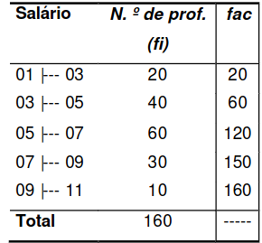{}


- Como achar o intervalo de classe que corresponde a separatriz calculada.\
Ex.: Se Q1 (25%), achar na tabela de classes e frequências, na coluna frequência acumulada, a classe que contém o valor que corresponde a 25% da frequência acumulada total.\
Esse intervalo de classe será a classe selecionada para aplicação da fórmula.\

\newpage

- Fórmula da separatriz:\
$$P_k = Li + \frac{k \cdot \sum f_i - F_{anterior}}{f_{intervalo}} \cdot h$$

onde,\
$P_k$ é o percentil (separatriz),\
$Li$ é o limite inferior do intervalo de classe selecionada,\
$k$ é o número em fração do percentil,\
$f_i$ é a frequência,\
$\sum f_i$ é a frequência acumulada total,\
$F_{anterior}$ é a frequencia acumulada do intervalo de classe anterior (ao selecionado) do qual se esta calculando,\
$f_{intervalo}$ é a frequência do intervalo de classe selecionada,\
$h$ é a amplitude de classe ($Ls - Li$).\

\newpage

#### boxplot
- Montando a box:\
A box contém como limite superior $Q_3$, limite inferior $Q_1$ e linha interna a mediana ($Q_2$).\

- Intervalo interquartil:\
$$IQR = Q_3 - Q_1$$

- Limites:\
  - Máximo\
  $$L_{máx} = Q_3 + 1,5 \cdot (IQR)$$
  - Mínimo\
  $$L_{mín} = Q_1 - 1,5 \cdot (IQR)$$

- Valores discrepantes (**Outliers**):\
  - Possíveis erros (arredondamento ou observação).\
  - Alguma condição especial que deve ser observada separadamente.\

- Exemplo explicativo de boxplot:\


{ width=50% }


\newpage

#### Pré-requisitos

- Os dados devem estar em formato tabular.\

#### Preparação dos dados

- A variável em formato de vetor.\
Ex.: `x <- turismo$cheg_2012/1000`\

#### Plotagem gráfico boxplot
- Principais argumentos do gráfico de dispersão:\
  - **x**\
  Variável em formato de vetor.\
  - `main`\
  Título principal do gráfico.\
  - `xlab`\
  Rótulo do eixo x.\
  - `ylab`\
  Rótulo do eixo y.\

\newpage

- Exemplo - Diagrama de caixa "boxplot" (`boxplot()`):\
```
#Variável x
x <- turismo$cheg_2012/1000

#Plotando o diagrama de caixa - boxplot
boxplot(x,
      main ="Boxplot das chegadas de Turistas ao Brasil em 2012",
      xlab ="Ano de 2012",
      ylab ="Chegadas de turistas em 2012 por mil")
```

{width=80% }


\newpage

### Histograma (hist)

- Histograma é um tipo de gráficos de barras.\
- É usado para variáveis quantitativas continuas.\
- Este tipo de gráfico é muito usado para observar:\
  - **Distribuição de frequências**\
  - **Simetria**\
  - **Desvio**\
  Presença de valores discrepantes (Outliers).\
  - **Amplitude da variável**\
- A diferença entre gráficos de barras e histograma:\
  - **Gráfico de barras**\
  É aplicado a variáveis categóricas, apenas um eixo representando variável númerica e o outro eixo representando um variável categórica.\
  
  
  {width=40%}
  
  
  - **Histograma**\
  É aplicado a variáveis númericas e possui dois eixos númericos (x representando a variável e y representando a frequência da variável).\
  
  
  {width=30%}
  
  
\newpage

#### Pré-requisitos

- Os dados devem estar em formato tabular.\

#### Preparação dos dados

- A variável em formato de vetor.\
Ex.: `x <- dados$cheg_2012/1000`\
- A frequência é calculada automaticamente pela função `hist` (histograma), basta informar a função se ela deve cálcular a frequência absoluta (**T**) ou a frequência relativa (**F**).\
Ex.: `hist(... , freq = T | F, ...)`\

#### Plotagem histograma
- Principais argumentos da função histograma (`hist()`):\
  - **x**\
  Variável em formato de vetor.\
  - `freq`\
  É a frequência.\
  Caso queira a frequência absoluta `= T`.\
  Caso queira a frequência relativa `= F.`\
  - `col`\
   Comando para colorir diversos itens do gráfico, pode ser valores como 1,2,..., ou por nome como 'red', 'blue', etc.\
  - `main`\
  Título principal do gráfico.\
  - `xlab`\
  Rótulo do eixo x.\
  - `ylab`\
  Rótulo do eixo y.\
  - `sub`\
  Adiciona texto ao final do gráfico.\

\newpage

- Exemplo - Histograma:\
```
#Compreendendo a distribuição frequência de chegadas de turistas do Brasil em
#2012
x <- dados$cheg_2012/1000

#histograma
hist(x,
     freq = T, #se T fornece a frequencia absoluta, se F fornece a frequencia relativa
     main = "Histograma das chegadas de turistas ao Brasil em 2012",
     xlab = "Chegadas de turistas em 2012 por mil",
     ylab = "Frequencia Absoluta das chegadas",
     sub = "Fonte: elaboração propria") #legenda
```


{width=80%}


\newpage

## Pacote **ggplot2**
O pacote `ggplot2` constroi diversos tipos de graficos a partir da mesma estrutura de componentes:\
- `data`: referente ao banco de dados.\
- `geom_forma`: um rol de tipos possiveis de representação dos dados.\
- `coord_system`: referente ao sistema de coordenadas, que podem ser cartesianas, polares e projeção de mapas.\
      
### O que precisa para fazer o gráfico?
A. Um nome de objeto para guardar o grafico (uma variavel).\
B. A base de dados que será utilizada para a plotagem.\
`ggplot(data=nome_da_base)`\
C. Descrever como as variaveis serão utilizadas na plotagem:\
`aes(x=..., y=..., ...)`\
D. Especificar o tipo de gráfico:\
`geom_forma(...)`\
E. Utilizar o operador "**+**" para adicionar camadas (*layers*) ao objeto `ggplot` criado.\
F. Pacotes auxiliares como `ggthemes` e `grid`, dentre outros.\
      
### Quais formatos podemos utilizar no **ggplot2** (*geom_forma*)?

```{r Formatos ggplot2 geom_forma, echo=FALSE, message=FALSE, warning=FALSE}
# Biblioteca
library(knitr)

# data.frame
form_geom_forma <- c("geom_area ou geom_ribbon",
  "geom_bar ou geom_col",
  "geom_bar+coord_polar",
  "geom_boxplot",
  "geom_curve",
  "geom_density",
  "geom_dotplot",
  "geom_histogram",
  "geom_line, geom_abline, geom_hline, geom_vline",
  "geom_point",
  "geom_qq ou geom_qq_line",
  "geom_tile, geom_rect ou geom_raster",
  "geom_violin"
  )
desc_tipo_grafico <- c("Produz um grafico para visualizar área sob a curva ou entre curvas.",
  "Produz um grafico de colunas do vetor x.",
  "Produz um grafico circular (Pizza).",
  "Produz o boxplot de x.",
  "Produz um grafico em curva.",
  "Produz um grafico da densidade de x.",
  "Produz um grafico de pontos.",
  "Produz um histograma do vetor x.",
  "Produz um grafico de linhas",
  "Produz um grafico de dispersão entre x e y.",
  "plota os quantis de x usando como base a curva normal.",
  "Produz uma grade de retangulos.",
  "Produz um grafico em forma de violino."
  )
tbl_geom_forma <- data.frame(form_geom_forma,desc_tipo_grafico)

# Tabela
kable(tbl_geom_forma, col.names = c("Forma","Tipo de gráfico"), align = "cc", 
      caption = "Nome das principais formas geométricas para construção de gráficos do pacote ggplot2")
```

\newpage

### Nome dos argumentos para adicionar efeito em gráficos do pacote **ggplot2**

```{r efeitos nos gráficos ggplot2, echo=FALSE, message=FALSE, warning=FALSE}
# Biblioteca
library(knitr)

# data.frame
func_efeitos_ggplot2 <- c("autoplot",
  "coord_cartesian",
  "coord_fixed",
  "coord_flip",
  "coord_polar",
  "geom_blank",
  "geom_jitter",
  "geom_smooth",
  "geom_text",
  "scale_fill_(=brewer ou grey ou gradient)",
  "scale_*_continuos",
  "scale_*_discrete",
  "scale_*_manual"
)
ef_ggplot2 <- c("Produz um grafico apropriado para o tipo de variavel.",
  "Coordenada cartesiana.",
  "Coordenada cartesiana com razão entre eixo x e y fixada.",
  "Inverte a posição dos eixos x e y.",
  "Coordenada polar.",
  "Janela em branco.",
  "Produz um efeito jitter.",
  "Produz uma curva suavizada.",
  "Aplica texto a janela grafica.",
  "Define a escala de cores.",
  "Define parametros para o eixo x ou y continuos.",
  "Define parametros para o eixo x ou y discreto.",
  "Define parametros para os eixos manualmente."
)
tbl_ef_ggplot2 <- data.frame(func_efeitos_ggplot2,ef_ggplot2)

# Tabela
kable(tbl_ef_ggplot2, col.names = c("Funções","Efeitos no gráfico"), align = "cc", caption = "Nome dos argumentos para adicionar efeito em gráficos do pacote ggplot2.")
```

### Definindo um tema para o grafico **ggplot**

- *theme_gray*\
Fundo cinza e linhas grandes brancas.\
- *theme_bw*\
O classico preto e branco. Otimo para projetor.\
- *theme_linedraw*\
Linhas pretasde varias larguras num fundo branco. semelhante ao theme_bw.\
- *theme_light*\
Semelhante ao theme_linedraw, porem com as linhas mais cinza claro, para dar atenção aos dados.\
- *theme_dark*\
Versão escura do theme_light, com o fundo escuro, util para criar linhas finas coloridas.\
- *theme_minimal*\
Um tema minimalista sem anotações de fundo.\
- *theme_classic*\
Tema classico, com linhas do eixo x e y, sem linhas de grade.\
- *theme_void*\
Um tema completamente vazio.\

\newpage

### Pacote ggthemes

```{r ggthemes, echo=FALSE, message=FALSE, warning=FALSE}
# Bibliotecas
library(knitr)

# data.frame
tema <- c("theme_base",
          "theme_calc",
          "theme_economist",
          "theme_economist_white",
          "theme_excel",
          "theme_few",
          "theme_fivethirtyeight",
          "theme_foundation",
          "theme_gdocs",
          "theme_hc",
          "theme_igray",
          "theme_map",
          "theme_pander",
          "theme_par",
          "theme_solarized",
          "theme_solarized_2",
          "theme_solid",
          "theme_stata",
          "theme_tufte",
          "theme_wsj")
semelhancas <- c("Tema do pacote básico do R",
                 "Semelhante aos gráficos produzidos pelo Calc do LibreOffice B",
                 "Semelhante ao The Economist",
                 "Semelhante ao The Economist com fundo branco",
                 "Semelhante aos gráficos produzidos pelo Excel",
                 "Baseado nas regras de Stephen Few sobre regras práticas para o uso de cores nos gráficos",
                 "Baseado nos gráficos do site fivethirtyeight.com",
                 "Tema de fundação, para produzir novos temas",
                 "Semelhante aos gráficos do Google Docs",
                 "Baseado em Highcharts JS",
                 "Inverte o tema gray",
                 "Limpa o tema para incluir mapas",
                 "Baseado no pacote pander",
                 "Baseado nos parâmetros definidos em par() do pacote base",
                 "Baseado na paleta Solarized",
                 "Baseado na paleta Solarized",
                 "Elimina todas as linhas e textos, mantendo somente os objetos geométricos",
                 "Semelhante aos gráficos do Stata",
                 "Baseado no designer de Edward Tufte",
                 "Semelhante aos gráficos do Wall Street Journal")
tbl_ggthemes <- data.frame(tema,semelhancas)

# Tabela
kable(tbl_ggthemes,col.names = c("Tema","Semelhanças"), align = "cc",
      caption = "Temas do pacote ggthemes")

```


Exemplo:\
```
#Bibliotecas
library(ggthemes)

#Plotando gráficos
f <- ggplot(dados,aes(cheg_2012/1000,cheg_2013/1000)) +
  geom_blank() +
  labs(x="",y="")

#Tema
p1 <- f +
  theme_gdocs(base_size = 18) +
  ggtitle("theme_gdocs")
  
p1
```

\newpage

### Inserindo títulos, subtítulos e rótulos aos eixos de um ggplot

- Existem duas formas de inserir textos no gráfico no **ggplot2**.\

#### Primeira forma

- Podemos adicionar texto ao gráfico **ggplot2** através do comando `labs()` e seus parâmetros:\
  - `title`\
  Adicionar um título ao gráfico **ggplot**.\
  - `x`\
  Adiciona um rótulo ao eixo x no gráfico **ggplot**.\
  - `y`\
  Adiciona um rótulo ao eixo y no gráfico **ggplot**.\
  - `subtitle`\
  Adicionar um subtítulo ao gráfico **ggplot**.\
  - `caption`\
  Adiciona texto ao final do gráfico **ggplot**.\
- Exemplo:\
```
#Plotando gráfico
p <- ggplot(data = Turismo, aes(x=cheg_2012/1000,y=cheg_2013/1000)) #Salva gráfico em variável

#Aplicando elementos de texto na forma janela em branco
p +
  geom_blank() + #Produz efeito janela em branco
  labs(title = "Título", #Adiciona texto ao gráfico
       x = "Eixo x", #Adiciona rótulo ao eixo x
       y = "Eixo y", #Adiciona rótulo ao eixo y
       subtitle = "Subtítulo", #Adiciona subtitulo ao gráfico
       caption = "Elaborado por ...")+ #Adciona texto ao final do gráfico
  theme_bw(base_size = 18)
```

#### Segunda forma

- Podemos adicionar texto ao **ggplot2** atraves dos comandos:\
  - `ggtitle("",subtitle = "")`\
  O comando `ggtitle` adiciona título ao gráfico **ggplot**.\
  Podemos adicionar o parâmetro `subtitle` para adicionar um subtítulo ao gráfico **ggplot**.\
  - `xlab("")`\
  Adiciona um rótulo ao eixo x no gráfico **ggplot**.\
  - `ylab("")`\
  Adiciona um rótulo ao eixo y no gráfico **ggplot**.\
  - `labs(caption = "")`\
  O comando `labs()` acompanhado do parâmetro `caption`, adiciona texto ao final do gráfico **ggplot**.\
- Exemplo:\
```
#Plotando gráfico
p <- ggplot(data = Turismo, aes(x=cheg_2012/1000,y=cheg_2013/1000)) #Salva gráfico em variável

#Aplicando elementos de texto na forma janela em branco
p +
  geom_blank() + #Produz efeito janela em branco
  ggtitle("Título",subtitle = "Subtítulo") + #Adiciona título e subtitulo ao gráfico
  xlab("Eixo x") + #Adiciona rótulo ao eixo x
  ylab("Eixo y") + #Adiciona rótulo ao eixo y
  labs(caption = "Elaborado por ...") + #Adciona texto ao final do gráfico
  theme_bw(base_size = 18)
```

\newpage

### Escalas no **ggplot2**

- Podemos definir a escala dos eixos utilizando uma camada especifica para esse fim:\
  - Variáveis Discretas\
  `scale_x_discrete()` ou `scale_y_discrete()`\
  - Variáveis Continuas\
  `scale_x_continuous()` ou `scale_y_continuous()`\

- Principais argumentos das funções `scale_(x|y)_discrete()` e `scale_(x|y)_continuous()`:\
  - `drop`\
  `T` omite do gráfico os níveis de um fator que não aparecem nos dados; `F` usa todos os níveis de um fator.\
  - `na.translate`\
  `F` remove valores faltantes da escala.\
  - `labels`\
  `NULL` (nenhum nome **ticks**) ou um vetor com nome (caracteres) dos **ticks**.\
  `labels = c("One Hundred Fifty","Three Hundred","Four Hundred Fifity")`\
  O comando `abbreviate`, abrevia o nome dos vetores nos **ticks**.\
  `labels = abbreviate`\
  - `limits`\
  Vetor de caracteres, ou números, com os possíveis limites dos valores de escala e sua ordem.\
  `limits = c("caracter_1","caracter_2")`\
  `limits = c(0,600)`\
  - `name`\
  Nome da escala que aparece na legenda (rótulos de x).\
  - `breaks`\
  O argumento `breaks` nos permite especifica onde os **ticks** aparecem.\
  Podemos dar nomes aos **ticks** especificados para aparecerem, usando o argumento `labels`.\
  `breaks = c(150,300,450),`\
  `labels = c("One Hundred Fifty","Three Hundred","Four Hundred Fifity")`\
  - `expand`\
  Expande a escala por adição de x aos limites da escala.\
  `expand = expand_scale(add = x)` ou `expand = expansion(add = x)`\
  Expande a escala por multiplicação de x aos limites da escala.\
  `expand = expand_scale(mult = x)` ou `expand = expansion(mult = x)`\
  - `position`\
  Posição da escala no eixo x (*top* ou *bottom*) e no eixo y (*left* ou *right*).\
  `position = 'top'`\
  - `trans`\
  Transforma a escala continua.\
  `trans = "reverse"`\
  Principais transformações:\
    - ans\
    - atanh\
    - boxcox\
    - date\
    - exp\
    - hms\
    - identity\
    - log\
    - log10\
    - log1p\
    - log2\
    - logit\
    - modulus\
    - probability\
    - probit\
    - pseudo_log\
    - reciproval\
    - reverse\
    - sqrt\
    - time\

\newpage

- Exemplos:\
```
#Plotando gráfico
p = ggplot(data = Turismo, aes(x=Estado, y=cheg_2012))
p+
geom_blank()+
labs(title = "Título",
     x = "Eixo x",
     y = "Eixo y",
     subtitle = "Subtítulo",
     caption = "Elaborado por ...")+
theme_bw(base_size = 18)+ #Tema
scale_x_discrete(limits=c("Amazonas","RioJaneiro"))
#Vetor de caracteres com os possíveis valores de escala e sua ordem.
```


{}


\newpage

```
#Plotando gráfico
p = ggplot(data = Turismo, aes(x=cheg_2012/1000, y=cheg_2013/1000))
p+
  geom_blank()+
  labs(title = "Título",
       x = "Eixo x",
       y = "Eixo y",
       subtitle = "Subtítulo",
       caption = "Elaborado por ...")+
  theme_bw(base_size = 18)+ #Tema
  scale_y_continuous(
    breaks = c(75,150,225),
    labels = c("75 mil","150 mil","225 mil"), #nome dos ticks do eixo y
    position = "right",
    trans = "reverse")+
  scale_x_continuous( limits = c(50,150)) #limites do eixo x

```


{}


\newpage

### Cores nos gráficos ggplot2

- As cores podem ser aplicadas em diversos elementos do gráfico:\
  - Linhas\
  - Preenchimentos da forma gráfica\
  - Texto\

- Principais parâmetros:\
  - `fill`\
  Controla o preenchimento de um gráfico.\
  - `colour` ou `color`\
  Cor de linha ou contorno do gráfico.\
  - `alpha`\
  Controla o grau de transparância da cor, valores entre 0 e 1 (0 sendo muito transparênte e 1 sendo opaco).\
  Ex.: `alpha <- 1`\

\newpage

#### Método para obter cores em **R**

- Pelo número\
`col = x`, sendo algum número. `x = 1, 2, ...`\
- Pelo nome\
Há 657 nomes de cores disponiveis no **R**.\
Através da função `colors()` diretamente na linha de comando será exibido o nome das 657 cores. Ademais se colocar `colors()[x]` será exibido o nome na posição x.\
Ex.: `colors()[657]` = "grey".\
- Pelo sistema **RGB** (*Red*, *Green*, *Blue*)\
`rgb(0,0,0)`\
- Pelo sistema hexa decimal\
`#ff0000`\

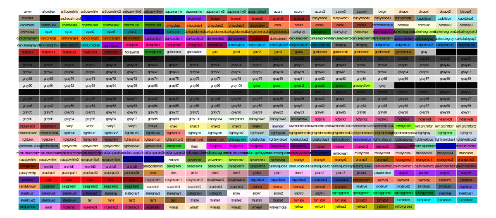{}


\newpage

#### Principais pacotes de paletas de cores do **R**
- **R** básico\
- Pacote **RColorBrewer**\

#### Tipos de paletas de cores
- *sequencial*\
Cores que variam em sequência da mais clara para mais escura.\
- *divergente*\
O centro da paleta é mais claro e os extremos mais escuros em ambas as direções.\
- *qualitativa*\
Não possui um ordenamento nas variações das cores.\

#### 5 funções básicas do **R** que geram paletas de cores sequenciais
- `rainbow(n,alpha)`\
- `heat.colors(n,alpha)`\
- `terrain.colors(n,alpha)`\
- `topo.colors(n,alpha)`\
- `cm.colors(n,alpha)`\

\newpage

#### **RColorBrewer** paletas de cores disponíveis
- *sequencial*\
  
```{r Sequencial Brewer, echo=FALSE, message=FALSE, warning=FALSE}

#data.frame
nome_sq_brewer <- c(
  "Blues",
  "BuGn",
  "BuPu",
  "GnBu",
  "Greens",
  "Greys",
  "Oranges",
  "OrRd",
  "PuBu",
  "PuBuGn",
  "PuRd",
  "Purples",
  "RdPu",
  "Reds",
  "YlGn",
  "YlGnBu",
  "YlOrBr",
  "YlOrRd"
)
tbl_sq_RColor <- data.frame(nome_sq_brewer)

#Tabela
kable(tbl_sq_RColor, col.names = c("Nome das paletas"),
      align = "c",
      caption = "**Pacote RColorBrewer**: Nome das paletas sequencial.")
```

As variações de cores vão de três a nove valores possíveis em cada paleta.\

- *divergente*\
  
```{r divergente Brewer, echo=FALSE, message=FALSE, warning=FALSE}

#data.frame
nome_div_brewer <- c(
  "BrBG",
  "PiYG",
  "PRGn",
  "PuOr",
  "RdBu",
  "RdGy",
  "RdYlBu",
  "RdYlGn",
  "Spectral"
)
tbl_div_RColor <- data.frame(nome_div_brewer)

#Tabela
kable(tbl_div_RColor, col.names = c("Nome das paletas"),
      align = "c",
      caption = "**Pacote RColorBrewer**: Nome das paletas divergente.")
```

As variações de cores vão de três a onze valores possíveis em cada paleta.\

\newpage

- *qualitativa*\
  
```{r Qualitativa Brewer, echo=FALSE, message=FALSE, warning=FALSE}

#data.frame
nome_quali_brewer <- c(
  "Accent",
  "Dark2",
  "Paired",
  "Pastel1",
  "Pastel2",
  "Set1",
  "Set2",
  "Set3"
)
num_quali_brewer <- c(8,8,12,9,8,9,8,12)
tbl_qual_RColor <- data.frame(nome_quali_brewer,num_quali_brewer)

#Tabela
kable(tbl_qual_RColor, col.names = c("Nome das paletas", "Número de cores"),
      align = "cc",
      caption = "**Pacote RColorBrewer**: Nome das paletas qualitativas e número de cores possiveis em cada paleta.")
```


\newpage

#### Aplicando escala de cinza ao gráfico

- `scale_fill_grey(..., start = x, end = x)`\
x é um valor entre 0 e 1, sendo 0 mais escuro e 1 mais claro.\
Aplica-se a gráficos que possuem preenchimento interno na forma como: **boxplot**, **histograma**, **violino** e **barras**.\

- `scale_color_grey(..., start = x, end = x)`\
x é um valor entre 0 e 1, sendo 0 mais escuro e 1 mais claro.\
Aplica-se a gráficos como **dispersão** ou **linhas**.\

\newpage

### Ajustando parâmetro de textos de um **ggplot**

- Os temas possuem formatações padronizadas para todos os elementos textuais de um gráfico como título, subtítulo ou rótulos dos eixos.\
- É possível realizar ajustes através da camada `theme()`, utilizando-se dos argumentos de `element_text()`.\
- Em `element_text()` podemos ajustar os seguintes parâmetros:\
  - `family`\
  Tipo de fonte, o padrão é "sans". No sistema **Windows** é possível consultar as famílias disponíveis através do comando `windowsFonts()`. Para mais opções de fontes utilize o pacote *extrafont* ou *showtext*.\
  - `face`\
  **plain**, **italic**, **bold**, **bold.italic** para ajustar a fonte em **plana**, **itálico**, **negrito** ou **negrito**-**itálico** respectivamente.\
  - `colour`\
  Cor da linha.\
  - `size`\
  Tamanho do texto em pontos. Pode usar um valor ou proporcional ao padrão, fazendo `rel(1.5)` para o aumento de 50\% ou `rel(0.5)` para diminuir 50\%.\
  - `hjust`\
  Alinhamento horizontal entre [0,1], hjust = 0,5 centraliza.\
  - `vjust`\
  Alinhamento vertical entre [0,1], vjust = 0,5 centraliza.\
  - `angle`\
  De 0 a 360.\
  - `lineheight`\
  Altura da linha.\
- Podemos aplicar os elementos de texto de forma global ou especificando o elemento que pode ser só o título, só um dos eixos, etc.\
- Para maiores detalhes utilize o comando `??theme`.\

\newpage

- Exemplo:\
```
#Plot
p = ggplot(data = dados, aes(x = cheg_2012/1000, y = cheg_2013/1000))

#ajustando parâmetros de texto
p+
  geom_blank()+
  labs(title = "Título",
       x = "Eixo x",
       y = "Eixo y",
       subtitle = "Subtítulo")+
  theme_bw(base_size = 18)+
  theme(text = element_text(family = "mono"))+ 
  #Altera a fonte de todos os textos
  theme(axis.text.x = element_text(size = rel(1.2)))+ 
  #Aumenta a fonte só do eixo x em 20%
  theme(axis.text.y = element_text(angle = 45))+ 
  #Muda o angulo do texto do eixo y em 45 graus
  theme(axis.title.y = element_text(face = "bold.italic"))+ 
  #Muda o rótulo do eixo y para negrito-itálico
  theme(plot.title = element_text(hjust = 0.5))+ 
  #Centraliza o título
  theme(plot.subtitle = element_text(hjust = 1)) 
  #Subtítulo a direita

#fechando dispositivo gráfico
dev.off()
```

{}

\newpage

### Layout da janela gráfica e plotagem de vários gráficos em uma janela

#### Principais pacotes para configurar layout da janela gráfica

- `grid`\
- `patchwork`\

#### Pacote grid
- O pacote `grid` implementa funções gráficas no sistema de plotagem `ggplot2` e também é um pacote gráfico independente, apesar de ser pouco usada essa última função.\
- O pacote `grid` oferece uma ampla variedade de funções que personalizam elementos de plotagem do `ggplot2`, como:\
  - Temas\
  - Cores\
  - Grafos (pequenos e multiplos)\
  - Incluir anotações matemáticas em objetos `ggplot`\
  <https://github.com/tidyverse/ggplot2/wiki/Plotmath>
  - Alterar sistemas de coordenadas\
  - *Layout* da janela gráfica\
- Sobre o *layout* da janela gráfica, podemos configurar para adicionar vários gráficos numa mesma janela gráfica. O passo a passo:\
  - Criar e configurar os gráficos.\
  - Definir quais gráficos devem aparecer e configuração do *layout* da janela gráfica (em tabela).\
  - *Print* dos gráficos em suas devidas posições no *layout* (em tabela) na janela gráfica.\
- Exemplo:\
```
#ggplot
p = ggplot(data = dados, aes(x = cheg_2012/1000,y = cheg_2013/1000))

#Gráfico 1
g1 <- p+
  geom_blank()+
  theme_bw(base_size = 18)

#Gráfico 2
g2 <- p+
  geom_point()+
  theme_minimal(base_size = 18)

#Layout para 1 linha e 2 colunas (g1 ao lado de g2)
pushViewport(viewport(layout = grid.layout(1,2)))

#Atribuindo g1
print(g1, vp=viewport(layout.pos.row = 1, layout.pos.col = 1))

#Atribuindo g2
print(g2, vp=viewport(layout.pos.row = 1, layout.pos.col = 2))

#fechando dispositivo grafico
dev.off()
```


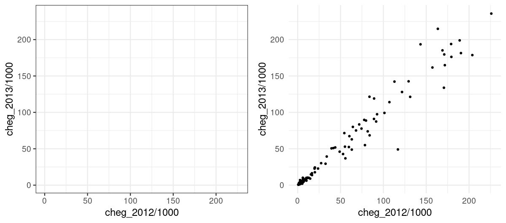{}


\newpage

#### Pacote patchwork
- O objetivo do `patchwork` é tornar simples juntar `ggplot` separados no mesmo gráfico.\
- O `patchwork` usa uma API que incita a exploração, iteração e escala para *layout* arbitrariamente complexos.\
- Formas de agrupar gráficos num *layout* usando `patchwork`:\
  - `g1 + g2`\
  Agrupa em linha.\
  - `(g1|g2|g3)/g4`\
  Agrupa em linhas e colunas.\

- Exemplo:\
```
#ggplot
p = ggplot(data = dados, aes(x = cheg_2012/1000,y = cheg_2013/1000))

#Gráfico 1
g1 <- p+
  geom_blank()+
  theme_bw(base_size = 18)

#Gráfico 2
g2 <- p+
  geom_point()+
  theme_minimal(base_size = 18)

#Gráfico 3
g3 <- p+
  geom_boxplot()+
  theme_grey(base_size = 18)

#Gráfico 4
g4 <- p+
  geom_point()+
  theme_minimal(base_size = 18)

#Layout 1 para 1 linha e 2 colunas (g1 ao lado de g2)
g1 + g2 + plot_layout(ncol = 2) + plot_annotation(title = "Dois gráficos com patchwork",
                                                  tag_levels = "1") 
                                                  #Título geral e número em cada gráfico

#fechando dispositivo grafico
dev.off()

#Layout 2
(g1 | g2 | g3) / g4

#fechando dispositivo grafico
dev.off()

```


\newpage

### Gráficos usando pacote ggplot2

- Passo a passo (principais pacotes):\
  - Importa dados\
  `readr`\
  - Organizar os dados\
  `tidyr`\
  `dplyr`\
  `magrittr`\
  - Preparar gráfico\
  `ggplot2`\
  - Adicionar camadas ao gráfico\
  `grid`\
  `ggthemes`\
  `RColorBrewer`\
  `extrafont`\
  `showtext`\
  - Plotar gráfico e definir layout\
  `grid`\
  `patchwork`\
  
\newpage

#### Gráfico de barras (geom_bar) com ggplot2

- Tipos de gráficos de barras do ggplot2:\
  - `geom_bar`\
  Para plotar um gráfico de barras no ggplot2, definimos o tipo de gráfico `geom_bar`.\
  A altura das barras é proporcional ao número de casos em cada grupo.\
  - `geom_col`\
  Outra forma de gerar gráficos de barras no ggplot2 é o tipo de gráfico `geom_col`.\
  A altura das barras representão os valores dos dados.\

- Observações:\
  - A função `reorder` serve para reordenar uma variável em função de outra. Muito útil para organizar as barras em formato crescente, ou decrescente, dos grupos.\
  - Quando temos mais de uma variável númerica associada a variável categorica (grupo) podemos ter no gráfico de barras com barras lado a lado ou empilhadas.(Ver exemplo 2)\
    - `fill = variável`\
    Categorias secundarias agrupadas.\
    Gera legenda automática na lateral.\
    - `geom_bar(stat = "identity", position = "dodge")`\
    barras agrupadas da mesma categoria ficam lado a lado.\
    - `geom_bar(stat = "identity")`\
    Sem `position = "dodge"`, por default é barras agrupadas da mesma categoria na forma empilhadas.\
- Os argumentos:\
  - `stat = identity`\
  Não altera o gráfico de barras.\
  - `stat = count`\
  Conta o número de casos em cada posição x.\

\newpage

- Exemplo 1 - Gráfico de Barras:\
```
#Plotando gráfico de barras (geom_bar)
p <- ggplot(data = dt, aes(x = reorder(Estado,y), y))+ #Mapeamento das variáveis
  geom_bar(stat = "identity")+ #Forma de barras
  labs(title = "Chegada de Turistas ao Brasil em 2013", #Título
       x = "Estados", #Texto do eixo x
       y = "Número de chegadas por mil")+ #Texto do eixo y
  geom_text(aes(label = round(y,2)), hjust=0.5, vjust=0)+ #Insere valores sobre as barras
  theme_bw(base_size = 18)+ #Define o tema
  theme(plot.title = element_text(hjust = 0.5))+ #Centraliza o texto do título
  theme(axis.text.x = element_text(angle = 90)) #Muda o ângulo do texto do eixo x em 90 graus
p

#Fechando dispositivo gráfico
dev.off()
```


\newpage

- Exemplo 2 - Gráfico de Barras com mais de uma categoria e *layout* com dois gráficos:\

```
#Preparação dos dados
dt <- dados %>% 
  filter(Estado == "SaoPaulo" | Estado == "RioJaneiro") %>% 
  rename('2012' = cheg_2012, '2013' = cheg_2013, '2014' = cheg_2014, '2015' = cheg_2015) %>% 
  gather(ano, chegada, '2012':'2015') %>% 
  select(Estado, ano, chegada) %>% 
  group_by(Estado,ano) %>% 
  summarize(chegada=sum(chegada)) %>% 
  ungroup()

#Convertendo ano para fator
dt$ano = factor(dt$ano)

#Visualizando dados
dt
View(dt)

#Plotagem gráfico de barras com duas ou mais categorias
p = ggplot(dt)+
  aes(x=reorder(Estado,chegada), y=chegada/1000, fill = ano)+
  geom_bar(stat = "identity",position = "dodge")+
  geom_text(aes(label = round(chegada/1000,2)), 
            position = position_dodge(width = 0.9), 
            vjust=-0.25)

#Adicionando camadas a p
p1 = p +
  labs(title = "Chegada de Turistas ao Brasil - Versão barras lado a lado",
       x = "Estados",
       y = "Número de chegadas por mil")+
  theme_bw(base_size = 18)+
  theme(plot.title = element_text(hjust = 0.5))+
  scale_fill_grey(start = 0, end = 0.9)

p1

#Plotando versão barras empilhadas
p = ggplot(dt)+
  aes(x=reorder(Estado,chegada), y=chegada/1000, fill = ano)+
  geom_bar(stat = "identity")+
  geom_text(aes(label = round(chegada/1000,2)), 
            position = position_stack(vjust=1))

#Adicionando camadas a p
p2 = p+
  labs(title = "Chegada de Turistas ao Brasil - Versão barras empilhadas",
       x = "Estados",
       y = "Número de chegadas por mil")+
  theme_bw(base_size = 18)+
  theme(plot.title = element_text(hjust = 0.5))+
  scale_fill_grey(start = 0.4, end = 1)

p2

#Layout (patchwork)
pp = p1 + p2 + plot_layout(ncol = 1) +
  plot_annotation(title = "Gráfico de Barras com duas ou mais categorias",
                  tag_levels = "1")

pp

#Fechando dispositivo gráfico
dev.off()

```


\newpage

#### Histograma com ggplot2

##### Teoria histograma

- Histograma é um tipo de gráficos de barras.\
- É usado para variáveis quantitativas continuas.\
- Para elaborar um histograma é necessário uma variável quantitativa.\
- No eixo x teremos os valores da variável e no eixo y sua frequência que pode ser absoluta ou relativa.\
- Este tipo de gráfico é muito usado para observar:\
  - **Distribuição de frequências**\
  - **Simetria**\
  - **Desvio**\
  Presença de valores discrepantes (Outliers).\
  - **Amplitude da variável**\
- A diferença entre gráficos de barras e histograma:\
  - **Gráfico de barras**\
  É aplicado a variáveis categóricas, apenas um eixo representando variável númerica e o outro eixo representando um variável categórica.\
  
  
  {width=30%}
  
  
  - **Histograma**\
  É aplicado a variáveis númericas e possui dois eixos númericos (x representando a variável e y representando a frequência da variável).\
  
  
  {width=30%}


\newpage

##### Histograma

- Principais argumentos da função `geom_histogram()`:\
  - `binwidth`\
  A largura das caixas (barras).\
  - `color = "nome_cor", fill = "nome_cor"`\
  Altera a cor da linha e do preenchimento.\
  - `color = variável_factor, fill = variável_factor`\
  Controla a variação de cor em função da variável **fator**(**factor**) do histograma.\
  - `linetype="dashed"`\
  Altera o tipo da linha de contorno das caixas (barras) para pontilhado.\
  - `position="identity"`\
  Histogramas sobrepostos.\
  - `position="dodge"`\
  Histogramas intercaladas.\
  -`alpha=0.6`\
  Controlar transparencia da cor do preenchimento.\
- Alterar a posição da legenda:\
  - `theme(legend.position="top")`\
  Legenda posicionada na parte superior da janela gráfica.\
  - `theme(legend.position="bottom")`\
  Legenda posicionada na parte inferior da janela gráfica.\
  - `theme(legend.position="none")`\
  Remove a legenda.\

\newpage

- Exemplo - Histograma com eixo x logarítmo no ggplot2:\
```
#Plotagem
p = ggplot(dados,aes(x=cheg_2013/1000))

#Adição de camadas
p+
  geom_histogram(aes(y= ..count.., fill = factor(Regiao)), #fill = variável factor
                 position = "identity", #Histogramas sobrepostos
                 alpha = 0.6, #Densidade das cores
                 binwidth = 0.1)+ #Largura das caixas (barras)
  scale_x_log10()+ #Eixo x em escala logarítmica
  labs(x = "Chegadas em escala logarítmica",
       y = "Frequência Absoluta",
       title = "Histograma do número de chegadas de turistas ao Brasil \nAno de 2013")+
  theme_bw(base_size = 18)+ #Tipo de tema
  scale_fill_discrete(name = "Região")+ #Escala de cores dos dados discretos
  scale_fill_grey(start = 0.2,end = 0.8) #Escala de cinza

#Fechando dispositivo gráfico
dev.off()
```

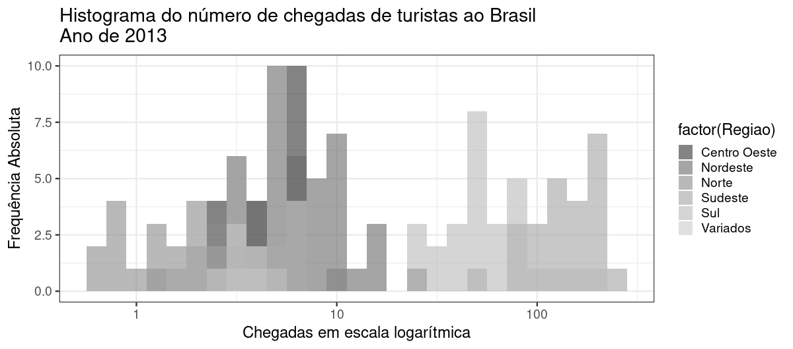


\newpage

#### boxplot (diagrama de caixa) com ggplot2

##### Teoria boxplot

- O **Diagrama de caixa** serve para compreensão da forma e amplitude dos dados.\
- Para elaborar um boxplot é necessário pelo menos uma variável quantitativa.\
- Se a variável pode ser agrupada por fatores(factor), temos um boxplot comparativo y ~ x, isto é, a variável númerica y agrupada pelas categorias da variável do tipo fator x.\
- É importante para fazer o **diagrama de caixa** conhecer a fórmula das **separatrizes**.\
- O **diagrama de caixa** usa em sua construção os conceitos de **quartis** (**Q1**, **Q2**, e **Q3**).\

##### Separatrizes
- Quartis:\
  - Q1 (25%)\
  - Q2 (50% ou mediana)\
  - Q3 (75%)\
  
- Tabela de distribuição de frequências:\


{}


- Como achar o intervalo de classe que corresponde a separatriz calculada.\
Ex.: Se Q1 (25%), achar na tabela de classes e frequências, na coluna frequência acumulada, a classe que contém o valor que corresponde a 25% da frequência acumulada total.\
Esse intervalo de classe será a classe selecionada para aplicação da fórmula.\

- Fórmula da separatriz:\
$$P_k = Li + \frac{k \cdot \sum f_i - F_{anterior}}{f_{intervalo}} \cdot h$$

onde,\
$P_k$ é o percentil (separatriz),\
$Li$ é o limite inferior do intervalo de classe selecionada,\
$k$ é o número em fração do percentil,\
$f_i$ é a frequência,\
$\sum f_i$ é a frequência acumulada total,\
$F_{anterior}$ é a frequencia acumulada do intervalo de classe anterior (ao selecionado) do qual se esta calculando,\
$f_{intervalo}$ é a frequência do intervalo de classe selecionada,\
$h$ é a amplitude de classe ($Ls - Li$).\

\newpage

##### boxplot

- Montando a box:\
A box contém como limite superior $Q_3$, limite inferior $Q_1$ e linha interna a mediana ($Q_2$).\

- Intervalo interquartil:\
$$IQR = Q_3 - Q_1$$

- Limites:\
  - Máximo\
  $$L_{máx} = Q_3 + 1,5 \cdot (IQR)$$
  - Mínimo\
  $$L_{mín} = Q_1 - 1,5 \cdot (IQR)$$

- Valores discrepantes (**Outliers**):\
  - Possíveis erros (arredondamento ou observação).\
  - Alguma condição especial que deve ser observada separadamente.\

- Exemplo explicativo de boxplot:\


{ width=50% }


\newpage

- Exemplo - boxplot com eixos invertidos no ggplot2:\

```
#Plotagem
p <- dados %>% 
  ggplot(aes(x=as.factor(Mes),y=cheg_2012/1000))

#Adição de camadas
p +
  geom_boxplot() +
  labs(title = "Visualizando a variabilidade de chegadas de turistas ao Brasil no ano de 2012",
       x= "Mês",
       y="Número de chegadas") +
  theme_bw(base_size = 18) + #Adiciona tema "black and white"
  coord_flip() #Inverte posição do eixo x

#Fechando dispositivo gráfico
dev.off()
```

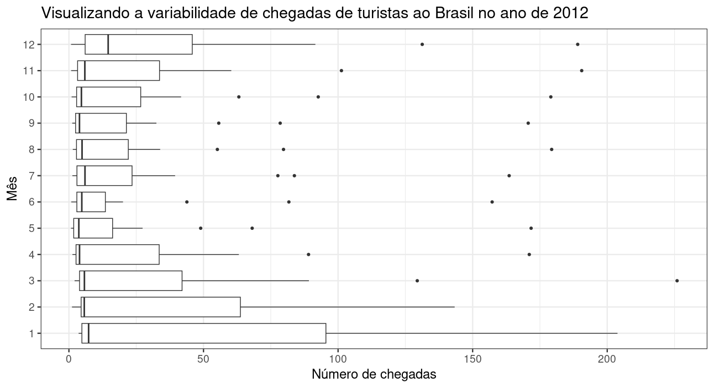


\newpage

- Exemplo - boxplot com efeito jitter:\

```
#Plotagem
p <- dados %>% 
  ggplot(aes(x=as.factor(Mes),y=cheg_2012/1000))

#Adição de camadas
p +
  geom_boxplot() +
  geom_jitter()+ #Adiciona o feito jitter
  labs(title = "Efeito jitter",
       x= "Mês",
       y="Número de chegadas") +
  theme_bw(base_size = 18) #Adiciona tema "black and white"

#Fechando dispositivo gráfico
dev.off()
```

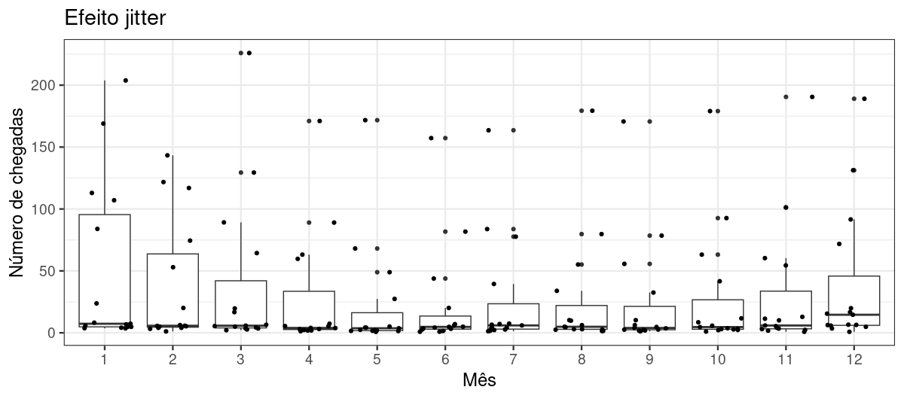


\newpage

- Exemplos - boxplot dividindo gráfico por facetas (`facet_grid()` e `facet_wrap()`):\

```
#Organizando dados
dt = dados %>% 
  filter(Regiao == "Norte" | Regiao == "Nordeste")

#Plotagem
p <- dt %>% 
  ggplot(aes(x=as.factor(Mes),y=cheg_2012/1000))

#Adição de camadas
p +
  geom_boxplot() +
  labs(title = "Chegada de turistas ao Brasil em 2012: Regiões Norte e Nordeste",
       x= "Mês",
       y="Número de chegadas") +
  theme_bw(base_size = 18)+ #Adiciona tema "black and white"
  facet_grid(Regiao ~.,scales = "free_y", space = "free")

#Fechando dispositivo gráfico
dev.off()
```


\newpage

```
#Organizando dados
dt = dados %>% 
  filter(Regiao != "Variados")

#Plotagem
p <- dt %>% 
  ggplot(aes(x=as.factor(Mes),y=cheg_2012/1000))

#Adição de camadas
p +
  geom_boxplot() +
  labs(title = "Chegada de turistas ao Brasil em 2012 por Regiões",
       x= "Mês",
       y="Número de chegadas") +
  theme_bw(base_size = 18)+ #Adiciona tema "black and white"
  facet_wrap(~Regiao, scale = "free_y", nrow=2)

#Fechando dispositivo gráfico
dev.off()
```


\newpage

#### Gráfico circular (pizza) com ggplot2

- O gráfico circular é montado a partir do gráfico de barras.\
- O gráfico circular é produzido a partir do gráfico de barras (`geom_bar()`), com uma única coluna e empilhado, e a variável y transforma em coordenada polar (`coord_polar()`).\
`geom_bar(aes(x=1,weight=variável_y,fill=variável_de_agrupamento))+coord_polar(theta="y")`
- Passo a passo:\
  - Produzir um gráfico de barras.\
  `geom_bar()`\
  - As barras devem ser em formato empilhado, com uma única coluna.\
  `aes(x = 1, weight = variável_y, fill = variável_de_agrupamento)`\
  - Aplicar coordenadas polar para transformar as barras em formato circular.\
  `coord_polar(theta = "y")`\
  - Adicionar textos.\
  `geom_text(x = 1.3, aes(y = Calculo_porcentagem, label = paste0(), "%"))`\
  `label` adiciona texto as fatias do gráfico circular.\
  `paste0` concatena texto.\
  - Adicionar camadas:\
    - Retirar escalas\
    `scale_x_continuous(breaks = NULL)`\
    `scale_y_continuous(breaks = NULL)`\
    - Adicionar título e rótulos.\
    `labs(title = "Título", x = "", y = "Rótulo de y")`\
    x não recebe rótulo no gráfico circular.\
    - Atribuir tema e tamanho de fonte.\
    `theme_bw(base_size = 18)`\
    - Retirar grades.\
    `theme(panel.grid = element_blank())`\

\newpage

- Exemplo - Gráfico circular (pizza):\

```
#Organizando dados
d <- data.frame(orcamento = c(10,20,30,40),
                Empresa = c(paste("E",1:4)))

#Plotando gráficio
d %>% 
  ggplot(aes(x = 1, weight = orcamento, 
             fill = Empresa))+ #Gráfico de barras empilhado e coluna única, com variável de agrupamento.
  geom_bar(color = "black")+
  coord_polar(theta = "y")+ #Transforma variável y em polar e o gráfico de barras em circular.
  geom_text(x = 1.3,
            aes(y = cumsum(orcamento[4:1]) - orcamento[4:1]/2, 
                label = paste0(100*round(orcamento[4:1]/sum(orcamento[4:1]),3), "%")))+
  scale_x_continuous(breaks = NULL)+ #Retirar a escala x
  scale_y_continuous(breaks = NULL)+ #Retirar a escala y
  labs(title = "Gráfico circular com ggplot2",
       x = "",
       y = "Fatia do orçamento a ser pago")+
  theme_bw(base_size = 18)+ #Tema e tamanho da fonte base.
  theme(panel.grid = element_blank())+ #Não atribui nenhum valor as grades (sem desenho).
  scale_fill_grey(start = 0.6, end = 1) #Escala de cores cinza.

#Fechando dispositivo gráfico
dev.off()
```


\newpage

#### Gráfico de pontos com ggplot2

- No gráfico de pontos temos dois eixos númericos produzindo um gráfico de dispersão.\
- Comando para aplicar gráfico de pontos:\
`geom_point()`\
- É possivel agrupar os pontos por grupos e atribuir cores e formas distintas.\
- Principais argumentos:\
  - `subset`\
  Subconjunto de dados de um `data.frame`, aplica um filtragem nos dados.\
  `subset(data, variável %in% c(valor1,valor2,...))`\
  - `shape`\
  Altera as formas de determinados grupos a partir de variável.\
  - `color`\
  Altera as cores de determinados grupos a partir de variável.\
  - `scale_x_continuous`\
  Configuração do eixo x (para dados númericos).\
    - `limits`\
    Define os limites do eixo x.\
    `limits = c(limite_inferior, limite_superior)`\
    - `breaks`\
    Define o espaçamento da escala do eixo x.\
    `breaks = seq(limite_inferior, limite_superior, valor_espaçamento)`\
  - `geom_point(size = valor)`\
  `size` altera o tamanho dos ícones do gráfico (os pontos).\

\newpage

- Exemplo - Gráfico de pontos (`geom_point()`) com subgrupos:\

```
#Plotagem
ggplot(subset(dados, Regiao %in% c("Sul", "Sudeste")), #Subconjunto de dados de um data.frame
       #O comando filtra dos dados do data.frame
       aes(x = Mes, y = cheg_2013/1000, 
           shape = Estado, #Alterar formas desse grupo de variáveis
           color = Regiao))+ #Diferencia os grupos das variáveis regiao por cor
  scale_x_continuous(limits = c(1,12), #Limites do eixo x
                     breaks = seq(1,12,1))+ #Espaçamento do eixo x
  geom_point(size = 3)+ #Tamanho dos ícones (pontos)
  labs(title = "Gráfico de Dispersão: Mês x chegadas em 2013",
       x = "Meses",
       y = "Chegadas por mil")+
  theme_bw(base_size = 18)+ #Adiciona tema "black and white" e tamanho da fonte
  theme(plot.title = element_text(hjust = 0.5))+ #Título centralizado
  scale_color_grey(start = 0.8, end = 0.2) #Aplica escalas de cinza

#Fechando dispositivo gráfico
dev.off()
```


\newpage

- Exemplo - Gráfico de pontos com efeito jitter (`geom_jitter()`):\

```
#Plotagem
ggplot(subset(dados, Regiao %in% c("Sul", "Sudeste")), #Subconjunto de dados de um data.frame
       #O comando filtra dos dados do data.frame
       aes(x = Mes, y = cheg_2013/1000, 
           shape = Regiao))+ #Diferencia os grupos das variáveis regiao por forma
  scale_x_continuous(limits = c(1,12), #Limites do eixo x
                     breaks = seq(1,12,1))+ #Espaçamento do eixo x
  geom_jitter(size = 3, #Tamanho dos ícones (pontos)
              aes(colour = Estado), #Camada color ao agrupamento por Estado (legenda)
              width = 0.25)+ #Controla a largura do espalhamento jitter
  labs(title = "Gráfico de Dispersão com efeito jitter (espalhamento)",
       subtitle = "Mês x chegadas em 2013",
       x = "Meses",
       y = "Chegadas por mil")+
  theme_bw(base_size = 18)+ #Adiciona tema "black and white" e tamanho da fonte
  theme(plot.title = element_text(hjust = 0.5))+ #Título centralizado
  theme(plot.subtitle = element_text(hjust = 0.5))+ #Subtítulo centralizado
  scale_color_grey(start = 0.8, end = 0.2) #Aplica escalas de cinza

#Fechando dispositivo gráfico
dev.off()
```


\newpage

- Exemplo - Gráficos de pontos com e sem efeito jitter (`geom_point()` e `geom_jitter()`):\

```
#Gráfico 1
g1 <- ggplot(subset(dados, Regiao %in% c("Sul", "Sudeste")), #Subconjunto de dados de um data.frame
             #O comando filtra dos dados do data.frame
             aes(x = Mes, y = cheg_2013/1000, 
                 shape = Estado, #Alterar formas desse grupo de variáveis
                 color = Regiao))+ #Diferencia os grupos das variáveis regiao por cor
  scale_x_continuous(limits = c(1,12), #Limites do eixo x
                     breaks = seq(1,12,1))+ #Espaçamento do eixo x
  geom_point(size = 3)+ #Tamanho dos ícones (pontos)
  labs(title = "Gráfico de Dispersão: Mês x chegadas em 2013",
       x = "Meses",
       y = "Chegadas por mil")+
  theme_bw(base_size = 18)+ #Adiciona tema "black and white" e tamanho da fonte
  theme(plot.title = element_text(hjust = 0.5))+ #Título centralizado
  scale_color_grey(start = 0.8, end = 0.2) #Aplica escalas de cinza

#Gráfico 2
g2 <- ggplot(subset(dados, Regiao %in% c("Sul", "Sudeste")), #Subconjunto de dados de um data.frame
             #O comando filtra dos dados do data.frame
             aes(x = Mes, y = cheg_2013/1000, 
                 shape = Estado))+ #Diferencia os grupos das variáveis regiao por forma
  scale_x_continuous(limits = c(1,12), #Limites do eixo x
                     breaks = seq(1,12,1))+ #Espaçamento do eixo x
  geom_jitter(size = 3, #Tamanho dos ícones (pontos)
              aes(colour = Regiao), #Camada color ao agrupamento por Estado (legenda)
              width = 0.25)+ #Controla a largura do espalhamento jitter
  labs(title = "Gráfico de Dispersão com efeito jitter (espalhamento)",
       subtitle = "Mês x chegadas em 2013",
       x = "Meses",
       y = "Chegadas por mil")+
  theme_bw(base_size = 18)+ #Adiciona tema "black and white" e tamanho da fonte
  theme(plot.title = element_text(hjust = 0.5))+ #Título centralizado
  theme(plot.subtitle = element_text(hjust = 0.5))+ #Subtítulo centralizado
  scale_color_grey(start = 0.8, end = 0.2) #Aplica escalas de cinza

#Layout
g1 / g2

#fechando dispositivo grafico
dev.off()
```

\newpage


\newpage

#### Gráfico de linhas com ggplot2

- No gráfico de linhas temos dois eixos numéricos.\
- O gráfico de linhas é produzido ligando os pontos do gráfico de pontos por linhas. Na biblioteca `ggplot2` o gráfico de linhas é construido atráves das funções `geom_point()+geom_line()`.\
- É o gráfico adequado para representar séries de valores no tempo.\
- Principais argumentos do gráfico de linhas na biblioteca `ggplot2`:\
  - `ggplot()`\
  Essa função recebe um `data.frame` e cria a camada básica do gráfico.\
    - `subset(data, variavel_grupos %in% c(valor_1, valor_2, ...))`\
    Subconjunto de dados de um data.frame.\
    O comando filtra dos dados do data.frame.\
    Ex.: `subset(dt, Regiao %in% c("Suldeste", "Sul"))`\
    - `aes()`\
    A função `aes()` mapeia os apectos visuais do gráfico.\
      - `x`\
      Define qual vai ser a variável e por consequência os valores do eixo x.\
      - `y`\
      Define qual vai ser a variável e por consequência os valores do eixo y.\
      - `color`\
      Adiciona diferentes cores aos diversos grupos da variável selecionada.\
      `color = variável_agrupamento`\
      - `shape`\
      Adicionar diferentes formatos aos pontos dos diversos grupos da variável selecionada.\
      `shape = variável_agrupamento`\
  - `scale_x_continuous()`\
  Configuração do eixo x (para dados númericos).\
    - `limits`\
    Define os limites do eixo x.\
    `limits = c(limite_inferior, limite_superior)`\
    - `breaks`\
    Define o espaçamento da escala do eixo x.\
    `breaks = seq(limite_inferior, limite_superior, valor_espaçamento)`\
  - `geom_point()`\
  Adiciona a camada de gráfico de pontos (os pontos).\
    - `size`\
    `geom_point(size = número)` altera o tamanho dos ícones do gráfico (os pontos).\
  - `geom_line()`\
  Adiciona a camada do gráfico de linhas (as linhas que liga os pontos).\
    - `size`\
    `goem_line(size = número)` altera a espessura das linhas.\
  - `theme_bw()`\
  Adiciona o tema "black and white".\
    - `base_size`\
    Define o tamanho da fonte dos texto do gráfico.\
  - `scale_color_gray()`\
  Aplica escalas de cinza.\

\newpage

- Exemplo - Gráfico de linhas (`geom_point()+geom_line()`):\

```
#Plotagem
ggplot(subset(dados, Regiao %in% c("Sul", "Sudeste")), #Subconjunto de dados de um data.frame
       #O comando filtra dos dados do data.frame
       aes(x = Mes,
           y = cheg_2013/1000, 
           shape = Estado, #Alterar formas desse grupo de variáveis
           color = Regiao))+ #Diferencia os grupos das variáveis regiao por cor
  scale_x_continuous(limits = c(1,12), #Limites do eixo x
                     breaks = seq(1,12,1))+ #Espaçamento do eixo x
  geom_point(size = 3)+ #Tamanho dos ícones (pontos)
  geom_line(size = 1.0)+ #Espessura da linha
  labs(title = "Gráfico de Linhas: Mês x chegadas em 2013",
       x = "Meses",
       y = "Chegadas por mil")+
  theme_bw(base_size = 18)+ #Adiciona tema "black and white" e tamanho da fonte
  scale_color_grey() #Aplica escalas de cinza

#Fechando dispositivo gráfico
dev.off()
```


\newpage

- Exemplo - Gráfico de linhas com efeito de suavização smooth(`geom_smooth()`):\

```
#Plotagem
ggplot(subset(dados, Estado %in% c("SaoPaulo")), #Subconjunto de dados de um data.frame
       #O comando filtra dos dados do data.frame
       aes(x = cheg_2012/1000,
           y = cheg_2013/1000, 
           color = Estado))+ #Diferencia os grupos das variáveis regiao por cor
  scale_x_continuous(limits = c(140,230), #Limites do eixo x
                     breaks = seq(140,230,10))+ #Espaçamento do eixo x
  geom_point(size = 1.5)+ #Tamanho dos ícones (pontos)
  geom_smooth(size = 1.0)+ #Espessura da curva
  labs(title = "Gráfico com ajuste de curva de tendência: 2012 x 2013",
       x = "Chegadas por mil em 2012",
       y = "Chegadas por mil em 2013")+
  theme_bw(base_size = 18)+ #Adiciona tema "black and white" e tamanho da fonte
  scale_color_grey() #Aplica escalas de cinza

#Fechando dispositivo gráfico
dev.off()
```


\newpage

#### Gráfico de pontos com ajuste por curva de tendência com ggplot2

- Trata-se de um ajuste por curva de tendência entre duas variáveis numéricas.\
- Usa a função `geom_smooth()` em conjunto com a função `geom_point()`, ambas da biblioteca `ggplot2`, para traçar uma curva suavizada que melhor se ajuste aos pontos, criada através do modelo de **regressão local**.\
`geom_point()+geom_smooth()`\
- A função `geom_smooth()` aceita outros métodos para geração de tendência, através do argumento `method`.\
Ex.: `geom_smooth(method = lm)`\
- A suavização de smooth descreve uma tendência (uma variabilidade), apresentando maior ou menor confiabilidade (área cinza do gráfico, argumento `se` da função `geom_smooth()`) da estimativa de tendência, dependendo da quantidade de pontos no local.\
Ex.: `geom_smooth(se = FALSE)`\
- O argumento `span` controla a "ondulação". Números pequenos fazem a curva mais sinuosa ($0 > x > 1$), enquanto números maiores ($\sim 1$) fazem a curva mais suave.\
  Ex.: `span = 0.3`\
- Gráfico de linha x gráfico de tendência:\
  - Os gráficos se assemelham ao passo que são gerados a partir do gráfico de pontos (`geom_point`).\
  `geom_point()+geom_line()`\
  `geom_point()+geom_smooth()`\
  - Diferente do gráfico de linhas, o gráfico de tendência não liga os pontos. O gráfico de tendência gera uma curva suavizada que melhor se ajuste aos pontos.\

\newpage

- Exemplo - Gráfico de pontos com ajuste por curva de tendência por `ggplot2` (`geom_point()+geom_smooth`):\

```
#Plotagem
ggplot(subset(dados, Estado %in% c("SaoPaulo")), #Subconjunto de dados de um data.frame
       #O comando filtra dos dados do data.frame
       aes(x = cheg_2012/1000,
           y = cheg_2013/1000, 
           color = Estado))+ #Diferencia os grupos das variáveis regiao por cor
  scale_x_continuous(limits = c(140,230), #Limites do eixo x
                     breaks = seq(140,230,10))+ #Espaçamento do eixo x
  geom_point(size = 1.5)+ #Tamanho dos ícones (pontos)
  geom_smooth(size = 1.0, span = 0.7, se = TRUE)+ 
  #Espessura da curva (size = 1.0)
  #Curva mais suave (span = 0.7)
  #Apresenta confiabilidade estimada (se = TRUE)
  labs(title = "Gráfico com ajuste de curva de tendência: 2012 x 2013",
       x = "Chegadas por mil em 2012",
       y = "Chegadas por mil em 2013")+
  theme_bw(base_size = 18)+ #Adiciona tema "black and white" e tamanho da fonte
  scale_color_grey() #Aplica escalas de cinza

#Fechando dispositivo gráfico
dev.off()
```


\newpage

#### Gráfico de dispersão com linha de tendência com ggplot2

- A regressão linear calcula uma equação que minimiza a distância entre a linha ajustada e todos os pontos dos dados.\
- Quando realizamos um ajuste por regressão linear observamos o gráfico de dispersão, o coeficiente de correlação e o valor de $R^2$ (coeficiente de determinação).\

##### Coeficiente de reta de regressão

- Regressão linear tenta traçar uma reta que melhor aproxime todos os pontos dispersos.\
$$ y = A + Bx$$
Onde,\
$A$ é o intercepto\
$B$ é o coeficiente angular.\

- Coeficiente angular:\
$$B = \frac{ n \sum x_i y_i - \sum x_i \sum y_i}{ n \sum x_i^2 - ( \sum x_i)^2}$$
- Intercepto:\
$$A = \frac{ \sum y - B \sum x }{n}$$

- `lm(y ~ x)$coef`\
Esta função do **R** retorna os coeficientes da reta de regressão (**intercepto** e **coeficiente angular**).\
A parte da função `$coef` apenas retorna de maneira mais direta os coeficientes separados, assim deixando claro em cada coluna o que é **intercepto** e o que é **coeficiente angular**.\

##### Coeficiente de Correlação linear
- O coeficiente de correlação tem o objetivo de entender como uma variável se comporta num cenario onde a outra variável variando. E se existe alguma relação entre a variabilidade de ambas as variáveis.\
- Os coeficientes variam de 1 a -1. Quanto mais proximo dos extremos, mais forte é a relação entre as variáveis. Quanto mais proximo do centro 0, menor é a relação entre as variáveis. Em 0 não existe relação entre as variáveis.\
      
  


  - A correlação proximo do valor 1, significa que a relação é positiva, ou seja, a reta de regressão é ascendente. Quando uma variável aumenta a outra aumenta também.\
  - A correlação proximo do valor -1, significa que a relação é Negativa, ou seja, a reta de regressão é descendente. Quando uma variável diminui a outra aumenta.\
      
  

- Cálculo de correlação linear:\
$$cor_{x,y} = \frac{n \sum x_i y_i \, - \, \sum x_i \sum y_i}{ \sqrt{ n \sum x_i^2  - ( \sum x_i)^2} \, \cdot \, \sqrt{ n \sum y_i^2  - ( \sum y_i)^2}}$$
  
Onde,\
  $n$ é o número de registros/linhas.\
  $x_i$ é o vetor x.\
  $y_i$ é o vetor y.\
  $xy$ é x vezes y.\
  
Uma forma rápida e simples de resolver o cálculo é preencher a tabela de correlação linear com as informações:\
  
  
{}
  
  
- `cor(x,y)`\
Função do **R** que cálcula a correlação linear das variáveis vetor x e y.\ 

##### Coeficiente de determinação (R²)

- O $R^2$ (coeficiente de determinação) é um indicador da qualidade do ajuste, que varia de [0,1], e indica a porcentagem da variabilidade de y é explicada pela variabilidade de x.\
  - $0\%$\
  Indica que o modelo não explica nada da variabilidade dos dados de resposta ao redor de sua média.\
  - $100\%$\
  Indica que o modelo explica toda variabilidade dos dados de resposta ao redor de sua média.\
  Teoricamente se um modelo pudesse explicar $100\%$ da variância, os valores ajustados seriam sempre iguais aos valores observados e, portanto, todos os pontos de dados cairiam na linha de regressão ajustada.\
- Valores baixos de $R^2$ não são necessariamente ruins, em algumas áreas é esperado que seus valores sejam baixos.\
Ex.: Áreas de previsão de comportamento humano, normalmente $R^2 < 50\%$.\

\newpage

##### Gráfico de dispersão com linha de tendência

- Principais argumentos do gráfico de dispersão com linhas de tendência:\
  - `geom_point()`\
  Adiciona a camada de gráfico de pontos (os pontos).\
  - `geom_smooth()`\
    - `method = lm`\
    Adiciona uma função de modelagem.\
    Uma comum usada é de regressão linear `lm`.\
  - `sprintf()`\
  Chama uma função de **C** `printf()`, que retorna um vetor de caracteres, contendo uma combinação formatada de texto e valores de variáveis.\
  - `summary(model)`\
  Retorna resumos matemáticos da classe do argumento.\
    - `summary(model)$coefficients[2]`\
    Retorna o **intercepto** ($A$) da reta de regressão linear ($y = A+Bx$).\
    - `summary(model)$coefficients[1]`\
    Retorna o **coeficiente angular** ($B$) da reta de regressão linear ($y = A+Bx$).\
    - `summary(model)$r.squared`\
    Retorna o **coeficiente de determinação** ($R^2$) da regressão linear.\
    - `cor(y,x)`\
    Retorna o **coeficiente de correlação** da regressão linear.\

\newpage

- Exemplo - Gráfico de dispersão com linha de tendência (**regressão linear**) por `ggplot2` (`geom_point()+geom_smooth(method="lm")`):\

```
#Plotagem
ggplot(df, aes(x, y, color = ""))+
  geom_point()+
  geom_smooth(method = "lm")+ #Método lm, Regressão linear
  labs(title = 
         sprintf("Regressão linear\nR-quadrado = %1.3f\nEquação: %1.2fX+%1.2f\nCoeficiente de correlação linear = %1.3f",
                 summary(model)$r.squared, #R-quadrado
                 summary(model)$coefficients[2], #coeficiente A de Y=AX+B
                 summary(model)$coefficients[1], #coeficiente B de Y=AX+B
                 cor(y,x)),#Coeficiente de correlação linear
       color = #legenda color (reta)
         sprintf("Equação: %1.2fX+%1.2f",
                 summary(model)$coefficients[2], #coeficiente A de Y=AX+B
                 summary(model)$coefficients[1]))+ #coeficiente B de Y=AX+B
         #Função de C printf, que retorna um vetor de caracteres,
         #contendo uma combinação de formatada de texto e valores de variáveis
         #"\n" = Próxima linha
         #"%1.2f" = "%" imprimir argumentos,
                    #"1" tamanho minimo do campo,
                    #"2" número de casas decimais e 
                    #"f" ponto flutuante.
  scale_color_grey()+ #Adiciona escala de cinza na variável color
  scale_fill_grey()+ #Adiciona escala de cinza na variável fill
  theme_bw(base_size = 18)+ #Adiciona tema "black and white" e tamanho da fonte
  theme(plot.title = element_text(hjust = 0.5)) #Alinhamento horizontal do título

#Fechando dispositivo gráfico
dev.off()
```

\newpage

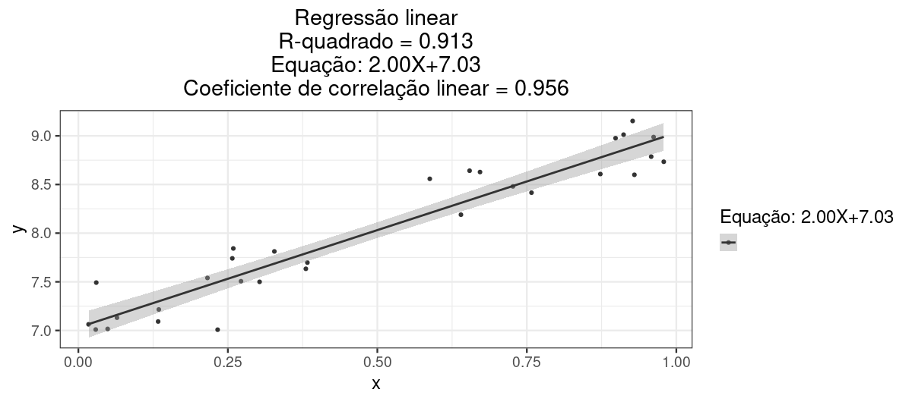


\newpage

#### Efeitos
##### O efeito jitter

- No gráfico de pontos ou dispersão, quando diversas observações (pontos) apresentam o mesmo valor, na visualização convencional, não é possivel perceber esse fato.\
- O feito jitter estabelece uma forma de evidenciar essas repetições. É um efeito que mostra os pontos sobrepostos num resultado de espalhamento em torno do ponto de sobreposição, permitindo que se visualize melhor a quantidade de ocorrências.\
- Adiciona uma pequena váriação aleatória à localização de cada ponto, é uma maneira útil de lidar com *overplotting* causada pela discrêpancia em conjuntos de dados menores.\
- *Overplotting* é quando os dados ou rótulos em uma visualização de dados se sobrepõem, dificultando a visualização de pontos de dados individuais em uma visualização de dados.\
- Comando para adicionar o efeito jitter no gráfico, usando a biblioteca **ggplot2**:\
`geom_jitter()`\

{ width=50% }


{ width=50% }


\newpage

##### Facetas

- Divide o gráfico em vários painéis.\
- O `facet_grid()` forma uma matriz de painéis definidos por variáveis de facetação de linha e coluna.\
- É mais útil quando se tem duas variáveis discretas e todas as combinações das variáveis existem nos dados.\
- Caso tenha apenas uma variável com muitos niveis, vale tentar `facet_wrap()`.\


\newpage

- Principais argumentos do `facet_grid()`:\
  - `rows` ou `cols`\
  O conjunto de variáveis `var()`. Definição de grupo de facetas na dimensão de linhas e colunas.\
  Exemplo: `row = var(variável_de_agrupamento)`\
  Outra forma de escrever é através da expressão `variável_linha ~ variável_coluna`, onde qualquer variável pode ser substituida por ponto (`variável_linha ~ .` ou `. ~ variável_coluna`), que é usado para indicar não haver lapidação nessa dimensão.\
  Exemplo: `Regiao ~ .`\
  - `nrow` ou `ncol`\
  Funciona para o `facet_wrap()`, controla como a feixa de opções é agrupada em uma grade, ou seja, controla o número de colunas e linhas, assim o como as facetas estão dispostas numa tabela.\ 
  Exemplo: `nrow = 3`\
  - `scale`\
  Por padrão, todos os painéis tem as mesmas escalas (`scale = "fixed"`). Eles podem se tornar independente, definindo as escalas como `free_x` (variando no eixo x), `free_y` (variando no eixo y) ou `free` (variando em ambos os eixos).\
  Exemplo: `scale = "free"`\
  - `space`\
  Se `fixed`, o padrão, todos os painéis tem o mesmo tamanho.\
  Se `free_y` sua altura será proporcional ao comprimento da escala y.\
  Se `free_x` sua largura será proporcional ao comprimento da escala x.\
  Ou se `free` tanto a altura quanto a largura vão variar em função das escalas x e y.\
  Exemplo: `space = "free"`\
  - `labeller`\
  O argumento `labeller` pode ser usado para controlar o rótulo dos painéis.\
  Exemplo: `labeller=label_both`\
  Adiciona o nome das variáveis nos rótulos, não somente os valores.\
  
\newpage

- Exemplos - `facet_grid()` alterando parâmetros:\

{ width=50% }


{ width=50% }


\newpage

{ width=50% }


{ width=50% }


\newpage

##### O efeito de suavização smooth

- Trata-se de um ajuste de curva de tendência entre duas variáveis numéricas.\
- Usa o modelo de regressão local para gerar uma curva suavizada que melhor se ajuste aos pontos.\
- Na regressão local, estima-se uma função na vizinhança de cada ponto de interesse.\
- O efeito de suavização smooth é gerado na biblioteca `ggplot2` pelas funções (`geom_point()+geom_smooth()`) com alguma semelhança ao gráfico de linhas, porém ao inves de ligar os pontos gera uma curve que se ajuste de maneira aproximada aos pontos.\
- A suavização de smooth descreve uma tendência (uma variabilidade), apresentando maior ou menor confiabilidade (área cinza do gráfico, argumento `se` da função `geom_smooth()`) da estimativa de tendência, dependendo da quantidade de pontos no local.\
- Podemos adicionar outros métodos de modelagem para uma curva de suvização, atráves do argumento `method`. Um método comum de se utiliza é a **regressão linear** (`lm`).\
Ex.: `geom_smooth(method = lm, se = FALSE)`\
- Principais argumentos da função `geom_smooth()`:\
  - `orientation`\
  Define a orientação, define se o ajuste deve ser feito ao longo do eixo y ao invés do eixo x.\
  Ex: `orientation = "y"`\
  - `span`\
  Use `span` para controlar a "ondulação".\
  Números pequenos fazem a curva mais sinuosa ($0 > x > 1$), enquanto números maiores ($\sim 1$) fazem a curva mais suave.\
  Ex.: `span = 0.3`\
  -`method`\
  Adiciona uma função de modelagem.\
  Uma comum usada é de regressão linear `lm`.\
  Ex.: `method = lm, se = FALSE`\
  - `se`\
  Especifica se mostra uma área de confiança em torno da linha suave (área cinza).\
  Por default é `True`, mostrando a área.\
  Caso `False`, omite a área.\
  Ex.: `se = FALSE`\

\newpage

- Exemplos - Gráficos de tendência usando a função de efeito de suavização smooth (`geom_point()+geom_smooth()`):\

{ width=50% }


{ width=50% }


\newpage

{ width=50% }


{ width=50% }


\newpage

### Assistentes para ggplot2 - `esquisse`

#### Pacotes auxiliares ao `ggplot2`

- `ggThemeAssist`\
Fornece uma interface gráfica (Addins) para editar os elementos do tema `ggplot2`.\

- `esquisse`\
  - Pacote para criação de gráficos (`ggplot2`) de maneira *point and click*.\
  - Assistente gráfico, para criação de gráficos rápidos e simples.\
  - Não tem todo o poderio do `ggplot2`, porém apresenta facilidades.\

- `hrbrthemes`\
Uma compilação de temas, escalas e utilitarios extras de `ggplot2`, incluindo uma função de verificação ortográfica para campos de rôtulos de plotagem.\

- `ggthemes`\
Temas adicionais para gráficos `ggplot2`.\
  


#### Referências e modelos de assistente gráfico

Modelos do pacote `ggplot2`:\
<https://exts.ggplot2.tidyverse.org/gallery/>

\newpage

#### Funções do assistente de gráficos `ggplot2` - `esquisse`

- Abrir assistente gráfico:\
  - `esquisse()`\
  Chama o assistente gráfico, abre no menu do **RStudio**.\
  - `esquisse(viewer = "browser")`\
  Abrir no browser.\
  - `esquisse(viewer = "pane")`\
  Abrir no viewer.\

- `esquisse(dados)`\
Passa dados para o assistente gráfico.\
Mesmo sem passar os dados para o assistente gráfico, o programa pega os dados na memória do sistema.\

\newpage

#### Assistente gráfico `esquisse`

- Ao instalar o pacote `esquisse`, ele fica disponível no addins do **RStudio**.\


{ width=80% }


- Dentro do assistente gráfico `esquisse`, a primeira aba é relativa a inserir textos no gráfico (título, subtítulo, legenda e rótulos).\


{ width=80% }


\newpage

- A segunda aba são opções de personalização do gráfico, variando de gráfico para gráfico (número de linhas).\


{ width=80% }


- Na aba appearance podemos mudar os temas e cores do gráfico.\


{ width=80% }


\newpage

- Na aba *data*, podemos aplicar filtros no *dataset*.\


{ width=80% }


- Por fim, na aba *code*, podemos exportar o gráfico, tanto o código de criação dele para replicar num *script*, ou o .png.\


{ width=80% }


\newpage

# CAP. 8 - LIMPEZA RÁPIDA NOS DADOS

## Pactoes
- `janitor`\
Projetado para inspeção e limpeza de dados "sujos".\

## Dados "sujos"
- Dados que podem apresentam diversos problemas ao utilizar dados abertos ou quando várias pessoas digitaram os dados.\
- Registros que necessitam de ajustes antes de sua análise.\

\newpage

## Principais funções `janitor`

### Limpando nomes do `data.frame` - `clean_names()`

- Manipulação de nomes problematicos de variáveis (`clean_names()`).\

- O que a função `clean.names()` faz?\
  - Retorna nomes somente com letras em caixa baixa e com "_" como separador.\
  - Manipula caracteres especiais e espaços.\
  - Inclui números para nomes duplicados.\
  - Converte o símbolo "%" para "percent" preservando o sentido.\

- Existe um função no pacote básico do R que também faz limpeza de nomes (corrige nomes) `make.names()`. Porém ela é muito básica, não sendo assim a solução ideal:\
  - Elimina espaços e substitui por pontos.\
  - Substitui símbolos por pontos.\

- Exemplo - Limpando nomes do `data.frame`:\
```
#Dados
dfp <- as.data.frame(matrix(ncol = 6))
names(dfp) <- c("OriGem",
                "REPETE",
                "REPETE",
                "% de acertos",
                "R!$@$&*",
                "")
dfp
#OriGem REPETE REPETE % de acertos R!$@$&*   
#1     NA     NA     NA           NA      NA NA

#Limpando nomes
clean_names(dfp)
#ori_gem repete repete_2 percent_de_acertos  r  x
#1      NA     NA       NA                 NA NA NA

#Comparando com a função básica do R make.names
make.names(names(dfp))
#[1] "OriGem"        "REPETE"        "REPETE"        "X..de.acertos"
#[5] "R......"       "X"  
```

\newpage

### Remova colunas ou linhas inútes
- Funções:\
  - `remove_constant()`\
  A função `remove_constant()` remove as colunas constantes.\
  - `remove_empty()`\
  A função `remove_empty()` remove valores vazios (*NA*), tanto colunas quanto linhas.\
  Sem especificar remove colunas e linhas.\
    - `which = "rows"`\
    remover linhas vazias.\
    - `which = "cols"`\
    remover colunas vazias.\

\newpage

- Exemplos - Eliminando colunas e/ou linhas com `remove_constant()` e `remove_empty()`:\

```
#Dados
x <- c("b","a","b","c","c",NA,"a","a",NA,"a")
y <- rep("Brasil",10)
z <- c(NA,1:7,NA,NA)
vazia <- rep(NA,10)

#Criando dataframe
dt <- data.frame(x,y,z,vazia)
dt

#Elimina coluna com valores constantes - remove_constant()
#Remove colunas y e vazia
dt_clean1 <- remove_constant(dt)
dt_clean1
      x  z
1     b NA
2     a  1
3     b  2
4     c  3
5     c  4
6  <NA>  5
7     a  6
8     a  7
9  <NA> NA
10    a NA

#Eliminando as linhas vazias - remove_empty()
#Remove linha 9, sem valores
dt_clean2 <- remove_empty(dt_clean1)
dt_clean2
      x  z
1     b NA
2     a  1
3     b  2
4     c  3
5     c  4
6  <NA>  5
7     a  6
8     a  7
10    a NA
```

\newpage

### Substitua valores perdidos/faltantes - `mice()`

- Apesar do `janitor` auxiliar a eliminar linhas e colunas com valores perdidas, caso necessite substituir tais valores, o pacote `mice` ajuda nessa tarefas, usando técnica de imputação de valores (*Multivariate Imputation by Chained Equations*).\
`install.packages("mice")`\

- A técnica `complete(mice())`, para substituição de valores, levam em conta o tipo de variável, produzindo a substituição dos valores pedidos.\
`complete(mice(data.frame))`\
  - O tipo de valores `character` não são apropriados para serem substituidos. O ideal, se possível, é passar as variáveis `character` para `factor`.\
  - Os tipos de valores mais apropriados para serem substituidos são `numeric` e `factor`.\

- Boas práticas ao aplicar substituição de valores perdidos/faltantes (`complete(mice())`):\
  - Antes aplicar a técnica de substituição de valores perdidos, é interessante fazer uma analise do `data.frame` para entender profundamente a situação:\
    - `str()`\
    Para entender a estrutura dos dados envolvidos (tipos de dados).\
    - `summary()`\
    Obter um resumo estatístico para conhecer de modo geral melhor o `data.frame`.\
  - Ao final da aplicação das funções `complete(mice())`, outra boa prática é obter o resumo estatístico (`summary()`) para observar e comparar a extensão dos impactos das substituições dos valores perdidos/faltantes para o conjuto dos dados.\

- Exemplo - Substituição de valores perdidos/faltantes (`complete(mice())`):\
```
#mice para substituição de valores perdidos/faltantes
#Analise estatística
dt
str(dt)
summary(dt)

#Substituindo valores perdidos com mice
dt_ajustado = complete(mice(dt))
dt_ajustado

#Nova analise estatística
summary(dt_ajustado)
```

\newpage

### Produzindo tabelas de frequência para uma variável - `taby()`

- A função `taby()`, do pacote `janitor`, é uma versão melhorada da função `table()`, do pacote base do R.\
- Diferenças:\
  - Retorna `data.frame` que pode ser melhorado e impresso com `kable()`, do pacote `knitr`.\
  - Calcula porcentagens automaticamente (porcentagem total e porcentagem valida, sem **NA**).\
  - Pode opcionalmente exibir valores **NA**.\
  - Quando **NA** ocorre, uma coluna adicional `valid_percent` (porcentagem valida) é adicionada.\
  - Pode opcionalmente ordernar as contagens (frequência).\
  - Pode ser usado com operador pipe `%>%`, do pacote `magrittr`.\
  - Quando a variável for do tipo categórica, os valores perdidos são contabilizados na tabela.\

{ width=50% }


\newpage

- Exemplo - Produzindo tabelas de frequência para uma variável (`taby()`):\

```
#Dados
x <- c("b","a","b","c","c",NA,"a","a",NA,"a")
y <- rep("Brasil",10)
z <- c(NA,1:7,NA,NA)
vazia <- rep(NA,10)

#Tabela de frequência da variável x
tabyl(x, sort = TRUE)
x n percent valid_percent
a 4     0.4          0.50
b 2     0.2          0.25
c 2     0.2          0.25
<NA> 2     0.2            NA

tabyl(x) %>% 
  select(x, valid_percent)
x valid_percent
a          0.50
b          0.25
c          0.25
<NA>            NA
```

\newpage

### Tabulação cruzada - `tabyl()`

#### Tabulação cruzada
- As tabelas de tabulação cruzada (tabelas de contigência) exibem o relacionamento entre duas variáveis categóricas (nominais ou ordinais). O tamanho da tabela é determinado pelo número de valores distintos para cada variável, com cada célula na tabela representando uma combinação exclusiva de valores.\
- Exemplo didático:\
Numa tabela onde temos duas colunas (x e y), a tabulação cruzada é a incidência (frequência) de ocorrências de x em y.\
Logo, para tornar uma tabela em tabulação cruzada o **x** mantém-se coluna e os valores de **y** passam a ser colunas, os valores da tabulação cruzada são as frequências das combinações.\

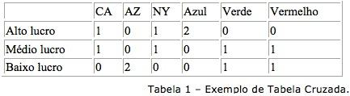{}


#### Função `tabyl()` para tabulação cruzada

- Uma tabulação cruzada é gerada com a função `tabyl()`.\
- Propriedades:\
  - Retorna um `dataframe`.\
  - Calcula frequências absolutas, mas é possível incluir frequências relativas por linha ou coluna.\
  - Também é possível incluir as frequências em forma de porcentagem.\
  - Pode (opcionalmente) mostrar os valores **NA** ("`show_na = F`" exclui **NA**).\
  Ex.:`tabyl(dt,x,y, show_na = F)`\
- A função `tabyl()`, do pacote `janitor`, produz resultado que só seria possível através de um conjunto de funções do sistema `tidyverse` (`dplyr` e `tidyr`).\
Ex.: `goup_by %>% summarise %>% mutate %>% spread`\

\newpage

- O pacote `janitor` tem um conjunto de funções para *adornar* a tabulação:\
  - `adorn_totals`\
  Adiciona o total por linha (`where = "row"`) ou coluna (`where = "col"`) ou por ambos.\
  Ex.: `tabyl(dt,col1,col2) %>% adorn_totals(.)`\
  - `adorn_percentages`\
  Calcula porcentagens com base nos totais de linha ("`row`"), de coluna ("`col`") ou sobre o total geral da tabela ("`all`").\
  Ex.: `adorn_percentages("row")`\
  - `adorn_pct_formatting`\
  Formata as porcentagens, controlando o número de dígitos a serem exibidos e incluindo o simbolo de "\%".\
  - `adorn_rounding`\
  Produz arredondamento nos números da tabela, não deve ser usado em conjunto com `adorn_pct_formatting`.\
  Ex.: `adorn_rounding(digits = 0, rounding = "half up")`\
  Métodos de arredondamento (`rounding`):\
    - `half up`\
    Arredonda para cima.\
    Ex.: $10.5 \rightarrow 11$\
    - `half to even`\
    Arredonda para baixo.\
    Ex.: $10.5 \rightarrow 10$\
  - `adorn_ns`\
  Adiciona as contagens (frequência absoluta).\
  - `adorn_title`\
  Adiciona título a tabela, podendo ser no topo da tabela ou combinado na primeira linha/coluna.\
  A opção "top" adiciona o nome da coluna numa linha vazia (dificulta manipulação posterior). Outra opção é "combined" anexando a variável de nome na linha já presente.\
  Ex.: `adorn_title("combined", row_name = "Cor de selo", col_name = "Categorias")`

\newpage

- Exemplos - Pacote `janitor`, função `tabyl()` para tabulação cruzada com adornos:\

```
#Tabulação cruzada entre x e y
#frequência de y em x
tabyl(dt,x,y)
        x A B C NA_
     azul 2 0 0   1
    preto 1 2 0   1
 vermelho 1 1 1   0
     <NA> 0 0 1   0

#Tabulação cruzada entre x e y com adornos
tabyl(dt,x,y) %>% 
  adorn_percentages("row") %>% #Inclui porcentagens com base na linha
  adorn_pct_formatting() #Formata para %
        x     A     B      C   NA_
     azul 66.7%  0.0%   0.0% 33.3%
    preto 25.0% 50.0%   0.0% 25.0%
 vermelho 33.3% 33.3%  33.3%  0.0%
     <NA>  0.0%  0.0% 100.0%  0.0%

tabyl(dt,x,y) %>% 
  adorn_percentages("col") %>% #Inclui porcentagens com base na coluna
  adorn_pct_formatting() #Formata para %
        x     A     B     C   NA_
     azul 50.0%  0.0%  0.0% 50.0%
    preto 25.0% 66.7%  0.0% 50.0%
 vermelho 25.0% 33.3% 50.0%  0.0%
     <NA>  0.0%  0.0% 50.0%  0.0%

tabyl(dt,x,y) %>% 
  adorn_percentages("all") %>% #Inclui porcentagens com base no total geral
  adorn_pct_formatting() #Formata para %
        x     A     B    C  NA_
     azul 18.2%  0.0% 0.0% 9.1%
    preto  9.1% 18.2% 0.0% 9.1%
 vermelho  9.1%  9.1% 9.1% 0.0%
     <NA>  0.0%  0.0% 9.1% 0.0%
```

\newpage

- Exemplos - Pacote `janitor`, função `tabyl()` para tabulação cruzada com adorno `adorn_title` para títulos e exclusão de **NA**:\

```

tabyl(dt,x,y, show_na = F) %>%  #Exclui NA
  adorn_percentages("all") %>% #Inclui porcentagens com base no total geral
  adorn_rounding(2) %>% #Arredonda com 2 casas decimais
  adorn_ns() %>% #Inclui contagens
  adorn_title("combined", 
              row_name = "Cor de selo",
              col_name = "Categorias") #Adiciona títulos
              
 Cor de selo/Categorias        A        B        C
                   azul 0.25 (2) 0.00 (0) 0.00 (0)
                  preto 0.12 (1) 0.25 (2) 0.00 (0)
               vermelho 0.12 (1) 0.12 (1) 0.12 (1)
```

\newpage

- Exemplos - Pacote `janitor`, função `tabyl()` para tabulação cruzada com adorno `adorn_rounding` para arredondamentos:\

```
#Arredondamentos
#half up - arredonda para cima
dt %>% 
  tabyl(x,y) %>% 
  adorn_percentages() %>% 
  adorn_rounding(digits = 0,rounding = "half up")
        x A B C NA_
     azul 1 0 0   0
    preto 0 1 0   0
 vermelho 0 0 0   0
     <NA> 0 0 1   0

#half to even - arredonda para baixo
dt %>% 
  tabyl(x,y) %>% 
  adorn_percentages() %>% 
  adorn_rounding(digits = 0,rounding = "half to even")
        x A B C NA_
     azul 1 0 0   0
    preto 0 0 0   0
 vermelho 0 0 0   0
     <NA> 0 0 1   0
```

\newpage

### Teste qui-quadrado para tabela cruzada - `chisq.test()`

- O teste qui-quadrado pode ser aplicado em dados tabelados de forma cruzada.\
- O teste qui-quadrado é um teste não paramétrico, não depende de parâmetros populacionais (média e variância).\
- É aplicado em variáveis qualitativas nominais, categóricas.\
- O objetivo é testar as hipóteses:\
  - $H_0$:\
  A variável linha é independente da variável coluna, ou seja, a proporção no total das linhas deve ser a mesma quando considerada em cada categoria da variável linha.\
  - $H_1$:\
  A variável linha é dependente da variável coluna, ou seja, a proporção no total das linhas é diferente da proporção em cada categoria da variável linha.\
- As variáveis devem ser categóricas.\
- Para concluir o teste, observamos o resultado do `p-valor` e comparamos com o nível de significância ($\alpha$) adotado na pesquisa, que em geral costuma ser de $0,05$(ou seja, $5\%$).\
  - Se `p-valor` $> 0,05 = H_0$\
  Não é possível rejeitar a hipotese nula ($H_0$).\
  Concluímos que as variáveis não são dependentes, são independentes, ao nível de significância de $5\%$.\
  - Se `p-valor` $\le 0,05 = H_1$\
  Rejeitamos a hipotese conhecida como nula ($H_0$).\
  Concluímos que as variáveis são dependentes ao nível de significância de $5\%$.\

\newpage

- Exemplo 1 - Hipótese $H_1$:\
```
#Suponha dois grupos que receberam tratamento
grupo <- c(rep("A",15),rep("B",15))
set.seed(20)
resposta <- c(sample(0:1,16,replace = T),rep(1,14))
dt = data.frame(grupo,resposta)

tab = tabyl(dt, grupo, resposta, show_na= F)
tab
 grupo 0  1
     A 9  6
     B 1 14

#Aplicando o teste qui-quadrado
chisq.test(tab)

	Pearson's Chi-squared test with Yates' continuity correction

data:  tab
X-squared = 7.35, df = 1, p-value = 0.006706

#Conclusão
##p-value = 0.006706
##Logo, p-value (0.006706) <= alpha (0.05)
##Assim, rejeitamos a hipótese nula (H_0),
##há uma associação estatisticamente significativa entre as variáveis.
##É a hipótese H_1.
```

\newpage

- Exemplo 2 - Hipótese $H_0$:\
```
#Suponha dois grupos que receberam tratamento
grupo <- c(rep("A",15),rep("B",15))
set.seed(20)
resposta <- c(sample(0:1,25,replace = T),rep(1,5))
dt = data.frame(grupo,resposta)

tab = tabyl(dt, grupo, resposta, show_na= F)
tab
 grupo 0 1
     A 9 6
     B 6 9

#Aplicando o teste qui-quadrado
chisq.test(tab)

	Pearson's Chi-squared test with Yates' continuity correction

data:  tab
X-squared = 0.53333, df = 1, p-value = 0.4652

#Conclusão
##p-value = 0.4652
##Logo, p-value (0.4652) > alpha (0.05)
##Assim, não podemos rejeitar a hipótese nula (H_0),
##Não há evidências suficientes para concluir que as variáveis estão associadas.
##É a hipótese H_0.
```

\newpage

### Caça aos registros com valores duplicados - `get_dupes()`

- A função `get_dupes()`, do pacote `janitor`, realiza a tarefa de retornar os registros duplicados do conjunto de dados em análise (exibe uma coluna com a contagem de duplicatas), para que seja possível detectar os casos problemáticos.\
- É uma função útil para casos em que não deveriam aparecer registros duplicados.\
Ex.: ID, registros de notas fiscais, conjuntos únicos (ID, registro de faturamento),...\
- Exemplo - Uso da função `get_dupes()`, do pacote `janitor`, para identificar registros duplicados:\
```
#data.frame
df = data.frame(ID = c(1000,1001,1000,1002),
                FAT = c(2098.60,345.00,2098.60,1332.44),
                ANO = c(2016,2016,2016,2017))

#Identificando registros duplicados - get_dupes()
##Metódo 1
get_dupes(df, ID, FAT)

    ID    FAT dupe_count  ANO
1 1000 2098.6          2 2016
2 1000 2098.6          2 2016

##Metódo 2 - com uso de magrittr
df %>% 
  get_dupes(ID,FAT)

    ID    FAT dupe_count  ANO
1 1000 2098.6          2 2016
2 1000 2098.6          2 2016
```

\newpage

### Corrija número para data com a função `excel_numeric_to_date()`

- A função `excel_numeric_to_date()`, do pacote `janitor`, é para consertar data em uma arquivo importado de *Excel*, se uma data veio em formato número ao invés de data.\
- A função `excel_numeric_to_date()` converte número para a classe *Date*.\
- Exemplo - Conversão de número para data, usando a função `excel_numeric_to_date()` de um arquivo importado do excel:\
```
#Aplicação da função excel_numeric_to_date
#Metódo 1
excel_numeric_to_date(51503)
[1] "2041-01-02"

#Metódo 2 - MAC
excel_numeric_to_date(51503, date_system = "mac pre-2011")
[1] "2045-01-03"

#Metódo 3 - com magrittr
dt <- 51503
dt %>% 
  excel_numeric_to_date()
[1] "2041-01-02"
```

\newpage

### Conte os níveis dos fatores - escala de *Likert*
#### Escala *Likert*
- A escala *Likert* é utilizada para mensurar sentimentos numa escala que pode variar entre um e cinco níveis (a mais usada é de cinco níveis).\
- Sendo um o menor nível e cinco o maior nível de concordância ou discordância sobre uma pergunta ou afirmação.\
- Os níveis dos fatores geralmente se apresentam como:\
  - Concordo totalmente\
  - Concordo parcialmente\
  - Neutro\
  - Discordo parcialmente\
  - Discordo totalmente\

{}


\newpage

#### A função `top_levels()`
- A função `top_levels()`, do pacote `janitor`, realiza a contagem dos níveis da escala do tipo *Likert*.\
- A função `top_levels()` fornece uma tabela com as contagens e percentuais dos níveis agrupados em três grupos:\
  - Alto\
  - Médio\
  - Baixo\
- O argumento `n` da função estabelece quantos níveis serão incluidos no grupo alto e baixo da escala.\
  - `n = 1`\
  Um nível no grupo alto, três níveis no grupo médio e um nível no grupo baixo.\
  - `n = 2`\
  Dois níveis no grupo alto, um nível no grupo médio e dois níveis no grupo baixo.\
- As caracteristicas da variável para ser avaliada pela função `top_levels()`:\
  - Deve ser um fator (classe `factor`)\
  - Conter as respostas e os níveis (`levels`)\
  - Respostas que não correspondem aos níveis (`levels`) são ignoradas.\
  - Exemplo:\
  ```
  f <- factor(c("neutro","concordo parcialmente",
              "discordo parcialmente","concordo",
              "concordo","concordo totalmente",
              "concordo totalmente","concordo","discordo totalmente"),
            levels = c("concordo totalmente",
                       "concordo parcialmente",
                       "neutro",
                       "discordo parcialmente",
                       "discordo totalmente"))
  ```

\newpage

- Exemplo - Contagem dos níveis da escala do tipo *Likert*, usando a função `top_levels()`:\
```
#Variável
f <- factor(c("neutro","concordo parcialmente",
              "discordo parcialmente","concordo",
              "concordo","concordo totalmente",
              "concordo totalmente","concordo","discordo totalmente"),
            levels = c("concordo totalmente",
                       "concordo parcialmente",
                       "neutro",
                       "discordo parcialmente",
                       "discordo totalmente"))

#Contagem levels
#n = nº de niveis no grupo alto e baixo
top_levels(f,n=1)
#Um nível no grupo alto, três níveis no grupo médio e um nível no grupo baixo.
                                   f n   percent
                 concordo totalmente 2 0.3333333
 <<< Middle Group (3 categories) >>> 3 0.5000000
                 discordo totalmente 1 0.1666667

top_levels(f,n=2)
#Dois níveis no grupo alto, um nível no grupo médio e dois níveis no grupo baixo.
                              f n   percent
 concordo totalmente, concor... 3 0.5000000
                         neutro 1 0.1666667
 discordo parcialmente, disc... 2 0.3333333
```

\newpage

#### Plotagem de escala *Likert*

- Podemos utilizar o pacote `likert`, para obter um resumo e formas de visualização da análise de respostas na escala *Likert*.\
`install.packages("likert")`\
- O pacote `likert` é usado em conjunto com os pacotes gráficos (`ggplot2` por exemplo).\
- Exemplo - Visualização de respostas na escala *Likert*:\
```
#Bibliotecas
library(janitor) #Limpeza de dados
library(ggplot2) #Elaboração de gráficos
library(likert) #Opções de figuras no ggplot para itens com escala likert
library(RColorBrewer) #Pacote com paleta de cores para gráficos

#Criando uma base de dados simulada com 3 questões
niveis <- c("concordo totalmente",
           "concordo parcialmente",
           "neutro",
           "discordo parcialmente",
           "discordo totalmente")

#Cria variáveis com 40 valores semialeatórios de 5 fatores
set.seed(30); q1 = factor(sample(1:5,40,replace = T))
levels(q1) = niveis #Substitui os 5 levels de q1 pelos 5 levels da variável niveis
set.seed(31); q2 = factor(sample(1:5,40,replace = T))
levels(q2) = niveis #Substitui os 5 levels de q2 pelos 5 levels da variável niveis
set.seed(32); q3 = factor(sample(1:5,40,replace = T))
levels(q3) = niveis #Substitui os 5 levels de q3 pelos 5 levels da variável niveis

#As respostas na escala de Likert
respostas <- data.frame(q1,q2,q3)

#Preparo para plotagem
tb_likert <- likert(respostas) #Transforma data.frame na classe likert

#Resumo das respostas
summary(tb_likert)

#Gráfico das respostas em escala de Likert
plot(tb_likert,
     colors = c("gray30","gray65","gray95","gray75","gray55"))+
  ggtitle("Gráfico das respostas em escala de Likert")+ #Título
  labs(x = NULL,
       y = "Porcentagem de respostas")+ #Rótulos dos eixos
  theme(plot.title = element_text(hjust = 0.5)) #Centraliza o título

#Fechando dispositivo gráfico
dev.off()
```

\newpage

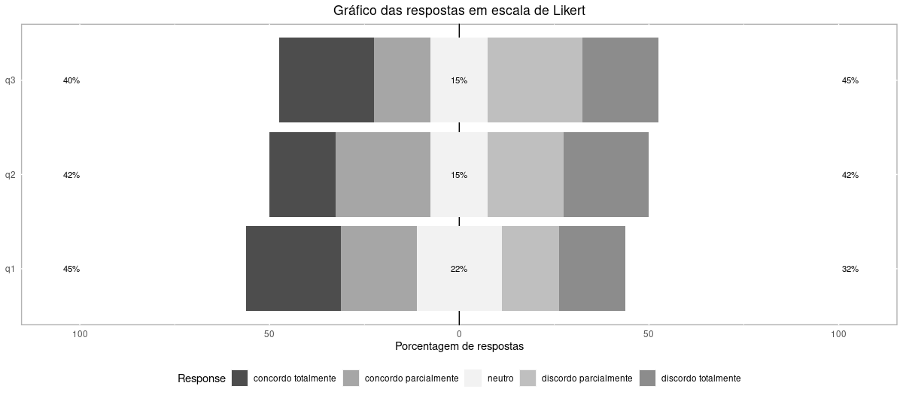


\newpage
- Exemplo - Visualização de respostas na escala *Likert* no formato `type = heat`:\

```
#Bibliotecas
library(janitor) #Limpeza de dados
library(ggplot2) #Elaboração de gráficos
library(likert) #Opções de figuras no ggplot para itens com escala likert
library(RColorBrewer) #Pacote com paleta de cores para gráficos

#Criando uma base de dados simulada com 3 questões
niveis <- c("concordo totalmente",
           "concordo parcialmente",
           "neutro",
           "discordo parcialmente",
           "discordo totalmente")

#Cria variáveis com 40 valores semialeatórios de 5 fatores
set.seed(30); q1 = factor(sample(1:5,40,replace = T))
levels(q1) = niveis #Substitui os 5 levels de q1 pelos 5 levels da variável niveis
set.seed(31); q2 = factor(sample(1:5,40,replace = T))
levels(q2) = niveis #Substitui os 5 levels de q2 pelos 5 levels da variável niveis
set.seed(32); q3 = factor(sample(1:5,40,replace = T))
levels(q3) = niveis #Substitui os 5 levels de q3 pelos 5 levels da variável niveis

#As respostas na escala de Likert
respostas <- data.frame(q1,q2,q3)

#Resumo das respostas
tb_likert <- likert(respostas) #Transforma data.frame na classe likert, prepara para plotagem
summary(tb_likert)

#Gráfico das respostas em escala de Likert
plot(tb_likert,
     colors = c("gray30","gray65","gray95","gray75","gray55"), 
     type = "heat")+
  ggtitle("Gráfico das respostas em escala de Likert")+ #Título
  labs(x = NULL,
       y = "Porcentagem de respostas")+ #Rótulos dos eixos
  theme(plot.title = element_text(hjust = 0.5)) #Centraliza o título

#Fechando dispositivo gráfico
dev.off()
```

\newpage


\newpage

- Exemplos de modelos de visualização da escala *Likert*:\

```
p1 = likert(items = pptqc, nlevels = 3)
plot(p1)
```

{ width=50% }


```
plot(p1, type = "heat")
```

{ width=50% }


\newpage

```
lik2 <- likert(as.data.frame(bd[ , 3:5]), grouping = bd$categ)
plot(lik2, wrap = 60, text.size=3) + theme(axis.text.y = element_text(size="6"))
```

{ width=50% }


\newpage

# CAP. 9 - ANÁLISE DESCRITIVA DOS DADOS

## Teoria
- Objetivo do capitulo é fazer uma análise descritiva dos dados através da tabulação das variáveis e cálculo de medidas descrititvas (média, desvio-padrão, etc).\
- Análise descritiva dos dados (Informações preliminares):\
  - Contagem dos resultados observados em cada variável do conjunto de dados.\
  - Natureza descritiva dos dados, tipo de variáveis (categórica ou numérica).\
  - Três objetivos principais:\
    - Verificar erros e anomalias.\
    - Compreender a distribuição de cada uma das variáveis isoladamente.\
    - Compreender a natureza e a força das relações entre as variáveis.\
- Após essas etapas, estabelecer um modelo estatístico formal e relatar suas conclusões.\

## Tipos de variáveis

- Variável numérica:\
  - Continua\
  Se seus valores pertencer ao conjunto dos números reais.\
  Ex.: Temperatura corporal, saldo em caixa, peso da carga de um caminhão, etc.\
  - Discreta\
  Se seus valores pertencer ao conjunto dos números inteiros.\
  Ex.: Número de pessoas com febre, número de empresas, número de caminhões, etc.\
- Variável categórica:\
  - Ordinal\
  Se seus valores podem ser ordenados do menor para o maior.\
  Ex.: Temperatura (baixa, média ou alta), saldo em caixa (negativo, nulo ou positivo), etc.\
  - Nominal\
  Quando não for possível estabeler ordenamento.\
  Ex.: Sexo do individuo, atividade fim da empresa, marca/modelo do caminhão, etc.\

- Podemos usar, no **R**, a função `str()` (structure) para conhecer o tipo dos dados.\
Ex.: `str(variavel)`\

\newpage

## Tabulação dos dados

- Na etapa de tabulação, o pesquisador prepara as tabelas de frequência com o intuito de entender o comportamento das variáveis.\
- Para construir as tabelas de frequência utilizamos o pacote `janitor`, a função `tabyl()` e os argumentos `adorn_`.\
- Variáveis numéricas contínuas:\
  - No caso de variáveis numéricas contínuas, para dividir o intervalo de classes podemos usar a função `cut()`, junto com o argumento `b = nclass.Sturges(coluna)`.\
  Ex.:`intervalo=(cut(dados$valor_compra,b=nclass.Sturges(dados$valor_compra)))`\
  - Por *default* os intervalos de classe da função `cut()`, com argumento `b = nclass.Sturges(coluna)`, as classes são formadas aberta na esquerda e fechada na direita.\
  Ex.: (11.4,153]\
  - Podemos adicionar o argumento `right = FALSE` para inverter a forma das classes, ficando fechada na esquerda e aberta na direita.\
  Ex.: [11.4,153)\
  - Outra forma de formar os intervalos de classe é inserindo os valores manualmente dos intervalos de classe, na função `cut()`, no argumento `b = c(valores_do_intervalo)`.\
  Ex.:`intervalo3 = (cut(dados$valor_compra, b = c(12,182,352,522,692,862)))`\

\newpage

- Exemplo - Tabela de frequência para variável categórica:\
```
#Análise descritiva dos dados
#Tabulação dos dados - variável categórica

#Bibliotecas
library(knitr) #Interpretação e compilação do documento rmd, formato tabela kable
library(magrittr) #Operador pipe " %>% ", concatena linhas de comando
library(readr) #Leitura de dados
library(janitor) #Limpeza de dados

#Leitura da base de dados
dados <- read.csv2(file = "~/Programacao/R/Dados/Dados_de_importacao/vendas.csv")
dados <- data.frame(dados)

#Exibindo as 6 primeiras linhas da base de dados
head(dados)

  cupom filial valor_compra n_itens desconto_perc quinzena
1   101      A       100.22       5             2        1
2   102      A        80.89      20             0        1
3   103      A        75.44       7             0        1
4   104      A       305.33       3            10        2
5   105      A       120.99       1             2        2
6   106      A        27.89       1             0        2

#Exibindo a estrutura dos dados
#Tipo das variáveis
str(dados)

'data.frame':	23 obs. of  6 variables:
 $ cupom        : int  101 102 103 104 105 106 201 202 203 204 ...
 $ filial       : chr  "A" "A" "A" "A" ...
 $ valor_compra : num  100.2 80.9 75.4 305.3 121 ...
 $ n_itens      : int  5 20 7 3 1 1 20 30 17 14 ...
 $ desconto_perc: int  2 0 0 10 2 0 0 12 10 0 ...
 $ quinzena     : int  1 1 1 2 2 2 2 2 2 1 ...

#Tabela de frequência variável categórica
tb_filial <- tabyl(dados,filial) %>% 
  adorn_totals() %>% 
  adorn_rounding(2)

tb_filial

 filial  n percent
      A  6    0.26
      B 12    0.52
      C  5    0.22
  Total 23    1.00

#Plotar tabela
kable(tb_filial, caption = "Tabela de frequência para variável categórica",align = "ccc")
```

\newpage

```{r Tabulação Freq Categorica, echo=FALSE, message=FALSE, warning=FALSE}
#Análise descritiva dos dados
#Tabulação dos dados - variável categórica

#Bibliotecas
library(knitr) #Interpretação e compilação do documento rmd, formato tabela kable
library(magrittr) #Operador pipe " %>% ", concatena linhas de comando
library(readr) #Leitura de dados
library(janitor) #Limpeza de dados

#Leitura da base de dados
dados <- read.csv2(file = "./Dados/Dados_de_importacao/vendas.csv")
dados <- data.frame(dados)

#Tabela de frequência variável categórica
tb_filial <- tabyl(dados,filial) %>% 
  adorn_totals() %>% 
  adorn_rounding(2)

#Plotar tabela
kable(tb_filial, col.names = c("Filial","n","Porcentagem") , caption = "Tabela de frequência para variável categórica", align = "ccc")
```

\newpage

- Exemplo - Tabela de frequência para variável numérica (contínua), usando o método de separação de classes `nclass.Sturges()`:\
```
#Análise descritiva dos dados
#Tabulação dos dados - Variável numérica (continua)

#Bibliotecas
library(knitr) #Interpretação e compilação do documento rmd, formato tabela kable
library(magrittr) #Operador pipe " %>% ", concatena linhas de comando
library(readr) #Leitura de dados
library(janitor) #Limpeza de dados

#Leitura da base de dados
dados <- read.csv2(file = "~/Programacao/R/Dados/Dados_de_importacao/vendas.csv")
dados <- data.frame(dados)

#Exibindo as 6 primeiras linhas da base de dados
head(dados)

  cupom filial valor_compra n_itens desconto_perc quinzena
1   101      A       100.22       5             2        1
2   102      A        80.89      20             0        1
3   103      A        75.44       7             0        1
4   104      A       305.33       3            10        2
5   105      A       120.99       1             2        2
6   106      A        27.89       1             0        2

#Exibindo a estrutura dos dados
#Tipo das variáveis
str(dados)

'data.frame':	23 obs. of  6 variables:
 $ cupom        : int  101 102 103 104 105 106 201 202 203 204 ...
 $ filial       : chr  "A" "A" "A" "A" ...
 $ valor_compra : num  100.2 80.9 75.4 305.3 121 ...
 $ n_itens      : int  5 20 7 3 1 1 20 30 17 14 ...
 $ desconto_perc: int  2 0 0 10 2 0 0 12 10 0 ...
 $ quinzena     : int  1 1 1 2 2 2 2 2 2 1 ...

#Cut para categorizar valor_compra em b intervalos
#Usar o metodo cut(dados, nclass.Sturges()) para separar as classes
intervalo = (cut(dados$valor_compra, b = nclass.Sturges(dados$valor_compra)))
intervalo

 [1] (11.4,153] (11.4,153] (11.4,153] (294,434]  (11.4,153] (11.4,153]
 [7] (11.4,153] (434,575]  (153,294]  (11.4,153] (11.4,153] (715,857] 
[13] (11.4,153] (153,294]  (434,575]  (11.4,153] (11.4,153] (153,294] 
[19] (11.4,153] (153,294]  (11.4,153] (294,434]  (715,857] 
Levels: (11.4,153] (153,294] (294,434] (434,575] (575,715] (715,857]

#Tabela de frequência da variável valor_compra
#Tabela frequência da uma variável numérica continua
tb_valor = tabyl(intervalo) %>% 
  adorn_totals() %>% 
  adorn_rounding(2)

tb_valor

  intervalo  n percent
 (11.4,153] 13    0.57
  (153,294]  4    0.17
  (294,434]  2    0.09
  (434,575]  2    0.09
  (575,715]  0    0.00
  (715,857]  2    0.09
      Total 23    1.00

#Plotar tabela
kable(tb_valor, align = "ccc",
      caption = "Tabela de frequência para variável numérica contínua")

Table: Tabela de frequência para variável numérica contínua

| intervalo  | n  | percent |
|:----------:|:--:|:-------:|
| (11.4,153] | 13 |  0.57   |
| (153,294]  | 4  |  0.17   |
| (294,434]  | 2  |  0.09   |
| (434,575]  | 2  |  0.09   |
| (575,715]  | 0  |  0.00   |
| (715,857]  | 2  |  0.09   |
|   Total    | 23 |  1.00   |
```

\newpage

```{r Tabulação freq numeric continuos, echo=FALSE, message=FALSE, warning=FALSE}
#Análise descritiva dos dados
#Tabulação dos dados - Variável numérica (continua)

#Bibliotecas
library(knitr) #Interpretação e compilação do documento rmd, formato tabela kable
library(magrittr) #Operador pipe " %>% ", concatena linhas de comando
library(readr) #Leitura de dados
library(janitor) #Limpeza de dados

#Leitura da base de dados
dados <- read.csv2(file = "./Dados/Dados_de_importacao/vendas.csv")
dados <- data.frame(dados)

#Cut para categorizar valor_compra em b intervalos
#Usar o metodo cut(dados, nclass.Sturges()) para separar as classes
intervalo = (cut(dados$valor_compra, b = nclass.Sturges(dados$valor_compra)))

#Tabela de frequência da variável valor_compra
#Tabela frequência da uma variável numérica continua
tb_valor = tabyl(intervalo) %>% 
  adorn_totals() %>% 
  adorn_rounding(2)

#Plotar tabela
kable(tb_valor, col.names = c("Intervalo","n","Porcentagem"),
      align = "ccc",
      caption = "Tabela de frequência para variável numérica contínua, usando o método de separação de classes `nclass.Sturges()`")
```

\newpage

- Exemplo - Tabela de frequência para variável numérica (contínua), com separação de classes inserido manualmente e limites com aberturas invertidas usando `right = FALSE`:\

```
#Cut para categorizar valor_compra em b intervalos
#Entrando com os intervalos de classe
#O comando "right = FALSE", inverte o intervalo de classe, esquerdo fechado e direito aberto [,).
intervalo = (cut(dados$valor_compra, b = c(12,182,352,522,692,862),
                  right = FALSE))
intervalo

 [1] [12,182)  [12,182)  [12,182)  [182,352) [12,182)  [12,182)  [12,182) 
 [8] [352,522) [182,352) [12,182)  [12,182)  [692,862) [12,182)  [182,352)
[15] [352,522) [12,182)  [12,182)  [182,352) [12,182)  [182,352) [12,182) 
[22] [352,522) [692,862)
Levels: [12,182) [182,352) [352,522) [522,692) [692,862)

#Tabela de frequência da variável valor_compra
#Tabela frequência da uma variável numérica continua
tb_valor = tabyl(intervalo) %>% 
  adorn_totals() %>% 
  adorn_rounding(2)

tb_valor

 intervalo  n percent
   [12,182) 13    0.57
  [182,352)  5    0.22
  [352,522)  3    0.13
  [522,692)  0    0.00
  [692,862)  2    0.09
      Total 23    1.00

#Plotar tabela
kable(tb_valor, align = "ccc",
      caption = "Tabela de frequência para variável numérica continua")
      
Table: Tabela de frequência para variável numérica continua

| intervalo | n  | percent |
|:----------:|:--:|:-------:|
|  [12,182)  | 13 |  0.57   |
| [182,352)  | 5  |  0.22   |
| [352,522)  | 3  |  0.13   |
| [522,692)  | 0  |  0.00   |
| [692,862)  | 2  |  0.09   |
|   Total    | 23 |  1.00   |
```
\newpage

```{r tab freq num cont intervalo manual, echo=FALSE, message=FALSE, warning=FALSE}
#Análise descritiva dos dados
#Tabulação dos dados - Variável numérica (continua)
#Intervalo de classe inserido manualmente

#Bibliotecas
library(knitr) #Interpretação e compilação do documento rmd, formato tabela kable
library(magrittr) #Operador pipe " %>% ", concatena linhas de comando
library(readr) #Leitura de dados
library(janitor) #Limpeza de dados

#Leitura da base de dados
dados <- read.csv2(file = "./Dados/Dados_de_importacao/vendas.csv")
dados <- data.frame(dados)

#Cut para categorizar valor_compra em b intervalos
#Entrando com os intervalos de classe
#O comando "right = FALSE", inverte o intervalo de classe, esquerdo fechado e direito aberto [,).
intervalo3 = (cut(dados$valor_compra, b = c(12,182,352,522,692,862),
                  right = FALSE))

#Tabela de frequência da variável valor_compra
#Tabela frequência da uma variável numérica continua
tb_valor3 = tabyl(intervalo3) %>% 
  adorn_totals() %>% 
  adorn_rounding(2)

#Plotar tabela
kable(tb_valor3, 
      col.names = c("Intervalo","n","Porcentagem"),
      align = "ccc",
      caption = "Tabela de frequência para variável numérica continua, com separação de classes inserido manualmente e limites com aberturas invertidas usando `right = FALSE` ")
```

\newpage

## Estatística descritiva com o pacote `DescTools`

### Teoria

- O pacote `DescTools` foi desenvolvido com o objetivo de fornecer uma análise descritiva de forma rápida e completa.\
- A principal função do pacote é `Desc()`, descreve as variáveis de acordo com sua natureza, produzindo medidas estatísticas descritivas e uma representação gráfica adequada.\
- Tipos de variáveis:\
  - Lógicas\
  - Fatores (ordenados e não ordenados)\
  - Inteiros\
  - Numéricos\
  - Datas\
  - Tabelas\
  - Matrizes\
- Principais saidas da função `Desc()`:\

```{r Desc,echo=FALSE, message=FALSE, warning=FALSE}
#Bibliotecas
library(knitr)

#data.frame
retorno <- c("length",
  "n",
  "NAs",
  "unique",
  "0s",
  "mean",
  "meanSE",
  ".05, ..., .95",
  "range",
  "sd",
  "vcoef",
  "mad",
  "IQR",
  "skew",
  "kurt",
  "lowest",
  "highest")
descricao_ret <- c("O comprimento do vetor.",
                   "O número de observações validas.",
                   "O número de observações faltantes.",
                   "O número de observações distintas entre si.",
                   "O número total de valores nulos.",
                   "A média aritmética do vetor.",
                   "Fornece um intervalo de 95% de confiança para a média, com base no erro padrão da média.",
                   "Percentil de x, iniciando em 5%, 10%, 1 quartil, mediana, ...",
                   "A amplitude do vetor x.",
                   "O desvio-padrão do vetor x.",
                   "O coeficiente de variação de x.",
                   "O desvio médio absoluto.",
                   "A amplitude interquartil, definida por 3 quartil - 1 quartil.",
                   "O coeficiente de assimetria do vetor x.",
                   "O coeficiente de curtose do vetor x.",
                   "Os cinco menores valores do vetor x.",
                   "Os cinco maiores valores do vetor x.")
tb_retornos <- data.frame(retorno,descricao_ret)

#Tabela
kable(tb_retornos, col.names = c("Saídas da função Desc", "Descrição"),
      align = "cc",
      caption = "Prinpipais saídas da função Desc para variáveis numéricas.")
```

\newpage

- Principais parâmetros da função `Desc()`:\
  - `plotit = F`\
  Omitir os gráficos.\
  Ex.: `Desc(dados, plotit = F)`\

- Mapeamento de dados faltantes:\
`PlotMiss(dados, main="Dados Faltantes", clust = TRUE)`\

{}


\newpage

### Customizar os gráficos
- É possível plotar determinada coluna a partir da função `plot()` e `Desc()`, obtendo assim as principais informações da variável envolvida.\
- Os gráficos plotados (pode ser mais de um), vão depender do tipo da variável envolvida:\
  - Numérica\
  **Histograma** sobreposto com curva de densidade;\
  **Boxplot**;\
  **Frequência acumulada** para cada intervalo da variável.\
  - Inteira\
  - Categórica\
  **Dicotômica** (ate dois niveis), intervalos deconfiança de 90, 95, 99% (assemelha-se a um boxplot).\
  **Politômica** (mais de dois niveis), gráfico de barras tanto para frequência absoluta quando para frequência relativa.\
- Principais argumentos da função `plot()`:\
  - `Desc(dados$coluna)`\
  Coluna/variável da qual serão plotados os gráficos, a partir de suas principais medidas estatísticas descritivas.\
  - `main = "Título"/NULL`\
  Insere um título ao gráfico.\
  - `maxlablen = 25`\
  Controla o número de caracteres máximo m impresso nos rótulos do gráfico.\
  - `type = c("bar", "dot")`\
  Customização do tipo de plotagem.\
  - `col = "red"/NULL`\
  Adiciona cor aos pontos.\
  - `xlim = c(150,200)/NULL`\
  Limites do eixo x.\
  - `ecdf = TRUE`\
  Exibe (`TRUE`), ou não (`FALSE`), as barras acumuladas do gráfico de barras.\ 
  - Exemplo:\
```
plot(Desc(dados$coluna),main= NULL, 
maxlablen = 25,
type = c("bar", "dot"),
col = NULL,
border = NULL,
xlim = NULL,
ecdf = TRUE)
```
\newpage

{width=55%}


{width=55%}


{width=55%}


\newpage

### Interpretação dos coeficientes
- $CV$ | `vcoef` (Coeficiente de variação)\
  - O coeficiente de variação é uma medida de dispersão, quanto menor a porcentagem mais próximos os dados estão da média.\
  - Calculando Coeficiente de variação $CV$:\
  $$CV = \frac{dp}{\bar{x}} \times 100$$
  onde,\
  $$Média (\bar{x}) = \frac{\sum_{i=1}^{n} x_i}{n}$$
  $$Desvio (dm) = \sum_{i=1}^{n} (|x_i - \bar{x}|)$$
  $$Variância (var) =  \frac{\sum_{i=1}^{n} (x_i - \bar{x})^2}{n}$$
  $$Desvio-padrão (dp) = \sqrt{\frac{\sum_{i=1}^{n} (x_i - \bar{x})^2}{n}}$$
  - Análise do coeficiente de variação:\
    - $CV \leqslant 15 \%$\
    Baixa dispersão.\
    - $15 \% < CV \leqslant 30 \%$\
    Média dispersão.\
    - $CV > 30 \%$\
    Alta dispersão.\

\newpage
  
- $As$ | `shew` (Coeficiente de assimetria)\
  - Ajuda a definir assimetria dos dados.\
  - Casos:\
    - Simetrica: $\bar{x} = md = m_o$.\
    - Assimetrica a esquerda: $\bar{x} - md = negativo$.\
    - Assimetrica a direita: $\bar{x} - md = positivo$.\
  - Calculando coeficiente de assimetria:\
  $$As = \frac{3 \times (\bar{x} - md)}{dp}$$
  Onde,\
  $\bar{x}$ é média;\
  $md$ é a mediana;\
  $m_o$ é a moda;\
  $dp$ é o desvio-padrão.\
  - Análise do coeficiente de assimetria:\
    - $|skew| \leqslant 0.15$\
    Distribuição praticamente simétrica ($\bar{x} = md = m_o$).\
    - $0.15 < |skew| \leqslant 1$\
    Assimetria moderada.\
    - $|skew| > 1$\
    Assimetria Forte.\
  - Casos de assimetria:\
  
  {width=50%}
  
  
\newpage
 
- $C$ | `kurt` (Coeficiente de Curtose)\
  - Curtose é o grau de achatamento (ou afilamento) de uma distribuição em comparação com a curva normal.\
  - Calculando o coeficiente de Curtose:\
  $$C = \frac{Q_3 - Q_1}{2 \times (P_{90} - P_{10})}$$
  $$* = L_i + \frac{k \cdot \sum f_i - F_{anterior}}{f_{intervalo}} \times h$$
  $$P_{k} = L_i + \frac{\frac{k}{100} \cdot \sum f_i - F_{anterior}}{f_{intervalo}} \times h$$
  Onde,\
  $Q_3$ é o terceiro quartil;\
  $Q_1$ é o primeiro quartil;\
  $P_{90}$ é o percentil 90;\
  $P_{10}$ é o percentil 10.\
  - Análisando o coeficiente de Curtose:\
    - $C \cong 0.263$\
    A distribuição é mesocúrtica.\
    - $C < 0.263$\
    A distribuição é leptocúrtica (em cume).\
    - $C > 0.263$\
    A distribuição é platicúrtica (plana).\
  - Tipos de achatamento da curva de distribuição:\
  
  {width=50%}
  
  
\newpage

## Mapeamento de dados faltantes - `PlotMiss()`

- Ao análisar a base de dados com dados faltantes, devemos observar como estão distribuidos os dados faltantes.\
- Ao aplicarmos o comando `PlotMiss()` podemos analisar a distribuição dos dados faltantes, identificando quais variáveis apresentam o maior número de dados faltantes.\
- Através do mapeamento de dados faltantes, podemos observar quais variáveis apresentam perda de dados e as variáveis, que pela maior ausência de dados, exigem maior atenção.\
- A partir do mapeamento podemos tomar duas decisões em relação as variáveis que apresentam ausência de dados:\
  - Realizar limpeza dos dados faltantes.\
    - Procurar/remover colunas ou linhas inúteis.\
    `remove_empty()`\
    - Registros duplicados.\
    `get_dupes()`\
  - Aplicar um algoritmo de imputação para esses dados.\
  `complete(mice())`\
- Exemplo - Mapeamento de dados faltantes:\
```
#Análise de distribuição de dados faltantes
PlotMiss(dados, col = colorRampPalette(c("gray10","gray90"))(1))

#Fechando dispositivo gráfico
dev.off()
```

{}


\newpage

## Analisando datas com o pacote `DescTools`

- Na análise descritiva de datas (`Desc(variável_data)`) é feito uma análise das frequências (frequência, porcentagem da frequência, frequência acumulada e porcentagem da frequência acumulada).\

- O pacote `lubridate` adiciona a classe `date` e funções para trabalhar com datas.\

### Principais funções (`date`) do pacote `lubridate`

- Converter classes para `date`:\
  - `date(variável_chr)`\
  Converte variável do tipo `chr` em tipo `date`.\
  Ex.: `data_date <- date(data_string)`\
  - `as_date(variável_chr)`\
  - `as.Date(variável_chr)`\
  Função da base do **R** para converter variável do tipo `chr` em tipo `date`.\

- Formatos de data: \
  - `dmy(variável_chr)`\
  Converte variável `chr` no formato `date` (dia, mês e ano).\
  Ex. formato: `21-10-2015`.\
  - `mdy(variável_chr)`\
  Converte variável `chr` no formato `date` (mês, dia e ano).\
  Ex. formato: `10-21-2015`.\
  - `myd(variável_chr)`\
  Converte variável `chr` no formato `date` (mês, ano e dia).\
  Ex. formato: `10-2015-21`.\
  - `ymd(variável_chr)`\
  Converte variável `chr` no formato `date` (ano, mês e dia).\
  Ex. formato: `2015-10-21`.\
  - `ydm(variável_chr)`\
  Converte variável `chr` no formato `date` (ano, dia e mês).\
  Ex. formato: `2015-21-10`.\

\newpage

- Extrair componentes da classe `date`:\
  - `second()`\
  Extrai os segundos.\
  - `minute()`\
  Extrai os minutos.\
  - `hour()`\
  Extrai a hora.\
  - `wday()`\
  Extrai o dia da semana.\
  - `mday`\
  Extrai o dia do mês.\
  - `month()`\
  Extrai mês.\
  - `year()`\
  Extrai ano.\
  - `today()`\
  Extrai o dia em que foi feita a ultima execução.\
  - `now()`\
  Extrai o dia em que foi feita a ultima execução, data completa.\

\newpage

- Fusos horários:\
O argumento `tz` ou `tzone` define o fuso.\
  - `with_tz(data, tzone = "novo_fuso")`\
  Retorna qual seria a data em outro fuso.\
  - `force_tz(data, tzone = "novo_fuso")`\
  Altera o fuso sem mudar a hora.\
  - Exemplo:\
  ```
  estreia_GoT <- ymd_hms("2017-07-16 22:00:00", tz = "America/Sao_Paulo")
  estreia_GoT
  ## [1] "2017-07-16 22:00:00 -03"
  
  # Devolve qual seria a data em outro fuso
  
  with_tz(estreia_GoT, tzone = "GMT")
  ## [1] "2017-07-17 01:00:00 GMT"
  with_tz(estreia_GoT, tzone = "US/Alaska")  
  ## [1] "2017-07-16 17:00:00 AKDT"
  
  # Altera o fuso sem mudar a hora
  
  force_tz(estreia_GoT, tzone = "GMT")
  ## [1] "2017-07-16 22:00:00 GMT"
  ```

\newpage

### Operações com datas
- Intervalos:\
  - Intervalos podem ser salvos em objetos da classe `interval`.\
  ```
  inicio <- dmy("01-04-1991")
  evento <- dmy("31-10-1993")
  
  sobrev <- interval(inicio, evento)
  sobrev
  ## [1] 1991-04-01 UTC--1993-10-31 UTC
  class(sobrev)
  ## [1] "Interval"
  ```
  
  
  - Outra forma de definir um intervalo é usar o operador `%--%`.\
  
  - Verificar se dois intervalos tem intersecção entre si, usando a função `int_overlaps()`.\
  ```
  intervalo_1 <- dmy("01-02-2003") %--% dmy("02-03-2005")
  intervalo_2 <- dmy("04-05-2004") %--% dmy("12-03-2012")
  int_overlaps(intervalo_1, intervalo_2)
  ## [1] TRUE
  ```
  
  
- Aritmética com datas:\
  - Somando datas:\
    - `data + dday(1)`\
    Adiciona um dia a variável da classe `date`.\
    - `data + dyear(1)`\
    Adiciona um ano a variável da classe `date`.\
  
  - Criando datas recorrentes:\
  Cria um evento que se repete no mesmo dia da semana, durante 1 (evento inivial) + 10 semanas.\
  ```
  reuniao <- dmy("18-03-2017")
  reunioes <- reuniao + weeks(0:10)
  reunioes
  ##  [1] "2017-03-18" "2017-03-25" "2017-04-01" "2017-04-08" "2017-04-15"
  ##  [6] "2017-04-22" "2017-04-29" "2017-05-06" "2017-05-13" "2017-05-20"
  ## [11] "2017-05-27"
  ```
  
  - Duração de intervalos:\
  `intervalo <- dmy("01-03-2003") %--% dmy("31-03-2003")`\
    - `intervalo / ddays(1)`\
    Retorna o número de dias.\
    - `intervalo / dminutes(1)`\
    Retorna o número de minutos.\
    - `as.period(intervalo)`\
    Retorna o tempo do intervalo.\

\newpage

### Análise DescTools com datas

- A análise foca em três componentes:\
  - Semana\
  Frequências distribuidas nos dias da semana.\
  - Mês\
  Frequências distribuidas pelos meses.\
  - Dia\
  Frequências distribuidas pelos dias.\

- É possível fazer analise de data, com e sem gráfico:\
  - `Desc(data, plotit = F)`\
  Sem gráficos.\
  - `Desc(data)`\
  Com gráficos.\

\newpage

- Exemplo - Análise descritiva de data com gráficos:\

```
#Transformando a coluna dados$data no formato data ano, mês e dia
str(dados$data)
x <- dmy(as.character(dados$data))

#Analisando a variável data sem gráficos
Desc(x, plotit = F)
#Analise descritiva de datas, leva em consideração três componentes
## semana
## mês
## dia

#Analise descritiva de datas com gráficos
Desc(x)
# Plota três gráficos
## semana
## mês
## dia
```

{}


\newpage

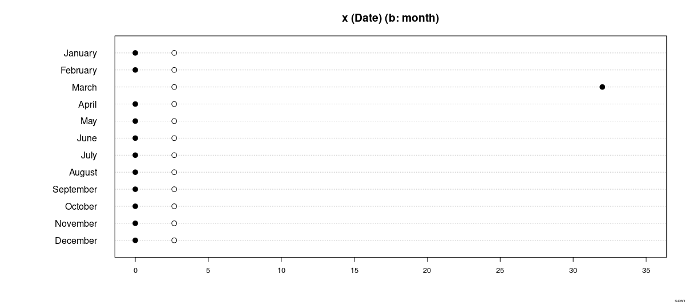{}


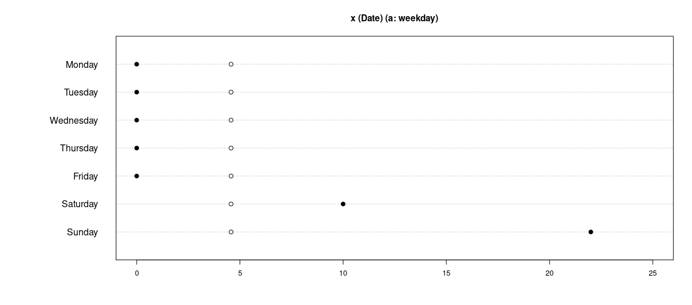{}


\newpage

# CAP. 10 - DISTRIBUIÇÕES DE PROBABILIDADES

## Teoria e introdução

- É possível realizar comparações gráficas com uma distribuição teórica de probabilidades.\

- As distribuições de probabilidade descrevem o comportamento de uma variável aleatória que pode ser **discreta** ou **contínua**.\

- Principais distribuições:\
  - Variável discreta\
    - Binomial\
    - Binomial negativa\
    - Geométrica\
    - Hipergeométrica\
    - Poisson\
  - Variável contínua\
    - Beta\
    - Cauchy\
    - Exponencial\
    - F de Snedecor\
    - Gama\
    - Lognormal\
    - Normal\
    - Qui-quadrada\
    - T de Student\
    - Uniforme\
    - Weibull\

\newpage

```{r Distribuição Prob e funções, echo=FALSE, message=FALSE, warning=FALSE}
#Biblioteca
library(knitr)

#data.frame
dist_prob <- c("Beta", "Binominal", 
               "Binominal negativa", "Cauchy", 
               "Qui-quadrada", "Exponencial",
               "F Snedecor", "Gamma", 
               "Geométrica", "Log-normal", 
               "Logística", "Normal", 
               "Poisson", "T Student", 
               "Weibull")
func_prob_R <- c("beta", "binom",
                 "nbinom", "cauchy",
                 "chisq", "exp",
                 "f", "gamma",
                 "geom", "lnorm",
                 "logis", "norm",
                 "poi", "t",
                 "weibull")
tb_disb_prob <- data.frame(dist_prob,func_prob_R)

#Tabela
kable(tb_disb_prob, col.names = c("Distribuição de probabilidade", "Nome da função no R"),
      align = "cc", caption = "Nome das funções correspondetes às principais distribuições de probabilidade")
```

\newpage

- Modelos:\
  - Em situações práticas, o pesquisador possiu uma série de observações da variável de interesse, obtidas através de um processo de amostragem, e deseja ajustar uma distribuição de probabilidades que reproduza o comportamento geral dessa variável.\
  - É importante conhecer diversos modelos teóricos para que se possa selecionar o mais adequado que reproduza o comportamento da variável em questão.\
  - O pesquisador precisará estimar os valores dos parâmetros do modelo que ele identifica como adequado (ajustar parêmetros).\
  - Ao final verificar a qualidade de ajuste.\

- Comandos sobre as distribuições de probabilidade e pesquisa:\
  - Em relação aos comandos sobre as distribuições de probabilidade, é possivel avaliar a densidade (**d**), a probabilidade (**p**), os percentis (**q**) e gerar números aleatórios (**r**).\
  - Cada um desses prefixos **d**, **p**, **q** e **r**, associados ao nome da função de distribuição, produz informações sobre essa função. (prefixo + função)\
  Ex.: `pnorm`\
  - Para saber quais argumentos e a ordem com que devem ser especificados no argumento das funções, utilize o comando `?ddist`, substituindo `dist` pelo nome da função no **R**.\
  Ex.: `?dnorm`\

\newpage

## Distribuição normal
## Aderência da distribuição normal
## As hipóteses de um teste estatístico
## Erros possíveis no teste de hipótese
## Regra de decisão para todos os testes de hipóteses
## Teste de normalidade
## Análise gráfica
## E quando os dados não são normais?

\newpage

# ANDAMENTO DOS ESTUDOS

Assunto em andamento:\

Atualmente estou estudando Cap. 10 - Distribuições de probabilidade.\

\newpage

# REFERÊNCIAS
